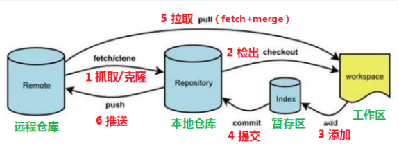
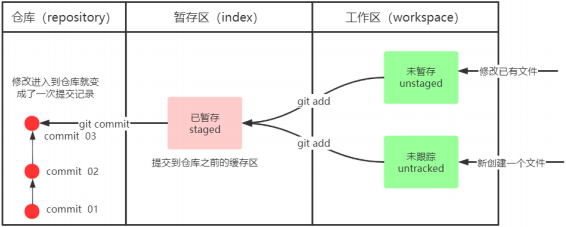

# Git（废）

[Git Learning Branch](https://learngitbranching.js.org/)

## Git Commit

Git 仓库中的提交记录保存的是目录下所有文件的快照，会将当前版本与仓库中的**上一个版本进行对比**，并把**所有的差异**打包到一起作为一个提交记录。

Git 还保存了**提交的历史记录**，大多数提交记录的上面都有 parent 节点的原因。

使用 `git commit` 指令，将当前文件版本，以上一个文件版本为 parent 节点进行保存

## Git Branch

生成 Git Branch 分支，基于这个提交以及它所有的 parent 节点提交进行新的工作。

使用 `git branch <branch-name>` 来创建一个新的分支，但是此时进行 `git commit` 操作仍然是对于原分支进行操作

使用 `git checkout <branch-name>` 来切换到自己想要的新分支上，再使用 `git commit` 时，此时的操作对象为新分支

在 Git 2.23 版本之后也可以使用 `git switch <branch-name>` 来切换

使用 `git checkout -M <branch-name>` 可以直接创建新分支后切换到该分支上面进行操作

## 分支与合并

为了将两个分支合并到一起，可以使用 `git merge <branch-name>` ，该操作会产生一个特殊的提交记录，有两个 parent 节点的一个提交记录

第二个合并分支的方法是 `git rebase` ，对当前分支取出一系列的提交记录后进行“复制”，最后再逐一放下去，形成一条线性结构

## 在提交树上移动

**HEAD** 默认总是指向当前分支上最近一次提交记录

使用 `git chekcout <option>` 使得 **HEAD** 指向一次具体的操作记录

## 相对引用

使用 `<option>^` 向上移动 1 个提交记录，或者使用 `~<num>` 移动多个提交记录；或者使用 **HEAD** 作为参照物，反复使用 `HEAD^` 重复向上移动

## `~` 操作符

使用 `~` 操作符，后跟一个数字（也可以不跟，此时等价于 `^` ），指定向上移动多少次

使用 `-f` 选项让分支指向另一个提交， `git branch -f <branch-name> HEAD~n` 使得 `<branch-name>` 分支强制指向 **HEAD** 的第 n 级 parent 提交

## 撤销变更

主要用两种方法来撤销变更，一是 `git reset` ，还有就是 `git revert`

在本地情况下，使用 `git reset HEAD~n` 将分支记录回退 n 个提交记录来实现撤销，本地代码库将无法找到回退之后的提交记录

在远程环境下，前者就失效了，需要使用 `git revert HEAD~n` ，此时并非删除 n 个提交记录，而是生成一个新提交记录，该提交记录等价于 n 个提交记录之前的提交记录

# Git

## 版本控制器

### 集中式版本控制工具

集中式版本控制工具，版本库是集中存放在中央服务器的，team 里每个人 work 时从中央服务器下载代码，必须联网才能工作，局域网或互联网。个人修改后提交到中央版本库

### 分布式版本控制工具

分布式版本控制系统没有中央服务器，每个人的电脑上都是一个完整的版本库，这样工作过时就无需联网，版本库仅在自己电脑上，多人协作只需要这将各自的修改推送给对方，就能互相看到对方的修改了

### Git 工作流程图



- clone（克隆）：从远程仓库中克隆代码到本地仓库

- checkout（检出）：从本地仓库中检出一个仓库分支然后进行修订

- add（添加）：在提交前先将代码提交到暂存区

- commit（提交）：提交到本地仓库，本地仓库中保存修改的各个历史版本

- fetch（抓取）：从远程库，抓取到本地仓库，不进行任何的合并动作

- pull（拉取）：从远程库拉到本地库，自动进行合并（merge），然后放到工作区，相当于 fetch + merge

- push（推送）：将本地的代码推送到远程仓库

## Git 安装与配置

### 安装 Git

### 配置 Git

设置用户信息和邮箱

```shell
git config --global user.name <your name>
git config --global user.email <your email>
```

查看配置的用户信息

```shell
git config --global user.name
git config --global user.email
```

### 基础操作指令

Git 工作目录对于文件的**修改** （增加、删除、更新）会存在几个状态，这些**修改**的状态会随着我们执行 GIt 的命令而发生变化



1. `git init`：初始化一个 Git 仓库，创建一个 `.git` 目录，用于存储版本库相关信息

2. `git status`：查看当前的修改状态（暂存区、工作区）

3. `git add 单个文件名 | 通配符`：添加工作区的一个或多个文件的修改加入暂存区，使用 `.` 添加所有修改到暂存区

4. `git commit -m "注释内容`：提交暂存区内容到本地仓库的当前分支

5. `git log [option]`：查看提交历史记录

- options：

  - `--all`：显示所有分支的提交记录

  - `--pretty=oneline`：显示简洁的提交记录

  - `--abbrev-commit`：显示简化的 commitId

  - `--graph`：以图的形式显示分支

6. 使用`.gitignore`文件来忽略不需要提交的文件

7. 使用`git commit --amend --date="YYYY-MM-DDTHH:MM:SS+08:00"`

### gitignore 文件语法

| 语法        | 作用                                 | 实例                  |
| ----------- | ------------------------------------ | --------------------- |
| `*.log`     | 忽略所有 `.log` 文件                 | `error.log`           |
| `/temp/`    | 忽略根目录下的 `temp` 目录及其子目录 | `/temp/test.txt`      |
| `temp/`     | 忽略所有层级的`temp`目录             | `temp/test.txt`       |
| `!temp.txt` | 不忽略 `temp.txt` 文件（例外规则）   | `temp.txt`            |
| `# 注释`    | 添加注释                             | `# 忽略所有.txt 文件` |

### Git 分支管理

1. `git branch`：查看本地分支

2. `git branch <branch-name>`：创建本地分支

3. `git checkout <branch-name>`：切换到指定分支

4. `git checkout -b <branch-name>`：创建并切换到指定分支

5. `git merge <branch-name>`：合并指定分支到当前分支

6. `git branch -d <branch-name>`：删除其他分支（**不能删除当前分支**）

7. `git branch -D <branch-name>`：强制删除分支

8. 解决分支冲突：

   - 当两个分支上对文件的修改存在冲突，需要手动解决冲突，步骤如下：

   - 处理文件中冲突的地方

   - 将解决完冲突的文件加入暂存区

   - 提交到仓库

9. 开发中分支使用原则和流程

   - master （生产）分支：线上分支，主分支，中小规模项目作为线上运行的应用对应分支

   - develop （开发）分支：是从 master 创建的分支，一般作为开发部门的主要开发分支，如果没有其他并行开发不同期上线要求，都可以在此版本进行开发，阶段开发完成后，需要合并到 master 分支，准备上线

   - feature/xxxx 分支：从 develop 创建的分支，一般是同期并行开发，但不同期上线时创建的分支，分支上的研发任务完成后合并到 develop 分支

   - hotfix/xxxx 分支：从 master 派生的分支，一般作为线上 bug 修复使用，修复完成后需要合并到 master、testdevelop 等分支

   - 还有如 test 分支（用于代码测试），pre 分支（预上线分支）等

### 操作远程仓库

1. `git remote add <remote-name> <remote-url>`：先初始化本地仓库，然后用该命令添加远程仓库，远端名称默认为 origin

2. `git remote`：查看已添加的远程仓库

3. `git push [-u] [<remote-name> <branch-name> <remote-name>]`

   - 如果远程分支名和本地分支名相同，k 可以省略 `<remote-branch-name>`

   - `-u`：推送到远端的同时建立起和远端分支的关联关系（如果**当前分支已经和远端分支关联**，则可以省略分支名和远端名）

4. `git branch -vv`：可以查看本地分支和远程分支的关联关系

5. `git clone <仓库路径>`：克隆远程仓库到本地当前打开的文件夹

6. `git fetch <remote-name> <branch-name>`：从远程仓库抓取最新版本到本地，不会自动合并，若不指定丁远端分支，则抓取所有分支

7. `git pull <remote-name> <branch-name>`：**拉取指令就是将远端仓库的修改拉到本地自动进行合并，等同于 fetch + merge**，若不指定远端名称和分支名，则抓取所有并更新当前分支
