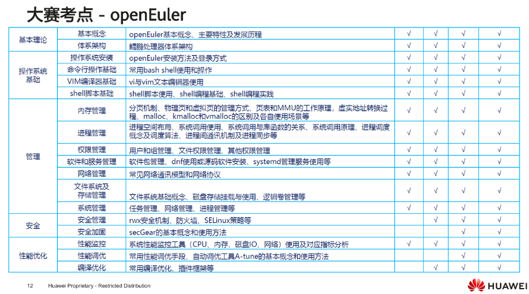
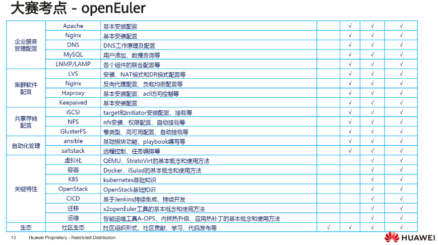
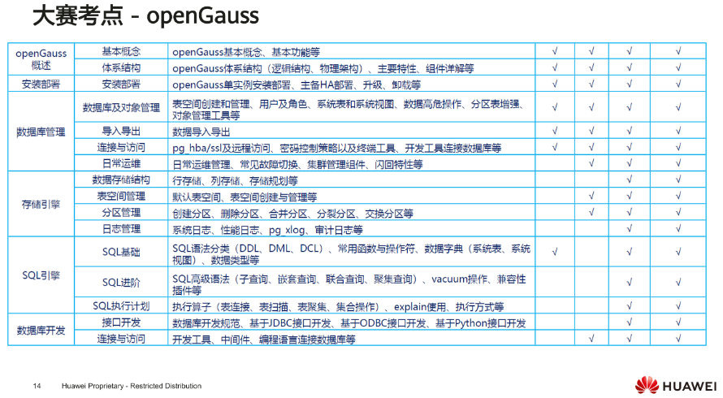
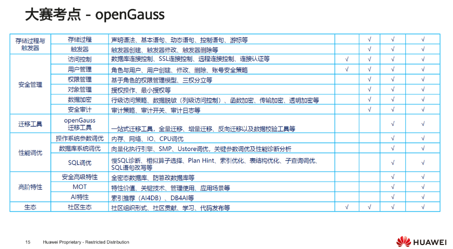
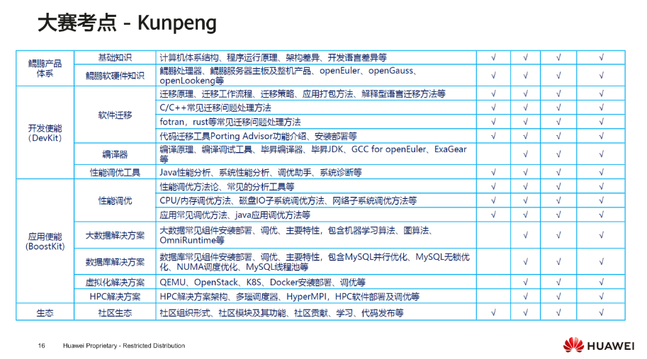

# 华为ICT大赛2023-2024考试大纲
## 实践赛-基础软件赛道

### 赛程设置（省赛）

- 考试类型：理论考试
- 考试时长：90min
- 试题数量：60道
- 试题类型：判断、单选、多选
- 总分：1000
- 额外加分：通过HCIA-openEuler/openGauss/Kunpeng任一认证50分，通过HCIP-openEuler/openGauss/Kunpeng任一认证100分，总计200分

### 初赛复赛考纲比重

|技术方向|省赛初赛占比|省赛复赛占比|
| --- | --- | --- |
|openEuler|50%|50%|
|openGauss|30%|30%|
|Kunpeng Application Developer|20%|20%|

### 考试范围

**考点**

