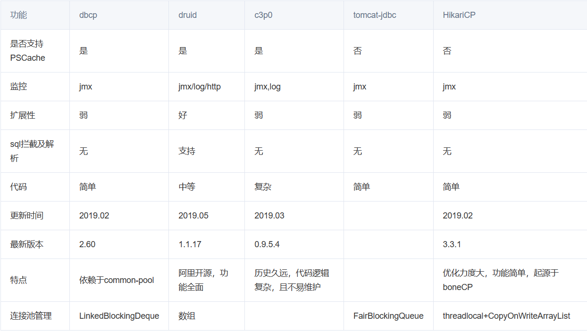

# JDBC

## 基础篇

### 数据的存储与操作

在开发 Java 程序中，数据都是存储在**内存**中，属于临时存储，当程序停止或重启时，内存中的数据就丢失了

为了解决数据的长期存储，使用如下方案：

1. 数据通过 I/O 流技术，存储在本地磁盘中，解决了持久化问题，但是没有结构和逻辑。不方便管理和维护。

2. 通过关系型数据库，将数据按照特定的格式交由数据库管理系统维护。关系型数据库是通过库和表分隔不同的数据，表中数据存储的方式是行和列，区分相同格式不同值的数据

数据存储的问题解决后，但当我们程序运行时，需要读取数据以及对数据做增删改的操作，那么为了通过 Java 程序对数据库中的数据增删改查，需要使用 JDBC 接口。

### JDBC

#### JDBC 概念

- JDBC: Java Database Connectivity，意为 Java 数据库连接

- JDBC 是 Java 提供的一组独立于任何数据库管理系统的 API

- Java 提供接口规范，由各个数据库厂商提供接口的实现，厂商提供的实现类封装成 jar 文件，也就是我们俗称的数据库驱动 jar 包。

- 学习 JDBC，充分体现了面向接口编程的好处，程序员只关心标准和规范，而无需关注实现过程。

JDBC 简单执行过程：


#### JDBC 的核心组成

- 接口规范：

  - 为了项目代码的可移植性、可维护性，从最初就制定了 Java 程序连接各种数据库的统一接口规范。这样，不管是哪一种 DBMS 软件，Java 代码都可以保持一致性

  - 接口存储在 java.sql 和 javax.sql 包下

- 实现规范：

  - 因为各个数据库的 DBMS 软件各有不同，那么各自的内部如何通过 SQL 实现增删改查等操作管理数据，只有数据库厂商知道，因此把接口规范的视线交给各个数据库厂商自行实现

  - 厂商将实现内容和过程封装成 jar 文件，只需要把 jar 文件引入到项目中集成即可，就可以调用实现过程操作数据库

### JDBC 项目快速部署

#### JDBC 搭建

1. 准备数据库

2. 官网下载数据库连接驱动 jar 包

3. 创建 Java 项目，在项目下新建 lib 文件夹，将下载的驱动 jar 移动到该文件夹下

4. 选中 lib 文件夹右键，选择添加为库，与项目集成

#### 数据库配置

本地数据库建库、建表、添加数据

#### Java 核心 API

##### 注册驱动

```java
Class.forname("");
```

- 在 Java 中，当使用 JDBC （Java Daatabase Connectivity）连接数据库时，需要加载数据库特定的驱动程序，以便与数据库进行通讯。加载驱动程序的目的是为了注册驱动程序，使得 JDBC API 能够识别并与特定的数据库交互

- 从 JDK 6 开始，不需要显式地调用`Class.forname()`来加载 JDBC 驱动程序，只要在类路径中继承了对应的 jar 文件，会自动在初始化时候注册驱动程序

##### Connection 连接

```java
Connection connection = DriverManager.getConnection("jdbc:mysql://localhost:3306/atguigu", "root", "123456");
```

- Connection 接口是 JDBC API 的重要接口，用于建立与数据库的通信通道。换而言之，Connection 对象不为空，则代表一次数据库连接。

- 在建立连接时，需要指定数据库 URL、用户名、密码参数。

  - URL：jdbc:mysql://localhost:3306/atguigu

    - jdbc:mysql://IP 地址:端口号/数据库名称?参数键值对 1&参数键值对 2

- `Connection` 接口还负责管理事务，`Connection` 接口提供了 `commit` 和 `rollback` 方法，用于提交事务和回滚事务。

- 可以创建 `Statement` 对象，用于执行 SQL 语句并与数据库进行交互。

- 在使用 JDBC 技术时，必须要先获取 Connection 对象，在使用完毕后，要释放资源，避免资源占用浪费及泄漏。

##### Statement

- `Statement` 接口用于执行 SQL 语句并与数据库进行交互。它是 JDBC API 中的一个重要接口。通过 `Statement` 对象，可以向数据库发送 SQL 语句并获取执行结果。

- 结果可以是一个或多个结果。

  - 增删改：受影响行数单个结果。

  - 查询：单行单列、多行多列、单行多列等结果。

- 但是`Statement` 接口在执行 SQL 语句时，会产生`SQL注入攻击问题`:

  - 当使用 `Statement` 执行动态构建的 SQL 查询时，往往需要将查询条件与 SQL 语句拼接在一起，直接将参数和 SQL 语句一并生成，让 SQL 的查询条件始终为 true 得到结果。

##### PreparedStatement

```java
PreparedStatement preparedStatement = connection.prepareStatement(SQL); // 创建 PreparedStatement 对象

preparedStatement.executeUpdate(); // 执行增删改语句

preparedStatement.executeQuery(); // 执行查询语句
```

- `PreparedStatement`是 `Statement` 接口的子接口，用于执行`预编译`的 SQL 查询，作用如下：

  - 预编译 SQL 语句：在创建 PreparedStatement 时，就会预编译 SQL 语句，也就是 SQL 语句已经固定。

  - 防止 SQL 注入：`PreparedStatement` 支持参数化查询，将数据作为参数传递到 SQL 语句中，采用?占位符的方式，将传入的参数用一对单引号包裹起来''，无论传递什么都作为值。有效防止传入关键字或值导致 SQL 注入问题。

  - 性能提升：PreparedStatement 是预编译 SQL 语句，同一 SQL 语句多次执行的情况下，可以复用，不必每次重新编译和解析。

- 后续的学习我们都是基于 PreparedStatement 进行实现，更安全、效率更高！

- 新增时，如 `VALUES (?,?)`，? 代表参数，参数使用 `PreparedStatement` 的 `setXxx()` 方法设置。设置好后使用 `executeUpdate()` 方法执行 SQL 语句。返回受影响的行数。

##### ResultSet

```java
ResultSet resultSet = preparedStatement.executeQuery(); // 执行查询语句
```

- `ResultSet`是 JDBC API 中的一个接口，用于表示从数据库中`执行查询语句所返回的结果集`。它提供了一种用于遍历和访问查询结果的方式。

- 遍历结果：ResultSet 可以使用 `next()` 方法将游标移动到结果集的下一行，逐行遍历数据库查询的结果，返回值为 boolean 类型，true 代表有下一行结果，false 则代表没有。

- 获取单列结果：可以通过 getXxx 的方法获取单列的数据，该方法为重载方法，支持索引和列名进行获取。MySQL 数据库的索引从 1 开始

##### 关闭资源

- 释放资源：在使用完毕后，必须要释放资源，避免资源占用浪费及泄漏。

- 释放 ResultSet 对象：`resultSet.close()`

- 释放 PreparedStatement 对象：`preparedStatement.close()`

- 释放 Connection 对象：`connection.close()`

**先开后关原则**

#### 常见问题

##### 管理资源

> 在使用 JDBC 的相关资源时，比如 Connection、PreparedStatement、ResultSet，使用完毕后，要及时关闭这些资源以释放数据库服务器资源和避免内存泄漏是很重要的。

##### SQL 语句问题

> java.sql.SQLSyntaxErrorException：SQL 语句错误异常，一般有几种可能：
>
> 1. SQL 语句有错误，检查 SQL 语句！建议 SQL 语句在 SQL 工具中测试后再复制到 Java 程序中！
> 2. 连接数据库的 URL 中，数据库名称编写错误，也会报该异常！

```java
	@Test
	public void querySingleColumn() throws SQLException {
		Connection draftConnection = DriverManager.getConnection("jdbc:mysql://localhost:3306/draft", "root", "123456");

		PreparedStatement draftStatement = draftConnection.prepareStatement("SELECT `name` FROM emp");

		ResultSet draftSet = draftStatement.executeQuery();

		while (draftSet.next()) {
			String name = draftSet.getString("name");
			System.out.println(name);
		}

		draftSet.close();
		draftStatement.close();
		draftConnection.close();
	}

	@Test
	public void querySingleRow() throws SQLException {
		Connection draftConnection = DriverManager.getConnection("jdbc:mysql://localhost:3306/draft", "root", "123456");

		PreparedStatement draftStatement = draftConnection.prepareStatement("SELECT id,`name`,salary,age FROM emp WHERE id = ?");

		draftStatement.setInt(1, 6); //填入 占位符? 处的内容，索引从1开始

		ResultSet draftSet = draftStatement.executeQuery();

		while (draftSet.next()) {
			int id = draftSet.getInt("id");
			String name = draftSet.getString("name");
			double salary = draftSet.getDouble("salary");
			int age = draftSet.getInt("age");
			System.out.println(id + " " + name + " " + salary + " " + age);
		}

		draftSet.close();
		draftStatement.close();
		draftConnection.close();
	}

	@Test
	public void queryMultipleRow() throws SQLException {
		Connection draftConnection = DriverManager.getConnection("jdbc:mysql://localhost:3306/draft", "root", "123456");

		PreparedStatement draftStatement = draftConnection.prepareStatement("SELECT id,`name`,salary,age FROM emp");

		ResultSet draftSet = draftStatement.executeQuery();

		while (draftSet.next()) {
			int id = draftSet.getInt("id");
			String name = draftSet.getString("name");
			double salary = draftSet.getDouble("salary");
			int age = draftSet.getInt("age");
			System.out.println(id + " " + name + " " + salary + " " + age);
		}

		draftSet.close();
		draftStatement.close();
		draftConnection.close();
	}

	@Test
	public void insertSingleRow() throws SQLException {
		Connection draftConnection = DriverManager.getConnection("jdbc:mysql://localhost:3306/draft", "root", "123456");

		PreparedStatement draftStatement = draftConnection.prepareStatement("INSERT INTO emp VALUES (?,?,?,?)");

		draftStatement.setInt(1,6);
		draftStatement.setString(2, "rose");
		draftStatement.setDouble(3,666.66);
		draftStatement.setInt(4,20);

		int result = draftStatement.executeUpdate();

		if(result > 0)
			System.out.println("success");
		else
			System.out.println("failure");

		draftStatement.close();
		draftConnection.close();
	}

	@Test
	public void updateSingleRow() throws SQLException {
		Connection draftConnection = DriverManager.getConnection("jdbc:mysql://localhost:3306/draft", "root", "123456");

		PreparedStatement draftStatement = draftConnection.prepareStatement("UPDATE emp SET salary = ? WHERE id = ?");

		draftStatement.setDouble(1, 888.88);
		draftStatement.setInt(2, 6);

		int result = draftStatement.executeUpdate();

		if (result > 0)
			System.out.println("success");
		else
			System.out.println("failure");

		draftStatement.close();
		draftConnection.close();
	}

	@Test
	public void deleteSingleRow() throws SQLException {
		Connection draftConnection = DriverManager.getConnection("jdbc:mysql://localhost:3306/draft", "root", "123456");

		PreparedStatement draftStatement = draftConnection.prepareStatement("DELETE FROM emp WHERE id = ?");

		draftStatement.setInt(1, 6);

		int result = draftStatement.executeUpdate();

		if (result > 0)
			System.out.println("success");
		else
			System.out.println("failure");

		draftStatement.close();
		draftConnection.close();
	}
```

## 进阶篇

### JDBC 拓展

#### 实体类和 ORM

- 在使用 JDBC 操作数据库时，数据都是零散的，在数据库中是一行完整的数据，到了 Java 中变成了一个一个的变量，不利于维护和管理。而我们 Java 是面向对象的，一个表对应的是一个类，一行数据就对应的是 Java 中的一个对象，一个列对应的是对象的属性，所以把数据存储在一个载体里，这个载体就是实体类。

- ORM（Object Relational Mapping）思想，**对象到关系数据库的映射**，作用是在编程中，把面向对象的概念跟数据库中表的概念对应起来，以面向对象的角度操作数据库中的数据，即一张表对应一个类，一行数据对应一个对象，一个列对应一个属性。

- 当下 JDBC 中这种过程我们称其为手动 ORM。后续也有相关 ORM 框架，比如 MyBatis、JPA 等。

```java
  public class Employee{
    private int id;
    private String name;
    private double salary;
    private int age;

    // constructor

    // getter and setter

    // toString()
  }


	@Test
	public void querySingleRow() throws SQLException {
		Connection draftConnection = DriverManager.getConnection("jdbc:mysql://localhost:3306/draft", "root", "123456");

		PreparedStatement draftStatement = draftConnection.prepareStatement("SELECT id,`name`,salary,age FROM emp WHERE id = ?");

		draftStatement.setInt(1, 6); //填入 占位符? 处的内容，索引从1开始

		ResultSet draftSet = draftStatement.executeQuery();

		Employee employee = null;

		while (draftSet.next()) {
			int id = draftSet.getInt("id");
			String name = draftSet.getString("name");
			double salary = draftSet.getDouble("salary");
			int age = draftSet.getInt("age");
			employee = new Employee(id, name, salary, age);
		}

		System.out.println(employee);
		draftSet.close();
		draftStatement.close();
		draftConnection.close();
	}
```

#### 主键回显

在数据中，执行新增操作时，主键列为自动增长，可以在表中直观的看到，但是在 Java 程序中，执行完新增后，只能得到受影响行数，无法得知当前新增数据的主键值。在 Java 程序中获取数据库中插入新数据后的主键值，并赋值给 Java 对象，此操作为主键回显。

在构建 PreparedStatement 对象时，传入需要主键回显参数 `Statement.RETURN_GENERATED_KEYS`

然后执行完新增操作后，对 PreparedStatement 对象调用 `getGeneratedKeys()` 方法（生成 ResultSet 对象），获取数据库中插入新数据的主键值，并赋值给 Java 对象。

```java
PreparedStatement draftStatement = draftConnection.prepareStatement("INSERT INTO emp(name,salary,age) VALUES (?,?,?)", Statement.RETURN_GENERATED_KEYS);

// execute insert

ResultSet draftSet = draftStatement.getGeneratedKeys();
if(draftSet.next()){
  int id = draftSet.getInt(1); // 主键回显
  employee.setId(id);
}
```

#### 批量操作

首先在连接数据库的 URL 后面追加`?rewriteBatchedStatements=true`参数，表示启用批量操作。

新增的 SQL 语句必须使用 `VALUES`，而且语句最后不要追加 `;`

先调用 `addBatch()` 方法，将多个 SQL 语句添加到批处理中，然后调用 `executeBatch()` 方法，执行批处理。

### 连接池

> 连接池就是数据库连接对象的缓冲区，通过配置，由连接池负责创建连接、管理连接、释放连接等操作。
>
> 预先创建数据库连接放入连接池，用户在请求时，通过池直接获取连接，使用完毕后，将连接放回池中，避免了频繁的创建和销毁，同时解决了创建的效率。
>
> 当池中无连接可用，且未达到上限时，连接池会新建连接。
>
> 池中连接达到上限，用户请求会等待，可以设置超时时间。

JDBC 的数据库连接池使用 javax.sql.DataSource 接口进行规范，所有的第三方连接池都实现此接口，自行添加具体实现。也就是说，所有连接池获取连接的和回收连接方法都一样，不同的只有性能和扩展功能!

主流连接池以及功能对比：



#### Druid 连接池配置、使用

- 使用步骤：

  - 引入 jar 包。
  - 编码。

- 代码实现编码操作：

  - 硬编码方式（不推荐、了解为主）

  - 软编码方式：

    - 在项目目录下创建 `resources` 目录，标识该目录为资源目录。

    - 创建 `db.properties` 配置文件，将连接信息定义在该文件中

    ```properties
    # druid连接池需要的配置参数，key固定命名
    driverClassName=com.mysql.cj.jdbc.Driver
    url=jdbc:mysql:///atguigu
    username=root
    password=atguigu
    initialSize=10
    maxActive=20
    ```

    - 编写 Java 代码，读取配置文件，创建 DruidDataSource 对象，设置相关参数。

    ```java
    //1.创建Properties集合，用于存储外部配置文件的key和value值。
    Properties properties = new Properties();

    //2.读取外部配置文件，获取输入流，加载到Properties集合里。
    InputStream inputStream = DruidTest.class.getClassLoader().getResourceAsStream("db.properties");
    properties.load(inputStream);

    //3.基于Properties集合构建DruidDataSource连接池
    DataSource dataSource = DruidDataSourceFactory.createDataSource(properties);

    //4.通过连接池获取连接对象
    Connection connection = dataSource.getConnection();
    System.out.println(connection);

    //5.开发CRUD

    //6.回收连接
    connection.close();
    ```
