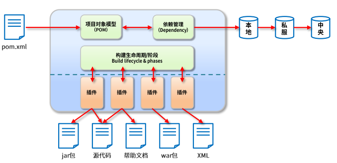
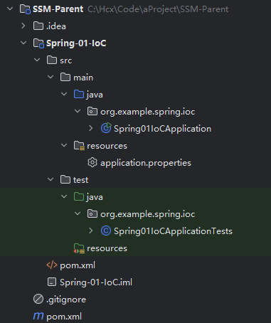
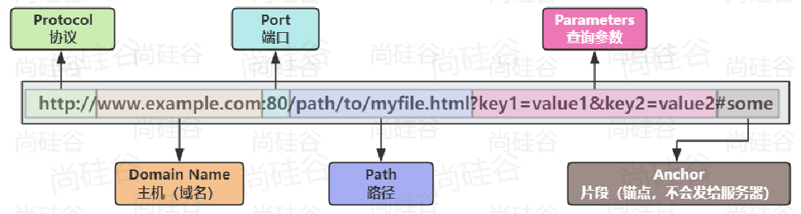
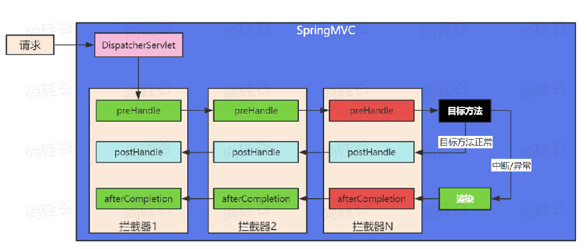
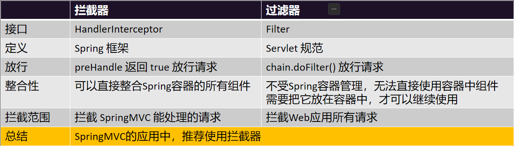
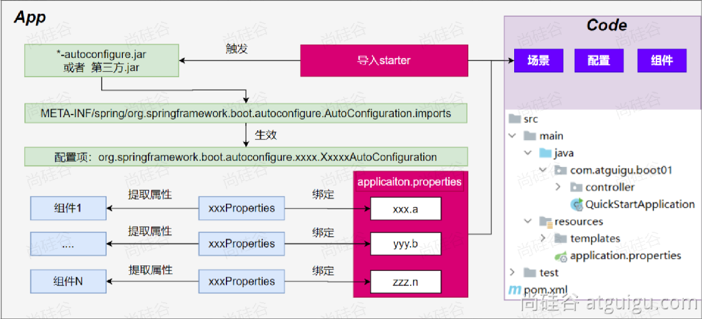

# Java

## 基础知识储备

### CMD 界面常见命令

|       操作       | 说明                                |
| :--------------: | :---------------------------------- |
|     盘符名称     | 盘符切换。E:回车，表示切换到 E 盘。 |
|       dir        | 查看当前路径下的内容。              |
|     cd 目录      | 进入单级目录。                      |
|      cd ..       | 回退到上一级目录。                  |
| cd 目录 1\目录 2 | 进入多级目录。                      |
|      cd \        | 回退到盘符目录。                    |
|       cls        | 清屏。                              |
|       exit       | 退出命令提示符窗口。                |
|      strat       | 打开文件                            |
|     ipconfig     | 查看本地 IP 地址                    |
|     ping IP      | 检查网络是否连接                    |

进入的目录带有中文、空格需要将目录使用双引号标记 cd "目录"

### Java 路径

绝对路径：

一定从盘符开始

相对路径：

相对当前项目，JAVA 中相对路径是**相对 JVM 的启动路径**的，对于简单的 JAVA 项目，其 JVM 是在项目名称下启动的

### Java 基础命令

在命令行环境中
先后输入以下指令来完成 编译+运行

```shell
javac + 文件名 + 后缀(编译java文件)
java + 文件名(运行编译后的java文件)
```

### Java 的三大平台

JavaSE、JavaME、JavaEE

#### JavaSE

是另两个版本的基础，主要用于开发桌面应用

#### JavaME

Java 语言的小型版本，用于嵌入式消费类电子设备或者小型移动设备的开发

#### JavaEE

用于 Web 方向的网站开发（主要从事后台服务器的开发）
服务器领域，Java 是龙头老大

### Java 的主要特性

- 面向对象
- 安全性
- 多线程
- 简单易用
- 开源
- 跨平台

### JRE 和 JDK

JVM（Java Virtual Machine），Java 虚拟机

JRE（Java Runtime Environment），Java 运行环境，包含了 JVM 和 Java 的核心类库（Java API）

JDK（Java Development Kit）称为 Java 开发工具，包含了 JRE 和开发工具

### IDEA

IDEA 全称为 Intellij IDEA，是用于 Java 语言开发的集成环境（IDE：把代码编写、编译、执行、调试等多种功能综合到一起的开发工具）

#### IDEA 中层级结构介绍

- 结构分类

  - Project（项目、工程）
    淘宝、京东等网站都属于一个个项目，IDEA 中就是一个个的 Project
  - module（模块）
    一个项目可以存放多个模块，不同的模块可以存放项目中不同的业务功能代码，如一个网站分成论坛模块，报名咨询模块等等
  - package（包）
    一个模块中有很多的细分业务，如一个论坛模块就包含了发帖、评论等不同的业务
  - class（类）
    真正的写代码地方

- 层级关系：project - module - package - class

## Java 基础语法

### 注释

注释是对代码的解释和说明文字，分为单行注释、多行注释和文档注释

- 单行注释

```java
// 这是单行注释文字
```

- 多行注释

```java
/*
这是多行注释文字
这是多行注释文字
这是多行注释文字
*/
```

- 文档注释

```java
/**

*/
```

### 关键字

被 Java 赋予了特定涵义的英文单词

- 特点：

1. 关键字的字母**全部小写**
2. 在常用的代码编辑器，有特殊高亮标记

#### class

用于（创建/定义）一个类，类是 Java 最基本的组成单元

### 字面量（常量）

字面量类型：

- 整数类型 int
- 小数类型 double
- 字符串类型 string
- 字符类型
- 布尔类型
- 空类型(null)

### 变量

在程序执行过程中，有可能变化的值

定义格式:

```
    数据类型 变量名 = 数据值;
```

### 数据类型

- 基本数据类型：

| 数据类型 | 关键字  | 内存占用 |                     取值范围                     |
| :------: | :-----: | :------: | :----------------------------------------------: |
|   整数   |  byte   |    1     |    负的 2 的 7 次方 ~ 2 的 7 次方-1(-128~127)    |
|          |  short  |    2     | 负的 2 的 15 次方 ~ 2 的 15 次方-1(-32768~32767) |
|          |   int   |    4     |        负的 2 的 31 次方 ~ 2 的 31 次方-1        |
|          |  long   |    8     |        负的 2 的 63 次方 ~ 2 的 63 次方-1        |
|  浮点数  |  float  |    4     |           1.401298e-45 ~ 3.402823e+38            |
|          | double  |    8     |          4.9000000e-324 ~ 1.797693e+308          |
|   字符   |  char   |    2     |                     0-65535                      |
|   布尔   | boolean |    1     |                   true，false                    |

定义 long 类型的数据，需要在数据值后方加一个 L 作为后缀
定义 float 类型的数据，需要在数据值后方加一个 F 作为后缀

### 标识符

标识符：就是给类，方法，变量等起的名字

- 必须由数字、字母、下划线\_、美元符号$组成。
- 数字不能开头
- 不能是关键字
- 区分大小写的。

小驼峰命名法用于：方法、变量

大驼峰命名法用于：类名

### 键盘录入

1. 导入`Scanner`这个类

```java
import java.util.Scanner;
```

2. 创建对象

```java
Scanner sc = new Scanner(System.in);
```

3. 接收数据

```java
int i = sc.nextInt();
```

4. 关闭对象

```java
sc.close();
```

方法：

1. next(), nextLine(): 可以接受任何数据，但是都会返回一个字符串

2. nextInt()：只能接受一个整数

3. nextDouble()：能接受整数和小数，但是都会看做小数返回

细节：

1. next（），nextInt（），nextDouble（）在接收数据的时候，会遇到空格，回车，制表符其中一个就会停止接收数据，但是这些符号 + 后面的数据还在内存中并没有接收。如果后面还有其他键盘录入的方法，会自动将这些数据接收。

2. nextLine（）方法是把一整行全部接收完毕。

使用方法：

键盘录入分为两套：

- next（）、nextInt（）、nextDouble（）这三个配套使用。

  如果用了这三个其中一个，就不要用 nextLine（）。

- nextLine（）单独使用。

  如果想要整数，那么先接收，再使用 Integer.parseInt 进行类型转换。

### 运算符和表达式

运算符：就是对常量或者变量进行操作的符号。

表达式：用运算符把常量或者变量连接起来的，符合 Java 语法的式子就是表达式。

#### 算术运算符

```java
+ - * / %
```

1. 隐式转换：

- 取值范围小的，和取值范围大的进行运算，小的会先提升为大的，再进行运算。
- byte、short、char 三种类型的数据在运算的时候，都会直接先提升为 int，然后再进行运算。

取值范围大小（从小到大）：

byte -> short -> int -> long -> float -> double

2. 强制转换：

书写格式：

```java
goalType variableName = (goalType) value;
```

会导致精度丢失

#### 字符串的 + 操作

- 当+操作中出现字符串时，此时就是字符串的连接符，会将前后的数据进行拼接，并产生一个新的字符串。
- 当连续进行+操作时，从左到右逐个执行的。

#### 自增自减运算符

```java
++ 自增运算符
-- 自减运算符
```

#### 赋值运算符

```java
=
+=
-=
*=
/=
%=
```

#### 关系运算符

```java
==
!=
>
>=
<
<=
```

#### 逻辑运算符

```java
&  -> &&(短路)
|  -> ||(短路)
^
!
<< 左移，低位补0
>> 右移，除符号位都补0
>>> 无符号右移，高位补0
```

#### 三元运算符

```java
关系表达式 ? 表达式1 : 表达式2 ;
```

### 判断和循环

#### 流程控制语句

1. 分类

- 顺序结构
- 判断和选择结构
- 循环结构

2. 顺序结构

按照代码的先后顺序依次执行

3. 判断结构

```java
if (关系表达式) {
    语句体 ;
}

if (关系表达式) {
    语句体1 ;
} else {
    语句体2 ;
}

if (关系表达式1) {
    语句体1 ;
} else if (关系表达式2) {
    语句体2 ;
}
...
else {
    语句体n+1;
}
```

4. 选择结构

```java
switch (表达式) {
	case 1:
		语句体1;
		break;
	case 2:
		语句体2;
		break;
	...
	default:
		语句体n+1;
		break;
}
```

- default 的位置和省略情况

  default 可以放在任意位置，也可以省略

- case 穿透

  不写 break 会引发 case 穿透现象

5. 循环结构

```java
for (初始化语句;条件判断语句;条件控制语句) {
	循环体语句;
}

while(条件判断语句){
	循环体;
	条件控制语句;
}

do{
    循环体;
    条件控制语句;
}while(条件判断语句);
```

### 数组

数组：指的是一种容器，可以同来存储同种数据类型的多个值。

定义格式：

```java
数据类型[] 数组名 -> int[] array
数据类型 数组名[] -> int array[]
```

#### 静态、动态初始化数组

格式：

```java
//静态
数据类型[] 数组名 = new 数据类型[]{元素1，元素2，元素3，元素4...};
->
int[] array = new int[]{1,2,3,4};

//动态
数据类型[] 数组名 = new 数据类型[数组的长度];
->
int[] array = new int[3];
```

解释：

- 数据类型：限定了数组以后能存什么类型的数据。
- 方括号：表示现在定义的是一个数组。
- 数组名：在起名字的时候遵循小驼峰命名法。
- new：给数组在内存中开辟一个空间
- 数据类型：限定数组能存什么类型的数据，前后数据类型要保持一致

#### 地址值（指针）

对于一个名为 array 的数组进行打印操作

```java
System.out.println(array);//address
```

输出的是数组的地址值，即表示数组在内存中的位置

#### 数组元素访问、索引、长度

```java
数组名[索引];   ->数组的内容

数组名.length;  ->数组的长度
```

#### 数组的内存

```java
int[] arr = new int[2];
sout(arr);//arr这个数组在堆内存中的地址值
sout(arr[0]);
```

### 方法

方法是程序中最小的执行单元，必须先创建才可以使用，该过程称为方法定义

#### 方法的定义和调用

- 无参数方法定义和调用

```java
定义：
public static void methodName (){
	// 方法体
}

调用：
methodName();
```

- 带参数方法定义和调用

```java
public static void methodName (values){
	方法体;
}
```

- 带返回值方法的定义和调用

```java
public static valueType methodName (value){
	return newValue;
}
```

#### 形参和实参

1. 形参：方法定义中的参数

2. 实参：方法调用中的参数

#### 方法重载

方法重载指同一个类中定义的多个方法之间的关系，满足下列条件的多个方法相互构成重载

- 多个方法在同一个类中
- 多个方法具有相同的方法名
- 多个方法的参数不相同，类型不同或者数量不同

重载仅针对同一个类中方法的名称与参数进行识别，与返回值无关
**不能通过返回值来判定两个方法是否相互构成重载**

#### 方法的值传

传递基本数据类型时，传递的是真实数据，形参的改变不影响实际参数的值

传递引用数据类型时，传递的是地址值，形参的改变影响实际参数的值

## 面向对象

### 类和对象

客观存在的事物皆为对象

- 类

  - 类的理解
    - 类是对现在生活中一类具有共同属性和行为的事物的抽象
    - 类是对象的数据类型，类是具有相同属性和行为的一组对象的集合
    - 类是对现实事物的一种描述
  - 类的组成
    - 属性：指事物的特征
    - 行为：指事物能执行的操作

- 类和对象的关系
  - 类：对现实生活中一类具有共同属性和行为的事物的抽象
  - 对象：是能够看得到摸得着的真实实体
  - **类是对事物的一种描述，对象则为具体存在的事物**

### 类的定义

类的组成是由属性和行为两部分组成

- 属性：在类中通过成员变量来体现
- 行为：在类中通过成员方法来体现

```java
public class className{
	// 成员变量
	valueType value1;
	valueType value2;
	...
	// 成员方法
	...
}
```

### 对象的使用

- 创建对象的格式

```java
className objectName = new className();
```

- 调用对象的格式：

```java
objectName.memberName;
objectName.memberFunction();
```

### 类的类型

- **javabean 类**：用来描述一类事物的类（不写 main 方法）
- **测试类**：编写 main 方法的类
- **工具类**：私有化构造方法，静态化方法，使用类名调用方法

### 注意事项

- 类名首字母建议大写，需要见名知意，驼峰模式
- 一个 java 文件中可以定义多个 class 类，且只能一个类是 public 修饰，同时 public 修饰的类名必须成为代码名

### 封装

封装：**告诉用户如何正确设计对象的属性和方法**
对象代表什么，就得封装相应数据，并提供数据相应的行为

### private 关键字

**private**是一个权限修饰符，可以修饰成员（变量和方法），被其修饰的成员只能在本类中才能被访问

### this 关键字

由于变量遵循就近原则，使用 this 可以区分局部变量和成员变量

this 的本质：所在方法调用者的地址

```java
this.value
```

### 成员变量和局部变量

- 类中位置不同：成员变量（类中方法外）局部变量（方法内部或方法声明上）
- 内存中位置不同：成员变量（堆内存）局部变量（栈内存）
- 生命周期不同：成员变量（随着对象的存在而存在，随着对象的消失而消失）局部变量（随着方法的调用而存在，醉着方法的调用完毕而消失）
- 初始化值不同：成员变量（有默认初始化值）局部变量（没有默认初始化值，必须先定义，赋值才能使用）

### 构造方法

格式：

```java
public class ClassName{
	修饰符 ClassName(value){

	}
}
```

功能：主要是完成对象数据的初始化

- 特点：
  - 方法名与类名相同，大小写也要一致
  - 没有返回值类型，连 void 都没有
  - 没有具体的返回值

### 标准类制作

- 类名需要见名知意
- 成员变量使用 private 修饰
- 提供至少两个构造方法
  1. 无参构造方法
  2. 带全部参数的构造方法
- get 和 set 方法
  ​ 提供每一个成员变量对应的 setXxx()/getXxx()
- 如果还有其他行为，也需要写上

### 对象内存图

Java 内存分配分为：栈、堆、方法区、本地方法栈、寄存器

方法区：存储可以运行的 class 文件

栈内存：方法运行时所进入的内存，方法进栈运行，运行完毕出栈

堆内存：new 出来的东西会在堆内存中开辟空间并产生地址

本地方法栈：JVM 在使用操作系统功能的时候使用

寄存器：给 CPU 使用，和开发无关

#### 一个对象的内存图


随着栈内存的方法逐渐使用完毕逐个 pop 出

#### 多个对象的内存图


其中的两个对象的`study()`方法都已经运行完成 pop 出栈

#### 两个引用指向同一个对象

```java
Student stu1 = new Student();
Student stu2 = stu1;

此时相当于两个指针（stu1,stu2）同时指向了一个地址值
```

### 基本数据类型和引用数据类型

基本数据类型：数据值是存储在自己的空间中，赋值给其他变量也是赋的真实的值

引用数据类型：数据值是存储在其他空间中，自己空间中存储的是地址值，赋值给其他变量赋的是地址值

### static 关键字

- 静态成员变量
  `static`关键字在 Java 开发中非常的重要，对于理解面向对象非常关键
  用来修饰的成员变量和成员方法是属于类的，放在静态区中
  没有被 static 修饰的成员变量和方法则是属于对象的

  被 static 修饰的成员变量，说明该变量是属于类的，直接使用类名访问即可，该变量称为**类变量**或者**静态成员变量**，直接使用类名访问即可，因为类只有一个，所以静态成员变量也只存在一份，使用**类名.变量名称**

- 实例变量
  无 static 修饰的成员变量属于每个对象，必须创建类的对象才可以访问，使用**对象.变量名称**

- 静态方法
  staitc 修饰成员方法，说明该方法属于类，称为**类方法**或者**静态方法**，直接使用类名访问，所有对象都可以共享这个方法,使用**类名.方法名称**即可

- 实例方法
  无 static 修饰的成员方法属于每个对象，该方法也叫做实例方法，所以必须创建对象才可以访问，使用**对象.实例方法**访问

对于 static 修饰的成员变量或者成员方法，即静态变量和静态方法，该类的每一个对象都**共享**同一个类和静态变量和静态方法，任何对象都可以更改静态变量的值或者访问静态方法

无 static 修饰的成员变量或者成员方法，即实例变量和实例方法，必须创建对象才能访问

static 修饰的变量、方法存储在静态区，随着类的加载而加载，且只加载一次，所以只有一份，节省内存，优先于对象存在

无 static 修饰的成员，是属于对象，对象有多少个他们就有多少份，且必须由对象调用

### 继承

多个类中存在相同属性和行为时，我们可以将这些内容内容单独抽取一个类，那么多个类无需再定义这些属性和行为，只需要**继承**那一个类就可以

其中，多个类可以称为**子类**，单独被继承的那一个类被称为**父类**、**超类**或者**基类**

- 定义：
  继承：就是子类继承父类的属性和行为，使得子类对象可以直接具有与父类相同的属性、相同的行为，子类可以直接访问父类中的**非私有**的属性和行为

- 特点：

  1.  提高了**代码的复用性**，减少代码冗余，相同代码重复利用
  2.  使类与类之间产生了关系
  3.  Java 只支持单继承，不支持多继承
  4.  一个类可以有多个子类
  5.  可以多层继承

- 格式：
  ```java
  class 父类{
  	...
  }
  class 子类 extends 父类{
  	...
  }
  ```

Java 是单继承的，一个类只能继承一个直接父类

继承实际上是子类相同的属性和行为可以定义在父类中，子类特有的属性和行为由自己定义，这样就实现了相同属性和行为的重复利用，从而提高了代码复用

子类不能继承父类的**构造方法**，但是子类可以继承父类的私用成员，只是无法直接访问，需要通过 getter/setter 方法来访问父类的 private 成员变量

- 成员变量

  子类和父类中的成员变量出现重名，此时的访问是有影响的，子类会优先访问自己对象中的成员变量，如果想要访问父类的同名成员变量，可以使用**super**关键词

  同**shit**，**super**代表的是父类对象的引用，**this**代表的是当前对象的引用

- 成员方法

  子类父类中出现重名的成员方法，则创建子类的对象调用该方法的时候，子类对象会优先调用自己的方法

- 方法重写

  子类出现与父类一模一样的方法时（返回值类型，方法名和参数列表都相同），会出现覆盖效果，也称为重写或者复写，**声明不变，重新实现**，子类方法覆盖父类方法，必须保证权限大于等于父类权限，返回值类型、函数名和参数列表必须一模一样

- @Override 重写注解

  在重写方法前面加上该注解，一方面可以提高代码的可读性，一方面可以防止重写出错

- 构造方法

  继承后，子类工作方法器特点：子类所有构造方法的第一行都会默认先调用父类的无参构造方法，子类构造方法的第一行都隐含了`super()`去调用父类无参数构造方法，`super()`可省略

-`super()和this()`

```java
	this.成员变量
	super.成员变量

	this.成员方法名()
	super.成员方法名()

	this(...)
	super(...)
```

**super() 和 this() 都必须是在构造方法的第一行，所以不能同时出现**

使用`super(...)`可以调用父类构造方法初始化继承自父类的成员变量的数据
使用`this(...)`可以调用本类中其他的构造方法

### 多态

**多条是继封装、继承之后，面向对象的第三大特性**
**多态出现于继承或者实现关系中**

多态体现的格式：

```java
父类类型 变量名 = new 子类/实现类构造器;
变量名.方法名()
```

**多态的前提**：有继承关系，子类对象是可以赋值给父类类型的变量。

使用多态后，对于方法的形参可以定义为共同的父类

```java
class Person{}
class Student extends Person{}
class Teacher extends Person{}
...
public void register(Person p){
	p.show();
}
...
register(Person p);
register(Student s);
register(Teacher t);
```

#### 多态的定义和前提

**多态**：是指同一行为，具有多个不同表现形式。

前提：

1. 有继承或实现关系
2. 方法的重写（不重写没有意义）
3. 父类引用指向子类对象

> 父类类型：指子类对象继承的父类类型，或者实现的父接口类型

#### 多态的运行特点

调用成员变量/成员方法：编译看左边，运行看右边

#### 多态的弊端

多态的编译阶段是看左边父类类型的，若子类独有（非从父类处重写），此时多态的写法无法访问子类独有功能。

#### 引用类型转换

**多态写法无法访问子类独有功能**

多态的转型氛围**向上转型（自动转型）** 和 **向下转型（强制转型）**

- 向上转型：
  多态本身是子类类型向父类类型向上转换的过程

  父类类型相对于子类来说是大范围的类型，子类范围小的可以直接自动转型给父类类型的变量

- 向下转型：
  一个已经向上转型的子类对象，将父类引用转为子类引用，可以使用强制类型转换的格式

  所以，为了调用子类特有的方法，必须进行向下转型

#### instanceof 关键字

```java
变量名 instanceof 数据类型
```

如果变量属于该数据类型或者其子类类型，返回 true
如果变量不属于该数据类型或者其子类类型，返回 false

在 JDK14 时提出新特性，将判断和强制转换合并效果

### 包

包在操作系统中其实就是一个文件夹。**包是用来分门别类的管理技术，不同技术类放在不同的包下**，方便管理和维护

命名规范：

```
路径名.路径名.xxx.xxx
```

- 需要导包的情况

在使用 Java 中提供的非核心包中的类时，使用自己写的其他包中的类，此时需要导包

- 不需要导包的情况

在使用 Java 核心包(Java.lang)中的类时，使用自己写的同一个包中的类时，此时不需要导包

### 权限修饰符

- public：公共的，所有地方都可以访问。

- protected：本类 ，本包，其他包中的子类都可以访问。

- 默认（没有修饰符）：本类 ，本包可以访问。

  注意：默认是空着不写，不是 default

- private：私有的，当前类可以访问。
  `public > protected > 默认 > private`

- 成员变量使用`private` ，隐藏细节。
- 构造方法使用`public` ，方便创建对象。
- 成员方法使用`public` ，方便调用方法。

### final 关键字

Java 提供了`final`关键字，表示修饰的内容不可变

- **final**：不可改变，可以用于修饰类、方法和变量
  - 类：被修饰的类不能被继承
  - 方法：被修饰的方法不能被重写
  - 变量：被修饰的变量有且仅能被赋值一次

```java
final class 类名{
}

修饰符 final 返回值类型 方法名(参数列表){
}

final 基本类型 变量名 = 值;
```

被 final 修饰的常量名称，一般都有书写规范，所有字母都**大写**

## 抽象类

把没有方法体的方法称为抽象方法。
Java 语法规定，包含抽象方法的类就是抽象类。

- 抽象方法：没有方法体的方法
- 抽象类：包含抽象方法的类

### abstract 关键字

用于修饰方法和类，修饰的方法是抽象方法，修饰的类是抽象类

- 抽象方法
  `修饰符 abstract 返回值类型 方法名 (参数列表);`

- 抽象类
  `abstract class 类名字{}`

### 抽象类使用方法

要求：继承抽象类的子类**必须重写父类所有的抽象方法**，否则子类也得声明为抽象类。

子类对父类抽象方法的完成时吸纳，将这种方法重写的操作，叫做**实现方法**

### 抽象类的特征

**有得有失**
有得：抽象类得到了拥有抽象方法的能力
有失：抽象了失去了创建对象的能力

### 抽象类的袭击

- 抽象类不能**创建对象**，只能创建其非抽象子类的对象

  > 假设创建了抽象类的的对象，调用抽象的方法，而抽象方法没有具体的方法体，没有意义

- 抽象类可以有构造方法，是供子类创建对象时，初始化父类成员

  > 子类的构造方法中，有默认的 super()，需要访问父类的构造方法

- 抽象类中不一定包含抽象方法，但有抽象方法的类必定是抽象类

  > 未包含抽象方法的抽象类，目的就是不想让调用者创建该类对象，通常用于某些特殊的类的结构设计

- 抽象类的子类，必须重写抽象父类中所有的抽象方法，否则子类也必须定义为抽象类，编译无法通过而报错

  > 假设不重写所有的抽象方法，则类中可能包含抽象方法。那么创建对象后，调用抽象方法，没有意义

- 抽象类存在的意义就是被子类继承

  > 抽象类中已经实现的是模板中确定的成员，抽象类不确定如何实现的定义成抽象方法，交给具体的子类去实现

## 接口

接口是**更加彻底**的抽象，在 JDK7 及其之前，接口中全部都是抽象方法。
接口同样是不能创建对象的

定义格式：

```java
public interface 接口名称{
	// 抽象方法
}
```

成分特点：接口中只有抽象方法和常量

### 接口中的抽象方法

接口中的抽象方法默认会自动加上`public abstract`修饰
按照规范：以后接口中的抽象方法建议不要写`public abstract`

### 接口中的常量

在接口中的常量的成员变量默认会加上：`public static final`，也就是说接口中定义的成员变量实际上是一个常量，被修饰后，变量值不可以被修改；同时静态化的变量可以直接用接口名访问
常量必须要给初始值，建议字母圈大写，单词间下划线链接

### 基本实现

类与接口的关系为实现关系，即**类实现接口**，该类可以称为接口的实现类，也可以称为接口的子类。实现的动作类似继承，格式相仿，只是关键字不同，实现使用`implements`关键字

#### 实现接口的格式

```java
接口的实现：
在Java中接口是被实现的，实现接口的类被称为实现类
class 类名 implements 接口1，接口2，接口3...{

}
```

#### 类实现接口的要求和意义

1. 必须重写实现的全部接口中所有抽象方法
2. 如果一个类实现了接口，但是没有重写完全部接口的全部抽象方法，这个类必须定义成抽象类
3. 意义：接口实现体现得是一种**规范**，接口对实现类是一种强制性的约束，要么全部完成接口申明的功能，要么自己也定义成抽象类，这是一种**强制性的规范**

- 接口与接口的多继承

一个接口可以同时继承多个接口：

- 类与接口是实现关系
- 接口与接口是继承关系

接口继承接口就是，把其他接口的抽象方法与本接口进行了合并

```java
public interface A extends B,C{
}
```

#### 接口的细节

1. 当两个接口中存在相同的抽象方法时候，怎么办？

   > 只要重写一次就可以，此时的重写，既表示重写接口 1 的，也表示重写接口 2 的

2. 实现类能不能继承 A 类的时候，同时实现其他接口呢？

   > 实现类可以继承一个抽象类的同时，在实现其他多个接口，只不过要把里面所有的抽象方法全部重写

3. 实现类能不能继承一个抽象类的时候，同时实现其他接口呢？

   > 实现类可以继承一个抽象类的同时，在实现其他多个接口，只不过要把里面所有的抽象方法全部重写

4. 实现类 Zi，实现了一个接口，还继承了一个 Fu 类。假设再接口中有一个方法，父类有一个同样的方法，子类应该如何操作

   > 一：如果父类中的方法体可以满足业务需求，在子类中可以不用重写

   > 二：如果父类中的方法体不可以满足业务需求，在子类中需要重写

5. 如果一个接口中有 10 个抽象方法，但我在实现类只需要使用一个，该怎么办？

   > 可以在接口和实现类中间，新建一个中间类（适配器类）

   > 让这个适配器类趋势线接口，对接口里面所有的方法做空重写

   > 让子类继承这个适配器类，想要用到那个方法就重写哪个方法

   > 中间类没有实际意义，一般定义为抽象类，不让外界创建对象

## 内部类

讲一个类 A 定义在另一个类 B 里面，里面的那个类 A 就称为**内部类**，B 则为**外部类**
当事物内部还有一个独立的事物，内部的事物脱离外部的事物无法独立使用（人体内有心脏，汽车内有发动机）

### 分类

按照定义的位置来份

1. 成员内部类，类定义在了成员位置（类中方法外称为成员位置，无 static 修饰的内部类）

2. 静态内部类，类定义在了成员位置（类中方法外称为成员位置，有 static 修饰的内部类）

3. 局部内部类，定义在了方法内

4. 匿名内部类，没有名字的内部类，可以在类内任意地方

### 成员内部类

特点：

- 无 static 修饰的内部类，属于外部类对象的
- 宿主：外部对象

使用格式：`外部类.内部类`

获取成员内部类对象的两种方式：

1. 外部直接创建成员内部类的对象

`外部类.内部类 变量 = new 外部类(). new 内部类()`

2. 外部类中定义一个方法提供内部类对象

```java
public class Outer{
	private class Inner{}
	public Inner getInner{
		return new Inner();
	}
}

public class Demo{
	public static void main(String[] args){
		Outer o = new Outer();
		Inner i = o.getInner();
	}
}
```

细节：

1. 成员内部类可以被一些修饰符所修饰，如：`private`，`public`，`protected`
   > 若内部类被`private`修饰，外界无法直接获取内部类的对象，只能通过外部类的相关函数获得；若是其他修饰词，一般直接使用直接引用获取对象
2. 成员内部类里面，JDK16 及其之后才能定义静态变量
3. 创建内部类对象时，对象中有一个隐含的`外部类名.this`记录外部类对象的地址值（在内部类调用外部类）
   > 你不累如果想要访问外部类的成员变量，外部类的变量必须使用 final 修饰（JDK8 后默认加上）

### 静态内部类

特点：

- 静态内部类是一种特殊的成员内部类
- 有 static 修饰，属于外部类本身
- 静态类内部类与其他类使用方法一样，只是访问时需要使用`外部类.内部类`
- 静态内部类可以直接访问外部类的静态成员
- 静态内部类不可以直接访问外部类的非静态成员，如果要访问需要创建外部类的对象

使用格式：
`外部类.内部类`

静态内部类的创建格式：
`外部类.内部类 变量 = new 外部类.内部类构造器;`

调用方法的格式：

- 调用非静态方法的格式：先创建对象，用对象调用
- 调用静态方法的格式：外部类名.内部类名.方法名()

### 局部内部类

定义在方法中的类

### 匿名内部类

**匿名内部类**：是内部类的简化写法，他是一个隐含了名字的内部类

格式：

```java
new 类名或者接口名(){
	重写方法
};
```

包含了继承或者实现关系、方法重写、创建对象

若希望定义一个只要使用一次的类，就可以考虑到匿名内部类，匿名内部类的本质作用是为了简化代码。

匿名内部类必须**继承一个父类**或者**实现一个父接口**

匿名内部类格式：

```java
new 父类名或者接口名(){
	//方法重写
	@Override
	public void method(){
		//执行语句
	}
}
```

特点：

1. 定义一个没有名字的内部类
2. 这个类实现了父类，或者父类接口
3. 匿名内部类会创建这个没有名字的类的对象

### GUI

GUI(Graphical User Interface)图形用户接口

采取图形化的方式显示操作界面

相关内容存储在 Swing 包（AWT 包过老不利于兼容）

## 正则表达式

`regex`：正则表达式就是用来验证各种字符串的规则。它内部描述了一些规则，我们可以验证用户输入的字符串是否匹配这个规则、在一段文本中查找满足要求的字符串

- 字符类：

1. [abc]：代表 a 或者 b，或者 c 字符中的一个。
2. [^abc]：代表除 a,b,c 以外的任何字符。
3. [a-z]：代表 a-z 的所有小写字符中的一个。
4. [A-Z]：代表 A-Z 的所有大写字符中的一个。
5. [0-9]：代表 0-9 之间的某一个数字字符。
6. [a-zA-Z0-9]：代表 a-z 或者 A-Z 或者 0-9 之间的任意一个字符。
7. [a-dm-p]：a 到 d 或 m 到 p 之间的任意一个字符。

- 预定义字符：

1. "." ： 匹配任何字符。（`"."`表示任意字符，`\\.`表示仅匹配 . ）
2. "\d"：一个任何数字[0-9]的简写；
3. "\D"：任何非数字[^0-9]的简写；
4. "\s"： 一个空白字符：[\t\n\x0B\f\r] 的简写
5. "\S"： 非空白字符：[^\s] 的简写
6. "\w"：单词字符：[a-zA-Z-0-9]的简写
7. "\W"：非单词字符：[^\w]

- 逻辑运算符

1. &&：并且
2. |：或者
3. \：转义字符

- 数量词

1. X? 一次或 0 次
2. X\* 零次或多次
3. X+ 一次或多次
4. X{n} 正好 n 次
5. X{n,} 至少 n 次
6. X{n,m} 至少 n 次但不超过 m 次

特殊标志、非捕获分组：

1. `(?i)`表示从此开始的后面组内，不区分大小写匹配
2. `(?=)`问号代指前面的匹配内容，等号后面跟上需要匹配的内容，但是不输出
3. `(?:)`问号代指前面的匹配内容，冒号后面跟上需要匹配的内容，保持输出
4. `(?!)`问号代指前面的匹配内容，感叹号后面跟上不能匹配的内容
5. `\\组号`在正则表达式内部，表示把第 x 组内容再拿出来用一次
6. `$组号`在正则外部使用，表示把第 x 组内容再拿出来用一次

贪婪爬取和非贪婪爬取：

1. 默认贪婪匹配
2. 非贪婪匹配：在数量词后面加`?`

使用括号进行分组

```java
//判断是否满足正则表达式的规则
public String[] matches(String regex);
//按照正则表达式的规则替换
public String replaceAll(String regex, String newStr);
//按照正则表达式的规则切割字符串
public String[] split(String regex);
```

### 爬取数据

```java
java.util.regex.Pattern
java.util.regex.Matcher

Pattern p = Pattern.compile(regex:"");
Matcher m = p.matcher(str);

while(m.find()){		//.find()返回boolean
	String s = m.group();
}
```

## Lambda

函数式编程思想，JDK 8 后开始的新语法

可以简化匿名内部类的书写，只能简化函数式接口的匿名内部类

删除其他，保留参数列表
`(T o1, T o2)->{}`

函数式接口：有且仅有一个抽象方法的接口叫做函数式接口，接口上方可以加`@FunctionalInterface`注解

## 集合

集合的体系结构：单列集合、双列集合（每次添加数据的个数划分）

单列集合：

- Collection

  - List

    - ArrayList
    - LinkedList

  - Set
    - TreeSet
    - HashSet
      - LinkedHashSet

List 系列的特点：

- 有序
- 可重复
- 有索引

Set 系列的特点：

- 无序
- 不重复
- 无索引

```java
\\添加元素
boolean add(E e)
\\从集合中移除指定的元素
boolean remove(Object o)
\\根据条件进行移除
boolean removeIf(Object o)
\\清空集合中的元素
void clear()
\\判断集合中是否存在指定的元素
boolean contains(Object o)
\\判断集合是否为空
boolean isEmpty()
\\集合的长度，也就是集合中元素的个数
int size()
```

contains 方法的底层是以来 equals 方法进行判断的，如果集合存储的是自定义对象，需要在 javabean 类中重写 equals 方法

### 数据结构

- 栈：后进先出、先进后出
- 队列：先进先出，后进后出
- 数组：查询快、增删慢
- 链表：查询慢、增删快；节点是独立的对象，在内存中不连续，节点包含数据值和下一个节点的地址

### Iterator 迭代器

Collection 集合获取迭代器

`Iterator<T> it = iterator()`返回迭代器对象，默认只想当前集合的 0 索引

迭代器遍历的时候禁止使用集合的方法增删改，使用`Iterator<T>.remove()`来进行删除

Iterator 的常用方法

```java
//判断当前位置是否有元素，有元素返回true，没有元素返回false
boolean hasNext()
//获取当前位置的元素，并将迭代器对象移向下一个位置
Iterator<T>.next()
```

### Collection

Collection 是单列集合的祖宗接口，它的功能是全部单列集合都可以继承使用的

- 迭代器遍历

- 增强 for 遍历

> 所有的单列集合和数组才能用增强 for 遍历
> 修改在增强 for 中的变量不会改变集合中原本的数据

- lambda 方法遍历

  `Collection.forEach((value)->{});`

#### List

```java
//在此集合中的指定位置插入指定的元素
void add(int index,E element)
//删除指定索引处的元素，返回被删除的元素
E remove(int index)
//修改指定索引处的元素，返回被修改的元素
E set(int index,E element)
//返回指定索引处的元素
E get(int index)
```

当方法被调用时候出现了重载现象，优先调用实参和形参类型一致的那个方法

列表迭代器遍历

```java
ListIterator<T> it = list.listIerator();

it.add();//列表迭代器专属
it.remove();
```

#### ArrayList

底层原理：

1. ArrayList 是数组结构
2. 空参创建的集合，在底层创建一个默认长度为 0 的数组
3. 添加第一个元素时，底层会创建一个新的长度为 10 的数组
4. `size()`既表示元素的个数也表示下个存入数据的索引
5. 存满时会扩容 1.5 倍（1 个个填入）
6. 若一次添加多个元素，1.5 倍仍放不下，则新创建数组的长度以实际为准

#### LinkedList

底层数据结构是双向链表，查询慢、增删快，但只对首尾操作，速度极快

```java
\\在该列表开头插入指定的元素
public void addFirst(E e)
\\将指定的元素追加到此列表的末尾
public void addLast(E e)
\\返回此列表中的第一个元素
public E getFirst()
\\返回此列表中的最后一个元素
public E getLast()
\\从此列表中删除并返回第一个元素
public E removeFirst()
\\从此列表中删除并返回最后一个元素
public E removeLast()
```

底层原理：

1. 刚开始创建的时候，底层创建了两个变量：一个记录头结点 first，一个记录尾结点 last，默认为 null
2. 添加第一个元素时，底层创建一个结点对象，first 和 last 都记录这个结点的地址值
3. 添加第二个元素时，底层创建一个结点对象，第一个结点会记录第二个结点的地址值，last 会记录新结点的地址值

迭代器分析：

```java
//获取一个迭代器对象
Iterator<E> iterator()
//判断当前指向的位置是否有元素
boolean hasNext()
//获取当前指向的元素并移动指针
E next
```

### 数据结构-树

每一个节点存储（父节点地址、值、左子节点地址、右子节点抵制）

度：每一个节点的子节点个数

二叉树：任意节点的度<=2

树高：树的总层数

根节点：最顶层的节点

左子节点：左下方的节点

右子节点：右下方的节点

根节点的左子树：以根节点的左子节点作根节点构成的树

根节点的右子树：以根节点的右子节点作根节点构成的树

#### 二叉查找树

- 每一个节点最多有两个子节点
- 任意节点左子树上的值都小于当前节点
- 任意节点右子树上的值都大于当前节点

##### 添加节点

1. 小的存左边
2. 大的存右边
3. 一样的不存

##### 查找节点

1. 小了往左查
2. 大了往右查

##### 遍历二叉树

- 前序遍历
  - 从根节点开始，按照**当前节点**，先**左子节点**，再**右子节点**
- 中序遍历（从小到大）
  - 从最左边的子节点开始，先**左子节点**，再**当前节点**，再**右子节点**
- 后序遍历
  - 从最左边的子节点开始，先**左子节点**，再**右子节点**，最后**当前节点**
- 层序遍历
  - 从根节点开始，一层一层的遍历

##### 弊端

容易退化成链表

#### 平衡二叉树

**任意节点**左右子树高度差不超过 1

##### 旋转

触发时机：当前二叉树不再是平衡二叉树的时候触发

1. 左旋

   - 从新加入节点开始，以不平衡的点作为支点
   - 将支点的右侧往左拉
   - 原先的右子节点成为新父节点，并把多余的左子节点出让给降级节点充当右子节点

2. 右旋

   - 从新加入节点开始，以不平衡的点作为支点
   - 将支点的左侧往右拉
   - 原先的左子节点成为新父节点，并把多余的右子节点出让给降级节点充当左子节点

##### 破坏平衡二叉树的情况

1. 左左（一次右旋）：当根节点左子树的左子树有节点插入，导致二叉树不平衡
2. 左右（先局部左旋，再整体右旋）：当根节点左子树的右子树有节点插入，导致二叉树不平衡
3. 右右（一次左旋）：当根节点右子树的右子树有节点插入，导致二叉树不平衡
4. 右左（先局部右旋，再整体左旋）：当根节点右子树的左子树有节点插入，导致二叉树不平衡

#### 红黑树

**二叉查找树**的一种

每一个节点可以是红或者黑

红黑树不是高度平衡的，是通过红黑规则实现平衡

- 规则：
  1. 每一个节点或是红色或是黑色
  2. 根节点必须是黑色
  3. 如果一个节点没有子节点或者父节点，则该节点相应的指针属性为 Nil，这些 Nil 视为叶节点,每个叶节点(Nil)是黑色的
  4. 如果某一个节点是红色,那么它的子节点必须是黑色(不能出现两个红色节点相连 的情况)
  5. 对每一个节点,从该节点到其所有后代叶节点的简单路径（不回头）上,均包含相同数目的黑色节点

##### 添加节点

默认红色（效率更高）

- 红黑树添加节点后如何保持红黑规则：

  - 根节点位置： - 直接变为黑色
    - 非根节点位置：
      - 父节点为黑色： - 默认红色
      - 父节点为红色：
        _ 叔叔红色 1. 将父节点设为黑色，将叔节点设为黑色 2. 将祖父节点设为红色 3. 如果祖父节点为根节点，再将根节点变为黑色 4. 如果祖父非根节点，将祖父设置为当前节点再进行判断
        _ 叔叔黑色且父节点的右孩子 1. 把父节点作为当前节点并左旋，再判断 \* 叔叔黑色且父节点的左孩子
        1. 将父节点设为黑色
        2. 将祖父节点设为红色
        3. 以祖父节点为支点右旋

### Set 集合

- 无序
- 不重复
- 无索引

Set 接口中的方法基本和 Collection 的 API 一致

#### HashSet

集合底层采用哈希表存储数据，哈希表是一种对增删改查数据性能都较好的结构

创建一个默认长度 16 默认扩容因子 0.75 的数组，当元素数量达到 数组长度\*扩容因子 个数后，自动扩容一倍

JDK8 后，数组+链表+红黑树（当链表长度超过 8，数组长度大于等于 64，自动转换为红黑树）

同哈希新元素挂在老元素下面

集合中存储的是自定义对象，必须要重写 hashCode 和 equals 方法

哈希值：对象的整数表达形式

- 根据 hashCode 方法算出来的
- 定义在 Object 类中，所有对象都可以调用，默认使用地址值计算
- 一般情况下，都会重写 hashCode 方法，利用对象内部属性值计算哈希值
- 小部分情况，不同属性值或者不同地址值计算出来的哈希值一致（哈希碰撞）

- HashSet 为什么存取顺序不一
  > 在遍历 HashSet 的时候是根据数组+链表/红黑树 顺序来遍历，不能保证取顺序和存一致
- HashSet 为什么没索引
  > HashSet 由数组+链表+红黑树，无法分清楚索引
- HashSet 是利用什么机制保证数据去重
  > HashCode 和 equals 方法

#### LinkedHashSet

有序、不重复、无索引

底层数据结构依然是哈希表，又额外增加双链表的机制记录存储的顺序

#### TreeSet

不重复、无索引、可排序

基于红黑树的数据结构实现

默认从小到大顺序排序

##### TreeSet 的两种排序比较方式

- 默认排序/自然排序：Javabean 类实现 Comparable 接口指定比较规则，重写 compareTo 方法，返回值为负数，添加元素小；返回值为正数，添加元素大；返回值为 0，添加元素已存在，舍弃（o 为已存在的元素，this 要添加的元素）

```java
public class Person implements Comparable<Person> {

    private String name;
    private int age;

    public Person(String name, int age) {
        this.name = name;
        this.age = age;
    }

    @Override
    public int compareTo(Person o) {
        if (this.age > o.age) {
            return 1;
        } else if (this.age < o.age) {
            return -1;
        } else {
            return 0;
        }
    }
}
```

- 比较器排序：用 TreeSet 集合存储自定义对象，带参构造方法使用的是比较器排序对元素进行排序的，让集合构造方法接收 Comparator 的实现类对象，重写 compare(T o1,T o2)方法，重写方法时，一定要注意排序规则必须按照要求的主要条件和次要条件来写

```java
TreeSet<Person> treeSet = new TreeSet<>(new Comparator<Person>() {
    @Override
    public int compare(Person o1, Person o2) {
        if (o1.age > o2.age) {
            return 1;
        } else if (o1.age < o2.age) {
            return -1;
        } else {
            return 0;
        }
    }
});

treeSet.add(new Person("Tom", 20));
treeSet.add(new Person("Jack", 25));
treeSet.add(new Person("Lily", 20));
treeSet.add(new Person("Tom", 25));

System.out.println(treeSet);
//输出：[Person{name='Jack', age=25}, Person{name='Lily', age=20}, Person{name='Tom', age=25}]
```

### 集合使用环境

- 集合中元素可重复，用基于数组的 ArrayList
- 集合中元素可重复，且增删多余查询，用基于链表的 LinkedList
- 集合中元素不可重复，用基于哈希表的 HashSet
- 集合中元素不可重复，且保证存取顺序，用基于哈希表和双链表的 LinkedHashList
- 集合中的元素不可重复，且需要排序，用基于红黑树的 TreeList

### 双列集合特点

特点：

1. 双列集合一次需要存一对数据，分别为键和值
2. 键不能重复，值可以重复
3. 键和值是一一对应的，每一个键只能找到自己对应的值
4. 键+值这个整体我们称之为“键值对”或者“键值对对象”，在 Java 中叫做“Entry 对象”

#### Map

常见 API：

```java
//添加元素
V put(K key,v value)
//根据键删除键值对元素
V remove(object key)
//移除所有的键值对元素
void clear()
//判断集合是否包含指定的键
boolean containsKey(0bject key)
//判断集合是否包含指定的值
boolean containsValue(object value)
//判断集合是否为空
boolean isEmpty()
//集合的长度，也就是集合中键值对的个数
int size()
```

遍历方式：

1. 键找值
   `Set<> keysSet()`，该方法返回一个由键组成的单列集合，遍历单列集合

2. 键值对
   `Set<Map.Entry<T(key), T(value)>> entrySet()`，该方法返回一个键值对集合

3. Lambda
   `forEach()`重写

#### HashMap

特点：无序、不重复、无索引

底层由哈希表结构实现

#### LinkedHashMap

特点：有序、不重复、无索引

底层由哈希表+双链表结构实现

#### TreeMap

特点：不重复、无索引、可排序

底层由红黑树结构实现

#### 键值对

- 键值对的添加：`put(key,value)`
- 键值对的删除：`remove(key)`
- 键值对的修改：`put(key,value)`
- 键值对的查询：`get(key)`
- 键值对的遍历：`keySet()`

#### 可变参数

可变参数：在方法定义时，使用“…”表示该方法可以接受多个参数，参数类型为 Object[]。

```java
public void test(Object... args){
    for(Object obj : args){
        System.out.println(obj);
    }
}
```

细节：

1. 可变参数只能作为最后一个参数，且只能有一个

### 泛型

泛型用于约束集合中存储元素的数据类型，本质是将类型参数化
若无泛型，`ArrayList`类在输入不同类型数据的时候仍可以通过编译，但是会在运行时候报错，加入泛型限制数据类型之后，可以使得输入不同类型数据的时候使得编译失败

使用`< 类型参数 >`使得代码操作的数据类型明显，提高了代码的可读性

JDK5 引入特性，可以在编译阶段约束操作的数据类型并且进行检查，只能填写引用数据类型

格式：
`<数据类型>`

好处：

- 避免了强制类型转换
- 统一数据类型

Java 中的泛型是伪泛型

编译时候检查，传入转为 Object，传出转为泛型，此过程为泛型的擦除

可以传入子类类型，默认类型为 Object

#### 泛型类

当编写一个类的时候，如果不确定类型，可以下定义为泛型类

```java
修饰符 class 类名<类型>{

}
```

类型可以写成 T、E、K、V

#### 泛型方法

本方法的泛型只能在本方法中运用

```java
修饰符 <E> 返回类型 方法名(参数列表){

}
```

对于不确定个数的参数，可以使用`E...<arrayName>`传入，传入时仍然是`a,b,c,d`一个一个传入

#### 泛型接口

```java
修饰符 interface 接口名<类型>{

}
```

实现类给出具体类型

实现类延续泛型，创建对象时再确定泛型类型

#### 泛型的继承

泛型不具备继承性，限制什么类型只能传递什么类型

但是数据具备继承性

```java
ArrayList<Father> list1 = new ArrayList<>();
ArrayList<Son> list2 = new ArrayList<>();

// method(ArrayList<Father> list)

method(list1);
method(list2);//报错

list1.add(new Father());
list1.add(new Son());//数据具备继承性
```

#### 泛型的通配符

```java
//? extends E:表示可以传递E或者E所有子类类型
//? super E:表示可以传递E或者E所有父类类型
```

限定类型范围

### 不可变集合

是一个长度不可变、内容也无法修改的集合

如果某个数据不能被修改，把它防御性地拷贝到不可变集合中是个很好的实践。

当集合对象被不可信的库调用时，不可变形式是安全的。

#### 分类

```java
static <E> List<E> of(E...elements)
//创建一个具有指定元素的不可变List集合对象
static <E> Set<E> of(E...elements)
//创建一个具有指定元素的不可变Set集合对象,需要保证唯一性
static <K,V> Map<K,V> of(E...elements)
//创建一个具有指定元素的不可变Map集合对象，需要保证键的唯一性，至多10个键值对
static <K,V> Map<K,V> copyOf(Map<K,V>)
//生成一个具有指定元素的不可变Map集合对象
```

## Stream 流

### Stream 流的三类方法：

1. 获取 stream 流：创建一条流水线，把数据放在流水线上准备进行操作
2. 中间方法：流水线上的操作、可以进行多次操作
3. 终结方法：一个 Stream 流只能有一个中介方法，是流水线上的最后一个操作

### 生成 Stream 的方法

- Collection 体系集合
  使用默认 stream()生成流，`default Stream <E stream()>`
- Map 体系集合
  把 Map 转成 Set 集合，间接的生成流
- 数组
  通过 Arrays 中的静态方法 stream 生成流
- 同种数据类型的多个数据
  通过 Stream 接口的静态方法`of(T..values)`生成流

```java
//Collection体系的集合可以使用默认方法stream()生成流
List<String> list = new ArrayList<String>();
Stream<String> stream = list.stream();
Set<String> set = new HashSet<String>();
Stream<String> stream = set.stream();

//Map体系的集合可以使用entrySet()方法生成流
Map<String,Integer> map = new HashMap<String,Integer>();
Stream<String> keyStream = map.keySet().stream();
Stream<Integer> valueStream = map.values().stream();
Stream<Map.Entry<String,Integer>> entryStream = map.entrySet().stream();

//数组可以通过Arrays.stream()方法生成流
int[] arr = {1,2,3,4,5};
Stream<int[]> stream = Arrays.stream(arr);

//同种数据类型的多个数据可以通过Stream.of(T...values)方法生成流
Stream<String> stream = Stream.of("a","b","c");
```

### Stream 流中间操作方法

- 概念：中间操作的意思是,执行完此方法之后,Stream 流依然可以继续执行其他操作

| 方法名                                          | 说明                                                        |
| ----------------------------------------------- | ----------------------------------------------------------- |
| Stream<T> filter(Predicate predicate)           | 用于对流中的数据进行过滤                                    |
| Stream<T> limit(long maxSize)                   | 返回此流中的元素组成的流，截取前指定参数个数的数据          |
| Stream<T> skip(long n)                          | 跳过指定参数个数的数据，返回由该流的剩余元素组成的流        |
| static <T> Stream<T> concat(Stream a, Stream b) | 合并 a 和 b 两个流为一个流                                  |
| Stream<T> distinct()                            | 返回由该流的不同元素（根据 Object.equals(Object) ）组成的流 |
| Stream<T> map(Function<T,R> mapper)             | 转换流中的数据类型                                          |

中间方法，返回新的 Stream 流，原来的 Stream 流只能使用一次且不会影响原本数据

### Stream 流终结方法

- 概念：终结方法的意思是,执行完此方法之后,Stream 流就被使用完毕,不能再使用其他方法

| 方法名                                   | 说明                       |
| ---------------------------------------- | -------------------------- |
| void forEach(Consumer<? super T> action) | 遍历                       |
| long count()                             | 返回流中元素的个数         |
| toArray()                                | 收集流中的数据，放到数组中 |
| collect()                                | 收集流中的数据，放到集合中 |

## 方法引用

概念：把已经有的方法拿过来用，当做函数式接口中抽象方法的方法体

要求：

1. 引用处必须是函数式接口
2. 被引用方法必须已经存在
3. 被引用方法的形参和返回值必须要跟抽象方法保持一致
4. 被引用方法的功能要满足当前需求

### 引用类方法

格式：`类名::静态方法名`

方法引用符`::`的左边是类名，右边是方法名

### 引用成员方法

格式：`对象名::成员方法名`

方法引用符`::`的左边是对象名，右边是方法名

### 引用构造方法

格式：`类名::new`

方法引用符`::`的左边是类名，右边是 new 关键字，可以用来创建对象

## 异常

**异常** ：指的是程序在执行过程中，出现的非正常的情况，最终会导致 JVM 的非正常停止。

在 Java 等面向对象的编程语言中，异常本身是一个类，产生异常就是创建异常对象并抛出了一个异常对象。Java 处理异常的方式是中断处理。

> 异常指的并不是语法错误,语法错了,编译不通过,不会产生字节码文件,根本不能运行

### 异常体系分类

异常机制其实是帮助我们**找到**程序中的问题，异常的根类是`java.lang.Throwable`，其下有两个子类：`java.lang.Error`与`java.lang.Exception`，平常所说的异常指`java.lang.Exception`

Throwable 体系：

- **Error**:严重错误 Error，无法通过处理的错误，只能事先避免，好比绝症，与开发者无关。
- **Exception**:表示异常，异常产生后程序员可以通过代码的方式纠正，使程序继续运行，是必须要处理的。好比感冒、阑尾炎。

Exception 体系：

- **RuntimeException**:运行时异常，是程序运行过程中可能发生的异常，是可以预见的，是可以处理的。
- **其他异常**:受检异常，是程序运行过程中可能发生的异常，是必须要处理的。

### 异常的作用

- 异常是用来查询 bug 的关键参考信息
- 异常可以作为昂发内部的一种特殊返回值，以便通知调用者底层的执行情况

### Throwable 的成员方法

| 方法名                        | 说明                                                     |
| ----------------------------- | -------------------------------------------------------- |
| public String getMessage()    | 返回此 throwable 的详细消息字符串                        |
| public String toString()      | 返回此可爬出的简短描述                                   |
| public void printStackTrace() | 将异常的错误信息输出在控制台（仅打印信息，不会停止运行） |

### 抛出、捕获

- 抛出异常`throw`：写在方法内，结束方法，手动抛出异常对象交给调用者
  `throw new RuntimeException("异常信息");`

- 声明异常`throws`：写在方法声明处，声明方法可能抛出的异常，编译时异常必须要写
  `public void test() throws Exception{}`

- 捕获异常`try-catch-finally`：写在方法内，捕获异常对象，处理异常，在 finally 代码块中存放的代码都是一定会被执行的（除非 JVM 退出）

在`catch`中可以填写多个 catch 块来捕获**不同**的异常，若是多个异常间存在继承关系，那么子类异常需要在上面的 catch 块中写，否则会被父类异常块捕获。

### 自定义异常

1. 定义异常类
2. 写继承关系
3. 空参构造
4. 带参构造

## File

File 对象就表示一个路径，可以使文件的路径，也可以是文件夹的路径

这个路径可以是存在的，也允许不符你在

| 方法名                                   | 说明                                         |
| ---------------------------------------- | -------------------------------------------- |
| public File(String pathname)             | 根据路径名构造 File 对象                     |
| public File(String parent, String child) | 根据父路径字符串和子路径字符串构造 File 对象 |
| public File(File parent, String child)   | 根据父 File 对象和子路径字符串构造 File 对象 |

### 判断、获取功能

| 方法名                          | 说明                                     |
| ------------------------------- | ---------------------------------------- |
| public boolean isDirectory()    | 判断是否为目录                           |
| public boolean isFile()         | 判断是否为文件                           |
| public boolean exists()         | 判断文件或目录是否存在                   |
| public long length()            | 获取文件大小（字节），不能获取文件夹大小 |
| public String getAbsolutePath() | 获取绝对路径                             |
| public String getPath()         | 获取路径                                 |
| public String getName()         | 获取文件名，带后缀                       |
| public long lastModified()      | 获取最后修改时间（毫秒）                 |

### 创建、删除功能

| 方法名                         | 说明           |
| ------------------------------ | -------------- |
| public boolean createNewFile() | 创建文件       |
| public boolean mkdir()         | 创建目录       |
| public boolean mkdirs()        | 创建多级目录   |
| public boolean delete()        | 删除文件或目录 |

### 遍历功能

| 方法名                    | 说明                                   |
| ------------------------- | -------------------------------------- |
| public String[] list()    | 列出目录下的文件和目录                 |
| public File[] listFiles() | 列出目录下的文件和目录，返回 File 数组 |

## IO 流

File 类只能对文件本身进行操作，不能读写文件里面存储的数据内容，所以需要 IO 流来操作文件

IO 流：存储和读取数据的解决方案，用于读写文件中的数据

分类：

- **输入流**、**输出流**；
- **字节流**（所有类型的文件）、**字符流**（纯文本文件）；

抽象类：
| | **输入流** | **输出流** |
| :--------: | :-----------------------------: | :------------------------------: |
| **字节流** | 字节输入流<br />**InputStream** | 字节输出流<br />**OutputStream** |
| **字符流** | 字符输入流<br />**Reader** | 字符输出流<br />**Writer** |

字符流的底层就是字节流，用于处理纯字符

字符流 = 字节流 + 字符集

- 输入流：一次读一个字节，遇到中文，一次读多个字节
- 输出流：底层会把数据按照指定的编码方式进行编码，变成字节再写到文件中

### 字节输出流【OutputStream】

`java.io.OutputStream `抽象类是表示字节输出流的所有类的超类，将指定的字节信息写出到目的地。它定义了字节输出流的基本共性功能方法。

- `public void close()` ：关闭此输出流并释放与此流相关联的任何系统资源。
- `public void flush() ` ：刷新此输出流并强制任何缓冲的输出字节被写出。
- `public void write(byte[] b)`：将 b.length 字节从指定的字节数组写入此输出流。
- `public void write(byte[] b, int off, int len)` ：从指定的字节数组写入 len 字节，从偏移量 off 开始输出到此输出流。
- `public abstract void write(int b)` ：将指定的字节输出流。

#### 文件输出流【FileOutputStream】

| 方法名                                               | 说明                                                                     |
| ---------------------------------------------------- | ------------------------------------------------------------------------ |
| public FileOutputStream(File file)                   | 根据文件对象构造文件输出流                                               |
| public FileOutputStream(String name)                 | 根据文件名构造文件输出流                                                 |
| public FileOutputStream(File file, boolean append)   | 根据文件对象和是否追加的方式构造文件输出流，默认为 false（清空原有内容） |
| public FileOutputStream(String name, boolean append) | 根据文件名和是否追加的方式构造文件输出流                                 |
| public void write(int b)                             | 将指定的 ASCII 码值写入此输出流                                          |
| public void write(byte[] b)                          | 将指定的字节数组写入此输出流                                             |
| public void write(byte[] b, int off, int len)        | 从指定的字节数组写入，从 off 索引开始，len 个字节                        |

换行：

- Windows 系统：`\r\n`
- Linux 系统：`\n`
- Mac 系统：`\r`

创建对象：

- 参数是字符串表示的路径或者是 File 对象都可以
- 如果路径不存在，会自动创建，但是要保证父级路径是存在的
- 如果文件存在，会清空原文件

写入数据：

- 写到本地文件的是整数在 ASCII 上对应的字符

释放资源：

- 每次使用完后都需要关闭流，释放资源

### 字节输入流【InputStream】

`java.io.InputStream `抽象类是表示字节输入流的所有类的超类，可以读取字节信息到内存中。它定义了字节输入流的基本共性功能方法。

- `public void close()` ：关闭此输入流并释放与此流相关联的任何系统资源。
- `public abstract int read()`： 从输入流读取数据的下一个字节。
- `public int read(byte[] b)`： 从输入流中读取一些字节数，并将它们存储到字节数组 b 中 。

#### 文件输入流【FileInputStream】

创建字节输入流对象：

- 如果文件不存在，直接报错

读取数据：

- 一次读取一个字节，读出来的是数据在 ASCII 上对应的数字
- 读取到文件末尾，read 方法返回-1

释放数据：

- 每次使用完流后都要释放资源

| 方法名                                      | 说明                                                                               |
| ------------------------------------------- | ---------------------------------------------------------------------------------- |
| public FileInputStream(File file)           | 根据文件对象构造文件输入流                                                         |
| public FileInputStream(String name)         | 根据文件名构造文件输入流                                                           |
| public int read()                           | 读取输入流中的字节，返回整数值                                                     |
| public int read(byte[] b)                   | 从输入流中读取一些字节数，并将它们存储到字节数组 b 中，返回读取数组长度            |
| public int read(byte[] b, int off, int len) | 从输入流中读取一些字节数，并将它们存储到字节数组 b 中，从 off 索引开始，len 个字节 |

#### 自动关闭流

```java
//JDK 7
try(FileInputStream fis = new FileInputStream("")){
    //操作流
} catch (IOException e) {
    e.printStackTrace();
}

//JDK 9
FileInputStream fis = new FileInputStream("");//方法抛出异常
try(fis) {
    //操作流
} catch (IOException e) {
    e.printStackTrace();
}
```

### 文件拷贝

流的关闭原则：**先开后关，后开先关，栈**

```java
public class Copy{
	public static void main(String[] args) throws IOException{
		FileInputStream fis = new FileInputStream("");
		FileOutputStream fos = new FileOutputStream("");

		int b;
		while((b=fis.read())!=-1)
			fos.write(b);

		int len;
		byte[] bytes = new byte[1024*1024*5];
		while((len=fis.read(bytes))!=-1)
			fos.write(bytes,0,len);

		fos.close();
		fis.close();
	}
}
```

### 字符集

一个字节由 8 个比特位表示，每个比特位可以取 0 或 1，所以一个字节可以表示 256 个不同的数值。

不同的字符集对应不同的编码规则，不同的编码规则对应不同的字符集。

乱码产生原因

1. 读取数据时未读完整个汉字
2. 编码和解码时方式不统一

#### ASCII 字符集

ASCII 字符集是最早的字符集，共 128 个字符，每个字符占一个字节。

ASCII 字符集的编码规则：前面补 0，补齐到 8 位

ASCII 字符集的解码规则：直接转成十进制

#### GBK 字符集

GBK 字符集英文编码规则：不足 8 位，前面补 0，补齐到 8 位

GBK 字符集英文的解码规则：直接转成十进制

GBK 字符集中文编码规则：每个汉字占两个字节，高位字节二进制一定以 1 开头，转成十进制之后是一个负数，不需要变动

GBK 字符集中文的解码规则：直接读取

#### Unicode 字符集

Unicode 字符集是目前世界上使用最广泛的字符集，包含了世界上所有语言的字符。

UTF-8 编码规则：用 1~4 个字节存储

```
0xxxxxxx
110xxxxx 10xxxxxx
1110xxxx 10xxxxxx 10xxxxxx
11110xxx 10xxxxxx 10xxxxxx 10xxxxxx
```

### 编码和解码

| 方法名                                                 | 说明                   |
| ------------------------------------------------------ | ---------------------- |
| public byte[] getBytes()                               | 使用默认方式进行编码   |
| public byte[] getBytes(String charsetName)             | 使用指定字符集进行编码 |
| public String String(byte[] bytes)                     | 使用默认方式进行解码   |
| public String String(byte[] bytes, String charsetName) | 使用指定字符集进行解码 |

### 字符输入流【Reader】

`java.io.Reader`抽象类是表示用于读取字符流的所有类的超类，可以读取字符信息到内存中。它定义了字符输入流的基本共性功能方法。

- `public void close()`：关闭此流并释放与此流相关联的任何系统资源。
- `public int read()`： 从输入流读取一个字符。
- `public int read(char[] cbuf)`： 从输入流中读取一些字符，并将它们存储到字符数组 cbuf 中 。

#### 文件输入流【FileReader】

`java.io.FileReader `类是读取字符文件的便利类。构造时使用系统默认的字符编码和默认字节缓冲区。

| 方法名                             | 说明                                                                                     |
| ---------------------------------- | ---------------------------------------------------------------------------------------- |
| public FileReader(File file)       | 根据文件对象构造文件输入流                                                               |
| public FileReader(String fileName) | 根据文件名构造文件输入流                                                                 |
| public int read()                  | 读取输入流中的字符，返回整数值，末尾返回-1                                               |
| public int read(char[] cbuf)       | 从输入流中读取一些字符，并将它们存储到字符数组 cbuf 中，返回读取数组长度，读到末尾返回-1 |
| public int close()                 | 释放资源/关闭流                                                                          |

### 字符输出流【Writer】

`java.io.Writer `抽象类是表示用于写出字符流的所有类的超类，将指定的字符信息写出到目的地。它定义了字节输出流的基本共性功能方法。

- `void write(int c)` 写入单个字符。
- `void write(char[] cbuf) `写入字符数组。
- `abstract  void write(char[] cbuf, int off, int len) `写入字符数组的某一部分,off 数组的开始索引,len 写的字符个数。
- `void write(String str) `写入字符串。
- `void write(String str, int off, int len)` 写入字符串的某一部分,off 字符串的开始索引,len 写的字符个数。
- `void flush() `刷新该流的缓冲。
- `void close()` 关闭此流，但要先刷新它。

#### 文件输出流【FileWriter】

`java.io.FileWriter `类是写出字符到文件的便利类。构造时使用系统默认的字符编码和默认字节缓冲区

| 方法名                                             | 说明                             |
| -------------------------------------------------- | -------------------------------- |
| public FileWriter(File file)                       | 根据文件对象构造文件输出流       |
| public FileWriter(String fileName)                 | 根据文件名构造文件输出流         |
| public FileWriter(File file, boolean append)       | 创建字符输出流关联本地文件，续写 |
| public FileWriter(String fileName, boolean append) | 创建字符输出流关联本地文件，续写 |
| public void write(int c)                           | 写入单个字符                     |
| public void write(char[] cbuf)                     | 写入字符数组                     |
| public void write(char[] cbuf, int off, int len)   | 写入字符数组的某一部分           |
| public void write(String str)                      | 写入字符串                       |
| public void write(String str, int off, int len)    | 写入字符串的某一部分             |

创建字符输出流对象：

- 参数是字符串表示的路径或者是 File 对象都可以
- 如果文件不存在，会自动创建，但是要保证父级路径是存在的
- 如果文件存在，默认清空原文件

写数据：

- 如果 write 方法的参数是整数，但是实际写到本地文件中的是证书在字符集上对应的字符

释放资源：

- 每次使用完流后都要释放资源

### 缓冲流

缓冲流,也叫高效流，是对 4 个基本的`FileXxx` 流的增强，所以也是 4 个流，按照数据类型分类：

- **字节缓冲流**：`BufferedInputStream`，`BufferedOutputStream`
- **字符缓冲流**：`BufferedReader`，`BufferedWriter`

缓冲流的基本原理，是在创建流对象时，会创建一个内置的 8192 字节长的缓冲区，通过缓冲区读写，减少系统 IO 次数，从而提高读写的效率。

#### 字节缓冲流

| 方法名                                        | 说明                 |
| --------------------------------------------- | -------------------- |
| public BufferedInputStream(InputStream in)    | 创建带缓冲区的输入流 |
| public BufferedOutputStream(OutputStream out) | 创建带缓冲区的输出流 |

#### 字符缓冲流

| 方法名                            | 说明                                                      |
| --------------------------------- | --------------------------------------------------------- |
| public BufferedReader(Reader in)  | 创建带缓冲区的输入流                                      |
| public BufferedWriter(Writer out) | 创建带缓冲区的输出流                                      |
| public String readLine()          | 读取一行，但不会读取换行符，如果没有数据可以读，返回 null |
| public void newLine()             | 跨平台的换行                                              |

### 转换流

转换流是字符流和字节流之间的桥梁，让字节流使用字符流的方法

#### InputStreamReader

转换流`java.io.InputStreamReader`，是 Reader 的子类，是从字节流到字符流的桥梁。它读取字节，并使用指定的字符集将其解码为字符。它的字符集可以由名称指定，也可以接受平台的默认字符集。

| 方法名                                                       | 说明                                                 |
| ------------------------------------------------------------ | ---------------------------------------------------- |
| public InputStreamReader(InputStream in)                     | 创建转换流，从指定的字节输入流读取                   |
| public InputStreamReader(InputStream in, String charsetName) | 创建转换流，从指定的字节输入流读取，使用指定的字符集 |

实际使用 FileReader 类，`public FileReader(File file, CharSet charsetName)`

#### OutputStreamWriter

转换流`java.io.OutputStreamWriter` ，是 Writer 的子类，是从字符流到字节流的桥梁。使用指定的字符集将字符编码为字节。它的字符集可以由名称指定，也可以接受平台的默认字符集。

| 方法名                                                          | 说明                                                     |
| --------------------------------------------------------------- | -------------------------------------------------------- |
| public OutputStreamWriter(OutputStream out)                     | 创建转换流，将字符写入指定的字节输出流                   |
| public OutputStreamWriter(OutputStream out, String charsetName) | 创建转换流，将字符写入指定的字节输出流，使用指定的字符集 |

实际使用 FileWriter 类，`public FileWriter(File file, CharSet charsetName)`

### 序列化流/反序列化流

可以把 Java 对象写到本地文件，对象操作输出流

`serialVersionUID`：是用来标识类的版本的，当类的实现发生变化时，可以修改 serialVersionUID 值，以便反序列化时能够正确的实例化对象。

`transient`关键字：用来修饰不需要序列化的属性。

#### ObjectOutputStream

对象操作输出流,Javabean 类要实现`Serializable`标记型接口，才能被序列化。

| 方法名                                      | 说明                                       |
| ------------------------------------------- | ------------------------------------------ |
| public ObjectOutputStream(OutputStream out) | 创建对象输出流，将对象写入指定的字节输出流 |
| public void writeObject(Object obj)         | 将指定的对象写入此输出流                   |

#### ObjectInputStream

对象操作输入流

| 方法名                                   | 说明                                       |
| ---------------------------------------- | ------------------------------------------ |
| public ObjectInputStream(InputStream in) | 创建对象输入流，从指定的字节输入流读取对象 |
| public Object readObject()               | 从此输入流中读取对象                       |

### 打印流

只操作文件目的地，不操作数据源，实现了自动刷新自动换行

#### PrintStream

| 方法名                                                                      | 说明                                   |
| --------------------------------------------------------------------------- | -------------------------------------- |
| public PrintStream(OutputStream/File/String out)                            | 创建打印流，将输出写入指定的字节输出流 |
| public PrintStream(String fileName, CharSet charsetName)                    | 指定字符编码                           |
| public PrintStream(OutputStream out, boolean autoFlush)                     | 指定是否自动刷新                       |
| public PrintStream(OutputStream out, boolean autoFlush, String charsetName) | 指定是否自动刷新和字符编码             |

字节流底层没有缓冲区

| 成员方法                                          | 说明                             |
| ------------------------------------------------- | -------------------------------- |
| public void write(int b)                          | 将指定的字节写入此输出流         |
| public void println(Xxx xxx)                      | 打印任意数据，自动刷新，自动换行 |
| public void print(Xxx xxx)                        | 打印任意数据，自动刷新           |
| public void printf(String format, Object... args) | 带有占位符的打印语句，不换行     |

#### PrintWriter

| 方法名                                                                | 说明                                   |
| --------------------------------------------------------------------- | -------------------------------------- |
| public PrintWriter(Writer out)                                        | 创建打印流，将输出写入指定的字符输出流 |
| public PrintWriter(String fileName, CharSet charsetName)              | 指定字符编码                           |
| public PrintWriter(Writer out, boolean autoFlush)                     | 指定是否自动刷新                       |
| public PrintWriter(Writer out, boolean autoFlush, String charsetName) | 指定是否自动刷新和字符编码             |

字符流底层有缓冲区

| 成员方法                                          | 说明                             |
| ------------------------------------------------- | -------------------------------- |
| public void write(int b)                          | 将指定的字节写入此输出流         |
| public void println(Xxx xxx)                      | 打印任意数据，自动刷新，自动换行 |
| public void print(Xxx xxx)                        | 打印任意数据，自动刷新           |
| public void printf(String format, Object... args) | 带有占位符的打印语句，不换行     |

### 压缩流/解压缩流

压缩流

| 方法名                                   | 说明                                       |
| ---------------------------------------- | ------------------------------------------ |
| public ZipOutputStream(OutputStream out) | 创建压缩输出流，将输出写入指定的字节输出流 |
| public void putNextEntry(ZipEntry entry) | 创建新的压缩条目                           |

解压缩流

| 方法名                                | 说明                                             |
| ------------------------------------- | ------------------------------------------------ |
| public ZipInputStream(InputStream in) | 创建解压缩输入流，从指定的字节输入流读取压缩数据 |
| public ZipEntry getNextEntry()        | 读取下一个压缩条目                               |

### Commons-io

Commons 是 apache 开源基金组织提供的工具包，里面有很多帮助我们提高开发效率的 API，Commons-io 是 apache 开源基金组织提供的一组有关 IO 操作的开源工具包。
作用是提高 IO 流的开发效率

#### 管理 jar 包

1. 项目内新建 lib 文件夹
2. 下载 jar 包，放入 lib 文件夹
3. 右键点击 jar 包，选择 Add as Library

#### FileUtils 类

| 方法名                                                               | 说明               |
| -------------------------------------------------------------------- | ------------------ |
| public static void copyFile(File src, File dest)                     | 复制文件           |
| public static void copyDirectory(File src, File dest)                | 复制文件夹         |
| public static void copyDirectoryToDirectory(File src, File destDir)  | 复制文件夹到文件夹 |
| public static void deleteDirectory(File directory)                   | 删除文件夹         |
| public static void cleanDirectory(File directory)                    | 清空文件夹         |
| public static String readFileToString(File file, String charsetName) | 读取文件内容       |
| public static void write(File file, Charset charset, String content) | 写入文件内容       |

#### IOUtils 类

| 方法名                                                              | 说明               |
| ------------------------------------------------------------------- | ------------------ |
| public static int copy(InputStream input, OutputStream output)      | 复制输入流到输出流 |
| public static int copyLarge(InputStream input, OutputStream output) | 复制大文件         |
| public static String readLines(Reader input)                        | 读取文件内容       |
| public static void write(String str, OutputStream output)           | 写入文件内容       |

## 多线程

进程：进程是程序的基本执行实体

线程：线程是操作系统能够进行运算调度的最小单位，它被包含在进程之中，是进程中的实际运作单位。

简单理解，线程就是应用软件中互相独立、可以同时运行的功能

线程的调度方式，分为抢占式和非抢占式。

- 非抢占式：轮流执行
- 抢占式（JVM）：体现随机性，优先级越大分配的越多

### 并发和并行

并发：在同一时刻，有多个指令在单个 CPU 上交替执行

并行：在同一时刻，有多个指令在多个 CPU 上同时执行

### 多线程的实现方式

| 实现方式                     | 优点                                 | 缺点                                 |
| ---------------------------- | ------------------------------------ | ------------------------------------ |
| 继承 Thread 类               | 简单，可以直接使用 Thread 提供的方法 | 无法继承其他类，可拓展性较差         |
| 实现 Runnable 接口           | 可以继承其他类，可拓展性强           | 复杂，不能直接使用 Thread 提供的方法 |
| 利用 Callable 和 Future 接口 | 可以继承其他类，可拓展性强           | 复杂，不能直接使用 Thread 提供的方法 |

#### 继承 Thread 类

将类声明为 Thread 类的子类，并重写 run()方法，接下来可以分配并启动该子类的实例，创建对象之后调用 start()方法。

```java
public class MyThread extends Thread {
    @Override
    public void run() {
        // 线程要执行的代码
    }
}

public class Main {
    public static void main(String[] args) {
        MyThread myThread = new MyThread();
        myThread.start();
    }
}
```

#### 实现 Runnable 接口

声明一个类实现 Runnable 接口，并重写 run()方法，接下来可以分配并启动该类的实例，创建对象之后调用 start()方法。

```java
public class MyRunnable implements Runnable {
    @Override
    public void run() {
        // 线程要执行的代码
    }
}

public class Main {
    public static void main(String[] args) {
        MyRunnable myRunnable = new MyRunnable();
        new Thread(myRunnable).start();
    }
}
```

#### 利用 Callable 和 Future 接口

可以将线程的执行结果返回，并提供回调接口。

```java
public class MyCallable implements Callable<T> {
    @Override
    public T call() throws Exception {
        // 线程要执行的代码
        return null;
    }
}

public class Main {
    public static void main(String[] args) {
        MyCallable mc = new MyCallable();
		FutureTask<T> ft = new FutureTask<>(mc);
		new Thread(ft).start();
		T result = ft.get(); // 获取线程执行结果
	}
}
```

### Thread 的成员方法

| 方法名                           | 说明                       |
| -------------------------------- | -------------------------- |
| String getName()                 | 获取线程的名称             |
| void setName(String name)        | 设置线程的名称             |
| static Thread currentThread()    | 获取当前线程               |
| static viod sleep(long millis)   | 让当前线程暂停执行一段时间 |
| setPriority(int newPriority)     | 设置线程的优先级           |
| final int getPriority()          | 获取线程的优先级           |
| final void setDaemon(boolean on) | 设置线程是否为守护线程     |
| public static void yield()       | 出让线程/礼让线程          |
| public static void join()        | 插入线程/插队线程          |

方法细节：

1. `getName()`：，默认名称为“Thread-数字”
2. `setName(String name)`：可以在子类中继承构造方法设置
3. `currentThread()`：当 JVM 启动时，系统会自动创建主线程 main，作用就是调用 main 方法，并执行里面的代码
4. `sleep(long millis)`：哪条线程执行到这里，那么哪条线程就会在这里停留对应时间，单位为毫秒，当时间到了后线程会自动地醒来继续执行
5. `setPriority(int newPriority)`、`final int getPriority()`：设置线程的优先级，优先级越高，获得 CPU 的使用权越大，默认优先级为 5，范围为 1~10，只是反应抢到 CPU 的概率，并不是绝对的，具体取决于系统的调度算法。
6. `final void setDaemon(boolean on)`：设置线程是否为守护线程，如果设置为 true，则该线程不重要，随着程序的结束而结束，默认值为 false。
7. `public static void yield()`：出让线程/礼让线程，让当前线程暂停执行一段时间，但不释放 CPU 资源，让其他线程有机会执行。
8. `public static void join()`：插队线程，让当前线程暂停执行一段时间，直到其他线程执行完毕，才继续执行。

### 线程的生命周期


### 线程安全的问题

#### 同步代码块：

把操作共享数据的代码锁起来

```java
synchronized(锁){
    // 共享数据操作的代码
}
```

特点 1：锁默认打开，有一个线程进去了，锁自动关闭

特点 2：里面的代码全部执行完毕，线程出来，锁自动打开

特点 3：锁对象可以是任意对象，但必须要唯一

#### 同步方法：

把整个方法锁起来

```java
public synchronized void method(){
    // 共享数据操作的代码
}
```

特点 1：同步方法是锁住方法里面所有的代码

特点 2：锁对象不能自己指定，非静态方法（this），静态（当前类的字节码文件对象）

StringBulider 类和 StringBuilder 类的差别就是，前者是线程不安全的，后者是线程安全的。

### Lock 锁接口

JDK5 后提供了一个新的锁对象 Lock，实现提供比使用 synchronized 方法和语句可以获得更广泛的锁定操作

即提供了获得锁和释放锁的方法，可以显式地进行锁定和解锁操作，并且可以绑定多个条件。

```java
void lock(); //获取锁
void unlock(); //释放锁
```

Lock 是接口，不能直接实例化，这里采用它的实现类 ReentrantLock 来实例化

使用`ReentrantLock()`：空参构造

使用`try-catch-finally`：确保锁一定被释放

### 死锁

两个或两个以上的进程在执行过程中，因争夺资源而造成的一种互相等待的现象，若无外力作用，它们都将无法推进下去。

#### 死锁条件

- 互斥条件：共享资源 X 和 Y 只能被一个线程占用
- 请求和保持条件：线程 T1 已经取得共享资源 X，在等待共享资源 Y 的时候，不释放共享资源 X
- 不可抢占条件：其他线程不能强行抢占线程 T1 占有的资源
- 循环等待条件：线程 T1 等待线程 T2 占有的资源，线程 T2 等待线程 T1 占有的资源

#### 处理方法

导致死锁后，只能人工干预来处理，重启服务、kill 掉线程

避免死锁，可以：

1. 一次性申请所有资源，就不存在锁要等待了
2. 占用部分资源的线程进行进一步申请其他资源的时候，如果申请不到，先释放自己占有的资源
3. 按序申请资源，线性申请资源
4. 避免嵌套锁

### 生产者和消费者（等待唤醒机制）

生产者消费者模式是一个十分经典的多线程协作的模式

生产者：生产数据，放入缓冲区

消费者：从缓冲区取出数据，消费数据

| 方法名称         | 说明                   |
| ---------------- | ---------------------- |
| void wait()      | 让线程等待，直到被唤醒 |
| void notify()    | 唤醒一个正在等待的线程 |
| void notifyAll() | 唤醒所有正在等待的线程 |

使用以上方法都是和锁绑定

可以模拟实现或者阻塞队列实现

#### 阻塞队列


- ArrayBlockingQueue：一个由数组结构组成的有界阻塞队列，FIFO，容量大小为数组大小
- LinkedBlockingQueue：一个由链表结构组成的有界阻塞队列，FIFO，容量大小无限（最大为 int 的最大值）

| 方法名称      | 说明                                   |
| ------------- | -------------------------------------- |
| void put(E e) | 向队列中添加元素，如果队列已满，则阻塞 |
| E take()      | 从队列中取出元素，如果队列为空，则阻塞 |

### 多线程的 6 种状态


（真实无运行状态）

- 新建状态（NEW）：创建线程对象
- 就绪状态（RUNNABLE）：start 方法
- 阻塞状态（BLOCKED）：无法获得锁对象
- 等待状态（WAITING）：wait 方法
- 计时等待（TIMED_WAITING）：sleep 方法
- 终止状态（TERMINATED）：全部代码运行完毕

### 线程栈

线程栈是用来存储线程运行过程中的局部变量、方法调用、返回地址等信息的内存空间。

每个线程都是一个线程栈

### 线程池

#### 线程池主要核心原理

1. 创建一个池子，池子中是空的

2. 提交任务，池子会创建新的线程对象（无空闲线程，但可创建新线程），任务执行完毕，线程归还给池子，下次再次提交任务时，不需要创建新的线程，直接复用已有的线程

3. 但是提交任务时，池子中没有空闲线程，也无法创建新的线程，任务就会排队等待，直到池子中有空闲线程，才会执行任务

4. 线程池的大小，决定了池子中最多能创建多少个线程，如果池子中有线程空闲，则不会创建新的线程，而是直接复用已有的线程

#### 线程池代码实现

Executors：线程池的工具类，通过调用方法返回不同的线程池对象

1. 创建线程池对象

| 方法名称                                                | 说明                                                                        |
| ------------------------------------------------------- | --------------------------------------------------------------------------- |
| static ExecutorService newCachedThreadPool()            | 创建一个可缓存线程池，线程池的大小不受限，线程数的创建和销毁由 JVM 自动管理 |
| static ExecutorService newFixedThreadPool(int nThreads) | 创建固定线程数量的线程池                                                    |

2. 提交任务

`pool.submit(Runnable task)`

3. 所有任务执行完毕，关闭线程池

`pool.shutdown()`

#### 自定义线程池

`ThreadPoolExecutor(int corePoolSize, int maximumPoolSize, long keepAliveTime, TimeUnit unit, BlockingQueue<Runnable> workQueue, ThreadFactory threadFactory, RejectedExecutionHandler handler)`

- 核心线程数量：不能小于 0
- 线程池中最大线程的数量：最大数量不能小于核心线程数量
- 空闲时间（值）：不能小于 0
- 空闲时间（单位）：用 TimeUnit 类指定
- 阻塞队列：不能为 null
- 创建线程的方式：不能为 null
- 要执行的任务过多时的粗略：不能为 null

##### 创建临时线程的条件：

1. 线程池中没有空闲线程
2. 阻塞队列已满
3. 线程池中线程数量没有达到最大线程数量

（可以说明，任务不一定是按照提交顺序完成）

##### 任务拒绝策略：

| 任务拒绝策略                           | 说明                                                           |
| -------------------------------------- | -------------------------------------------------------------- |
| ThreadPoolExecutor.AbortPolicy         | 直接抛出异常，默认策略                                         |
| ThreadPoolExecutor.DiscardPolicy       | （不推荐）直接丢弃任务，不抛出异常                             |
| ThreadPoolExecutor.DiscardOldestPolicy | 丢弃队列最前面的任务（等待最久的任务），然后把当前任务加入队列 |
| ThreadPoolExecutor.CallerRunsPolicy    | 由调用者所在的线程来执行任务(绕过线程池)                       |

##### 最大并行数

```java
int maxParallelism = Runtime.getRuntime().availableProcessors();
```

可以求出最大并行数

##### 线程池大小设置

对于 CPU 密集型任务，最大并行数+1

对于 IO 密集型任务，最大并行数 _ 期望 CPU 利用率 _ 总时间(CPU 计算时间+等待时间)/CPU 计算时间

## 网络编程

网络编程：在网络通信协议下，不同计算机上运行的程序，进行的数据传输和通信，是计算机跟计算机之间通过网络进行数据传输（Java.net 包是心爱）

### 常见软件架构

#### CS 架构

`C/S Client/Server`：客户端和服务器架构，在用户本地需要下载安装客户端程序，在远程有一个服务器端程序

优缺点：

1. 画面可以做的非常精美，用户体验好

2. 需要开发客户端，也需要开发服务端
3. 用户需要下载和更新的时候太麻烦了

#### BS 架构

`B/S Browser/Server`：浏览器和服务器架构，用户通过浏览器访问服务器端程序，服务器端程序提供服务

优缺点：

1. 不需要开发客户端，只需要页面+服务端
2. 用户不需要下载，打开浏览器就能使用

3. 如果应用过大，用户体验受到影响

### 网络编程三要素

1. IP：设备在网络中的地址，是唯一的标识
2. 端口号：应用程序在设备中唯一的标识
3. 协议：数据在网络中传输的规则，常见的协议有 UDP、TCP、http、https、ftp 等

#### IP

全称：Internet Protocol，即互联网协议地址，也称 IP 地址，是分配给上网设备的数字标签

上网设备在网络中的地址，是唯一的

##### IPv4

全称：Internet Protocol version 4，即互联网协议第四版

采用 32 位地址长度，分成 4 组，每组 8 位，每组用“.”分隔，点分十进制表示法，0-255

IPv4 地址分类：公网地址（万维网使用）和私有地址（局域网使用）

192.168.开头就是私有地址，范围即为 192.168.0.0-192.168.255.255，专门为组织机构内部使用，以此来节省 IP

127.0.0.1，也可以是`localhost`：是回送地址，也称本地回环地址、本地 IP，永远只会寻找当前所在本机（不经过网络，在本地回传）

##### IPv6

全称：Internet Protocol version 6，即互联网协议第六版

采用 128 位地址长度，分成 8 组，每组 16 位，每组用“:”分隔，冒号十六进制表示法，0-65535

特殊情况：连续出现多个 0，则使用 0 位压缩表示法

##### InetAddress 类

java.net 包中提供的类，用来表示 IP 地址，可以获取 IP 地址的各种信息

| 方法名                                    | 说明                                                   |
| ----------------------------------------- | ------------------------------------------------------ |
| static InetAddress getByName(String host) | 根据主机名获取 IP 地址，可以使机器名称也可以是 IP 地址 |
| String getHostName()                      | 获取此 IP 地址的主机名                                 |
| String getHostAddress()                   | 返回文本显示的 IP 地址字符串                           |

#### 端口号

应用程序在设备中唯一的标识

端口号由两个字节表示的整数，取值范围：0~65535
0~1023：系统预留端口，一般不用

一个端口号只能被一个应用使用，如果多个应用使用同一个端口号，则会出现端口冲突

#### 协议

计算机网络中，连接和通信的规则被称为网络通信协议

- OSI 参考模型：世界互联协议标准，全球偷心规范，单模型过于理想化，未能在因特网上进行广泛推广

- TCP/IP 参考模型（TCP/IP 协议）：事实上的国际标准


UDP 协议

- 用户数据报协议（User Datagram Protocol）
- UDP 是面向无连接通信协议，速度快，有大小限制（64k），数据不安全，易丢失数据
- 不管是否已经连接成功都发送

TCP 协议

- 传输控制协议 TCP（Transmission Control Protocol）
- TCP 是面向连接的协议，速度慢，没有大小限制，数据安全
- 会确保连接成功，并且数据传输的完整性

##### UDP 通信程序

发送数据

1. 创建发送端的 DatagramSocket 对象
2. 数据打包（DatagramPacket）
3. 发送数据
4. 释放资源

```java
//创建发送端的DatagramSocket对象
//绑定端口，通过该端口向外发送，若空参构造，则随机分配可用端口；若指定端口，则绑定该端口
DatagramSocket ds = new DatagramSocket();

//数据打包DatagramPacket
//data为要发送的数据，必须要转化为字节形式
DatagramPacket dp = new DatagramPacket(data, data.length, ip, port);

//发送数据
ds.send(dp);

//释放资源
ds.close();
```

接收数据

1. 创建接收端的 DatagramSocket 对象
2. 接收打包好的数据
3. 解析数据包
4. 释放资源

```java
//创建接收端的DatagramSocket对象
//接收的时候一定要绑定端口，还要和发送端口一致
DatagramSocket ds = new DatagramSocket(port);

//接收打包好的数据
byte[] data = new byte[1024];
DatagramPacket dp = new DatagramPacket(data, data.length);
ds.receive(dp);

//解析数据包
byte[] bytes = dp.getData();
int len = dp.getLength();
InetAddress address = dp.getAddress();
int port = dp.getPort();

System.out.println("接收到的数据：" + new String(bytes, 0, len));
System.out.println("发送方的IP：" + address.getHostAddress());
System.out.println("发送方的端口：" + port);

//释放资源
ds.close();
```

细节：receive()方法是阻塞的，直到接收到数据才会返回，如果没有数据，则一直阻塞

UDP 的三种通信方式：

1. 单播

2. 组播

   组播地址：224.0.0.0-239.255.255.255，用于多播，同一网络下的所有主机都可以接收到该组播包
   其中 224.0.0.0-224.0.0.255 为预留的组播地址

3. 广播

   255.255.255.255，用于广播，同一网络下的所有主机都可以接收到该广播包

##### TCP 通信程序

TCP 通信协议是一种可靠的网络协议，它在通信的两端各建立一个 Socket 对象
通信之前要保证连接已经建立
通过 Socket 产生 IO 流来进行网络通信


##### TCP 的三次握手


##### TCP 的四次挥手


## 动态代理

动态代理特点：无侵入式的给代码增加额外的功能

把所有想要被代理的方法写在接口里面，对象和代理需要实现同一个接口

`java.lang.reflect.Proxy`：提供了为对象产生代理对象的方法

## 反射

反射允许对封装类成员变量、成员方法和构造方法的信息进行编程访问

1. 获取 class 对象，类名为 Class

2. 获取成员变量、成员方法、构造方法（获取）

3. 调用方法（解剖）

### 获取 class 对象

1. Class.forName("全类名") 包名+类名

源代码阶段使用（将 java 文件编译成 class 文件），最为常用

2. 类名.clss

加载阶段使用（将 class 文件加载到内存中），更多用于当做参数传递

3. 对象.getClass()

运行阶段使用（获取对象的类信息），当已经有了对象才可以使用

### 获取成员变量、成员方法、构造方法

#### 获取构造方法

Constructor 类，可以获取类的构造方法

| 方法名                                                           | 说明                                     |
| ---------------------------------------------------------------- | ---------------------------------------- |
| Constructor<?>[] getConstructors()                               | 获取类的所有公共构造方法                 |
| Constructor<?>[] getDeclaredConstructors()                       | 获取类的所有构造方法（包括私有构造方法） |
| Constructor<T> getConstructor(Class<?>...parameterTypes)         | 返回单个公共构造方法对象                 |
| Constructor<T> getDeclaredConstructor(Class<?>...parameterTypes) | 返回单个构造方法对象（包括私有构造方法） |

传入的参数是类的 class 对象，如传入`String.class`

#### 调用构造方法

getModifiers() 方法可以获取构造方法的修饰符，返回 int 类型，具体含义参考 Modifier 类

getParameterTypes() 方法可以获取构造方法的参数类型，返回 Parameter 类数组

对于 Constructor 类，可以通过 `newInstance()` 方法将获得的构造放方法创建对象，传入参数为构造方法的参数，也可以使用 `setAccessible(true)` 方法临时取消权限校验进行构造

#### 获取字段（成员变量）

| 方法名                              | 说明                               |
| ----------------------------------- | ---------------------------------- |
| Field[] getFields()                 | 获取类的所有公共字段               |
| Field[] getDeclaredFields()         | 获取类的所有字段（包括私有字段）   |
| Field getField(String name)         | 根据字段名获取字段                 |
| Field getDeclaredField(String name) | 根据字段名获取字段（包括私有字段） |

#### 调用字段

getModifiers() 方法可以获取字段的修饰符，返回 int 类型，具体含义参考 Modifier 类

getType() 方法可以获取字段的类型，返回 Class 类对象

getName() 方法可以获取字段的名称，返回字符串

对于 Field 类，可以通过 `get()` 方法获取字段的值，可以通过 `set()` 方法设置字段的值，传入的参数都是该对象（set 方法多传入修改后的值），也可以使用 `setAccessible(true)` 方法临时取消权限校验进行操作

#### 获取成员方法

| 方法名                                                           | 说明                                             |
| ---------------------------------------------------------------- | ------------------------------------------------ |
| Method[] getMethods()                                            | 获取类的所有公共方法（包括父类）                 |
| Method[] getDeclaredMethods()                                    | 获取类的所有方法（包括私有方法，不包括父类）     |
| Method getMethod(String name, Class<?>...parameterTypes)         | 根据方法名和参数类型获取方法对象                 |
| Method getDeclaredMethod(String name, Class<?>...parameterTypes) | 根据方法名和参数类型获取方法对象（包括私有方法） |

#### 调用成员方法

getModifiers() 方法可以获取方法的修饰符，返回 int 类型，具体含义参考 Modifier 类

getName() 方法可以获取方法的名称，返回字符串

getParameters() 方法可以获取方法的参数列表，返回 Parameter 类数组

getExceptionTypes() 方法可以获取方法的异常列表，返回 Class 类数组

invoke(Object obj, Object...args) 方法可以调用方法，传入的参数为调用方法的对象以及该方法需要使用的参数，返回值是方法的返回值，也可以使用 `setAccessible(true)` 方法临时取消权限校验进行操作

getReturnType() 方法可以获取方法的返回类型，返回 Class 类对象

### 反射的作用

1. 获取一个类里面所有的信息，获取到了之后，在执行其他的业务逻辑

2. 结合配置文件，动态地创建对象并且调用方法

## 类与对象

### Object 类

```java
//创建对象
public Object();
//返回对象的字符串表达形式
public String toString();
//比较两个对象是否相等
public boolean equals(Object obj);
//对象克隆
protected Object clone(int a);
```

对于 javabean 类可以根据需求直接重写
默认的 toString()方法是对地址值进行字符串化
默认的 equals()方法是比较地址值是否相同

如果一个接口里面没有抽象方法，表示当前的接口是一个标记性接口`cloneable`，若当前接口一旦实现了，那么当前类的对象就可以被克隆，如果没有实现，当前类的对象就不能克隆

克隆对象需要：1、重写 Object 的 clone 方法；2、让 javabean 类实现 Cloneable 接口；3、创建原对象并调用 clone 就可以了

**浅克隆：**

​ 不管对象内部的属性是基本数据类型还是引用数据类型，都完全拷贝过来

​ 基本数据类型拷贝过来的是具体的数据，引用数据类型拷贝过来的是地址值。

​ Object 类默认的是浅克隆


**深克隆：**

​ 基本数据类型拷贝过来，字符串复用，引用数据类型会重新创建新的


### Objects 类

工具类，存在于`java.util`包下，所以需要进行导入，且被`final`修饰即不可以被继承

```java
// 获取对象的字符串表现形式
public static String toString(Object o)
// 先作非空判断，比较两个对象是否相等
public static boolean equals(Object a, Object b)
// 判断对象是否为null，为则返回true
public static boolean isNull(Object obj)
// 判断对象是否不为null，不为则返回true
public static boolean nonNull(Object obj)
```

### 包装类

Java 提供了两个类型系统，基本类型与引用类型，使用基本类型在于效率，然而很多情况，会创建对象使用，因为对象可以做更多的功能，如果想要我们的基本类型像对象一样操作，就可以使用基本类型对应的包装类

| 基本类型 | 对应的包装类（位于 java.lang 包中） |
| -------- | ----------------------------------- |
| byte     | Byte                                |
| short    | Short                               |
| int      | **Integer**                         |
| long     | Long                                |
| float    | Float                               |
| double   | Double                              |
| char     | **Character**                       |
| boolean  | Boolean                             |

JDK5 自动装箱与自动拆箱

直接对包装类赋值、运算

- 包装类与字符串之间的转换

基本类型转换为 String

- 方式一：直接在数字后加一个空字符串
- 方式二：通过 String 类静态方法 valueOf()

将字符串转为基本类型

- `public static byte parseByte(String s)`：将字符串参数转换为对应的 byte 基本类型。
- `public static short parseShort(String s)`：将字符串参数转换为对应的 short 基本类型。
- `public static int parseInt(String s)`：将字符串参数转换为对应的 int 基本类型。
- `public static long parseLong(String s)`：将字符串参数转换为对应的 long 基本类型。
- `public static float parseFloat(String s)`：将字符串参数转换为对应的 float 基本类型。
- `public static double parseDouble(String s)`：将字符串参数转换为对应的 double 基本类型。
- `public static boolean parseBoolean(String s)`：将字符串参数转换为对应的 boolean 基本类型。

细节：获取 Integer 对象的时候不要自己 new，而是采取直接赋值或者静态方法 valueOf 的方式

## 日志

### 日志技术概述

可以把程序在运行过程中的详细信息都打印在控制台上

利用 log 日志还可以把这些详细信息保存到文件和数据库中。

#### 优势

- 可以将系统执行的信息选择性的记录到指定位置（控制台、文件、数据库中）

- 可以随时以开关的形式控制是否记录日志，无需修改源代码

### 日志技术体系

#### 体系结构

日志规范接口：`Commons Logging`（JCL）、`Simple Logging Facade for Java`（slf4j）

**日志规范**：一些接口，提供给日志的实现框架设计的标准

日志实现框架：`Log4j`、`JUL`(java.util.logging)、`Logback`等

**日志框架**：已经做好的日志记录实现代码

### Logback 概述

Logback 是基于 slf4j 的日志规范实现的框架，性能比之前使用的 log4j 要好

#### 技术模块

- Logback-core:该模块为其他两个模块提供基础代码，必须有

- Logback-classic:完整实现了 slf4j API 的模块

- Logback-access:模块与 Tomcat 和 Jetty 等 Servlet 容器集成，以提供 HTTP 访问日志功能

### Logback 快速上手

- 导入包在 lib 文件夹中，并且将 lib 文件夹作为库

- 配置文件 **logback.xml** 并放到 src 文件夹下

- `public static final Logger LOGGER = LoggerFactory.getLogger("类对象");`

- 用`LOGGER.info("日志信息");`等等方法输出在控制台/文件/数据库中

> xml 文件配置，其中文件路径需要自行修改

```xml
<?xml version="1.0" encoding="UTF-8"?>
<configuration>
    <!-- CONSOLE ：表示当前的日志信息是可以输出到控制台的 -->
    <appender name="CONSOLE" class="ch.qos.logback.core.ConsoleAppender">
        <!-- 输出流对象 默认 System.out 改为 System.err  其中err：控制台输出日志为红色，而out为黑色 -->
        <target>System.out</target>
        <encoder>
            <!-- 格式化输出：%d表示日期，%thread表示线程名，%-5level：级别从左显示5个字符宽度 %msg：日志消息，%n是换行符 -->
            <pattern>%d{yyyy-MM-dd HH:mm:ss.SSS} [%-5level]  %c [%thread] : %msg%n</pattern>
        </encoder>
    </appender>

    <!-- File：表示当前的日志信息是可以输出到文件的 -->
    <appender name="FILE" class="ch.qos.logback.core.rolling.RollingFileAppender">
        <encoder>
            <pattern>%d{yyyy-MM-dd HH:mm:ss.SSS} [%thread] %-5level %logger{36} - %msg%n</pattern>
            <charset>utf-8</charset>
        </encoder>
        <!-- 日志输出路径(logback_message.log是文档名，下方还有一处文件名（不用写.log）) -->
        <file>C:\Hcx\Code\Java\log\test.log</file>
        <!-- 指定日志文件拆分和压缩规则（防止文件过大） -->
        <rollingPolicy
                class="ch.qos.logback.core.rolling.SizeAndTimeBasedRollingPolicy">
            <!-- 通过指定压缩文件名称，来确定分割文件方式 -->
            <fileNamePattern>C:\Hcx\Code\Java\log\test-%d{yyyy-MMdd}.log%i.gz</fileNamePattern>
            <maxFileSize>1MB</maxFileSize> <!-- 文件拆分大小 -->
        </rollingPolicy>
    </appender>

    <!--
    level:用来设置打印级别，大小写无关：TRACE, DEBUG, INFO, WARN, ERROR, ALL 和 OFF (关掉)， 默认debug（可忽略大小写）
    <root>可以包含零个或多个<appender-ref>元素，标识这个输出位置将会被本日志级别控制。
    -->
    <root level="INFO"> <!-- 打印规则：只打印不低于当前级别的日志 -->
        <appender-ref ref="CONSOLE"/> <!-- 如果这个地方不配置关联打印的位置，改位置将不会记录日志 -->
        <appender-ref ref="FILE" />
    </root>
</configuration>

```

### Logback 配置详解

Logback 日志系统的特性都是通过核心板配置文件 logback.xml 来配置的。

#### Logback 日志输出位置、格式设置

- 通过 logback.xml 文件中的`<appender>`标签可以设置输出位置和日志信息的详细格式。

- 通常可以设置 2 个日志输出位置：**一个是控制台**、**一个是系统文件**

  - 控制台输出日志信息：`<appender name="CONSOLE" class="ch.qos.logback.core.ConsoleAppender">`

  - 文件输出日志信息：`<appender name="FILE" class="ch.qos.logback.core.rolling.RollingFileAppender">`

- 日志信息的详细格式设置：

  - 日志输出方式（控制台中）：`<target>`标签，传入`System.out`或`System.err`

  - 日志输出格式：`<encoder>`、`<pattern>`标签，设置日志输出格式，其中`<pattern>`标签设置日志信息的输出格式

  - 日志文字编码：`<charset>`标签设置日志信息的编码格式（文件输出）

  - 日志输出文件路径：`<file>`标签设置日志文件输出路径（文件输出）

  - 日志文件拆分和压缩：`<rollingPolicy>`标签设置日志文件拆分和压缩规则（文件输出）

  - `<root>`标签设置日志输出位置和日志级别，在`<root level="">`处填入级别表示只打印不低于当前级别的日志信息，中间加入`<appender-ref>`标签关联日志输出位置

#### Logback 日志级别设置

- Logback 日志系统共分为 5 个级别：

  - TRACE：细粒度信息，仅在调试阶段使用

  - DEBUG：调试信息，一般用于开发阶段

  - INFO：运行信息，记录程序的运行状态

  - WARN：警告信息，记录程序的运行中出现的异常

  - ERROR：错误信息，记录程序的运行中出现的严重错误

- 额外设置：

  - ALL：打印所有级别的日志信息

  - OFF：关闭所有日志信息

- 在 logback.xml 文件的`<root>`标签中设置日志级别，如：`<root level="INFO">`

## 类加载器

类加载器：负责将.class 文件（存储的物理文件）加载到内存中

### 类加载介绍

#### 类加载时机：

1. 创建类的实例（对象）

2. 调用类的方法

3. 访问类或者接口的类变量，或者为该变量赋值

4. 用反射方法来强制创建某个类或接口对应的 `java.lang.Class` 对象

5. 初始化某个类的子类

6. 直接使用 **java.exe** 命令来运行某个主类

#### 类加载过程

加载 -> 验证 -> 准备 -> 解析 -> 初始化

其中 验证 -> 准备 -> 解析 3 个步骤可以合并为 1 个步骤，即链接阶段

##### 加载

- 通过一个类的全限定名来获取定义此类的二进制字节流

  - 全限定名：包名.类名，如 java.lang.String

  - 二进制字节流：类文件字节码

  - 即通过**包名 + 类名**，获取这个类，准备用流进行传输

- 将这个字节流所代表的静态存储结构转化为运行时数据结构

  - 静态存储结构：类中的静态变量、静态方法、常量池等

  - 运行时数据结构：JVM 内存中的方法区、堆内存、方法栈等

  - 将这个类加载到内存中

- 在内存中生成一个代表这个类的 java.lang.Class 对象，任何类被使用时，系统都会为之建立一个 java.lang.Class 对象

  - 加载完毕创建一个 class 对象

##### 链接

- 验证：确保 Class 文件字节流中，包含的信息符合当前虚拟机的要求，并且不会危害虚拟机自身安全

  - 文件中的信息是否符合虚拟机规范，有无安全隐患

- 准备：负责为类的类变量（被 static 修饰的变量）分配内存，并设置默认初始化值

  - 初始化静态变量

- 解析：将类的二进制数据流中的符号引用替换为直接引用

  - 本类中如果用到了其他类，此时就需要找到对应的类

##### 初始化

- 根据程序员通过程序指定的主观计划去初始化类变量和其他资源

  - 静态变量赋值以及初始化其他资源

### 类加载器分类

- 分类

  - Bootstrap class loader：虚拟机的内置类加载器，通常表示为 null ，并且没有父 null

  - Platform class loader：平台类加载器,负责加载 JDK 中一些特殊的模块

  - System class loader：系统类加载器,负责加载用户类路径上所指定的类库

- 类加载器的继承关系

  - System 的父加载器为 Platform

  - Platform 的父加载器为 Bootstrap

#### 双亲委派模型


##### 双亲委派模型的流程

1. 如果一个类加载器收到了类加载请求，它并不会自己先去加载，而是把这个请求委托给父类的加载器去执行

2. 如果父类加载器还存在其父类加载器，则进一步向上委托，依次递归，请求最终将到达顶层的启动类加载器

3. 如果父类加载器可以完成类加载任务，就成功返回

4. 倘若父类加载器无法完成此加载任务，子加载器才会尝试自己去加载，这就是双亲委派模式

#### ClassLoader 常用方法

| 方法名                                              | 说明               |
| --------------------------------------------------- | ------------------ |
| public static ClassLoader getSystemClassLoader()    | 获取系统类加载器   |
| public InputStream getResourceAsStream(String name) | 加载某一个资源文件 |

## 配置文件

配置文件：用来保存程序在运行时需要的一些参数

常见的配置文件格式：TXT, Properties, XML

### 配置文件优缺点

- **TXT 文件**：

  - 优点：无

  - 缺点：不直观，不易维护

- **Properties 文件**：

  - 优点：键值对形式易于阅读、解析简单

  - 缺点：无法配置一组一组的数据

- **XML 文件**：

  - 优点：易于阅读，可以配置成组出现的数据

  - 缺点：解析比较复杂

### Properties

在 Java 中使用**Properties**类来处理这种类型的数据，它是一个轻量级的配置文件和键值对存储工具，用于存储应用程序的配置参数、用户首选项等等

#### 什么是 Properties

**Properties** 是 Java 标准库中的一个类，在 util 库下，用于处理配置文件和键值对存储。继承自 **Hashtable** 类，因此可以存储一组键值对，其中键和值都是字符串类型。

#### Properties 常用方法

| 方法名                                                        | 说明                                   |
| ------------------------------------------------------------- | -------------------------------------- |
| public void setProperty(String key, String value)             | 设置键值对                             |
| public String getProperty(String key)                         | 获取键值对                             |
| public void load(InputStream inputStream)                     | 从输入流中加载配置信息                 |
| public void store(OutputStream outputStream, String comments) | 存储配置信息到输出流，字符串为注释内容 |

#### 进阶用法

##### 默认值设置

`getProperty(String key, String defaultValue)`，若键值对不存在，则返回默认值（无）

##### 遍历 Properties

`.entrySet().stream().forEach(entry -> System.out.println(entry.getKey() + " = " + entry.getValue()));`

`.forEach((k, v) -> System.out.println(k + " = " + v));`遍历所有键值对

### XML

#### XML 概述

- XML 的全称为(Extensible Markup Language)，是一种**可拓展**的**标记语言**

- 标记语言：通过标签来描述数据的一门语言（标签有时候我们也将其称之为元素）

- 可拓展：标签的名字是可以自己定义的

#### XML 作用

- 用于进行存储数据和传输数据

- 作为软件的配置文件

#### XML 的创建、语法规则

- 创建一个 XML 类型的文件，要求文件的后缀必须使用 xml

- 文档声明必须是第一行

```xml
<?xml version="1.0" encoding="UTF-8"?>
version: XML默认的版本号码，该属性是必须存在的
encoding: 本XML文件的编码
```

- 标签由一对尖括号和合法标识符组成：`<name></name>`，必须存在一个根标签，**有且只能有一个**

- 标签必须成对出现，有开始，有结束：`<name></name>`

- 特殊的标签可以不成对，但是必须有结束标记，如：`<br/>`

- 标签中可以定义属性，属性和标签名之间空格隔开，属性和属性值之间用等号链接，属性值必须用引号引起来`<student id = "1"></student>`

- 标签需要正确的嵌套

- XML 文件中可以做定义注释信息：`<!- 注释内容 -->`

- XML 中可以存在以下特殊字符

  -`&lt` `<`：小于号

  -`&gt` `>`：大于号

  -`&amp` `&`：和号

  -`&apos` `'`：单引号

  -`&quot` `"`：双引号

- XML 文件中可以存在 CDATA 区：`<![CDATA[ ...内容... ]]>`

#### XML 文档约束

- 文档约束：是用来限定 xml 文件中的标签以及属性应该怎么写 -> 以此强制约束程序员必须按照文档约束的规定来编写 xml 文件

- 文档约束的分类

  - DTD（Document Type Definition）：定义 XML 文档的结构和元素

  - schema：定义 XML 文档的结构和元素，并对元素进行类型和约束的定义

##### DTD

1. DTD 约束文档，文件后缀是`.dtd`


2. 在需要编写的 XML 文件中导入该 DTD 约束文档

- 引入本地 dtd

`<!DOCTYPE 根元素名称 SYSTEM 'dtd文件路径'>`

- 在 xml 文件内部引入

`<!DOCTYPE 根元素名称 [dtd文件内容]>`

- 引入网络 dtd

`<!DOCTYPE 根元素名称 PUBLIC "DTD文件名称" "DTD文档的URL">`

3. **按照约束的规定来编写 XML 文件的内容**

DTD 约束文档可以约束 XML 文件的编写，**不能约束具体的数据类型**

##### schema

- schema 可以约束具体的数据类型，约束能力上更强大

- schema 本身也是个 xml 文件，本身也受到其他约束文件的要求，所以编写的更加严谨


###### schema 使用方法

- 编写 schema 约束文档，后缀必须是`.xsd`

- 在需要编写的 XML 文件中导入该 schema 约束文档


- **按照约束内容编写 XML 文件的标签**

#### XML 解析

XML 的数据的作用是用来存储数据、做配置信息、进行数据传输，最终需要被程序进行读取，解析里面的信息

XML 解析：使用程序读取 XML 中的数据

两种解析方法：**DOM 解析** 和 **SAX 解析**

- SAX 解析：不会把整体的 XML 文件都加载到内存，而是从上往下进行扫描

  - 缺点：只能读取，不能添加，不能删除

  - 优点：因为是逐行扫描，不需要把整体的 xml 文件都加载到内存，所以可以用来解析比较大的 xml 文件

- DOM 解析：把整体的 XML 文件加载到内存，会把这整个 xml 文件在内存中形成一个树形结构，我们可以通过这个树形结构来解析 xml 文件

  - 优点：可以读取、可以添加、可以删除、可以对 xml 文件进行任何操作

  - 缺点：需要 xml 文件全部加载到内存，所以不能解析非常大的 xml 文件（对于现在的计算机，该缺点忽略不计）

##### DOM 解析

常见的解析工具：


DOM 解析 XML 文档对象模型


###### Dom4j 解析 XML

- 官网下载 Dom4j 框架，官网下载

- 在项目中创建目录：lib

- 引入 jar 包到 lib 文件夹下

- 在 lib 文件夹选择添加为库

- 在类中导入包使用

**Dom4j 解析 XML**

SAXReader 类：用来读取 XML 文件

| 方法名                    | 说明                            |
| ------------------------- | ------------------------------- |
| public SAXReader()        | 创建 Dom4J 的解析器对象         |
| Document read(String url) | 加载 XML 文件成为 Document 对象 |
| Document read(File file)  | 加载 XML 文件成为 Document 对象 |

Document 类：用来表示 XML 文档的树形结构

| 方法名                   | 说明                  |
| ------------------------ | --------------------- |
| Element getRootElement() | 获取 XML 文档的根元素 |

Element 类：用来表示 XML 文档中的元素

| 方法名                              | 说明                                                     |
| ----------------------------------- | -------------------------------------------------------- |
| List<Element> elements()            | 得到当前元素下的所有子元素                               |
| List<Element> elements(String name) | 得到当前元素下指定名字的子元素返回集合                   |
| Element element(String name)        | 得到当前元素下指定名字的子元素，若有很多同名则返回第一个 |
| String getName()                    | 得到当前元素的名字                                       |
| String attributeValue(String name)  | 通过属性名直接得到属性值                                 |
| String elementText(String name)     | 得到制定名称的子元素的文本                               |
| String getText()                    | 得到当前元素的文本                                       |

##### XPath 解析

- XPath 在解析 XML 文档方面提供了独树一帜的路径思想，更加优雅高效，更适合进行微信息检索

- XPath 使用**路径表达式**来定位 XML 文档中的元素节点或属性节点

## 单元测试

- 单元测试就是针对最小的功能单元编写测试代码，Java 程序最小的功能单元是方法，因此，单元测试就是针对 Java 方法的测试没劲儿检查方法的正确性

### Junit 单元测试框架

- JUnit 是使用 Java 语言实现的单元测试框架，开源

- 几乎所有 IDE 工具都集成了 JUnit，这样我们就可以直接在 IDE 中编写并运行 JUnit 测试

- JUnit 可以灵活的选择执行哪些测试方法，可以一键执行全部测试方法

- 单元测试中的某个方法测试失效了，不会影响其他测试方法的测试

#### JUnit 快速入门

**编写测试方法：测试方法必须是公共的无参数无返回值的非静态方法**

在测试方法上使用`@Test`注解：标注该方法是一个测试方法

##### 使用经验

在实际开发过程中，想要测试一个方法是否正确，并不是直接在当前方法的上面写`@Test`

而是自己独立编写一个测试类（不要写 main 方法）

在这个测试类中编写一些测试方法，测试方法中调用要被测试的方法即可

##### 断点调试

`Assert`类，可以断点调试，可以查看断点处的变量值

`Assert.assertEquals("相同时候出现的提示信息",实际结果,预计值)`

#### JUnit 常用注解{#junit-annotation}

| 注解名       | 说明                                                       |
| ------------ | ---------------------------------------------------------- |
| @Test        | 标注一个方法为测试方法                                     |
| @Before      | 用来修饰实例方法，该方法会在每一个测试方法执行之前执行一次 |
| @After       | 用来修饰实例方法，该方法会在每一个测试方法执行之后执行一次 |
| @BeforeClass | 用来静态修饰方法，该方法会在所有测试方法之前只执行一次     |
| @AfterClass  | 用来静态修饰方法，该方法会在所有测试方法之后只执行一次     |

- 开始执行的方法：初始化资源

- 执行完之后的方法：释放资源

#### 相对路径

默认情况：相对路径是相对于项目

单元测试：相对路径是相对于测试类

## 注解

注解的主要作用：对我们的程序进行标注，通过注解可以给类增加额外的信息

注解是给编译器、JVM 看的，编译器或 JVM 可以根据注解来完成对应的功能

### Java 部分常用注解

| 注解名                   | 说明         |
| ------------------------ | ------------ |
| @Override                | 标注方法重写 |
| @Deprecated              | 标注过时方法 |
| @SuppressWarnings("all") | 压制警告信息 |

部分第三方注解，详见[JUnit 常用注解](#junit-annotation)

### 自定义注解

自定义注解单独存在无意义，一般和反射结合使用，会用反射去解析注解

#### 格式

```java
public @interface 注解名称 {
  public 属性类型 属性名() default 默认值;
}
```

使用自定义注解格式

`@注解名(属性名1 = 属性值1，属性名2 = 属性值2)`

**特殊属性**

- value 属性，如果只有一个 value 属性的情况下，使用 value 属性可以省略 value 名称不写

- 如果有多个属性，且多个属性没有默认值，那么 value 名称是不能省略的

### 元注解

- 元注解：就是注解注解的注解。写在注解上面的注解

- `@Target`：约束自定义注解只能在哪些地方使用，其中可使用的值定义在 ElementType 中，常用值如下

  - **TYPE** 类、接口

  - **FIELD** 成员变量

  - **METHOD** 成员方法

  - **PARAMETER** 方法参数

  - **CONSTRUCTOR** 构造器

  - **LOCAL_VARIABLE** 局部变量

- `@Retention`：申明注解的生命周期，其中可使用的值定义在 RetentionPolicy 中，常用值如下

  - **SOURCE** 注解只作用在源码阶段，生成的字节码文件中不存在

  - **CLASS** 注解作用在源码阶段、字节码阶段，运行阶段不存在（默认值）

  - **RUNTIME** 注解作用在源码阶段、字节码阶段、运行阶段（开发常用）

## Schedule-System 项目笔记

### MVC 架构

#### pojo 层

##### pojo 层作用

- 类中定义了多个类属性，并与数据库表的字段保持一致，一张表对应一个 model 类。

- 主要用于定义与数据库对应的类对象，提供 get/set 方法,tostring 方法,有参无参构造函数。

##### 实体类

1. 实体类的类名和表格名称应该对应（对应不是一致）

2. 实体类的属性名和表格的列名应该对应

3. 每个属性都必须是私有的

4. 每个属性都应该具备 getter 和 setter 方法

5. 必须具备无参构造器

6. 应该实现序列化接口（缓存 分布式项目数据传递 可能会将对象序列化）

7. 应该重写类的 HashCode 和 equals 方法

8. toString 是否重写都可以

9. 使用 Lombok 注解，帮助生成 getter setter 全参构造 无参构造 equals hashCode 方法

- lombok 使用方法：

  - 引入 Lombok 插件依赖

  - 在设置-编译器-注解处理器-启用注解处理

  - 在需要使用 Lombok 注解的类上添加相应注解：

    - @Data：包括了 @Getter、@Setter、@ToString、@EqualsAndHashCode 四种注解的功能，生成 getter setter equals hashCode toString 方法

    - @AllArgsConstructor：生成全参构造器

    - @NoArgsConstructor：生成无参构造器

#### dao 层

##### dao 层作用

Data access Object，数据访问对象，该类中用于定义对表格 CRUD 的方法

Dao 层一般需要定义接口和实现类（接口用于定义方法，实现类用于实现接口方法）其他程序员无需关注具体实现，只需要调用接口方法即可

接口处要添加合理的文档注释

```java
/**
 * 介绍一下当前类...
 * 作者：
 * 时间：
 */
```

`@param` ：是一个用于文档注释的标记，用于描述方法的参数，提供关于参数的详细信息

`@return` ：是一个用于文档注释的标记，用于描述方法的返回值，提供关于返回值的详细信息

#### util 软件包

##### util 软件包作用

- 该软件包中定义了一些工具类，比如分页工具类，加密工具类，邮件工具类等。

- 工具类一般都定义为静态类，提供一些工具方法，方便其他程序员调用。

如 JDBCUtil 工具类，用于提供 JDBC 相关的工具方法，如获取数据库连接，关闭数据库连接等，约定俗成的工具包。

#### service 层

##### service 层作用

- 该层中定义了一些业务逻辑，比如用户注册，用户登录，用户信息修改等。

#### controller 层

直接使用实现类定义，因为 Servlet 技术的特殊性，使用定义接口反而会干扰代码的可读性

contorller 层需要判断请求的类型，然后调用相应的业务逻辑，所以设置 RequestURI 为 `/service/*`

使用反射技术，根据请求的 URI 调用相应的业务逻辑，并返回相应的结果（方便后续根据返回结果设置方法名进行跳转）

#### 业务需求写入

从前端至后端，以 controller 层为起点（前端请求 controller 层），调用 service 层的业务逻辑，service 再调用 dao 层的数据库信息处理，pojo 层可以作为中间对象传输，前端根据返回结果设置相应结果

### 监听器限制登录状态

对于需要限制状态的页面，如后台管理页面，需要在每次请求页面时判断用户是否登录，如果用户未登录，则跳转到登录页面。为了实现该需求，使用监听 session 域信息和过滤器技术实现。

### 校验用户名是否占用

使用 Ajax 技术，在用户名输入框输入时，通过后台请求判断用户名是否存在，如果存在，则提示用户名已存在，如果不存在，则提示用户名可以使用。

#### 跨域过滤器

为了避免违背同源策略，需要在服务器端配置跨域过滤器，以允许跨域请求。

未来使用框架，直接使用 `@CrossOrigin` 解决解决跨域问题

## Maven

Maven 的本质是一个项目管理工具，将项目开发和管理过程抽象成一个项目对象模型（POM:Project Object Model）

Maven 结构：



Maven 的作用：

- 项目构建：提供标准的、跨平台的自动化项目构建方式

- 依赖管理：方便快捷的管理项目依赖的资源（jar 包），避免资源间的版本冲突问题

- 统一开发结构：提供标准的、统一的项目结构

### 仓库

**仓库**：用于存储资源，包含各种 jar 包

**仓库分类**：

- 本地仓库：自己电脑上存储资源的仓库，连接远程仓库获取资源

- 远程仓库：非本机电脑上的仓库，为本地仓库提供资源

  - 中央仓库：Maven 团队维护，存储所有资源的仓库（mvnrepository.com）

  - 私服：部门/公司范围内存储资源的仓库，从中央仓库获取资源

**私服的作用**：

- 保存具有版权的资源，包含购买或自主研发的 jar

  - 中央仓库中的 jar 都是开源的，不能存储具有版权的资源

- 一定范围内共享资源，仅对内部开放，不对外共享

### 坐标

坐标：Maven 中的坐标用于描述仓库中资源的位置

- Maven 坐标主要组成：

  - groupId：定义当前 Mabem 项目隶属组织名称（通常是域名反写，例如：org.mybatis）

  - artifactId：定义当前 Maven 项目名称（通常是模块名称，例如 CRM、SMS）

  - version：定义当前项目版本号

  - packaging：定义该项目的打包方式

- Maven 坐标的作用：

  使用唯一标识，唯一性定位资源位置，通过该标识可以将资源的识别与下载工作交由机器完成

### 配置

#### 本地仓库配置

在 maven 安装路径中的`conf/setting.xml`，使用`<localRepository>`进行定义

#### 远程仓库配置

在 `maven-model-builder-{version}.jar/org/apache/maven/model/pom-4.0.0.xml` 中 `<repositories>` 可以发现初始定位

仍然在 `setting.xml` 中进行配置， `<mirrors>` 标签中添加如下内容

```xml
<mirror>
  <!-- 此镜像的唯一标识符，用来区分不同的mirror元素 -->
  <id>nexus-aliyun</id>
  <!-- 对哪种仓库进行镜像，简单来说就是替代哪个仓库 -->
  <mirrorOf>central</mirrorOf>
  <!-- 镜像名称 -->
  <name>Nexus aliyun</name>
  <!-- 镜像url -->
  <url>http://maven.aliyun.com/nexus/content/groups/public</url>
</mirror>
```

### Maven 构建项目

Maven 工程目录结构：


在`src`同级目录中创建`pom.xml`文件

基础`pom.xml`文件结构

```xml
<?xml version="1.0" encoding="UTF-8"?>
<project
  xmlns="http://maven.apache.org/POM/4.0.0"
  xmlns:xsi="http://www.w3.org/2001/XMLSchema-instance"
  xsi:schemaLocation="http://maven.apache.org/POM/4.0.0 http://maven.apache.org/xsd/maven-4.0.0.xsd">

  <modelVersion>4.0.0</modelVersion>

  <groupId>com.example</groupId>
  <artifactId>myproject</artifactId>
  <version>1.0</version>
  <packaging>jar</packaging>

  <dependencies>
    <dependency>
      <groupId>junit</groupId>
      <artifactId>junit</artifactId>
      <version>4.12</version>
    <dependency>
  </dependencies>

</project>
```

#### Maven 项目构建命令

- Maven 构建命令使用`mvn`开头，后面添加功能参数，可以一次执行多个命令，使用空格分隔

```shell
mvn compile # 编译项目
mvn clean   # 清理项目
mvn test    # 运行测试用例
mvn package # 打包项目
mvn install # 安装项目到本地仓库
```

#### 插件创建工程

创建工程

```shell
mvn archetype:generate -DgroupID={project-packaging} -DartifactId={project-name} -DarchetypeArtifactId=maven-archetype-quickstart -DinteractiveMode=false
```

创建 Java 工程

```shell
mvn archetype:generate -DgroupId=com.itheima -DartifactId=java-project -DarchetypeArtifactId=maven-archetype-quickstart -Dversion=0.0.1-snapshot -DinteractiveMode=false
```

创建 Web 工程

```shell
mvn archetype:generate -DgroupId=com.itheima -DartifactId=web-project -DarchetypeArtifactId=maven-archetype-webapp -Dversion=0.0.1-snapshot -DinteractiveMode=false
```

#### 依赖配置

在`pom.xml`文件中

```xml
<!-- 设置当前项目所依赖的所有jar -->
<dependencies>
  <!-- 设置具体的依赖 -->
  <dependency>
    <!-- 依赖所属群组id -->
    <groupId>junit</groupId>
    <!-- 依赖所属项目id -->
    <artifactId>junit</artifactId>
    <!-- 依赖版本号 -->
    <version>4.12</version>
  </dependency>
</dependencies>
```

**依赖传递**

- 依赖具有传递性：

  - 直接依赖：在当前项目中通过依赖配置建立的依赖关系

  - 间接依赖：被依赖的资源如果依赖其他资源，当前项目间接依赖其他资源

**依赖冲突问题**

- 路径优先：当依赖中出现相同的资源时，层级越低，优先级越低；层级越浅，优先级越高

- 声明优先：当资源在相同层级被依赖时，配置顺序靠前的覆盖配置顺序靠后的

- 特殊优先：当同级配置了相同资源的不同版本，后配置的覆盖先配置的

**可选依赖**

- 可选依赖指对外隐藏当前所依赖的资源——不透明，将标签`<optional></optional>`的值设置为 true

**排除依赖**

在资源下，创建`exclusion`标签，用于排除依赖

```xml
<dependencies>
  <dependency>
    <groupId>com.itheima</groupId>
    <artifactId>project</artifactId>
    <version>1.0-SNAPSHOT</version>
    <exclusions>
      <exclusion>
        <groupId>log4j</groupId>
        <artifactId>log4j</artifactId>
      </exclusion>
    </exclusions>
  </dependency>
</dependencies>
```

**依赖范围**

依赖的 jar 默认情况可以在任何地方使用，可以通过`<scope></scope>`标签设定其作用范围

作用范围：

- 主程序范围有效（main 文件夹范围内）

- 测试程序范围内有效（test 文件夹范围内）

- 是否参与打包（package 指令范围内）

| scope    | 主代码 | 测试代码 | 打包 | 范例        |
| -------- | ------ | -------- | ---- | ----------- |
| compile  | Y      | Y        | Y    | log4j       |
| test     | N      | Y        | N    | junit       |
| provided | Y      | Y        | N    | servlet-api |
| runtime  | N      | N        | Y    | jdbc        |

**依赖范围的传递性**

- 带有以来范围的资源在进行传递时，作用范围将受到影响

| ROW 直接依赖，COL 间接依赖 | scmpile | test | provided | runtime |
| -------------------------- | ------- | ---- | -------- | ------- |
| compile                    | compile | test | provided | runtime |
| test                       | None    | None | None     | None    |
| provided                   | None    | None | None     | None    |
| runtime                    | runtime | test | provied  | runtime |

### 生命周期与插件

#### 项目构建生命周期

compile -> test-compile -> test -> package -> install

Maven 对项目构建的生命周期划分为 3 套

- clean：清理工作

  - pre-clean：执行一些需要在 clean 之前完成的工作

  - clean：移除所有上一次构建生成的文件

  - post-clean：执行一些需要在 clean 后立刻完成的工作

- default：核心工作，例如编译、测试、打包、部署等（部分）

  - compile：编译项目的源代码

  - test-compile：编译测试源代码

  - test：运行测试

  - package：打包项目

  - install：安装项目到本地仓库

- site：产生报告，发布站点等

  - pre-site：执行一些需要在生成站点文档之前完成的工作

  - site：生成项目的站点文档

  - post-site：执行一些需要在生成站点文档之后完成的工作，并且为部署准备

  - site-deploy：将生成的站点文档部署到特定的服务器上

#### 插件

- 插件与生命周期内的阶段绑定，在执行到对应生命周期时执行对应的插件功能

- 默认 maven 在各个生命周期上绑定有预设的功能

- 通过插件可以自定义其他功能

添加插件：在`pom.xml`文件中

```xml
<build>
  <plugins>
    <!-- 插件配置 -->
    <plugin>
      <groupId>org.apache.maven.plugins</groupId>
      <artifactId>maven-source-plugin</artifactId>
      <version>2.2.1</version>
      <executions>
        <execution>
          <goals>
            <goal>jar</goal>
          </goals>
          <phase>generate-test-sources</phase>
        </execution>
      </executions>
    </plugin>
  </plugins>
</build>
```

## JavaSSM 框架

### Spring 框架

企业级一站式框架：某特定领域系统的一组约定、标准、代码库以及工具的集合。框架作为项目的骨架和基础结构，提供了高层次的抽象和可复用性，而工具作为辅助手段，帮助开发者完成特定任务并提高工作效率

Spring 是一个**IoC(DI)**和**AOP**框架

特性：

- 非侵入式：基于 Spring 开发的应用中的对象可以不依赖于 Spring 的 API

- 依赖注入：DI(Dependency Injection)是控制反转(IoC)最经典的实现

- 面向切面编程：Aspect Oriented Programming - AOP

- 容器：Spring 是一个容器，包含并管理应用对象的生命周期

- 组件化：Spring 通过将众多简单的组件配置组合成一个复杂应用

- 一站式：Spring 提供了一系列框架，解决了应用开发中的众多问题

#### 组件和容器

**组件**：具有一定功能的对象

**容器**：管理组件（创建、获取、保存、销毁）

#### IoC 和 DI

- **Ioc**：Inversion of Control （控制反转）思想

  - **控制**：资源的控制权（资源的创建、获取、销毁等）

  - **反转**：和传统的方式不同

- **DI**：Dependency Injection （依赖注入）实现方法

  - **依赖**：组件的依赖关系，如 NewsController 依赖 NewsService

  - **注入**：通过 Setter 方法、构造器等方式自动的注入（赋值）

#### Spring 项目构建

新建 Maven 父项目，在 `pom.xml` 中添加打包方式为`<packaging>pom</packaging>`

Spring 项目（项目+Spring 模块）目录



- `main` 目录下存放了 Spring 项目的主程序代码

  - `java` 目录下存放了 Spring 项目的源代码

    - `Spring01IoCApplication.java` 为主程序入口

  - `resources` 目录下存放了 Spring 项目的资源文件（配置文件、静态资源等）

- `test` 目录下存放了 Spring 项目的测试代码

  - `java` 目录下存放了 Spring 项目的测试源代码

    - `Spring01IoCApplicationTest.java` 为测试类

  - `resources` 目录下存放了 Spring 项目的测试资源文件

- `pom.xml` 为 Spring 项目的 Maven 配置文件

在 Spring 项目自动生成的 `Spring01IoCApplication.java` 该文件为主入口类，也称为主程序类

#### 容器的注册

`ApplicationContext`：Spring 应用上下文对象，IoC 容器

Spring 容器有自己的默认组件，可以通过`ioc.getBeanDefinitionNames()`获取`String[]`数组，数组中包含了所有注册到容器中的组件名称

容器中每个组件都有自己的名字，可以通过方法名（组件名）修改

使用`@Bean`注解方法来注册容器，方法名为容器名称，返回值类型为组件类型

```java
@Bean
public Person zhangsan(){
  Person person = new Person();
  person.setName("张三");
  return person;
}
```

在 Bean 注解中也可以指定容器名字（覆盖默认方法名）

```java
@Bean("{container-name}")
```

组件的创建时机：

容器启动过程中就会创建组件对象，并放入容器中，容器启动完成后，组件对象就处于可用状态，同时对象有单实例特性，所有组件默认是单例的，每次获取直接从容器中拿

#### 容器的获取

**组件的四大特性**：

- 名字，全局唯一，如果组件名重复，一定只会给容器放一个最先声明的那个

- 类型

- 对象

- 作用域

1. 根据组件名获取对象

```java
ConfigurableApplicationContext ioc = SpringApplication.run(Spring01IoCApplication.class, args);
Object object = ioc.getBean("zhangsan");
```

2. 根据组件类型获取对象

```java
ConfigurableApplicationContext ioc = SpringApplication.run(Spring01IoCApplication.class, args);
Person person = ioc.getBean(Person.class);
```

// 以上代码必须确保容器内有且仅有一个 Person 类型的组件，否则会报错

```java
ConfigurableApplicationContext ioc = SpringApplication.run(Spring01IoCApplication.class, args);
Map<String, Person> map = ioc.getBeansOfType(Person.class);
```

3. 根据组件名字和类型获取对象

```java
ConfigurableApplicationContext ioc = SpringApplication.run(Spring01IoCApplication.class, args);
Person person = ioc.getBean("zhangsan", Person.class);
```

**总结**：

从容器中获取组件，

1. 组件不存在，抛出异常：`NoSuchBeanDefinitionException`

2. 组件不唯一

- 按照类型只要一个，抛异常，`NoUniqueBeanDefinitionException`

- 按照名字只要一个，精确获取到指定对象

- 多个，返回所有组件的 List 集合

3. 组件唯一存在，正确返回

##### 框架的配置类

组件：框架的底层配置

配置文件：指定位置（已经不常用）

配置类：分类管理组件的配置，配置类也是容器中的一个组件

新建文件`config.PersonConfig.java`

```java
@Configuration
public class PersonConfig {
  @Bean
  public Person person(){
    Person person = new Person();
    person.setName("张三");
    return person;
  }
}
```

##### MVC 分层模型对应注解

Spring 提供了快速的 MVC 分层注解

1. 控制层注解：`@Controller`

2. 服务层注解：`@Service`

3. 持久层注解：`@Repository` （DAO）

4. 组件层注解：`@Component`，本质上上面三个都是该注解的别名

默认，分层注解能起作用的前提是，组件必须在主程序类所在的包及其子包结构下

如果组件不在该包及其子包结构下，则需要在主程序类上使用`@ComponentScan`注解指定只扫描的包路径（其他包下的组件不会被扫描到），只扫描用 Spring 相关注解注册到容器中的组件

```java
@ComponentScan(basePackages = "{目标路径}")
@SpringBootApplication
```

##### 导入第三方组件

第三方组件导入容器（没法标注分层注解）：

1. `@Bean`，自己 new，注册给容器

2. `@Import`：导入组件，在括号内指定组件类`@Import(Component.class)`

`@Import`注解只用标注一次，推荐在一个专门的配置类`AppConfig.java`上写`@Import`、`@ComponentScan`等注解，主类只保留`@SpringBootApplication`

##### 组件的作用域

使用`@Scope`注解指定作用域

- `Scope("prototype")`，非单实例

- `Scope("singleton")`，单实例（默认）

- `Scope("request")`，同一个请求单实例

- `Scope("session")`，同一个会话单实例

容器创建之前，所有的单实例组件都会被创建，容器销毁之后，所有的单实例组件都会被销毁

多实例组件在启动时不会被创建，什么时候获取什么时候创建

##### 懒加载

使用`@Lazy`，容器启动完成之前不会创建加载组件的对象，直到第一次使用时才创建

##### FactoryBean

`FactoryBean`是一个接口，实现该接口的类可以创建对象，并返回，容器中注册该组件，容器会调用该组件的`getObject()`方法来获取对象

如果制造的对象比较复杂，利用工厂方法进行制造组件，组件的类型是泛型，组件名字是工厂名字

```java
@Component
public class BYDFactory implements FactoryBean<Car> {
  // 调用此方法给容器中制造对象
  @Override
  public Car getObject() throws Exception {
    Car car = new Car();
    return car;
  }

  // 说明造的东西的类型
  @Override
  public Class<?> getObjectType() {
    return Car.class;
  }

  // 组件是否单实例
  @Override
  public boolean isSingleton() {
    return true;
  }
}
```

##### 条件注册

`@Conditional`注解，根据条件判断是否注册组件

可以标在`@Bean`注解的方法上，也可以标在`@Configuration`注解的类上

| @Conditional                       | 用途                                                                                               |
| ---------------------------------- | -------------------------------------------------------------------------------------------------- |
| @ConditionalOnCloudPlatform        | 判定是否指定的云平台，支持：NONE、CLOUD_FOUNDRY、HEROKU、SAP、NOMAD、KUBERNETES、AZURE_APP_SERVICE |
| @ConditionalOnRepositoryType       | 判定是否指定的 JPA 类型，支持：AUTO、IMPERATIVE、NONE、REACTIVE                                    |
| @ConditionalOnJava                 | 判定 Java 版本范围，支持：EQUAL_OR_NEWER、OLDER_THAN                                               |
| **@ConditionalOnMissingBean**      | 容器中没有指定组件，则判定 true                                                                    |
| @ConditionalOnMissingFilterBean    | 容器中没有指定的 Filter 组件，则判定 true                                                          |
| @ConditionalOnGraphQlSchema        | 如果 GraphQL 启用，则判定 true                                                                     |
| @ConditionalOnSingleCandidate      | 如果容器中指定组件只有一个，则判定 true                                                            |
| **@ConditionalOnClass**            | 如果存在该类，则判定 true                                                                          |
| @ConditionalOnCheckpointRestore    | 判定是否导入了 org.crac.Resource，导入则判定 true                                                  |
| @ConditionalOnNotWebApplication    | 如果不是 Web 应用，则判定 true                                                                     |
| @ConditionalOnEnabledResourceChain | 如果 web-jars 存在或在 resource.chain 开启，则判定 true                                            |
| **@Profile**                       | 如果是指定 Profile 标识，则判定 true;                                                              |
| @ConditionalOnMissingClass         | 如果不是在某个类，则判定 true                                                                      |
| @ConditionalOnWebApplication       | 如果是 Web 应用，则判定 true                                                                       |
| **@ConditionalOnResource**         | 如果系统中存在某个资源文件，则判定 true                                                            |
| @ConditionalOnNotWarDeployment     | 如果不是 war 的部署方式，则判定 true                                                               |
| @ConditionalOnDefaultWebSecurity   | 如果启用了默认的 Security 功能，则判定 true                                                        |
| @ConditionalOnExpression           | 如果表达式计算结果为 true，则判定 true                                                             |
| @ConditionalOnWarDeployment        | 如果是 war 的部署方式，则判定 true                                                                 |
| @ConditionalOnBean                 | 如果容器中有指定组件，则判定 true                                                                  |
| @ConditionalOnThreading            | 如果指定的 threading 激活，则判定 true                                                             |
| **@ConditionalOnProperty**         | 如果存在指定属性，则判定 true                                                                      |
| @ConditionalOnJndi                 | 如果 JNDI 位置存在，则判定 true                                                                    |

#### 注入组件

`@Autowired` 自动注入注解，，自动装配，原理就是 Spring 调用容器的`.getBean()`方法来获取对象

自动装配流程（先按照类型，再按照名称）：

按照类型，找到这个组件：

1. 有且仅有一个，直接注入，名字无所谓

2. 如果找到多个，再按照名字去找，变量名就是名字，否则报错

- 如果找到，直接注入

- 如果找不到，报错

3. 如果没有找到，报错

```java
@Autowired
Person bill;

@Autowired
List<Person> persons;

@Autowired
Map<String, Person> personMap;
```

新版 Spring 可以自行按照名字去找对应的组件（变量名就是组件名）

老版 Spring 需要使用注解`@Qualifier("{component-name}")`来指定组件名（精确指定）

也可以对于同一类型的组件，中选取一个作为默认组件，在该组件上标注`@Primary`注解（若不想使用该组件，则需要使用`@Qualifier`注解指定）

对于后两种注解指定方式，此时组件变量名自定，仅用于本类

##### `@Resource`注解

`@Resource`是 Java 官方规定的接口注解，而`@Autowired`是 Spring 框架提供的特定注解，两者的功能是一样的，适用范围`@Resource`更广，但是`@Autowired`功能更多而且在行业内更常用

##### 构造器注入

在创建的时候有且仅有一个有参构造器，对于该构造器需要的参数组件，Spring 会在容器中查找，并自动注入

##### Setter 注入

将`@Autowired`注解放在 Setter 方法上，Spring 会在容器中查找，并自动注入

##### 感知接口

可以通过感知接口（Aware）来注入容器中的组件，获取相关的组件

##### `@Value`注解

`@Value`注解

- 可以注入配置属性的值，可以标在字段上，也可以标在方法上

- 可以使用`@Value("${key}")`语法动态从配置文件中取出某一项的值（`${key:defaultValue}`可以作为默认值）

- 可以使用`@Value("#{SpEL}")`（Spring Expression Language）Spring 表达式语言

  - SpEL 除了静态方法需要使用`T(java.util.UUID).randomUUID().toString()`中`T(类)`该语法之外，其余基本和 Java 表达式语言一致

##### `@PropertySource`

在配置类、配置文件上使用`@PropertySource("classpath:{resource-name}")`注解，指定配置文件的位置

- `classpath:`指向的从自己的项目类路径下查找资源文件（需要使用标记）

- `classpath*:`指的是从自己的项目类路径及其子包下查找资源文件（需要使用标记）

虽然任意代码文件指定后全局都可以使用，但推荐什么代码需要使用就在什么代码文件上指定，避免混乱

##### `@Profile`

利用条件注释，环境标识符（如 dev、test、prod）来激活不同环境的配置，如：

```java
@Configuration
@Profile({"dev", "default"})
public class DevConfig {
  // 开发环境配置
}

@Configuration
@Profile("test")
public class TestConfig {
  // 测试环境配置
}

@Configuration
@Profile("prod")
public class ProdConfig {
  // 生产环境配置
}
```

无环境标识符，默认激活`default`配置（无`default`则报错）

在配置文件中，可以指定激活的环境标识符（`spring.profiles.active=dev`）

#### 生命周期

使用`@Bean`时，可以使用`@Bean(initMethod = "init", destroyMethod = "destroy")`这两个键俩指定初始化方法和销毁方法

`constructor`构造器 -> `@Autowired`属性注入 -> `@PostConstruct`注解的方法 -> `initializingBean` 接口的 `afterPropertiesSet()` 方法 -> `initMethod`（`@Bean`） -> `@PreDestroy`注解的方法 -> `disposableBean` 接口的 `destroy()` 方法 -> `destroyMethod`（`@Bean`）

1. 创建周期

   1. `constructor`构造器

   2. `@Autowired`属性注入

2. 初始化周期：

   1. `@PostConstruct`注解的方法

   2. `initializingBean` 接口的 `afterPropertiesSet()` 方法

   3. `initMethod`（`@Bean`）

3. 运行周期

4. 销毁周期

   1. `@PreDestroy`注解的方法

   2. `disposableBean` 接口的 `destroy()` 方法

   3. `destroyMethod`（`@Bean`）

#### AOP

AOP：Aspect Oriented Programming（面向切面编程）

OOP：Object Oriented Programming（面向对象编程）

实现日志功能：

1. 硬编码，不推荐，耦合了通用逻辑和专用逻辑

2. 静态代理：编码时介入，编码期间就指定好了互相代理关系

   - 定义：，定义一个代理对象，包装这个组件。以后业务的执行，从代理开始，不直接调用组件。代理对象，是目标对象的接口的子类型，代理对象并不是目标对象，而是将目标对象作为自己的属性。

   - 优点：实现简单

   - 缺点：需要为不同类型编写不同代理类，导致拓展维护性差；范围小

3. 动态代理：运行期间才决定好了代理关系（拦截器，拦截所有）

   - 定义：目标对象在执行期间会被动态拦截，插入指定逻辑

   - 优点：可以代理所有事物

   - 缺点：实现麻烦

原生的 JDK 动态代理

```java
/*
ClassLoder loader 类加载器
Class<?> clazz 目标对象实现的接口
InvocationHandler 类似于拦截器
*/

/*
proxy：代理对象
method：代理对象准备调用目标对象的这个方法
args：方法调用传递的参数
*/

// Object 直接强转为目标对象类型
Object proxyInstance = Proxy.newProxyInstance(
  target.getClass().getClassLoader(),
  target.getClass().getInterfaces(),
  (proxy, method, args) -> {
    Object result = method.invoke(target, args);
    return result;
  }
);
```

静态方法的动态代理调用（代理万物），便于打印输出日志

```java
public class DynamicProxy{
  public static Object getProxyInstance(Object target){
    return Proxy.newProxyInstance(
      target.getClass().getClassLoader(),
      target.getClass().getInterfaces(),
      (proxy, method, args) -> {
        String methodName = method.getName();
        String argsStr = Arrays.toString(args);
        System.out.println("【日志】：【" + methodName + "】开始；参数："+ argsStr);
        Object result = method.invoke(target, args);
        System.out.println("【日志】：【" + methodName + "】结束；返回值："+ result);
        return result;
      }
    );
  }
}
```

JDK 自带的动态代理强制要求目标对象必须有接口，代理的也只是接口规定的方法

```java
public class LogUtils{
  public static void logStart(String methodName, Object... args){
    System.out.println("【日志】：【" + methodName + "】开始；参数："+ Arrays.toString(args));
  }
  public static void logEnd(String methodName){
    System.out.println("【日志】：【" + methodName + "】结束；");
  }
  public static void logException(String methodName, Throwable e){
    System.out.println("【日志】：【" + methodName + "】异常；异常信息："+ e.getCause());
  }
  public static void logReturn(String methodName, Object result){
    System.out.println("【日志】：【" + methodName + "】结束；返回值："+ result);
  }
}

public class DymanicProxyTest{
  public static Object getProxyInstance(Object target){
    return Proxy.newProxyInstance(
      target.getClass().getClassLoader(),
      target.getClass().getInterfaces(),
      (proxy, method, args) -> {
        String methodName = method.getName();
        // 记录开始
        LogUtils.logStart(methodName, args);
        Object result = null;
        try {
          result = method.invoke(target, args);
          // 记录返回值
          LogUtils.logReturn(methodName, result);
        } catch (Exception e) {
          // 记录异常
          LogUtils.logException(methodName, e);
        } finally {
          // 记录结束
          LogUtils.logEnd(methodName);
        }
        return result;
      }
    );
  }
}
```

##### AOP 专业术语

横切关注点：与业务逻辑无关，专注于方法开始、方法结束、方法异常、方法返回这四个阶段的处理

通知方法：在横切关注点上所执行的动作，如前面例子中的`logStart()`-前置通知、`logEnd()`-返回通知、`logException()`-异常通知、`logReturn()`-后置通知

切面类：包含通知方法的类，如前面例子中的`LogUtils`

连接点：程序执行的某个特定位置，如前面例子中的`method.invoke(target, args)`

切入点：指通知方法所要织入的位置，在连接点中选出感兴趣的点，使用切入点表达式作为切入点，如前面例子中的`method.invoke(target, args)`

代理对象判断是否为切入点，若是则在切面类中提取对应方法织入目标对象

##### AOP 实现

步骤：

1. 导入 AOP 依赖

`pom.xml`文件中添加依赖

```xml
<dependency>
  <groupId>org.springframework.boot</groupId>
  <artifactId>spring-boot-starter-aop</artifactId>
</dependency>
```

2. 编写切面 Aspect 和通知方法

在主软件包中创建`aspect/LogAspect.java`

```java
@Aspect
@Component
public class LogAspect {
  public logStart() {
    System.out.println("【切面 - 日志】开始...");
  }
  public logEnd() {
    System.out.println("【切面 - 日志】结束...");
  }
  public logException() {
    System.out.println("【切面 - 日志】异常...");
  }
  public logReturn() {
    System.out.println("【切面 - 日志】返回...");
  }
}
```

1. 告诉 Spring 通知方法何时何地运行：

**何时**：

- `@Before`：方法执行之前

- `@AfterReturning`：方法执行正常返回结果运行。

- `@AfterThrowing`：方法抛出异常运行

- `@After`：方法执行之后

**何地**：

在何时中的注解中，使用切入点表达式

**切入点表达式**：

1. `execution(方法的全签名)`

全写法：`[public] int [com.atguigu.spring.aop.calculator.MathCalculator].add(int,int) [throws ArithmeticException]`

省略写法：`int add(int,int)`

通配符：

- `*` 表示任意字符

- `..` 参数位置表示多个参数任意类型 / 类型位置代表多个层级

2. `args(参数类型)`：参数带啥类型，就匹配啥类型

3. `@args(注解类型))`：参数上有没有对应注解，就匹配啥注解

4. `@annotation(注解类型)`：方法上有没有对应注解，就匹配啥注解

##### AOP 细节

只要对象有了切面，容器中注入的是代理对象

增强器链：切面中的所有通知方法其实就是增强器，被组织成一个链路放到集合中。目标方法真正执行前后会去增强器链中执行那些需要提前执行的方法

AOP 的底层原理：

1. Spring 会为每个被切面切入的组件创建代理对象（Spring CGLIB 创建的代理对象，无视接口）

2. 代理对象中保存了切面类里面所有通知方法构成的增强器链

3. 目标方法执行时，会先去执行增强器链中拿到需要提前执行的通知方法去执行

通知方法的执行顺序：

1. 正常链路：前置通知 -> 目标方法 -> 返回通知 -> 后置通知

2. 异常链路：前置通知 -> 目标方法 -> 异常通知 -> 后置通知

JoinPoint：连接点获取当前方法的详细信息

```java
//获取全签名
MethodSignature signature = (MethodSignature) joinPoint.getSignature();

//方法名
String methodName = signature.getName();

//目标方法传来的参数值
Object[] args = joinPoint.getArgs();

//使用result变量接收目标方法的返回值
@AfterReturning(value = "execution(* com.atguigu.spring.aop.service.*.*(..))", returning = "result")
public void logReturn(JoinPoint joinPoint, Object result){}

//获取异常
@AfterThrowing(value = "execution(* com.atguigu.spring.aop.service.*.*(..))", throwing = "e")
public void logException(JoinPoint joinPoint, Throwable e){}
```

`@Pointcut()`注解可以定义切入点表达式

**多切面执行顺序**：

多个切面之间的关系是层层嵌套

决定切面的内外顺序：

- 默认顺序：首字母排序越靠前，切面顺序越靠前（外层）

- `@Order()`：数字越小，优先级越高（外），数字越大，优先级越低（内）

##### 环绕通知

`@Around`：环绕通知，可以控制目标方法是否执行，修改目标方法参数、执行结果等

```java
/*
Object：返回值
ProceedingJoinPoint：可以继续推进的切点
*/
@Aspect
@Component
public class AroundAdvice {
  @Pointcut("")
  public void pointcut() {}

  @Around("pointcut()")
  public Object aroundAdvice(ProceedingJoinPoint pjp) throws Throwable {
    // 获取目标方法的参数
    Object[] args = pjp.getArgs();

    System.out.println("【环绕】-前置通知");// 前置通知

    Object proceed = null;

    try{
      // 接收传入参数的调用目标方法，同反射的method.invoke()
      proceed = pjp.proceed(args);
      System.out.println("【环绕】-返回通知" + proceed);// 返回通知
    }catch(Exception e){
      System.out.println("【环绕】-异常通知" + e.getMessage());// 异常通知
      throw e;// 抛出异常，让别的AOP继续感知
    }finally{
      System.out.println("【环绕】-后置通知");// 后置通知
    }

    // 修改返回值
    return proceed;
  }
}
```

- AOP 的应用场景

  1. 日志记录

  2. 事务管理

  3. 权限检查

  4. 缓存管理

  5. 性能监控

  6. 异常处理

  7. 安全审计

  8. 自动化测试

- 模板化的业务逻辑（事务）

  1.  获取数据库链接

  2.  设置非自动提交

  3.  执行 SQL

  4.  封装返回值

  5.  正常提交

  6.  异常回滚

  7.  关闭链接

- 模板化的业务逻辑（权限），假设 `@Role("admin")` 注解

  1. 拿到用户身份

  2. 拿到目标方法标准的所有注解

  3. 判定是否注解指定的身份用户

  4. 是：执行目标方法

  5. 不是：记录非法请求

#### 操作数据库

1. 导入包：`spring-boot-starter-data-jdbc`、`mysql-connector-java`

2. 配置数据库连接信息：在`application.properties`中配置`spring.datasource.url/username/password/driver-class-name`四项数据

3. 可以直接使用 DataSource 了

`jdbcTemplate` 是个基础的数据库操作类，封装了基本的数据库操作方法，包括增删改查、批处理、事务管理等。

#### 声明式事务

- 声明式：通过注解等方式，告诉框架，我要做什么，框架会帮我做什么

  - 优点：代码量小

  - 缺点：封装太多，排错不容易

`@EnableTransactionManagement` ：开启基于注解的自动化事务管理，在启动类上添加该注解，即可开启事务管理功能。

`@Transactional` ：注解在方法上，声明当前方法是一个事务方法，框架会自动帮助我们管理事务。遇到错误 jpa 会自动回滚事务，不用手动回滚事务。

##### 事务细节

1. `transactionManager`：事务管理器，控制事务的获取、提交、回滚，底层默认使用`JdbcTransactionManager`

   底层原理：事务管理器（`TransactionManager`）用于控制提交和回滚；事务拦截器（`TransactionInterceptor`，切面）用于控制何时提交和回滚，`completeTransactionAfterThrowing(txInfo, ex)`方法说明在这个时候回滚，`commitTransactionAfterReturning(txInfo)`方法说明在这个时候提交。

2. `propagation`：传播行为

3. `isolation`：隔离级别

4. `timeout`（同`timeoutString`）：超时时间，事务超时，秒为单位，一旦超过约定时间，事务就会回滚；超时时间是指从方法开始，到最后一次数据库操作结束的时间

5. `readOnly`：只读优化，传入布尔值

6. `rollbackFor`：指明哪些异常需要回滚。不是所有异常都一定会引起事务回滚，传入异常的类名

   - 异常：

     - 运行时异常（`unchecked exception`【非受检异常】）

     - 编译时异常（`checked exception`【受检异常】）

   - 回滚的默认机制：

     - 运行时异常：回滚

     - 编译时异常：不回滚

   可以指定哪些异常需要回滚

   **回滚异常 = 运行时异常 + 指定的回滚异常**

7. `noRollbackFor`：指明那些异常不需要回滚。

   **不回滚异常 = 编译时异常 + 指定的不回滚异常**

##### 传播行为

定义：当一个事务方法被另一个事务方法调用时，事务该以何种状态存在？事务属性该如何传播下去？

| 传播行为         | 产生效果                                                       |
| ---------------- | -------------------------------------------------------------- |
| **REQUIRED**     | 支持当前事务，如果不存在则创建一个新的事务                     |
| SUPPORTS         | 支持当前事务，如果不存在则非事务性执行                         |
| MANDATORY        | 支持当前事务，如果不存在则抛出异常                             |
| **REQUIRES_NEW** | 创建一个新事务，并在存在当前事务时挂起当前事务                 |
| NESTED           | 如果当前存在事务，则在嵌套事务中执行，否则像 REQUIRED 一样运行 |
| NOT_SUPPORTED    | 非事务执行，如果存在当前事务则暂停                             |
| NEVER            | 非事务性地执行，如果存在事务则抛出异常                         |

设置：`@Transactional(propagation = Propagation.< 传播行为 >)`

异常会往上传播，直到遇到事务边界（事务的开始或结束）或者遇到不支持的传播行为。

属性参数设置项也会传播，如果小事务和大事务共用一个事务，小事务则会默认传递大事务的设置，小事务的设置会失效

#### 隔离级别

##### 隔离级别

- 错误：脏读、不可重复读、幻读

  - 脏读：一个事务读取了另一个事务未提交的数据。

  - 不重复读：在同一事务中，多次读取同一数据，结果不一致。

  - 幻读：在同一事务中，多次查询同一范围的数据，结果集不一致。

- 隔离级别，防止多个事务并发访问数据库时发生的并发问题：

  - 设置：`@Transactional(isolation = Isolation.< 隔离级别 >)`

  - 读未提交（`READ_UNCOMMITTED`）：事务可以读取未被提交的数据，易产生脏读、不可重复读和幻读等问题

  - 读已提交（`READ_COMMITTED`）：事务只能读取已经提交的数据，可避免脏读，但可能一发不可重复读和幻读

  - 可重复读（`REPEATABLE_READ`）：同一事务期间多次重复读取的数据相同。避免脏读和不可重复读，但仍有幻读的问题

  - 串行化（`SERIALIZABLE`）：最高隔离级别，完全禁止了并发，只允许一个事务执行完毕之后才能执行另一个事务

| 隔离级别 | 脏读 | 不重复读 | 幻读 |
| -------- | ---- | -------- | ---- |
| 读未提交 | √    | √        | √    |
| 读已提交 | ×    | √        | √    |
| 可重复读 | ×    | ×        | √    |
| 串行化   | ×    | ×        | ×    |

- MySQL 默认隔离级别是可重复读

- Oracle 默认隔离级别是读已提交

### SpringMVC

- SpringMVC 是 Spring 的 Web 模块，用来开发 Web 应用

- SpringMVC 应用最终作为 B/S 、 C/S 模式下的 Server 端

- Web 应用的核心就是 **处理 HTTP 请求响应**

`@ResponseBody`：将方法的返回值放到响应体中，每次请求进来执行目标方法

`@RestController`：相当于 `@ResponseBody` + `@Controller`，直接标注在 Controller 类上，前后分离开发的标准注解

1. tomcat 不用整合

2. Servlet 开发过程简易，不用实现任何接口

3. 自动解决了乱码问题

#### 路径映射

- `@RequestMapping`

  - 路径映射

    - 精确路径必须**全局唯一**

    - 路径位置通配符：多个都能匹配上，则精确优先

      - `*`：匹配任意多个字符（0~N），不能匹配多个路径，可写在中间

      - `**`：匹配任意多层路径，只能写在末尾

      - `?`：匹配任意单个字符（1），可写在中间

      - 精确程度：完全匹配 > `?` > `*` > `**`

    - 路径变量：`@PathVariable`

  - 请求限定注解参数

    - 请求方式：`method = RequestMethod.< 请求方式 >`

    - 请求参数：params

      - `params = {"username", "age"}`表示请求必须包含`username`和`age`参数，否则请求会被拦截

      - `params = {"username=admin"}`表示请求必须包含`username`参数且值为`admin`，否则请求会被拦截

      - `params = {"username!=admin"}`表示请求必须包含`username`参数且值不为`admin`，否则请求会被拦截

    - 请求头：headers

      - `headers = {"haha"}` 表示请求中必须包含`haha`请求头，否则请求会被拦截

      - `headers = {"haha=hehe"}`表示请求中必须包含`haha`请求头且值为`hehe`，否则请求会被拦截

      - `headers = {"haha!=hehe"}`表示请求中必须包含`haha`请求头且值不为`hehe`，否则请求会被拦截

    - 请求内容类型：consumes

      - `Media Type`：媒体类型

      - `consumes = {"application/json"}`表示浏览器必须携带 json 格式的数据

    - 响应内容类型：produces

      - `produces = {"text/html;charset=UTF-8"}`表示响应的数据类型为 html，编码为 UTF-8

#### 请求方式

- 类型：

  `GET`、`POST`、`PUT`、`DELETE`、`PATCH`、`HEAD`、`OPTIONS`、`TRACE`

- HTTP 请求会带来各种数据：

  - 请求首行：（请求方式、请求路径、请求协议）

  - 请求头

  - 请求体

- URL 携带大量数据，特别是 GET 请求，会把参数放在 URL 上，POST 请求会把参数放在请求体中



- JSON 数据格式

  - JavaScript Object Notation（JavaScript 对象表示法）

  - JSON 用于将结构化数据表示为 JavaScript 对象的标准格式，通常用于在网站上表示和传输数据

  - JSON 可以作为一个**对象**或者**字符串**存在

    - 前者用于解读 JSON 中的数据，后者用于通过网络传输 JSON 数据

    - JavaScript 提供一个全局的可访问的 JSOn 对象来对这两种数据进行转换

  - JSON 是一种纯数据格式，它只包含属性，没有方法

  - 将字符串转换为原生对象称为**反序列化**，将原生对象转换为字符串称为**序列化**

#### 请求处理

- 获取请求参数（无论在请求体中还是 URL 后，都是请求参数，都是使用相同方法获得）：

  - 在`@RequestMapping`注解下的方法中，通过对方法的传入参数进行**同名的属性**赋值，即可获取请求参数

    - 没有携带的参数，包装类型自动封装为 null，基本类型封装为默认值

    - 携带的参数，自动封装

  - 对传入参数使用注解`@RequestParam("<参数名>")`标注，可以获取请求参数，同时该参数的变量名任意设置（别名）

    - 用该注解取出某个参数的值，默认一定要携带

    - `@RequestParam(value = "<参数名>", required = false)`通过设置`required`属性的值决定是否默认携带该参数

    - `@RequestParam(defaultValue = "<默认值>")`可以设置默认值，当请求参数没有该参数时，使用默认值

  - 如果目标方法参数是一个 POJO 对象，SpringMVC 会自动吧请求参数和 POJO 属性进行匹配封装（要求参数名和 POJO 属性名一致），可以在 POJO 对象类中直接使用`=`来赋默认值

    1. POJO 的所有属性值都是来自于请求参数

    2. 如果请求参数没带，则封装为 null

    - POJO 级联封装复杂属性：

      - 父级 POJO 类中有子 POJO 类属性，子 POJO 类也有属性，SpringMVC 会自动匹配封装

- 获取请求头

  - 在`@RequestMapping`注解下的方法中，通过在方法参数中的变量前添加`@RequestHeader("<请求头名>")`注解来获取请求头中对应的值（请求头中不区分大小写）

    - 其他参数设置基本同上

- 获取 Cookie

  - 在`@RequestMapping`注解下的方法中，通过在方法参数中的变量前添加`@CookieValue("<Cookie名>")`注解来获取 Cookie 中对应的值

- 接收请求体中的 JSON 对象数据

  - 在`@RequestMapping`注解下的方法中，通过`@RequestBody`注解来接收请求体中的 JSON 数据，并自动转换为 Java 对象

    - `@RequestBody`：实现拿到请求体中的 JSON 字符串，然后把 JSON 字符串转为 Java 对象

- 接收文件（SpringMVC 默认限制文件上传的大小不能超出 1MB，需要在`application.properties`中配置`spring.servlet.multipart.max-file-size`来设置单文件最大大小、`spring.servlet.multipart.max-request-size`来设置当次请求最大大小）

  - 单文件上传，使用`@RequestParam("<headerImg，参数名>")`和`MultipartFile`类来接收文件

  - 多文件则使用`@RequestParam("<lifeImg，参数名>")`和`MultipartFile[]`类来接收多个文件

    - 获取原始文件名：`String originalFilename = file.getOriginalFilename()`

    - 获取文件大小：`long size = file.getSize()`

    - 获取文件流：`InputStream inputStream = file.getInputStream()`

    - 文件保存：`file.transferTo(new File(pathname + originalFilename)`

- 封装请求原始数据

  - 在`@RequestMapping`注解下的方法中，通过`HttpEntity<>`类来封装请求原始数据，包括请求头、请求参数、请求体等

    - 泛型：用于说明请求体类型，也会自动封装转换为 Java 对象

    - 拿到所有请求头：`HttpHeaders headers = requestEntity.getHeaders()`

    - 拿到请求体：`Object body = requestEntity.getBody()`

- 使用原生 Servlet API

  - 在`@RequestMapping`注解下的方法中，通过`HttpServletRequest`和`HttpServletResponse`来获取请求和响应对象，并使用原生 Servlet API 来处理请求和响应

| 参数类型                  | 作用                                |
| ------------------------- | ----------------------------------- |
| @MatrixVariable           | 矩阵变量                            |
| **@RequestParam**         | 请求参数                            |
| WebRequest                | 非 ServletAPI 下使用的              |
| @RequestHeader            | 请求头                              |
| NativeWebRequest          | request                             |
| @CookieValue              | Cookie 值                           |
| **ServletRequest**        | ServletAPI 下使用的                 |
| ServerResponse            | request, response                   |
| **@RequestBody**          | 请求体                              |
| HttpSession               | session 对象                        |
| HttpEntity<B>             | 请求头+请求体                       |
| PushBuilder               | HTTP/2 数据推送组件                 |
| @RequestPart              | 文件项                              |
| Principal                 | 当前认证的用户                      |
| Map、Model、ModelMap      | 服务端渲染共享数据                  |
| HttpMethod                | 请求方式                            |
| @ModelAttribute（MA）     | 前置数据绑定                        |
| Locale                    | 区域信息                            |
| **Errors, BindingResult** | 数据校验结果                        |
| TimeZone, Zoneld          | 区域信息                            |
| @SessionAttributes        | session 数据                        |
| InputStream, Reader       | 请求体数据流                        |
| UrlComponentsBuilder      | 封装请求 URL                        |
| OutputStream, Writer      | 响应体数据流                        |
| @RequestAttribute         | 请求域中属性                        |
| **@PathVariable**         | URL 路径变量                        |
| 其他任何参数              | 当做@RequestParam 或@ModelAttribute |

#### 响应处理

- 返回 JSON 对象

  SpringMVC 中，`@ResponseBody`注解会自动的把返回对象转换为 JSON 对象并且写在响应体中

- 文件下载

  流程：响应头告诉浏览器将要传输一个下载文件，响应体中携带该文件的内容，浏览器会自动保存该文件。`HttpEntity`是用于拿到整个请求数据，`ResponseEntity`是用于拿到整个相应数据（响应头、响应体、状态码）

  ```java
  @RequestMapping("/download")
  public ResponseEntity<byte[]> download() throws IOException {

    byte[] bytes = Files.readAllBytes(Paths.get(new File("<file path>").toURI()));

    return ResponseEntity
     .ok()
     .header("Content-Disposition","attachment;filename=<filename>")
     .contentType(MediaType.APPLICATION_OCTET_STREAM)
     .contentLength(bytes.length)
     .body(bytes);
  }
  ```

  - `Content-Disposition`：响应头，指定文件名信息，文件名中如果有中文还需要用 URLEncoder 进行编码（`String encode = URLEncoder.encode("中文名.txt", "UTF-8")`）

  - `ContentType`：响应头，指定响应内容类型，是一个 `OCTET_STREAM`（8 位字节流）

  - `ContentLength`：响应头，指定内容大小

  - body 制定具体响应内容（文件字节流），也可以使用`InputStreamResource`代替`byte[]`，防止**Out Of Memory**问题

  ```java
  @RequestMapping("/download")
  public ResponseEntity<InputStreamResource> download() throws IOException {
    FileInputStream inputStream = new FileInputStream(new File("<file path>"));

    String encode = URLEncoder.encode("<文件名>","UTF-8");

    InputStreamResource resource = new InputStreamResource(inputStream);

    return ResponseEntity.ok()
      .contentType(MediaType.APPLICATION_OCTET_STREAM)
      .contentLength(inputStream.available())
      .header("Content-Disposition","attachment;filename=" + encode)
      .body(resource);
  }
  ```

#### RESTful

- **RESTful**（Representational State Transfer 表现层状态转移）是一种**软件架构风格**

  - **Resource Representational State Fransfer**

    - Resource：资源

    - Representational：表现形式，比如用 JSON、XML、JPEG 等

    - State Transfer：状态变化，通过 HTTP 的动词（GET、POST、PUT、DELETE）实现

  - 使用资源名作为 URI，用 HTTP 的请求方式表示对资源的操作

- 满足 REST 风格的系统，称为是 RESTful 系统

以员工的 CRUD 为例，设计的 RESTful API 入戏

| URI             | 请求方式 | 请求体        | 作用         | 返回数据            |
| --------------- | -------- | ------------- | ------------ | ------------------- |
| /employee/{id}  | GET      | 无            | 查询某个员工 | Employee JSON       |
| /employee       | POST     | employee json | 新增某个员工 | 成功或失败状态      |
| /employee       | PUT      | employee json | 修改某个员工 | 成功或失败状态      |
| /employee/{id}  | DELETE   | 无            | 删除某个员工 | 成功或失败状态      |
| /employees      | GET      | 无/查询条件   | 查询所有员工 | List<Employee> JSON |
| /employees/page | GET      | 无/分页条件   | 查询所有员工 | 分页数据 JSON       |

- `@PathVariable`注解，用于获取路径参数中的动态部分

  - 路径参数：`/employee/{id}`

  - 路径参数的类型（填入方法获取的参数）：`@PathVariable("id") Long id`

  - 使用：

    - `/resources/{name}`：将`{}`中的值封装到 name 变量中

    - `/resources/{*path}`：将`{}`中的值封装到 path 变量中，path 变量可以匹配任意路径，如`/resources/image.png`（`path="image.png"`）、`/resources/css/spring.css`（`path="css/spring.css"`）

    - `/resources/{filename:\\w+}.dat`：将`{}`中的值封装到 filename 变量中，filename 满足正则表达式`\\w+`的要求

- `@RequestMappping`可以根据请求的方法类型来细分为`@GetMapping`、`@PostMapping`、等，称为**Request 映射**

- 后端行业规定统一返回一个 JSON 对象，包含状态码和数据，状态码用于表示请求是否成功，数据用于返回具体的业务数据

  - JSON 格式：

  ```json
  {
    "code": 200, // 业务的状态码，200表示成功，其余都是失败；前后端将来会一起商定不同的业务状态码，根据状态码前端显示不同效果
    "msg": "success", // 服务端返回给前端的提示消息
    "data": {} // 服务器返回给前端的数据
  }
  ```

  - `common.Result.class`

  ```java
  @Data
  public class Result<T>{
    private Integer code;
    private String msg;
    private T data;

    public static <T> Result<T> ok(T data){
      Result<T> result = new Result<>();
      result.setCode(200);
      result.setMsg("success");
      result.setData(data);
      return result;
    }

    public static Result ok(){
      Result result = new Result<>();
      result.setCode(200);
      result.setMsg("success");
      return result;
    }

    public static Result error(){
      Result result = new Result<>();
      result.setCode(500);
      result.setMsg("error");
      return result;
    }

    public static Result error(Integer code, String msg){
      Result result = new Result<>();
      result.setCode(code);
      result.setMsg(msg);
      return result;
    }

    public static Result error(Integer code, String msg, Object data){
      Result result = new Result<>();
      result.setMsg(msg);
      result.setMsg(msg);
      result.setData(data);
      return result;
    }
  }
  ```

- 跨域问题

  - 跨域（Cross-Origin Resource Sharing，简称 CORS）是一种 HTTP 协议，通过设置 HTTP 响应头来允许跨域请求，浏览器为了安全，会默认遵循同源策略（请求要去的服务器和当前项目所在的服务器必须是同一个源/服务器），如果不是，请求就会被拦截

  - 避免跨域问题的原理：服务器给浏览器的响应头中添加`Access-Control-Allow-Origin`字段

  - 使用`@CrossOrigin`注解标注在`RestController`类上或者`RequestMapping`方法上，即可解决跨域问题

#### 拦截器

- SpringMVC 内置了**拦截器机制**，允许在请求被目标方法处理的前后进行拦截，执行一些额外操作；比如：**权限验证**、**日志记录**、**数据共享**等

- 使用步骤：

  - 实现 `HandlerInterceptor` 接口的组件即可成为拦截器

  - 创建 `WebMvcConfigurer` 组件，并配置拦截器的拦截路径

    - 写法一，使用`@Bean`放一个 `WebMvcConfigurer`

    ```java
    @Configuration // 对SpringMVC底层进行配置
    public class WebSpringMVCConfig{
            @Bean
      public WebMvcConfigurer webMvcConfigurer(){
        return new WebMvcConfigurer(){

        };
      }
    }
    ```

    - 写法二，配置类实现`WebMvcCOnfigurer`接口

    ```java
    @Configuration
    public class MySpringMVCConfig implements WebMvcConfigurer{

      @Autowired
      MyHandlerInterceptor myHandlerInterceptor;

      @Override
      public void addInterceptors(InterceptorRegistry registry) {
        registry.addInterceptor(myHandlerInterceptor)
         .addPathPatterns("/**");// 拦截所有请求
      }
    }
    ```

  - 查看执行顺序效果：顺序`preHandle`（返回 true 表示继续执行） => **目标方法** => 倒序`postHandle` => 渲染 => 倒序`afterCompletion`（页面渲染完之后触发）

    - 只有执行成功的`preHandle`会倒序执行`afterCompletion`

    - `postHandle` 、 `afterCompletion` 从哪里炸，倒序链路从哪里结束

    - `postHandle` 失败不会影响 `afterCompletion` 执行

- 多拦截器执行顺序：



- 拦截器和过滤器：



#### 异常处理

- **编程式**异常处理：

  - `try-catch`、`throw`

- **声明式**异常处理：

  - SpringMVC 提供了 `@ExceptionHandler` 、 `@ControllerAdvice` 等便捷的声明式注解来进行快速的异常处理

  - `@ExceptionHandler`：可以处理指定类型异常

    - 如果 Controller 本类出现异常，会自动在本类中找有没有`@ExceptionHandler`标注的方法，如果有，执行这个方法，它的返回值就是客户端收到的结果

    - 如果发生异常，多个都能处理，则精确优先

  - `@ControllerAdvice`：可以集中处理所有 Controller 的异常

  - `@RestControllerAdvice`：相当于`@ControllerAdvice` + `@ResponseBody`

  - `@ExceptionHandler` + `@ControllerAdvice`：可以完成全局统一异常处理

  ```java
  @ResponstBody
  @ExceptionHandler(Exception.class)
  public Result handleExcepiton(Exception e){//可以设置传入参数来获取异常信息
    return Result.error();
  }
  ```

- 异常处理优先级：

  - 本类 > 全局

  - 精确 > 模糊

- SpringBoot 底层异常处理默认行为：本类和全局都不能处理该异常

  - **自适应的异常处理**：

    - 浏览器发送的请求，出现异常返回默认错误页面

    - 移动端发的请求，出现异常返回默认 JSON 错误数据；项目开发的时候错误模型需要按照项目的标准走

    - 最佳实践：编写全局异常处理器处理所有异常

- 在项目开发中，前端关心异常状态，后端关注正确的业务流程

  - 后端只编写正确的业务逻辑，如果出现业务问题，后端通过抛异常的方式提前中断业务逻辑，并让前端感知异常。

  - 中断业务时候，必须让上层及以上的链路知道中断原因，所以推荐抛出业务异常

  ```java
  public class BizException extends RuntimeException{
    private Integer code;// 业务异常码
    private String msg;// 业务异常信息
    public BizException(Integer code, String msg){
      super(msg);
      this.code = code;
      this.msg = msg;
    }

    public BizException(BizExceptionEnum bizExceptionEnum){
      super(bizExceptionEnum.getMsg());
      this.code = bizExceptionEnum.getCode();
      this.msg = bizExceptionEnum.getMsg();
    }
  }

  @Data
  public enum BizExceptionEnum{
    private Integer code;
    private String msg;

    // ORDER_xxx订单模块相关异常
    ORDER_CLOSED(10001,"订单已关闭"),
    ORDER_NOT_EXIST(10002,"订单不存在"),
    ORDER_TIMEOUT(10003,"订单超时"),
    // PRODUCT_xxx商品模块相关异常
    PRODUCT_HAS_CLOSED(20001,"商品已下架"),
    PRODUCT_HAS_SOLD(20002,"商品已售完"),
    PRODUCT_STOCK_NOT_ENOUGH(20003,"商品库存不足")
    //...

    private BizExceptionEnum(Integer code, String msg){
      this.code = code;
      this.msg = msg;
    }

  }
  ```

  - 异常处理的最终方式：

    1. 必须有业务异常类：BizException

    2. 必须有异常枚举类：BizExceptionEnum 列举项目中每个模块将会出现的所有异常情况

    3. 编写业务代码的时候，只需要编写正确逻辑，如果出现预期问题，则以抛异常的方式终端逻辑并通知上层

    4. 全局异常处理器：GlobalExceptionHandler 处理所有异常，返回给前端约定的 JSON 数据与错误码

#### 数据校验

- **JSR 303**是 Java 为**Bean 数据合法性校验**提供的标准框架，已经包含在 JavaEE6.0 标准中。JSR 303 通过在**Bean 属性上标注**类似于`@NotNull`、`@Max`等标准的注解指定校验规则，并通过标准的验证接口对 Bean 进行验证

- 数据校验使用流程：

  1. 引入校验以来：`spring-boot-starter-validation`

  2. 定义封装数据的 Bean

  3. 给 Bean 的字段标注校验注解，并指定校验错误消息提示

  4. 使用`@Valid`、`@Validated`开启校验

  5. 使用`BindingResult`封装检验结果

  6. 使用**自定义校验注解**+**校验器**（implements **ConstraintValidator**）完成字段的自定义校验规则

  7. 结合校验注解 message 属性和 i18n 文件，实现错误消息国际化

  8. 结合全局异常处理，统一处理数据校验错误（`MethodArgumentNotValidException`）

| 校验注解                    | 作用                                                                    |
| --------------------------- | ----------------------------------------------------------------------- |
| @AssertFalse                | 验证 Boolean 类型字段是否为 false                                       |
| @AssertTrue                 | 验证 Boolean 类型字段是否为 true                                        |
| @DecimalMax                 | 验证字符串表示的数字是否小于等于指定的最大值                            |
| @DecimalMin                 | 验证字符串表示的数字是否大于等于指定的最小值                            |
| @Digits(integer, fraction)  | 验证数值是否符合指定的格式，integer 指定整数精度，fraction 指定小数精度 |
| @Email                      | 验证字符串是否为邮箱地址格式                                            |
| @Future                     | 验证日期是否在当前时间之后                                              |
| @Past                       | 验证日期是否在当前时间之前                                              |
| **@Min(value)**             | 验证数字是否大于等于指定的最小值                                        |
| **@Max(value)**             | 验证数字是否小于等于指定的最大值                                        |
| @Null                       | 验证对象是否为 null                                                     |
| **@NotNull**                | 验证对象是否不为 null，与 @Null 相反（a!=null）                         |
| **@NotEmpty**               | 验证字符串是否非空（a!=null && a!=""）                                  |
| **@NotBlank**               | 验证字符串是否非空白字符（a!=null && a.trim().length > 0）              |
| **@Size(max=, min=)**       | 验证字符串、集合、Map、数组的大小是否在指定范围内                       |
| **@Pattern(regex=, flag=)** | 验证字符串是否符合指定的正则表达式                                      |

#### JavaBean 分层模型

- POJO：Plain Old Java Object，简单的 Java 对象

- DAO：Database Access Object，专门用来访问数据库的对象

- DTO：Data Transfer Object，专门用来传输数据的对象

- TO：Transfer Object，专门用来传输数据的对象

- BO：Business Object，业务对象（Service），专门用来封装业务逻辑的对象

- VO：View/Value Object，值对象，视图对象（专门用来封装前端数据的对象）

#### 接口文档

- Swagger 可以快速生成实时接口文档，方便前后开发人员进行协调沟通。遵循 OpenAPI 规范

- Knife4j 是基于 Swagger 之上的增强套件，参考[使用文档](https://doc.xiaominfo.com/docs/quick-start)

| 注释         | 标注位置            | 作用                   |
| ------------ | ------------------- | ---------------------- |
| @Tag         | controller 类       | 描述 controller 作用   |
| @Parameter   | 参数                | 标识参数作用           |
| @Parameters  | 参数                | 参数多重说明           |
| @Schema      | model 层的 JavaBean | 描述模型作用及每个属性 |
| @Operation   | 方法                | 描述方法作用           |
| @ApiResponse | 方法                | 描述响应状态码等       |

#### 数据转换

- 日期处理：`@JsonFormat`

  - 默认的日期格式：`YYYY-MM-DDTHH:mm:ss.SSS+08:00`（UTC+8）

  - 反序列化：前端提交日期字符串 => 日期对象

  - 序列化：日期对象 => 日期字符串

  - `@JsonFormat(pattern = "yyyy-MM-dd HH:mm:ss", timezone = "GMT+8")`

### MyBatis

MyBatis 是一款优秀的持久层半自动（自行撰写 SQL 语句）框架，支持自定义 SQL、存储过程以及高级映射

MyBatis 不像 Hibernete 等这些全自动框架，它把关键的 SQL 部分交给程序员自己编写，而非自动生成

[](https://mybatis.org/)

#### 基本使用

1. 创建项目模块，引入依赖（MyBatis、MySQL Driver），配置数据库连接信息

2. 准备数据库环境和 JavaBean 对象

3. 编写 DAO 接口，定义方法，方法参数和返回值类型

   - `com.example.dao.EmpMapper.java`

   ```java
   @Mapper // 告诉Spring，这是MyBatis操作数据库用的接口
   public interface EmpMapper {
     Emp getEmpById(Integer id);
   }
   ```

4. 编写 DAO 实现的 xml 文件

   - `resources.EmpMapper.xml`

   ```xml
   <?xml version="1.0" encoding="UTF-8"?>
   <DOCTYPE mapper PUBLIC "-//mybatis.org//DTD Mapper 3.0//EN" "http://mybatis.org/dtd/mybatis-3-mapper.dtd">

   <mapper namespace="com.example.dao.EmpMapper">

   <select id="getEmpById" resultType="com.example.domain.Emp">
     select * from emp where id = #{id}
   </select>

   </mapper>
   ```

   - `namespace`：编写 mapper 接口的全类名，代表这个 xml 文件和这个 mapper 接口进行绑定

   - `select`：标签代表一次查询

     - `id`：绑定方法名

     - `resultType`：返回值类型（全类名）

     - `#{}`：占位符，用于接收方法参数值，动态取值

     - 自动封装需要字段名和属性名一致的 JavaBean 对象（别名）

5. 配置 MyBatis 的配置文件（xml 扫描位置）

   - `resources.application.properties`

   ```xml
   mybatis.mapper-locations=classpath:mapper/** */.xml
   ```

6. 单元测试

7. 打开 SQL 日志

   - `resources.application.properties`

   ```xml
   logging.level.com.example.mybatis.mapper=debug
   ```

##### 获取自增 ID

- 数据库表中有自增 ID 字段，需要在 MyBatis 中获取该 ID 值

```xml
<insert id="addEmp" useGeneratedKeys="true" keyProperty="id">
  insert into t_emp (emp_name, age, emp_salary) values (#{empName}, #{age}, #{empSalary})
</insert>
```

- `useGeneratedKeys`：使用自动生成的 id

- `keyProperty`：指定自动生成 id 对应的实行，把自动生成的 id 属性封装到 emp 对象的 id 属性中

实现了自增 id 回填的效果

##### 查询所有

```java
public List<Emp> getAllEmps()
```

```xml
<select id="getAllEmps" resultType="com.example.domain.Emp">
  select * from t_emp
</select>
```

返回的是集合，不用管集合对象，在 `resultType` 属性中仍然填对象类型（集合中的元素类型）

##### 驼峰命名自动映射封装

`resources.application.properties`

```xml
mybatis.configuration.map-underscore-to-camel-case=true
```

#### 参数传递

`#{}`：底层使用`PreparedStatement`方式，SQL **预编译**后设置参数，无 SQL 注入攻击风险

`${}`：底层使用`Statement`方式，SQL **无预编译**，直接 **拼接参数**， 有 SQL 注入攻击风险

- 所有参数位置，都应该使用`#{}`

- 需要动态表名等才用`${}`

- 凡是使用了`${}`的业务，一定要 **自己编写防 SQL 注入攻击代码**

| 传参形式             | 示例                                                                                                                    | 取值方式                                                                     |
| -------------------- | ----------------------------------------------------------------------------------------------------------------------- | ---------------------------------------------------------------------------- |
| 单个参数 - 普通类型  | `getEmploy(Long id)`                                                                                                    | `#(变量名)`                                                                  |
| 单个参数 - List 类型 | `getEmploy(List<Long> id)`                                                                                              | `#(变量名[0])`                                                               |
| 单个参数 - 对象类型  | `addEmploy(Employee)`                                                                                                   | `#(对象中属性名)`                                                            |
| 单个参数 - Map 类型  | `addEmploy(Map<String,Object> m)`                                                                                       | `#(map中属性名)`                                                             |
| 多个参数 - 无@Param  | `getEmploy(Long id,String name)`                                                                                        | `#(变量名)` //新版兼容                                                       |
| 多个参数 - 有@Param  | `getEmploy(@Param(“id”)Long id, @Param(“name”)String name)`                                                             | `#(param指定的名)`                                                           |
| 扩展：               | `getEmploy(@Param(“id”)Long id, @Param(“ext”)Map<String,Object> m, @Param(“ids”)List<Long> ids, @Param(“emp”)Employ e)` | `#(id), #(ext.name), #(ext.age), #(ids[0]), #(ids[1]), #(e.email), #(e.age)` |

**推荐**：即使只有一个参数，也使用`@Param`指定参数名

#### 结果封装

- 返回**基本类型**、**普通对象**都只需要在`resultType`中声明返回值类型全类名即可（MyBatis 为`java.lang`下的很多数据类型都起了别名，只需要使用 Long、String、Double 等表示即可，无需写全类名）

  - 对象封装建议全局开启驼峰命名自动映射`mybatis.configuration.map-underscore-to-camel-case=true`

- 返回**集合类型**（List、Set、Map），在`resultType`中声明集合中的元素类型

- 自定义结果集`ResultMap`

  - 数据库的字段如果和 JavaBean 的属性不能一一对应：

    - 如果符合驼峰命名，则开启驼峰命名自动映射

    - 编写自定义结果集（`ResultMap`）

  ```xml
  <resultMap id="EmpResultMap" type="com.example.domain.Emp">
    <id column="id" property="empId"/>
    <result column="emp_name" property="empName"/>
    <result column="age" property="empAge"/>
    <result column="emp_salary" property="empSalary"/>
  </resultMap>
  ```

  - `id`：声明主键映射规则

  - `result`：声明普通列映射规则

  - `association`：指定自定义对象封装规则，一般用户联合查询一对一关系的封装

    - `javaType`：指定关联的 Bean 的类型

    - `select`：指定分布查询调用的方法

    - `column`：指定分布查询传递的参数列

  - `collection`：指定自定义集合封装规则，一般用户联合查询一对多关系的封装

    - `ofType`：指定关联的 Bean 的类型

    - `select`：指定分布查询调用的方法

    - `column`：指定分布查询传递的参数列

- 使用：优先打开驼峰命名自动映射，再额外编写自定义结果集

别名：

| 别名                       | Java 类型    |
| -------------------------- | ------------ |
| \_byte                     | byte         |
| \_char (since 3.5.10)      | char         |
| \_character (since 3.5.10) | char         |
| \_long                     | long         |
| \_short                    | short        |
| \_int                      | int          |
| \_integer                  | int          |
| \_double                   | double       |
| \_float                    | float        |
| \_boolean                  | boolean      |
| \_string                   | String       |
| byte                       | Byte         |
| char (since 3.5.10)        | Character    |
| character (since 3.5.10)   | Character    |
| long                       | Long         |
| short                      | Short        |
| int                        | Integer      |
| integer                    | Integer      |
| double                     | Double       |
| float                      | Float        |
| boolean                    | Boolean      |
| date                       | Date         |
| decimal                    | BigDecimal   |
| bigdecimal                 | BigDecimal   |
| biginteger                 | BigInteger   |
| object                     | Object       |
| date[]                     | Date[]       |
| decimal[]                  | BigDecimal[] |
| bigdecimal[]               | BigDecimal[] |
| biginteger[]               | BigInteger[] |
| object[]                   | Object[]     |
| map                        | Map          |
| hashmap                    | HashMap      |
| list                       | List         |
| arraylist                  | ArrayList    |
| collection                 | Collection   |
| iterator                   | Iterator     |

#### 动态 SQL

- **动态 SQL**是 MyBatis 的强大特性，可以摆脱**根据不同条件拼接 SQL 语句**的束缚，灵活地编写灵活的 SQL 语句

- `<if>`标签

  - `<if test="condition">...</if>`：判断条件，如果`test`中语句的结果为`true`，则执行`if`标签体内的语句，否则不执行

    - `test`：判断条件

- `<where>`标签

  - `<where>`标签解决 where 后面的语法错误（多`and`或`or`，无任何条件多`where`）

- `<set>`标签

  - 同`<where>`标签，解决 set 后面的语法错误

- `<trim>`标签

  - 可以实现 `set` 去除多余逗号、`where` 去除多余 `and` 和 `or`

  - `prefix`：如果标签体中有东西，就拼接该前缀

  - `suffix`：如果标签体中有东西，就拼接该后缀

  - `prefixOverrides`：标签体中最终生成的字符串，如果以指定前缀开始，就覆盖成空串

  - `suffixOverrides`：标签体中最终生成的字符串，如果以指定后缀结束，就覆盖成空串

- `<choose>`、`<when>`、`<otherwise>`标签

  - 在多个分支条件中，根据条件结果选择执行哪个分支

  ```xml
  <select>
    select * from emp
    <where>
      <choose>
        <when test="name != null">
          emp_name = #{name}
        </when>
        <when test="salary > 3000">
          emp_salary = #{salary}
        </when>
        <otherwise>
          id = 1
          </otherwise>
      </choose>
    </where>
  </select>
  ```

- `<foreach>`标签

  - 遍历 List，Set，Map，数组

  - `collection`：制定要遍历的集合名

  - `item`：将当前遍历出的元素赋值给指定的变量

  - `separator`：指定在每次遍历时，元素之间拼接的分隔符

  - `open`：遍历开始前缀，不开始遍历就不会有该前缀

  - `close`：遍历结束后缀

  - 批量操作默认支持事务回滚

  ```xml
  <select id="getEmpsByNames">
    select * from emp
    <where>
      <if test="names != null">
        <foreach collection="names" item="name" separator="or", open = "name IN (", close = ")">
          #{name}
        </foreach>
      </if>
    </where>
  </select>
  ```

- sql 片段

  - `<sql>`标签：抽取可复用的 sql 片段

    - `id`：指定 sql 片段的 id

  - `<include>`标签：用于引用 sql 片段

    - `refid`：引用的 sql 片段的 id

  ```xml
  <sql id="empColumns">
    emp_name, emp_salary, emp_age
  </sql>

  <select id="getEmpById">
    select <include refid="empColumns"/> from emp where id = #{id}
  </select>
  ```

#### 转义字符

| 原始字符 | 转义字符 |
| -------- | -------- |
| &        | &amp;    |
| <        | &lt;     |
| >        | &gt;     |
| '        | &apos;   |
| "        | &quot;   |

#### 缓存机制

- MyBatis 拥有两级缓存机制：

  - 一级缓存默认开启，事务级别：**当前事务共享**

  - 二级缓存需要手动配置开启：**所有事务共享**

  - 缓存中有就不用查询数据库，如果没有就要去数据库查询原始数据，然后放到缓存中

  - L1~LN：N 级缓存

    - 数字越小离我越近，查的越快。存储越小，造价越高。

    - 数字越大离我越远，查的越慢。存储越大，造价越低。

  - 缓存失效情况（缓存不命中）

    - 查询的东西不一样

    - 两次查询之间，进行一次增删改（由于增删改会引起数据库变化，MyBatis 认为数据有可能就变了，需要再进行一次查询）

#### 插件机制

- MyBatis 底层使用拦截器机制提供插件功能，方便用户在 SQL 执行前后进行拦截增强

- 拦截器：`Interceptor`

- 拦截器可以拦截 **四大对象** 的执行：

  - **ParameterHandler**：处理 SQL 的参数对象

  - **ResultSetHandler**：处理 SQL 的返回结果集

  - **StatementHandler**：数据库的处理对象，用于执行 SQL 语句

  - **Executor**：MyBatis 的执行器，用于执行 SQL 语句

### SpringBoot

- SpringBoot 帮我们简单、快速地创建一个独立的、生产级别的 Spring 应用

- 大多数 SpringBoot 应用只需要编写少量配置即可快速整合 Spring 平台以及第三方技术

- 特性：

  - 快速创建独立 Spring 应用

  - 直接嵌入 Tomcat、Jetty、Undertow

  - 提供可选的**starter**，简化应用整合

  - **按需自动配置**Spring 以及第三方库

  - **提供生产级别特性**：如 监控指标、健康检查、**外部化配置**等

  - 无代码生成、无 xml；基于自动配置

- 总结：

  - 简化开发、简化配置、简化整合、简化部署、简化监控、简化运维

- 场景启动器：导入相关的场景，拥有相关的功能

  - [默认支持的所有场景](https://docs.spring.io/spring-boot/docs/current/reference/html/using.html#using.build-systems.starters)

  - 官方：`spring-boot-starter-xxx`

  - 三方：`xxx-spring-boot-starter`

  - 把当前场景用的 jar 包都导入进来，每个场景启动器哦度有个基础依赖`spring-boot-starter`

- 依赖管理：

  - maven 父子继承，父项目可以**锁定版本**

  - 父项目无法管理的需要写版本

  - 修改版本：

    - 就近优先原则直接在文件中设置`version`

    - 覆盖属性设置，在`properties`中设置`<xxx.version>1.0.0</xxx.version>`

- 自动配置：

  - 导入场景，容器中就会自动配置好这个场景的核心组件，如 Tomcat、SpringMVC、DataSource 等，也可以自行配置进行替换

  - 默认的包扫描规则：SpringBoot 只会扫描主程序所在的包及其下面的子包

  - 配置默认值：配置文件的所有配置项是和某个类的对象值进行一一绑定的，很多配置即使不写都有默认值（端口号、字符编码），[默认能写的所有配置项](https://docs.spring.io/spring-boot/appendix/application-properties/index.html)

  - 按需加载自动配置：导入的场景会导入全量自动配置包，但并不是都生效的

  - 核心流程总结：

    - 导入**starter**，就会导入**autoconfigure**包

    - **autoconfigure** 中有一个文件 `META-INF/spring/org.springframework.boot.autoconfigure.AutoConfiguration.imports`，里面制定的所有启动要加载的自动配置类

    - `@EnableAutoConfiguration`会自动的把上面文件里面写的所有自动配置类都导入，`xxxAutoConfiguration`是有条件注解进行按需加载

    - `xxxAutoConfiguration`给容器中导入一堆组件，组件都是从`xxxProperties`中提取属性值

    - `xxxProperties` 又是和配置文件进行了绑定，使得导入 starter、修改配置文件就能修改底层行为

  

#### 基础功能

- 属性绑定

  - 将容器中任意组件的属性值和配置文件的配置项的值进行绑定

    - 给容器中注册组件（`@Component`，`@Bean`）

    - 使用 `@ConfigurationProperties` 声明组件和配置文件的哪些配置项进行绑定

- YAML 文件

  - SpringBoot 集中化管理配置（`application.properties`）配置多厚难以阅读和修改，**层级结构辨识度不高**

  - YAML 语言，设计目标就是方便人类读写，层次分明更适合作为配置文件，使用`.yaml`或`.yml`作为文件后缀

  - 基本语法：

    - **大小写敏感**

    - 键值对写法：`key: value`，使用空格分割

    - 使用**缩进表示层级关系**

      - 缩进时不允许使用 Tab 键，只允许空格、换行

      - 缩进的空格数目不重要，只要相同层级的元素左侧对齐即可

    - `#` 表示注释，从这个字符一直到行尾，都会被解析器忽略

    - Value 支持的写法

      - 对象：键值对的集合，如：映射、哈希、字典

      - 数组：一组按次序排列的值，如：序列、列表

      - 字面量：单个的、不可再分的值，如：字符串、数字、布尔、日期

- SpringApplication

  - 自定义 banner：类路径添加`banner.txt`文件或设置`spring.banner.location`就可以定制 banner

  - 自定义 SpringApplication

#### 日志系统

规范：项目开发不要写`System.out.println()`，用日志记录信息

- SpringBoot 默认使用 `slf4j + logback` 日志系统

- 日志格式

  - 默认输出格式：

    - 时间和日期：毫秒级精度

    - 日志级别：ERROR（FATAL）、WARN、INFO、DEBUG、TRACE

    - 进程 ID

    - ---：消息分隔符

    - 线程名：使用`[]`包含

    - 消息：日志记录的内容
