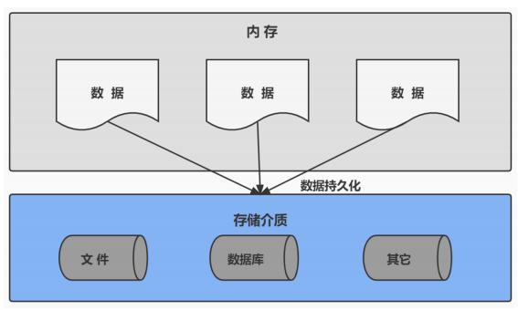

# MySQL

## 数据库概述

### 为什么要用数据库

- 持久化（persistence）：**把数据保存到可掉电式存储设备中以供之后使用**。大多数情况下，特别是企业级应用，**数据持久化意味着将内存中的数据保存到硬盘上加以固化**，而持久化的实现过程大多通过各种关系数据库来完成

- 持久化的主要作用是**将内存中的数据存储在关系型数据库中**，当然也可以存储在磁盘文件、XML 数据文件中

### 数据库与数据库管理系统

#### 数据库相关概念

| 术语                                               | 解释                                                                                                                                     |
| -------------------------------------------------- | ---------------------------------------------------------------------------------------------------------------------------------------- |
| DB：数据库（Database）                             | 即存储数据的“仓库”，其本质是一个文件系统，它保存了一系列有组织的数据。                                                                   |
| DBMS：数据库管理系统（Database Management System） | 是一种操纵和管理数据库的大型软件，用于建立、使用和维护数据库，对数据库进行统一管理和控制。用户通过数据库管理系统访问数据库中表内的数据。 |
| SQL：结构化查询语言（Structured Query Language）   | 专门用来与数据库通讯的语言                                                                                                               |

#### 数据库与数据库管理系统的关系

