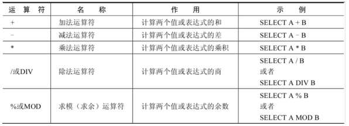
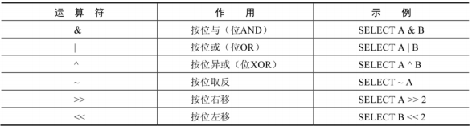
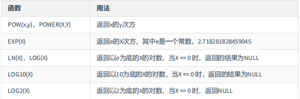
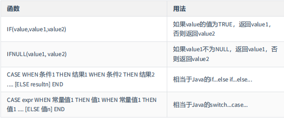

# MySQL

## 数据库概述

### 为什么要用数据库

- 持久化（persistence）：**把数据保存到可掉电式存储设备中以供之后使用**。大多数情况下，特别是企业级应用，**数据持久化意味着将内存中的数据保存到硬盘上加以固化**，而持久化的实现过程大多通过各种关系数据库来完成

- 持久化的主要作用是**将内存中的数据存储在关系型数据库中**，当然也可以存储在磁盘文件、XML 数据文件中


### 数据库与数据库管理系统

#### 数据库相关概念

| 术语                                               | 解释                                                                                                                                     |
| -------------------------------------------------- | ---------------------------------------------------------------------------------------------------------------------------------------- |
| DB：数据库（Database）                             | 即存储数据的“仓库”，其本质是一个文件系统，它保存了一系列有组织的数据。                                                                   |
| DBMS：数据库管理系统（Database Management System） | 是一种操纵和管理数据库的大型软件，用于建立、使用和维护数据库，对数据库进行统一管理和控制。用户通过数据库管理系统访问数据库中表内的数据。 |
| SQL：结构化查询语言（Structured Query Language）   | 专门用来与数据库通讯的语言                                                                                                               |

#### 数据库与数据库管理系统的关系

数据库管理系统(DBMS)可以管理多个数据库，一般开发人员会针对每一个应用创建一个数据库。为了保存应用中实体的数据，一般会在数据库创建多个表，以保存程序中实体用户的数据。


### MySQL 简介

#### 概述

- MySQL 是一个 **开放源代码的关系型数据库管理系统**

- MySQL 是一种关联数据库管理系统，将数据保存在不同的表中，而不是将所有数据放在一个大仓库内，这样就增加了速度并提高了灵活性。

- MySQL6.x 版本之后分为社区版和商业版。

- MySQL 是开源的，所以不需要支付额外的费用。

- MySQL 是可以定制的，采用了 GPL（GNU General Public License） 协议，你可以修改源码来开发自己的 MySQL 系统。

- MySQL 支持大型的数据库。可以处理拥有上千万条记录的大型数据库。

- MySQL 支持大型数据库，支持 5000 万条记录的数据仓库，32 位系统表文件最大可支持 4GB ，64 位系统支持最大的表文件为 8TB 。

- MySQL 使用 标准的 SQL 数据语言 形式。

- MySQL 可以允许运行于多个系统上，并且支持多种语言。这些编程语言包括 C、C++、Python、Java、Perl、PHP 和 Ruby 等。

#### 关于 MySQL 8.0

MySQL 从 5.7 版本直接跳跃发布了 8.0 版本。MySQL 8 版本在功能上做了显著的改进与增强，开发者对 MySQL 的源代码进行了重构，最突出的一点是多 MySQL Optimizer 优化器进行了改进。不仅在速度上得到了改善，还为用户带来了更好的性能和更棒的体验。

#### 为什么选择 MySQL

1. 开放源代码，使用成本低。
2. 性能卓越，服务稳定。
3. 软件体积小，使用简单，并且易于维护。
4. 历史悠久，社区用户非常活跃，遇到问题可以寻求帮助。
5. 许多互联网公司在用，经过了时间的验证。

#### Oracle VS MySQL

- Oracle 更适合大型跨国企业的使用，因为他们对费用不敏感，但是对性能要求以及安全性有更高的要求。

- MySQL 由于其**体积小、速度快、总体拥有成本低，可处理上千万条记录的大型数据库，尤其是开放源码**这一特点，使得很多互联网公司、中小型网站选择了 MySQL 作为网站数据库（Facebook，Twitter，YouTube，阿里巴巴/蚂蚁金服，去哪儿，美团外卖，腾讯）。

### RDBMS 与 非 RDBMS

关系型数据库是 DBMS 的主流，使用最多的 DBMS 依次是 Oracle、 MySQL、 SQL Server，这些都是关系型数据库（RDBMS）。

#### 关系型数据库(RDBMS)

##### 实质

- 这种类型的数据库是**最古老**的数据库类型，关系型数据库模型是把复杂的数据结构归结为简单的**二元关系**（即二维表格形式）。

- 关系型数据库以 **行(row)** 和 **列(column)** 的形式存储数据，以便于用户理解。这一系列的行和列被称为 **表(table)** ，一组表组成了一个**库(database)**。

- 表与表之间的数据记录有关系(relationship)。现实世界中的各种实体以及实体之间的各种联系均用 **关系模型** 来表示。关系型数据库，就是建立在 **关系模型** 基础上的数据库。

- SQL 就是关系型数据库的查询语言

##### 优点

- **复杂查询** 可以用 SQL 语句方便的在一个表以及多个表之间做非常复杂的数据查询

- **事务支持** 使得对于安全性能很高的数据访问要求得到实现

#### 非关系型数据库(非 RDBMS)

##### 介绍

**非关系型数据库**， 可看成传统关系型数据库的功能 **阉割版本** ，基于键值对存储数据，不需要经过 SQL 层的解析， **性能非常高** 。同时，通过减少不常用的功能，进一步提高了数据库的性能。

目前基本上大部分主流的非关系型数据库都是免费的

##### 类型

- **键值型数据库**

键值型数据库通过 **Key-Value** 键值的方式来存储数据，其中 Key 和 Value 可以是简单的对象，也可以是复杂的对象。Key 作为唯一的标识符，优点是查找速度快，在这方面明显优于关系型数据库，缺点是无法像关系型数据库一样使用条件过滤（比如 WHERE），如果你不知道去哪里找数据，就要遍历所有的键，这就会消耗大量的计算。

键值型数据库典型的使用场景是作为 **内存缓存** 。 **Redis** 是最流行的键值型数据库


- **文档型数据库**

此类数据库可存放并获取文档，可以是 XML、JSON 等格式。在数据库中文档作为处理信息的基本单位，一个文档就相当于一条记录。文档数据库所存放的文档，就相当于键值数据库所存放的“值”。MongoDB 是最流行的文档型数据库。此外，还有 CouchDB 等。

- **搜索引擎数据库**

虽然关系型数据库采用了索引提升检索效率，但是针对全文索引效率却较低。搜索引擎数据库是应用在搜索引擎领域的数据存储形式，由于搜索引擎会爬取大量的数据，并以特定的格式进行存储，这样在检索的时候才能保证性能最优。核心原理是“倒排索引”。

典型产品：Solr、Elasticsearch、Splunk 等

- **列式数据库**

列式数据库是相对于行式存储的数据库，Oracle、MySQL、SQL Server 等数据库都是采用的行式存储（Row-based），而列式数据库是将数据按照列存储到数据库中，这样做的好处是可以大量降低系统的 I/O，适合于分布式文件系统，不足在于功能相对有限。典型产品：HBase 等。

- **图形数据库**

图形数据库，利用了图这种数据结构存储了实体（对象）之间的关系。图形数据库最典型的例子就是社交网络中人与人的关系，数据模型主要是以节点和边（关系）来实现，特点在于能高效地解决复杂的关系问题。

图形数据库顾名思义，就是一种存储图形关系的数据库。它利用了图这种数据结构存储了实体（对象）之间的关系。关系型数据用于存储明确关系的数据，但对于复杂关系的数据存储却有些力不从心。如社交网络中人物之间的关系，如果用关系型数据库则非常复杂，用图形数据库将非常简单。

典型产品：Neo4J、InfoGrid 等。

### 关系型数据库设计规则

- 关系型数据库的典型数据结构就是 **数据表** ，这些数据表的组成都是结构化的(Structured)

- 将数据放到表中，表再放到库中。

- 一个数据库中可以有多个表，每个表都有一个名字标记自己，表名具有唯一性

- 表具有一些特征，这些特征定义了数据在表中如何存储，类似 Java 中的 类

#### 表、记录、字段

- E-R（entity-relationship）模型中有三个主要概念：**实体集** 、 **属性** 、 **联系集**

- 一个实体集（class）对应于数据库中的一个表（table），一个实体（instance）则对应于数据库表中的一行（row），也称为一条记录（record）。一个属性（attribute）对应于数据库表中的一列（column），也称为一个字段（field）


> ORM 思想 (Object Relational Mapping)体现：
> 数据库中的一个表 <---> Java 或 Python 中的一个类
> 表中的一条数据 <---> 类中的一个对象（或实体）
> 表中的一个列 <----> 类中的一个字段、属性(field)

#### 表的关联关系

- 表与表之间的数据记录有关系(relationship)。现实世界中的各种实体以及实体之间的各种联系均用关系模型来表示。

- 四种：一对一关联、一对多关联、多对多关联、自我引用

##### 一对一关联（one-to-one）

- 在实际的开发中应用不多，因为一对一可以创建成一张表。

- 举例：设计 学生表 ：学号、姓名、手机号码、班级、系别、身份证号码、家庭住址、籍贯、紧急联系人、...

  - 拆为两个表：两个表的记录是一一对应关系。
  - **基础信息表** （常用信息）：学号、姓名、手机号码、班级、系别
  - **档案信息表** （不常用信息）：学号、身份证号码、家庭住址、籍贯、紧急联系人、...

- 两种建表原则：

  - 外键唯一：主表的主键和从表的外键（唯一），形成主外键关系，外键唯一。

  - 外键是主键：主表的主键和从表的主键，形成主外键关系。

##### 一对多关联（one-to-many）

- 常见实例场景： **客户表和订单表**， **分类表和商品表**， **部门表和员工表**

- 举例：

  - 员工表：编号、姓名、...、所属部门
  - 部门表：编号、名称、简介

- 一对多建表原则：在从表（多方）创建一个字段，字段作为外键指向主表（一方）的主键。

##### 多对多关联（many-to-many）

要表示多对多关系，必须创建第三个表，该表通常称为 **联接表** ，它将多对多关系划分为两个一对多关系。将这两个表的主键都插入到第三个表中。

- 举例 1：学生-课程

  - **学生信息表** ：一行代表一个学生的信息（学号、姓名、手机号码、班级、系别...）
  - **课程信息表** ：一行代表一个课程的信息（课程编号、授课老师、简介...）
  - **选课信息表** ：一个学生可以选多门课，一门课可以被多个学生选择

- 举例 2：产品-订单

  “订单”表和“产品”表有一种多对多的关系，这种关系是通过与“订单明细”表建立两个一对多关系来定义的。一个订单可以有多个产品，每个产品可以出现在多个订单中。

  - **产品表** ：“产品”表中的每条记录表示一个产品。
  - **订单表** ：“订单”表中的每条记录表示一个订单。
  - **订单明细表** ：每个产品可以与“订单”表中的多条记录对应，即出现在多个订单中。一个订单可以与“产品”表中的多条记录对应，即包含多个产品。

##### 自我引用（self-reference）


自我引用是指一个表中包含了对自己（表）的引用。

## MySQL 环境搭配

### MySQL 的卸载

1. 停止 MySQL 服务：在任务管理器停止 MySQL 服务。

2. 卸载软件

3. 删除环境变量配置

### MySQL 的 4 大版本

- MySQL Community Server 社区版本，开源免费，自由下载，但不提供官方技术支持，适用于大多数普通用户。
- MySQL Enterprise Edition 企业版本，需付费，不能在线下载，可以试用 30 天。提供了更多的功能和更完备的技术支持，更适合于对数据库的功能和可靠性要求较高的企业客户。
- MySQL Cluster 集群版，开源免费。用于架设集群服务器，可将几个 MySQL Server 封装成一个 Server。需要在社区版或企业版的基础上使用。
- MySQL Cluster CGE 高级集群版，需付费。

### MySQL 的启动、停止服务

使用**管理员身份**运行命令行，输入以下命令：

- 启动 MySQL 服务：`net start mysql`

- 停止 MySQL 服务：`net stop mysql`

## MySQL 的使用

### MySQL 的部分命令

1. 查看数据库列表：`show databases;`

> “information_schema”是 MySQL 系统自带的数据库，主要保存 MySQL 数据库服务器的系统信息，比如数据库的名称、数据表的名称、字段名称、存取权限、数据文件 所在的文件夹和系统使用的文件夹，等等

> “performance_schema”是 MySQL 系统自带的数据库，可以用来监控 MySQL 的各类性能指标。

> “sys”数据库是 MySQL 系统自带的数据库，主要作用是以一种更容易被理解的方式展示 MySQL 数据库服务器的各类性能指标，帮助系统管理员和开发人员监控 MySQL 的技术性能。

> “mysql”数据库保存了 MySQL 数据库服务器运行时需要的系统信息，比如数据文件夹、当前使用的字符集、约束检查信息，等等

2. 创建数据库：`create database 数据库名;`不能和已有的数据库重名

3. 使用自己的数据库：`use 数据库名;`

- 如果没有使用`use`语句，后面针对数据库的操作也没有加“数据名”的限定，则会报错

- 使用完`use`语句后，如果接下来的 SQL 都是针对同一个数据库操作的，那就不用重复 use 了，如果要针对另一个数据库操作，那么需要重新 use

4. 查看某个库的所有表格：`show tables;`

- 前面要先`use`指定的数据库，否则会报错

5. 创建新的表格：

```
create table 表格名 (
    字段名1 数据类型1,
    字段名2 数据类型2,
    字段名3 数据类型3
);
```

- 如果是最后一个字段，后面就不用加逗号，因为逗号的作用是分割每一个字段

6. 查看一个表的数据：`select * from 表格名;`

7. 添加一条记录：`insert into 表名称 values(值列表);`

8. 查看表的创建信息：`show create table 表名称\G`

9. 查看数据库的创建信息：`show create database 数据库名称\G`

10. 删除表：`drop table 表名称;`

11. 删除数据库：`drop database 数据库名称;`

12. 查看当前数据库的端口号：`select @@port;`

### MySQL 目录结构与源码

#### 主要目录结构

| MySQL 的目录结构                               | 说明                                   |
| ---------------------------------------------- | -------------------------------------- |
| /bin                                           | 所有 MySQL 的可执行文件，如：mysql.exe |
| MySQLInstanceConfig.exe                        | 数据库的配置向导，在安装时出现的内容   |
| /data                                          | 系统数据库所在的目录                   |
| my.inl                                         | MySQL 的主要配置文件                   |
| C:\Program Files\MySQL\MySQL Server 8.4\data\  | 用户创建的数据库所在的目录             |

#### MySQL 源代码获取

首先，进入 MySQL 下载界面。不要选择用默认的“Microsoft Windows”，而是要通过下拉栏，找到“Source Code”，在下面的操作系统版本里面， 选择 Windows（Architecture Independent），然后点击下载。

接下来，把下载下来的压缩文件解压，就得到了 MySQL 的源代码。

MySQL 是用 C++ 开发而成的。

mysql-8.0.22 目录下的各个子目录，包含了 MySQL 各部分组件的源代码：


- sql 子目录是 MySQL 核心代码；

- libmysql 子目录是客户端程序 API；

- mysql-test 子目录是测试工具；

- mysys 子目录是操作系统相关函数和辅助函数；

## 基本的 SELECT 语句

### SQL 概述

SQL(Structured Query Language，结构化查询语言)是使用关系模型的数据库应用语言，**与数据直接打交道**

SQL 有两个重要标准，分别是 SQL92 和 SQL99。分别代表了 92 年和 99 年颁布的 SQL 标准。

不同的数据生产厂商都支持 SQL 语句，但都有特有内容。

- SQL 规范（普通话）
  - MySQL 特有（方言）
  - Oracle 特有（方言）

#### SQL 分类

SQL 语言在功能上主要分为如下 3 大类：

- **DDL（Data Definition Language，数据定义语言）**，这些语句定义了不同的数据库、表、视图、索引等数据库对象，还可以用来创建、删除、修改数据库和数据表的结构

  - 主要的语句关键字包括`CREATE`、`DROP`、`ALTER`等

- **DML（Data Manipulation Language，数据操纵语言）**，用于添加、删除、更新和查询数据库记录，并检查数据完整性

  - 主要的语句关键字包括`INSERT`、`DELETE`、`UPDATE`、`SELECT`等

  - **SELECT**是 SQL 语言的基础，最为重要。

- **DCL（Data Control Language，数据控制语言）**，用于定义数据库、表、字段、用户的访问权限和安全级别。

  - 主要的雨具关键字包括`GRANT`、`REVOKE`、`COMMIT`、`ROLLBACK`、`SAVEPOINT`等

> 因为查询语句使用得非常频繁，所以很多人把查询语句单拎出来一类：DQL（数据查询语言）。

> 还有单独将`COMMIT`、`ROLLBACK`取出来称为 TCL（Transaction Control Language，事务控制语言）。

### SQL 语言的规则与规范

#### 基本规则

- SQL 语句可以写在一行或者多行。为了提高可读性，各子句分行写，必要时候使用缩进

- 每条命令以`;`或`\g`或`\G`结束

- 关键字不能被缩写也不能分行

- 关于标点符号：

  - 必须保证所有的`()`、单引号、双引号是成对结束的

  - 必须使用英文状态下的半角输入方式

  - 字符串型和日期时间类型的数据可以使用`''`单引号表示

  - 列的别名，尽量使用`""`双引号，而且不建议省略`as`

#### SQL 大小写规范

- **MySQL** 在 Windows 环境下是大小写不敏感的

- **MySQL** 在 Linux 环境下是大小写敏感的

  - 数据库名、表名、表的别名、变量名是严格区分大小写的

  - 关键字、函数名、列名（或字段名）、列的别名（字段的别名）是忽略大小写的

- **推荐采用统一的书写规范**：

  - 数据库名、表名、表的别名、字段名、字段别名等都小写

  - SQL 关键字、函数名、绑定变量都大写

#### SQL 注释

```
单行注释：#注释文字(MySQL特有的方式)
单行注释：-- 注释文字(--后面必须包含一个空格。)
多行注释：/* 注释文字 */
```

#### 命名规则

- 数据库、表名不得超过 30 个字符，变量名限制为 29 个

- 必须只能包含 A–Z, a–z, 0–9, \_共 63 个字符

- 数据库名、表名、字段名等对象名中间不要包含空格

- 同一个 MySQL 软件中，数据库不能同名；同一个库中，表不能重名；同一个表中，字段不能重名必须保证你的字段没有和保留字、数据库系统或常用方法冲突。如果坚持使用，请在 SQL 语句中使用`（着重号）引起来

- 保持字段名和类型的一致性，在命名字段并为其指定数据类型的时候一定要保证一致性。假如数据类型在一个表里是整数，那在另一个表里可就别变成字符型了

#### 数据导入指令

启动 MySQL 命令行客户端，使用`source`指令录入以`.sql`结尾的文件路径：

```
mysql> SOURCE 文件名;
```

### 基本的 SELECT 语句

#### SELECT ... FROM

- 语法：`SELECT 标识选择哪些列 FROM 标识从哪个表中选择`

- 选择所有列：`SELECT * FROM 表名;`

  使用通配符`*`代表将所有列都选择，在生产环境不建议直接使用

- 选择特定列：`SELECT 列1, 列2, 列3 FROM 表名;`

#### 列的别名

- 重命名一个列

- 便于计算

- 紧跟列名，也可以**在列名和别名之间加入关键字 AS，别名使用双引号**，以便在别名中包含空格或特殊字符并区分大小写。

- AS 可以省略

- 别名建议简短，见名知意

```
SELECT 列名1 AS 列名1别名, 列名2 列名2别名
FROM 表名;
```

#### 去除重复行

默认情况查询会返回全部行，包括重复行。

在 SELECT 语句中使用关键字`DISTINCT`去除重复行

```
SELECT DISTINCT 列名 FROM 表名;
```

注意：

1. DISTINCT 需要放到所有列名的前面

2. DISTINCT 其实是对后面所有列名的组合进行去重

#### 空值参与运算

- 所有运算符或列值遇到 null 值，运算的结果都为 null

- 在 MySQL 中，空值不等于空字符串

#### 着重号

为了确保表中的字段、表名等没有和保留字、数据库系统或常用方法冲突，若相同，则在 SQL 语句中使用一对 ``（着重号）引起来。

#### 查询常数

SELECT 查询还可以对常数进行查询。在 SELECT 查询结果中增加一列固定的常数列，这列的
取值是我们指定的，而不是从数据表中动态取出的。

SQL 中的 SELECT 语法的确提供了这个功能，一般来说我们只从一个表中查询数据，通常不需要增加一个固定的常数列，如果想整合不同的数据源，用常数列作为这个表的标记，就需要查询常数。

```
SELECT id, `name`, 1 AS `rank`, 'CN' AS country FROM student;
```

### 显示表结构

使用 `DESCRIBE` （SQL 标准） 或 `DESC`（MySQL 特有） 命令，表示表结构：`DESCRIBE 表名;`


其中，各个字段的含义分别解释如下：

- Field：表示字段名称。

- Type：表示字段类型，这里 barcode、goodsname 是文本型的，price 是整数类型的。

- Null：表示该列是否可以存储 NULL 值。

- Key：表示该列是否已编制索引。PRI 表示该列是表主键的一部分；UNI 表示该列是 UNIQUE 索引的一部分；MUL 表示在列中某个给定值允许出现多次。

- Default：表示该列是否有默认值，如果有，那么值是多少。

- Extra：表示可以获取的与给定列有关的附加信息，例如 AUTO_INCREMENT 等

### 过滤数据

- 语法：`SELECT 列名 FROM 表名 WHERE 条件;`

  - 使用 WHERE 子句，将不满足条件的行过滤

  - **WHERE 子句紧随 FROM 子句**

## 运算符

### 算术运算符

算术运算符主要用于数学运算，其可以连接运算符前后的两个数值或表达式，对数值或表达式进行加（+）、减（-）、乘（\*）、除（/）和取模（%）运算。



#### 加法与减法运算符

- 一个整数类型的值对整数进行加法和减法操作，结果还是一个整数；

- 一个整数类型的值对浮点数进行加法和减法操作，结果是一个浮点数；

- 加法和减法的优先级相同，进行先加后减操作与进行先减后加操作的结果是一样的；

- 在 Java 中，+的左右两边如果有字符串，那么表示字符串的拼接。但是在 MySQL 中+只表示数值相加。如果遇到非数值类型，先尝试转成数值，如果转失败，就按 0 计算。（补充：MySQL 中字符串拼接要使用字符串函数 CONCAT()实现）

#### 乘法与除法运算符

- 一个数乘以整数 1 和除以整数 1 后仍得原数；

- 一个数乘以浮点数 1 和除以浮点数 1 后变成浮点数，数值与原数相等；

- 一个数除以整数后，不管是否能除尽，结果都为一个浮点数；

- 一个数除以另一个数，除不尽时，结果为一个浮点数，并保留到小数点后 4 位；乘法和除法的优先级相同，进行先乘后除操作与先除后乘操作，得出的结果相同。在数学运算中，0 不能用作除数，在 MySQL 中，一个数除以 0 为 NULL。

### 比较运算符

比较运算符用来对表达式左边的操作数和右边的操作数进行比较，比较的结果为真则返回 1，比较的结果为假则返回 0，其他情况则返回 NULL。

比较运算符经常被用来作为 SELECT 查询语句的条件来使用，返回符合条件的结果记录


#### 等号运算符

- 等号运算符（=）判断等号两边的值、字符串或表达式是否相等，如果相等则返回 1，不相等则返回
  0。

- 在使用等号运算符时，遵循如下规则：

  - 如果等号两边的值、字符串或表达式都为字符串，则 MySQL 会按照字符串进行比较，其比较的是每个字符串中字符的 ANSI 编码是否相等。

  - 如果等号两边的值都是整数，则 MySQL 会按照整数来比较两个值的大小。

  - 如果等号两边的值一个是整数，另一个是字符串，则 MySQL 会将字符串转化为数字进行比较。

  - 如果等号两边的值、字符串或表达式中有一个为 NULL，则比较结果为 NULL。

- 对比：SQL 中赋值符号使用 :=

#### 安全等于运算符

安全等于运算符`<=>`与等于运算符`=`的作用是相似的，**唯一的区别**是`<=>`可以用来对 NULL 进行判断。在两个操作数均为 NULL 时，其返回值为 1，而不为 NULL；当一个操作数为 NULL 时，其返回值为 0，而不为 NULL。

> 相当于限制返回数值，严格保证只会返回 1 或 0

#### 不等于运算符

不等于运算符(`!=`和`<>`)用于于判断两边的数字、字符串或者表达式的值是否不相等，如果不相等则返回 1，相等则返回 0。不等于运算符不能判断 NULL 值。如果两边的值有任意一个为 NULL，或两边都为 NULL，则结果为 NULL。

#### 非符号类型运算符


- 空运算符：(`IS NULL`或`ISNULL`)判断一个值是否为 NULL，如果为 NULL 则返回 1，否则返回 0

- 非空运算符：(`IS NOT NULL`)判断一个值是否不为 NULL，如果不为 NULL 则返回 1，否则返回 0

- 最小值运算符：(`LEAST(value1, value2, value3,...)`)在有两个或多个参数时，返回最小值。当参数是整数或浮点数时，返回最小值；当参数为字符串，返回字母表中顺序最靠前的字符；当比较值列表中有 NULL 时，不能判断大小，返回 NULL。

- 最大值运算符：(`GREATEST(value1, value2, value3,...)`)在有两个或多个参数时，返回最大值。当参数是整数或浮点数时，返回最大值；当参数为字符串，返回字母表中顺序最靠后的字符；当比较值列表中有 NULL 时，不能判断大小，返回 NULL。

- BETWEEN AND 运算符：(`BETWEEN value1 AND value2`)判断值是否在一个范围内，如果在范围内则返回 1，否则返回 0。常用格式：`SELECT D FROM table_name WHERE C BETWEEN A AND B;`，当 C>=A 且 C<=B 时，返回 1，否则返回 0。

- IN 运算符：IN 运算符用于判断给定的一个值是否是 IN 列表中的一个值，如果是则返回 1，否则返回 0；如果给定值为 NULL，或者 IN 列表中存在 NULL，则结果为 NULL。

- LIKE 运算符：LIKE 运算符用于匹配字符串，通常用于模糊匹配，如果满足条件则返回 1，否则返回 0；如果给定的值或者匹配条件为 NULL，则返回结果为 NULL。

- REGEXP 运算符：REGEXP 运算符用来匹配字符串，语法格式为：`expr REGEXP 匹配条件`。如果 expr 满足匹配条件，返回 1；如果不满足，则返回 0。若 expr 或匹配条件任意一个为 NULL，则结果为 NULL。

REGEXP 运算符在进行匹配时，常用的有以下几种通配符：

1. `^`匹配以该字符后面的字符开头的字符串。

2. `$`匹配以该字符前面的字符结尾的字符串。

3. `.`匹配任何一个单字符。

4. `[...]`匹配在方括号内的任何字符。例如，`[abc]`匹配`a`或`b`或`c`。为了命名字符的范围，使用一个`-`。`[a-z]`匹配任何字母，而`[0-9]`匹配任何数字。

5. `_`匹配零个或多个在它前面的字符。例如，`x_`匹配任何数量的‘x’字符，`[0-9]_`匹配任何数量的数字，而`_`匹配任何数量的任何字符

### 逻辑运算符

逻辑运算符主要用来判断表达式的真假，在 MySQL 中，逻辑运算符的返回结果为 1、0 或者 NULL


1. **逻辑非运算符** 逻辑非(`NOT`或`!`)运算符表示当给定的值为 0 时返回 1；当给定的值为非 0 值时返回 0；当给定的值为 NULL 时，返回 NULL。

2. **逻辑与运算符** 逻辑与（`AND`或`&&`）运算符是当给定的所有值均为非 0 值，并且都不为 NULL 时，返回 1；当给定的一个值或者多个值为 0 时则返回 0；否则返回 NULL。

3. **逻辑或运算符** 逻辑或（`OR`或`||`）运算符是当给定的值都不为 NULL，并且任何一个值为非 0 值时，则返回 1，否则返回 0；当一个值为 NULL，并且另一个值为非 0 值时，返回 1，否则返回 NULL；当两个值都为 NULL 时，返回 NULL。

4. **逻辑异或运算符** 逻辑异或（XOR）运算符是当给定的值中任意一个值为 NULL 时，则返回 NULL；如果两个非 NULL 的值都是 0 或者都不等于 0 时，则返回 0；如果一个值为 0，另一个值不为 0 时，则返回 1。

### 位运算符

位运算符是在二进制数上进行计算的运算符。位运算符会先将操作数变成二进制数，然后进行位运算，最后将计算结果从二进制变回十进制数。



1. **按位与运算符** 按位与（&）运算符将给定值对应的二进制数逐位进行逻辑与运算。当给定值对应的二进制位的数值都为 1 时，则该位返回 1，否则返回 0

2. **按位或运算符** 按位或（|）运算符将给定的值对应的二进制数逐位进行逻辑或运算。当给定值对应的二进制位的数值有一个或两个为 1 时，则该位返回 1，否则返回 0。

3. **按位异或运算符** 按位异或（^）运算符将给定的值对应的二进制数逐位进行逻辑异或运算。当给定值对应的二进制位的数值不同时，则该位返回 1，否则返回 0。

4. **按位取反运算符** 按位取反（~）运算符将给定的值的二进制数逐位进行取反操作，即将 1 变为 0，将 0 变为 1。

5. **按位右移运算符** 按位右移（>>）运算符将给定的值的二进制数的所有位右移指定的位数。右移指定的位数后，右边低位的数值被移出并丢弃，左边高位空出的位置用 0 补齐。

6. **按位左移运算符** 按位左移（<<）运算符将给定的值的二进制数的所有位左移指定的位数。左移指定的位数后，左边高位的数值被移出并丢弃，右边低位空出的位置用 0 补齐。

### 运算符的优先级


数字编号越大，优先级越高，优先级高的运算符先进行计算。可以看到，赋值运算符的优先级最低，使用`()`括起来的表达式的优先级最高。

## 排序与分页

### 排序数据

#### 排序规则

- 使用 `ORDER BY` 子句排序

  - **ASC(ascend)升序**

  - **DESC(descend)降序**

- **ORDER BY 子句在 SELECT 语句的结尾**

- 单列排序：`SELECT 列名 FROM 表名 ORDER BY 列名 (DESC|ASC);`

- 多列排序：`SELECT 列名1, 列名2, 列名3 FROM 表名 ORDER BY 列名1 (DESC|ASC), 列名2 (DESC|ASC), 列名3 (DESC|ASC);`

  - 可以使用不在 SELECT 列表中的列排序。

  - 在对多列进行排序的时候，首先排序的第一列必须有相同的列值，才会对第二列进行排序。若第一列数据中的所有值都是唯一的，将不再对第二列排序

### 分页

- **分页原理**

  - 所谓分页显示就是将数据库的结果集，一段一段显示出来需要的条件

  - **MySQL 中使用 LIMIT 子句实现分页**

  - 格式：`LIMIT [位置偏移量,] 行数`，第一条记录的位置偏移量是 0，第二条记录的位置偏移量是 1，以此类推。

```
--前十条记录
SELECT * FROM 表名 LIMIT 10;
SELECT * FROM 表名 LIMIT 0, 10;
```

- 分页显示公式：**（当前页数-1）\*每页条数，每页条数**

`SELECT * FROM 表名 LIMIT (当前页数-1)*每页条数, 每页条数;`

- **LIMIT 子句在 SELECT 语句的结尾**

使用 LIMIT 可以约束返回结果的数量，**减少数据表的网络传输量**，也可以**提升查询效率**。

## 多表查询

多表查询，也称为关联查询，指两个或更多个表一起完成查询操作

前提条件：这些一起查询的表之间是有关系的（一对一、一对多），它们之间一定是有关联字段，这个关联字段可能建立了外键，也可能没有建立外键。比如：员工表和部门表，这两个表依靠“部门编号”进行关联。

### 多表查询分类

#### 等值连接

等值连接（等匹配）：当两个表的关联字段相等时，就称为等值连接。

语法：`SELECT 列名1, 列名2 FROM 表名1, 表名2 WHERE 表名1.关联字段 = 表名2.关联字段;`

主键必须保持唯一、非空性

**在多个表中有相同列的时候，必须在列明前加上表名前缀**

使用表的别名，在查询字段、过滤条件中只能使用别名不能使用原有表名

**连接 n 个表，至少要 n-1 个条件**

#### 内连接与外连接

- 内连接: 合并具有同一列的两个以上的表的行, **结果集中不包含一个表与另一个表不匹配的行**

- 外连接: 两个表在连接过程中除了返回满足连接条件的行以外**还返回左（或右）表中不满足条件的行 ，这种连接称为左（或右） 外连接**。没有匹配的行时, 结果表中相应的列为空(NULL)。

- 如果是左外连接，则连接条件中左边的表也称为 **主表** ，右边的表称为 **从表** 。

- 如果是右外连接，则连接条件中右边的表也称为 **主表** ，左边的表称为 **从表** 。

### SQL99 实现多表查询

#### 基本语法

使用`JOIN... ON`

```
SELECT 列名1, 列名2
FROM table1
  JOIN table2 ON table1 和 table2 的连接条件
    JOIN table3 ON table2 和 table3 的连接条件
```

- 语法说明：

  - **可以使用 ON 子句制定额外的连接条件**

  - 这个连接条件是与其它条件分开的。

  - **ON 子句使语句具有更高的易读性**

  - 关键字`JOIN`、`INNER JOIN`、`CROSS JOIN`的含义是一样的，都表示内连接

#### 外连接（OUTER JOIN）的实现

关于`LEFT OUTER JOIN`和`RIGHT OUTER JOIN`只存在于 SQL99 及之后的

##### 左外连接（LEFT OUTER JOIN）

语法：

```
SELECT 字段列表
FROM table1 LEFT JOIN table2
ON 关联条件
WHERE 条件
```

##### 右外连接（RIGHT OUTER JOIN）

语法：

```
SELECT 字段列表
FROM table1 RIGHT JOIN table2
ON 关联条件
WHERE 条件
```

###### 满外连接（FULL OUTER JOIN）

- 满外连接的结果=左右表匹配的数据 + 左表没有匹配到的数据 + 右表没有匹配到的数据。

- SQL99 是支持满外连接的。使用`FULL JOIN` 或 `FULL OUTER JOIN` 来实现。

- 需要注意的是，MySQL 不支持`FULL JOIN`，但是可以用 `LEFT JOIN UNION RIGHT JOIN`代替

### UNION 的使用

**合并查询结果** 利用 UNION 关键字，可以给出多条 SELECT 语句，并将它们的结果组合成单个结果集。合并时，两个表对应的列数和数据类型必须相同，并且相互对应。各个 SELECT 语句之间使用 UNION 或 UNION ALL 关键字分割

```
SELECT 字段列表 FROM table1
UNION [ALL]
SELECT 字段列表 FROM table2;
```

**UNION 操作符**

UNION 操作符返回两个查询的结果集的并集，去除重复记录

**UNION ALL 操作符**

UNION ALL 操作符返回两个查询的结果集的并集。对于两个结果集的重复部分，不去重.

> 注意：执行 UNION ALL 语句时所需要的资源比 UNION 语句少。如果明确知道合并数据后的结果数据不存在重复数据，或者不需要去除重复的数据，则尽量使用 UNION ALL 语句，以提高数据查询的效率。

### 7 中 SQL JOINS 的实现


语法格式：
⋂
⋃

```
#中图：内连接 A ⋃ B
SELECT 字段列表
FROM 表1 JOIN 表2
ON 表1.关联字段 = 表2.关联字段
```

```
#左上图：左外连接 A ⋃ (A ⋂ B)
SELECT 字段列表
FROM 表1 LEFT JOIN 表2
ON 表1.关联字段 = 表2.关联字段
```

```
#右上图：右外连接 (A ⋂ B) ⋃ B
SELECT 字段列表
FROM 表1 RIGHT JOIN 表2
ON 表1.关联字段 = 表2.关联字段
```

```
#左中图：A - A ⋂ B
SELECT 字段列表
FROM 表1 LEFT JOIN 表2
ON 表1.关联字段 = 表2.关联字段
WHERE 表1.关联字段 IS NULL
```

```
#右中图：B - A ⋂ B
SELECT 字段列表
FROM 表1 RIGHT JOIN 表2
ON 表1.关联字段 = 表2.关联字段
WHERE 表2.关联字段 IS NULL
```

```
#左下图：A ⋃ B
SELECT 字段列表
FROM 表1 LEFT JOIN 表2
ON 表1.关联字段 = 表2.关联字段
WHERE 表2.关联字段 IS NULL

UNION

SELECT 字段列表
FROM 表2 RIGHT JOIN 表1
ON 表1.关联字段 = 表2.关联字段
WHERE 表1.关联字段 IS NULL
```

```
#右下图：A ⋃ B - A ⋂ B
SELECT 字段列表
FROM 表1 LEFT JOIN 表2
ON 表1.关联字段 = 表2.关联字段
WHERE 表2.关联字段 IS NULL

UNION

SELECT 字段列表
FROM 表1 RIGHT JOIN 表2
ON 表1.关联字段 = 表2.关联字段
WHERE 表1.关联字段 IS NULL
```

### SQL99 语法新特性

#### 自然连接

SQL99 在 SQL92 的基础上提供了一些特殊语法，比如 **NATURAL JOIN** 用来表示自然连接。我们可以把自然连接理解为 SQL92 中的等值连接。它会帮你自动查询两张连接表中 **所有相同的字段** ，然后进行 **等值连接** 。

```
SELECT 字段列表
FROM 表1 NATURAL JOIN 表2
```

#### USING 连接

当我们进行连接的时候，SQL99 还支持使用 **USING** 指定数据表里的 同名字段 进行等值连接。但是只能配合 JOIN 一起使用。

```
SELECT 字段列表
FROM 表1 JOIN 表2
USING 字段名
```

USING 指定了具体的相同的字段名称，你需要在 USING 的括号 () 中填入要指定的同名字段。同时使用 **JOIN...USING** 可以简化 JOIN ON 的等值连接。

#### 表连接的约束方式

表连接的约束条件可以有三种方式：WHERE, ON, USING

- WHERE：适用于所有关联查询

- ON ：只能和 JOIN 一起使用，只能写关联条件。虽然关联条件可以并到 WHERE 中和其他条件一起写，但分开写可读性更好。

- USING：只能和 JOIN 一起使用，而且要求两个关联字段在关联表中名称一致，而且只能表示关联字段值相等

## 单行函数

### 函数的理解

函数可以把我们经常使用的代码**封装**起来，在需要时候直接调用；既**提高了代码效率**，又**提高了可维护性**。在 SQL 中，可以使用函数对检索出来的数据进行函数操作。使用这些函数可以**提高用户对数据库的管理效率**。

函数分类为：**内置函数**和**自定义函数**，内置函数是系统内置的通用函数，而自定义函数是我们根据自己的需要编写的

### DBMS 函数的差异

**DBMS 之间差异性很大，远大于同一个语言不同版本之间的差异性**。大部分 DBMS 会有自己特定的函数，这就意味着**采用 SQL 函数的代码可移植性是很差的**，因此在使用函数的时候要注意。

### MySQL 的内置函数及分类

MySQL 提供的内置函数从 **实现的功能角度** 可以分为数值函数、字符串函数、日期和时间函数、流程控制函数、加密与解密函数、获取 MySQL 信息函数、聚合函数等。

将内置函数再分类，分为：**单行函数**、**聚合函数（分组函数）**

### 单行函数分类

- 操作数据对象

- 接收参数返回一个结果

- **只对一行进行变换**

- **每行返回一个结果**

- 可以嵌套

- 参数可以是一列或一个值

#### 数值函数

##### 基本函数


##### 角度与弧度互换函数


##### 三角函数


##### 指数与对数



##### 进制间的转换


#### 字符串函数


> MySQL 中，字符串的位置是从 1 开始的。

#### 日期和时间函数

##### 获取日期、时间


##### 日期与时间戳的转换


##### 获取月份、星期、星期数、天数等函数


##### 日期的操作函数


##### 时间和秒钟转换的函数


##### 计算日期和时间的函数


##### 日期的格式化与解析


上述**非 GET_FORMAT**函数中 fmt 参数常用的格式符：


GET_FORMAT 函数中 data_type 和 format_type 参数常用的取值：


#### 流程控制函数

流程处理函数可以根据不同条件，执行不同的处理流程



#### 加密与解密函数

加密与解密函数主要用于对数据库中的数据进行加密和解密处理，以防数据被他人窃取，这些函数在保证数据库安全时非常有用。


#### MySQL 信息函数

MySQL 中内置了一些可以查询 MySQL 信息的函数，这些函数主要用于帮助数据库开发或运维人员更好地对数据库进行维护工作


#### 其他函数


## 聚合函数

### 聚合函数介绍

聚合函数是作用于一组数据，并对一组数据返回一个值

- 聚合函数类型

  - `AVG()`

  - `SUM()`

  - `MAX()`

  - `MIN()`

  - `COUNT()`

- 聚合函数语法：

```
SELECT [column,] group function(column), ...
FROM table
[WHERE condition]
[GROUP BY column]
[ORDER BY column]
```

- 聚合函数不能嵌套使用

#### AVG 和 SUM 函数

可以对**数值型数据**使用 AVG 和 SUM 函数。

```
SELECT AVG(column), SUM(column)
FROM table
```

#### MAX 和 MIN 函数

可以对**任意数据类型**使用 MAX 和 MIN 函数。

```
SELECT MAX(column), MIN(column)
FROM table
```

#### COUNT 函数

- `COUNT(*)` 返回表中记录总数，适用于**任意数据类型**

```
SELECT COUNT(*)
FROM table
WHERE condition;
```

- `COUNT(expr)` 返回**expr 不为空**的记录总数

```
SELECT COUNT(column)
FROM table
WHERE column IS NOT NULL;
```

### GROUP BY

#### 基本使用

可以使用 GROUP BY 子句将表中的数据分成若干组

```
SELECT column, group function(column)
FROM table
[HWERE condition]
[GROUP BY column]
[ORDER BY column];
```

> WHERE 一定放在 FROM 后面

在 SELECT 列表中，所有未包含在组函数中的列都应该包含在 GROUP BY 子句中。

```
SELECT column1, group function(column2)
FROM table
GROUP BY column1;
```

#### 使用多个分列

```
SELECT column1, column2, group function(column3)
FROM table
GROUP BY column1, column2;
```

#### GROUP BY 中使用 WITH ROLLUP

使用 `WITH ROLLUP` 关键字后，在所有查询出来的分组记录之后增加一条记录，该记录计算查询出的所有记录的总和，即统计记录数量

```
SELECT column1, group function(column2)
FROM table
[WHERE condition]
GROUP BY column1 WITH ROLLUP;
```

> 当使用 ROLLUP 时，不能同时使用 ORDER BY 子句进行结果排序，即 ROLLUP 和 ORDER BY 是相互排斥的。

### HAVING

#### 基本使用

过滤分组：**HAVING** 子句

1. 行已经被分组。

2. 使用聚合函数。

3. 满足 HAVING 子句中条件的分组将被显示。

4. HAVING 不能单独使用，必须要跟 GROUP BY 一起使用。

```
SELECT column1, group function(column2)
FROM table
[WHERE condition]
[GROUP BY column1]
[HAVING condition]
[ORDER BY column];
```

**不能在 WHERE 子句中使用的聚合函数**

#### WHERE 和 HAVING 的对比

- 区别 1：WHERE 可以直接使用表中的字段作为筛选条件，但不能使用分组中的计算函数作为筛选条件；HAVING 必须要于 GROUP BY 子句一起使用，可以把分组计算的函数和分组字段作为筛选条件。

- 区别 2：如果需要通过连接从关联表中获取需要的数据，WHERE 是先筛选后连接，而 HAVING 是先连接后筛选。

|        | 优点                         | 缺点                                   |
| ------ | ---------------------------- | -------------------------------------- |
| WHERE  | 先筛选数据再关联，执行效率高 | 不能使用分组中的计算函数进行筛选       |
| HAVING | 可以使用分组的计算函数       | 在最后的结果集中进行筛选，执行效率较低 |

### SELECT 执行过程

#### 查询的结构

```
#方式1：

SELECT ...,....,...
FROM ...,...,....
WHERE 多表的连接条件
AND 不包含组函数的过滤条件
GROUP BY ...,...
HAVING 包含组函数的过滤条件
ORDER BY ... ASC/DESC
LIMIT ...,...

#方式2：
SELECT ...,....,...
FROM ... JOIN ...
ON 多表的连接条件
JOIN ...
ON ...
WHERE 不包含组函数的过滤条件
AND/OR 不包含组函数的过滤条件
GROUP BY ...,...
HAVING 包含组函数的过滤条件
ORDER BY ... ASC/DESC
LIMIT ...,...

#其中：
#（1）from：从哪些表中筛选
#（2）on：关联多表查询时，去除笛卡尔积
#（3）where：从表中筛选的条件
#（4）group by：分组依据
#（5）having：在统计结果中再次筛选
#（6）order by：排序
#（7）limit：分页
```

#### SELECT 执行顺序

1. **关键字的顺序不能颠倒**

```
SELECT ... FROM ... WHERE ... GROUP BY ... HAVING ... ORDER BY ... LIMIT...
```

2. **SELECT 语句的执行顺序**

```
FROM -> WHERE -> GROUP BY -> HAVING -> SELECT 的字段 -> DISTINCT -> ORDER BY -> LIMIT
```

#### SQL 的执行原理


## 子查询

子查询指一个查询语句嵌套在另一个查询语句内部的查询

SQL 中子查询的使用大大增强了 SELECT 查询的能力，因为很多时候查询需要从结果集中获取数据，或者需要从同一个表中先计算得出一个数据结果，然后与这个数据结果（可能是某个标量，也可能是某个集合）进行比较

### 子查询的基本使用

- 基本语法结构：

```
SELECT 字段列表
FROM 表名
WHERE 条件
  (SELECT 字段列表
  FROM 表名);
```

- 子查询（内查询）在主查询之前一次执行完成

- 子查询的结果被主查询（外查询）使用

- **注意事项**

  - 子查询要包含在括号内

  - 将子查询放在比较条件的右侧

  - 单行操作符对应单行子查询，多行操作符对应多行子查询

### 子查询的分类

- 分类方式 1：

  - 按照内查询的结果返回一条还是多条记录，将子查询分为**单行子查询**、**多行子查询**

- 分类方式 2：

  - 按照内查询是否被多次执行，将子查询划分为**相关（关联）子查询**、**不相关（非关联）子查询**

### 单行子查询

**单行比较操作符**

| 操作符 | 含义                     |
| ------ | ------------------------ |
| =      | equal to                 |
| >      | greater than             |
| >=     | greater than or equal to |
| <      | less than                |
| <=     | less than or equal to    |
| <>     | not equal to             |

### 多行子查询

- 也称为集合比较子查询

- 内查询返回多行

- 使用多行比较操作符

**多行比较操作符**

| 操作符 | 含义                                                         |
| ------ | ------------------------------------------------------------ |
| IN     | 等于列表中的**任意一个**                                     |
| ANY    | 需要和单行比较操作符一起使用，和子查询返回的**某一个**值比较 |
| ALL    | 需要和单行比较操作符一起使用，和子查询返回的**所有**值比较   |

### 相关子查询

如果子查询的执行依赖于外部查询，通常情况下都是因为子查询中的表用到了外部的表，并进行了条件关联，因此每执行一次外部查询，子查询都要重新计算一次，这样的子查询就称之为 **关联子查询** 。

相关子查询按照一行接一行的顺序执行，主查询的每一行都执行一次子查询

## 创建和管理表

### 一条数据存储的过程

**存储数据是处理数据的第一步**

#### 完整的数据存储过程

完整的数据存储过程包括：

1. 创建数据库

2. 确认字段

3. 创建数据表

4. 插入数据


从系统的架构层次上来看，MySQL 数据库系统从大到小依次是 **数据库服务器**、**数据库**、**数据表**、**数据表的行与列**

#### 标识符命名规则

- 数据库名、表名不得超过 30 个字符，变量名限制为 29 个

- 必须只能包含 A–Z, a–z, 0–9, `_`共 63 个字符

- 数据库名、表名、字段名等对象名中间不要包含空格

- 同一个 MySQL 软件中，数据库不能同名；同一个库中，表不能重名；同一个表中，字段不能重名

- 必须保证你的字段没有和保留字、数据库系统或常用方法冲突。如果坚持使用，请在 SQL 语句中使用`（着重号）引起来

- 保持字段名和类型的一致性：在命名字段并为其指定数据类型的时候一定要保证一致性，假如数据类型在一个表里是整数，那在另一个表里可就别变成字符型了

#### 数据类型

| 类型             | 类型举例                                                                                                        |
| ---------------- | --------------------------------------------------------------------------------------------------------------- |
| 整数类型         | TINYINT、SMALLINT、MEDIUMINT、INT(或 INTEGER)、BIGINT                                                           |
| 浮点类型         | FLOAT、DOUBLE                                                                                                   |
| 定点数类型       | DECIMAL                                                                                                         |
| 位类型           | BIT                                                                                                             |
| 日期时间类型     | YEAR、TIME、DATE、DATETIME、TIMESTAMP                                                                           |
| 文本字符串类型   | CHAR、VARCHAR、TINYTEXT、TEXT、MEDIUMTEXT、LONGTEXT                                                             |
| 枚举类型         | ENUM                                                                                                            |
| 集合类型         | SET                                                                                                             |
| 二进制字符串类型 | BINARY、VARBINARY、TINYBLOB、BLOB、MEDIUMBLOB、LONGBLOB                                                         |
| JSON 类型        | JSON 对象、JSON 数组                                                                                            |
| 空间数据类型     | 单值：GEOMETRY、POINT、LINESTRING、POLYGON；集合：MULTIPOINT、MULTILINESTRING、MULTIPOLYGON、GEOMETRYCOLLECTION |

常用数据类型介绍：

| 类型             | 类型举例                                                                                                        |
| ---------------- | --------------------------------------------------------------------------------------------------------------- |
| 整数类型         | TINYINT、SMALLINT、MEDIUMINT、INT(或 INTEGER)、BIGINT                                                           |
| 浮点类型         | FLOAT、DOUBLE                                                                                                   |
| 定点数类型       | DECIMAL                                                                                                         |
| 位类型           | BIT                                                                                                             |
| 日期时间类型     | YEAR、TIME、DATE、DATETIME、TIMESTAMP                                                                           |
| 文本字符串类型   | CHAR、VARCHAR、TINYTEXT、TEXT、MEDIUMTEXT、LONGTEXT                                                             |
| 枚举类型         | ENUM                                                                                                            |
| 集合类型         | SET                                                                                                             |
| 二进制字符串类型 | BINARY、VARBINARY、TINYBLOB、BLOB、MEDIUMBLOB、LONGBLOB                                                         |
| JSON 类型        | JSON 对象、JSON 数组                                                                                            |
| 空间数据类型     | 单值：GEOMETRY、POINT、LINESTRING、POLYGON；集合：MULTIPOINT、MULTILINESTRING、MULTIPOLYGON、GEOMETRYCOLLECTION |

### 创建和管理数据库

#### 创建数据库

```
# 创建数据库
CREATE DATABASE 数据库名;

# 创建数据库并指定字符集
CREATE DATABASE 数据库名 CHARACTER SET 字符集;

# 判断数据库是否已经存在，不存在则创建数据库（推荐）
CREATE DATABASE IF NOT EXISTS 数据库名;
```

> DATABASE 不能改名，可视化工具提供的改名是通过新建表、将所有表复制到新库在删除旧库实现的

#### 使用数据库

- 查看当前所有的数据库：`SHOW DATABASES;`

- 查看当前正在使用的数据库：`SELECT DATABASE();`

- 查看指定库下所有的表：`SHOW TABLES FROM 数据库名;`

- 查看数据库的创建信息：`SHOW CREATE DATABASE 数据库名;`

- 使用/切换数据库：`USE 数据库名;`

> 要操作表格和数据之前必须先说明是对哪个数据库进行操作，否则就要对所有对象加上`数据库名.`

#### 修改数据库

- 更改数据库字符集：`ALTER DATABASE 数据库名 CHARACTER SET 字符集;`

#### 删除数据库

- 删除数据库：`DROP DATABASE IF EXISTS 数据库名;`

### 创建表

#### 创建方式 1

- **必须具备**：

  - CREATE TABLE 权限

  - 存储空间

- **语法格式**：

```
CREATE TABLE [IF NOT EXISTS] 表名 (
  字段名 数据类型 [完整性约束条件] [默认值],
  字段名 数据类型 [完整性约束条件] [默认值],
  字段名 数据类型 [完整性约束条件] [默认值],
  ...
  [表约束条件]
);
```

- **必须指定**：

  - 表名

  - 列名（字段名），数据类型，**长度**

- **可选指定**:

  - 约束条件

  - 默认值

#### 创建方式 2

- 使用 AS subquery 选项，**将创建表和插入数据结合起来**

- 指定的列和子查询中的列要一一对应

- 通过列名和默认值定义列

#### 查看数据表结构

在 MySQL 中创建好数据表之后，可以查看数据表的结构。MySQL 支持使用 DESCRIBE/DESC 语句查看数据表结构，也支持使用 **SHOW CREATE TABLE** 语句查看数据表结构。

**语法格式如下**：`SHOW CREATE TABLE 表名\G`

使用 SHOW CREATE TABLE 语句不仅可以查看表创建时的详细语句，还可以查看存储引擎和字符编码。

### 修改表

修改表指的是修改数据库中已经存在的数据表的结构

**使用 ALTER TABLE 语句修改表结构**：

- 向已有的表中添加列

- 修改现有表中的列

- 删除已有的表中的列

- 重命名现有表中的列

#### 追加一个列

`ALTER TABLE 表名 ADD [COLUMN] 字段名 字段类型 [FIRST|AFTER 字段名]`

#### 修改一个列

- 可以修改列的数据类型，长度、默认值和位置

- 修改字段数据类型、长度、默认值、位置的语法格式

`ALTER TABLE 表名 MODIFY [COLUMN] 字段名 字段类型 [DEFAULT 默认值] [FIRST|AFTER 字段名];`

#### 重命名一个列

`ALTER TABLE 表名 CHANGE [COLUMN] 列名 新列名 新数据类型;`

#### 删除一个列

`ALTER TABLE 表名 DROP [COLUMN] 字段名;`

### 重命名表

- 方式一：使用 RENAME

```
RENAME TABLE 旧表名 TO 新表名;
```

- 方式二：

```
ALTER TABLE 旧表名 RENAME [TO] 新表名;
```

### 删除表

- 在 MySQL 中，当一张数据表 **没有与其他任何数据表形成关联关系** 时，可以直接删除该表。

- 数据和结构都被删除。

- 所有正在运行的相关事务被提交

- 所有相关索引被删除

- 语法格式：

`DROP TABLE [IF EXISTS] 表名1 [, 表名2,...];`

### 清空表

`TRUNCATE TABLE 表名;`

TURNCATE 语句**不能回滚**，而使用 DELETE 语句则可以回滚。

## 数据处理之增删改

### 插入数据

#### 方式一：VALUES 子句

使用这种语法一次只能向表中插入**一条**数据

- 字符和日期型数据应包含在单引号中。

```
# 为表的所有字段按默认顺序插入数据
INSERT INTO 表名 VALUES (值1, 值2,...);
# 为表的指定字段插入数据
INSERT INTO 表名 (字段1, 字段2,...) VALUES (值1, 值2,...);
# 同时插入多条数据
INSERT INTO 表名
VALUES
(值1, 值2,...),
(值1, 值2,...),
...
(值1, 值2,...)
```

使用 INSERT 同时插入多条记录时， MySQL 会返回一些在执行单行插入时没有的额外信息，这些信息的含义如下：

- Records: 表明插入的记录条数。

- Duplicates：表明插入时被忽略的记录，可能是这些记录包含了重复的主键值。

- Warnings：表明有问题的数据值

> 一个同时插入多行记录的 INSERT 语句等同于多个当行插入的 INSERT 语句，但是多行的 INSERT 语句在处理过程中 **效率更高** 。因为 MySQL 执行单条 INSERT 语句插入多行数据比使用多条 INSERT 语句快，所以在插入多条记录时最好选择使用单条 INSERT 语句的方式插入。

#### 方式二：SELECT 子句

INSERT 还可以将 SELECT 语句查询的结果插入到表中，此时不需要把每一条记录的值一个一个输入，只需要使用一条 INSERT 语句和一条 SELECT 语句组成的组合语句即可快速地从一个或多个表中向一个表中插入多行。

```
INSERT INTO 表名
(tar_column1[,tar_column2,...])
SELECT
(src_column1[,src_column2,...])
FROM 源表名
[WHERE condition]
```

- 在 INSERT 语句中加入子查询

- **不必书写 VALUES 子句**

- 子查询中的值列表应与 INSERT 语句中的列名对应

### 更新数据

```
UPDATE 表名
SET 字段名1=新值1, 字段名2=新值2,...
[WHERE 条件];
```

- 可以一次更新**多条**数据

- 如果需要回滚数据

- 使用**WHERE**子句指定需要更新的数据

```
UPDATE 表名
SET 字段名1=值1
WHERE 字段名2=值2;
```

- 如果省略 WHERE 子句，则表中所有数据都会被更新

### 删除数据

- 使用 DELETE 语句从表中删除数据：`DELETE FROM 表 [WHERE 条件];`
