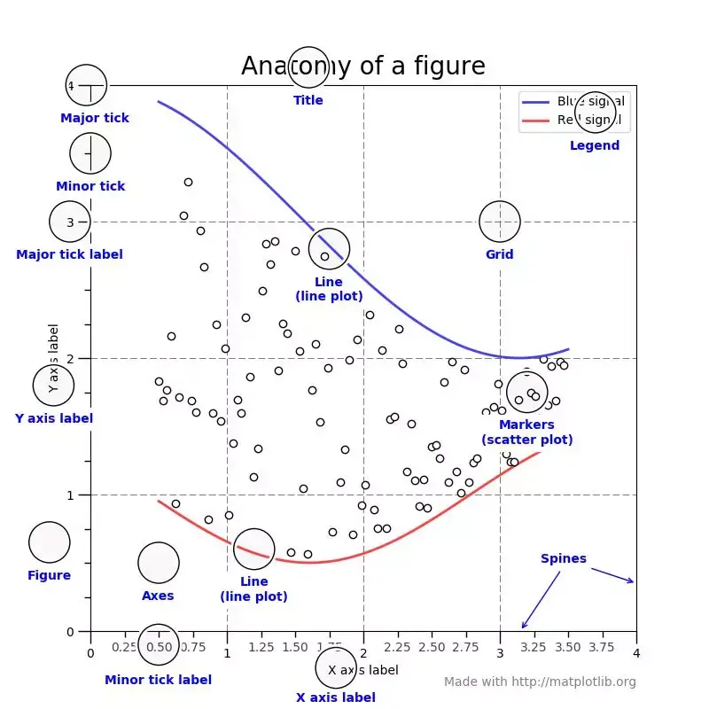
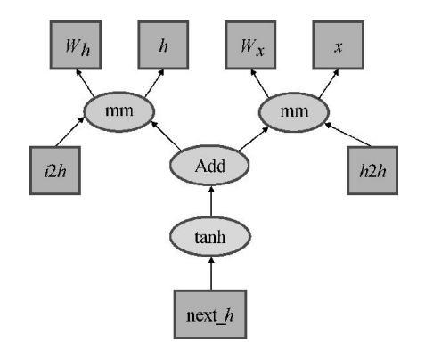
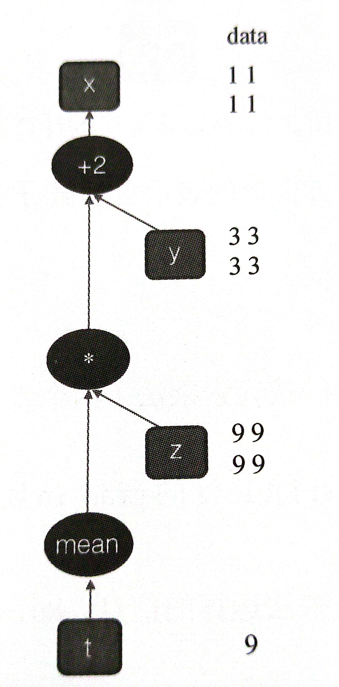

# Python学习笔记

## 对象

### 常量与变量

无需**事先声明变量及其类型**，直接赋值就可以创建**任意类型变量**。不仅变量的值可以变化，**变量的类型**也是随时可以发生变化。

### 数字

类型有 **int**-整数、 **float**-实数、 **complex**-复数
数字位数过大可以在输入时，间隔填入单个下划线 <b>_</b> 对数字分组，但不能出现在开头或结尾，也**不能连续使用**下划线

### 字符串

在Python里字符也作字符串处理，使用单引号、双引号、三引号作为**定界符**，还可以**互相嵌套**

### 列表、元组、字典、集合

|比较项|列表|元组|字典|集合|
| :-: | :-: | :-: | :-: | :-: |
|类型名称|**list**|**tuple**|**dict**|**set**|
|定界符|方括号<b>[ ]</b>|圆括号<b>( )</b>|花括号<b>{ }</b>|花括号<b>{ }</b>|
|是否可变|是|否|是|否|
|是否有序|是|是|否|否|
|是否支持下标|是（使用整数序号）|是（使用整数序号）|是（使用“键”）|否|
|元素分割符|逗号|逗号|逗号|逗号|
|对元素形式的要求|无|无|键：值|必须可哈希|
|对元素值的要求|无|无|“键”必须可哈希|必须可哈希|
|元素是否可重复|是|是|“键”不可重复|否|
|成员测试速度|非常慢|很慢|非常快|非常快|
|新增和删除元素速度|尾部操作快，其他慢|不允许|快|快|

### 运算符和表达式

#### 算术运算符

1. `+`除了可以用于算数加法，还可以用于列表、元组、字符串连接
   
2. `*`除了表示算数乘法，还可以用于列表、元组、字符串这几个序列类型于整数的惩乘法，表示序列中元素引用的重复，生成新的序列对象

3. `/`和`//`分别表示算数除法和算数求整商

4. `%`可以用于整数求余数运算

5. `**`运算符表示幂乘，等价于`pow( )`

#### 关系运算符

```
"Hello">"world" # 逐个比较对应位置的字符，得出结论后立刻停止
>>>False
[1,2,3]<[1,2,4] # 比较列表的大小，逐个比较对应位置的元素
>>>True
{1,2,4}>{1,2,3} # 集合之间的包含测试
>>>False
{1,2,3}<{1,2,3,4} # 测试是否为真子集
>>>True
```

#### 成员测试运算符

**in**为成员测试运算符，即测试一个对象是否为另一个对象的元素

#### 逻辑运算符

**and**,**or**,**not**为逻辑运算符，遵守惰性求值

#### 矩阵乘法运算符

<b>@</b>为矩阵乘法运算符，和**Numpy**结合使用

## 常用内置函数

### 类型转换与判断

- 数字类型

  1. `bin(number)`，`oct(number)`，`hex(number)`分别将整数转化为二进制、八进制、十六进制
  2. `int()`将其他类型的数字转化为整数
  3. `float()`将其他数据转化为实数
  4. `complex()`生成复数
  5. `eval()`自动将字符串转化为对应数字类型 

- 字符串类型

  1. `ord(char)`返回单个字符的Unicode码
  2. `chr()`将Unicode码转化为对应字符
  3. `str(obj)`将任意类型参数转化为字符串
  4. `ascii(obj)`把对象转化为ASCII码

- 数据类型

   `list()`,`tuple()`,`dict()`,`set()`将其他数据转化为相应类型，或者生成对应类型的空对象 

- 判断数据类型

  `type(obj )`判断数据类型

### 最值与求和

`max()`,`min()`,`sum()`这3个内置函数用于计算列表、元组或者其他包含有限个元素的课迭代对象中所有元素的最大值、最小值以及所有元素之和

### 基本输入输出

`input()`,`print()`是基本输入输出函数，`input()`一律将输出作为字符串

`print()`的语法格式如下：
`print(value, sep=' ', end='\n', flie=sys.stdout, flush=False)`

### 排序与逆序

`sorted()`对有限长度的可迭代对象进行从小到大排序后，不影响原来对象，返回一个排序后的新对象
`sorted(value, key)`可通过key选择判断对象
`reversed()`规则同上，仅规则调整为从大到小

### 枚举

- `enumerate()`函数用来枚举可迭代对象中的元素，返回的对象为**包含索引和值的元组**

### map()、reduce()、filter()

- `map()`将一个对象一次映射到可迭代对象
- `reduce()`处于`functools`标准库中
- `filter()`

### range()

- `range([start, ]stop[, step])`左闭右开区间，step为步长

## 可迭代对象

### 列表

列表是**有序容器对象**、**可变容器对象**

#### 列表的创建与删除

`a_list=[1, 2, 3]`
`a_list=[]`
`a_list=list()`

`a_list=[expression for expr1 in sequence1 if condition1]`
`a_list = [x*x for x in range(10)]`

`del a_list`

#### 列表的元素访问

使用**双向索引**，正序为**0 -> (len-1)**，逆序为<b>-len -> -1</b>

#### 列表的常用方法

- `append()`
- `extend()`
- `clear()`
- `copy()`
- `count(value)`：返回value的元素在列表中的出现个数
- `insert(index, obj)`：在index处插入obj，index后顺延
- `index(value)`：返回**第一个**值为value的index，若不存在则Error
- `pop(index)`：删除并返回下标为index的元素
- `remove(value)`：删除**第一个**值为value的元素，若不存在则Error
- `reverse()`：将列表翻转
- `sort(list, key=None, reverse=False)`：对列表进行原地排序，**key**为排序规则，reverse值为**False**时升序
- `len()`
  
#### 切片操作

`[start:stop:step]`step+则正向，step-则反向

### 元组

#### 元组的创建和访问

元组中**只有一个元素**时，必须在最后增加一个逗号。定义后**元素的数量和引用不允许改变**

#### 元组和列表

同为**有序序列**，都支持**双向索引**，也可用`count()` `index()`获取元素的索引

但元组属于**不可变序列**、**可哈希序列**，无法改变。

### 字典

字典是包含若干`key:value`元素的**无序可变容器**

键：必须为Python中任意**不可变元素**如整数、实数、复数、字符串、元组等，而且**键互异性**

#### 字典创建与删除

```
a_dict={'A':'1','B':2} 
x=dict()
x={}
dict.fromkeys(['name','age','gender']) # value = None
dict.fromkeys(['3','5','7'],666) # value = 666
```

#### 字典元素访问

```
a_dict = {'age': 39, 'score': 97, 'name': 'Dong'}
print(a_dict['age'])
>>>39
print(a_dict['gender'])
>>>KeyError:'address'

print(a_dict.get('age'))
>>>39
print(a_dict.get('gender', 'Not Exists.'))
>>>Not Exists. # 若不存在则返回默认值

for item in a_dict: #遍历Key
    pass            
for item in a_dict.items(): #遍历键值对
    pass
for key in a_dict.keys():   #遍历Key
    pass
for value in a_dict.values()    #遍历值
    pass
```

#### 字典元素添加、修改与删除

以**Key**进行赋值时`a_dict[Key] = value`，若Key存在，则更新值，若不存在，则新增键值对

```
b_dict = {'gende': '28'}
a_dict.update(b_dict)       # 将b_dict中的所有键值对更新到a_dict，规则如上
```

`del a_dict`删除指定元素
`a_dcit.pop(Key[, b])`删除并返回对应值，否则返回参数d，若无d则抱错
`a_dict.popitem(Key)`删除并返回指定键对应的键值对，若为空字典则异常报错

### 集合

**set**是**无序可变容器**，使用花括号，**元素互异**
集合中仅含**不可变类型**数据

#### 集合创建与删除

```
a={}
a_set = set(range(8,14))
a_set set([0, 1, 2, 3, 4, 0, 2, 5]) #a_set={0, 1, 2, 3, 4, 5}
```

`del`删除整个集合

#### 集合方法与运算

1. 增加与删除集合元素
   
`set.add()`增加新元素，若存在则忽略
`set.pop()`随机删除并返回一个元素，若空集合则异常
`set.remove(value)`删除特定值的元素，若不存在则异常
`set.discard(value)`删除特定值的元素，若不存在则忽略操作

2. 集合运算

`len()、max()、min()、sum()、sorted()、map()`等也适用于集合，还支持交集`|`并集`&`差集`-`对称差集`^`

### 序列解包

```
x, y, z = 1, 2, 3
tuple = (False, 3.5, 'exp')
(x, y, z) = tuple
x, y, z = range(3)
a, b = b, a
for key, value in dict.items():
    pass
```

## 程序控制结构

### 条件表达式

1. 关系运算符

```
1<2<3 # 1<2 and 2<3
1<2>3 # 1<2 and 2>3
```

2. 逻辑运算符

`and`,`or`,`not`：前两者有着**短路求值**或**惰性求值**特点

### 选择结构

1. **单分支选择结构**

```
if condition :
    expression
```
相同级别的代码块必须**保证相同的缩进量**

2. **双分支选择结构**

```
if condition :
    expression1
else :
    expression2

value1 if condition else value2
```

3. **多分支选择结构**

```
if condition1:
    expression1
elif condition2:
    expression1
...
elif conditionN:
    expressionN
```

4. **选择结构的嵌套**

```
if condition1:
    expression1
    if condition2:
        expression2
    else:
        expression3
else:
    if condition3:
        expression4
```
使用嵌套选择结构时，一定要**严格控制好不同级别代码块的缩进量**

### 循环结构

1. **for循环和while循环**

```
while condition:
    循环体
[else:
    expression]
```
```
for 循环变量 in 可迭代对象:
    循环体
[else:
    expression]
```


2. **break语句与continue语句**

## 函数

### 函数的定义与使用

#### 基本语法

```
def name([参数列表]):
    body
```
使用关键字**def**用于定义函数
- 函数形式参数**无需声明**类型，也无需指定函数**返回类型**
- 即使无需接受参数，也需要保留空括号
- 括号后必须带**冒号**
- 函数体和**def**关键字保留一定缩进

#### 函数递归调用

注意递归深度，以免**栈溢出**

### 函数参数

传递**实参的引用给形参**
在函数内部直接修改形参的值，实际上是**修改引用**，并不会影响实参

#### 位置参数

**实参按照位置逐个传递给形参**
实参和形参的**顺序**、**个数**必须完全一致

#### 默认值参数

在调用函数时，如果不传入参数，则使用默认值，否则使用传入参数的值

**任何一个默认值参数右边都不能再出现没有默认值的普通未知参数**

默认值应该设置为**不可变类型数据**

#### 关键参数

通过关键参数可以按照名字传递参数,实参顺序可以和形参顺序不一致

#### 可变长度参数

定义函数时有两种形式：<b>*parameter</b>，<b>**parameter</b>

第一种（*）将所有传入的参数作为元组形参进入函数
第二种（**）将关键参数（键值对）传入并作为字典元素进入函数

#### 实参序列解包

在传入参数的时候，在**实参**前面加*，则解包后以此作为位置参数传入函数
若在**实参**前面加**则作为字典解包后传入函数

#### 参数设置

函数若需要接收多种形式的参数，一般把未知参数放在最前面，然后是默认值参数，再是一个星号的可变长度参数，最后是两个星号的可变长度参数

### 变量作用域

不同作用域内同名变量之间互不影响

若想在函数内改变函数外实参，可以使用**global**关键字

- 一个变量已在函数外定义，如果在函数内需要修改这个变量的值，可以使用**gobal**明确声明要使用的**同名变量**

如果在某个作用域内尤为变量赋值的操作，那么该变量被认为是该作用域内的**局部变量**

### lambda表达式

```
f = lambda 传入参数 : expression
```

## 面向对象程序设计

```
```

## 字符串

字符串属于**不可变有序序列**，使用单引号、双引号、三单引号、三双引号作为定界符，定界符之间支持**互相嵌套**

### 字符串编码格式简介

Python默认使用**UTF-8**进行编码

**GB2312**是我国制定的中文编码，**GBK**作为**GB2312**的扩充，**CP936**是微软基于**GBK**开发的编码方式，三者都是使用2字节表示常见汉字

### 转义字符与原始字符窜

|转义字符|含义|转义字符|含义|
| :-: | :-: | :-: | :-: |
|`\b`|退格，把光标前移|`\\`|一个反斜线`\`|
|`\f`|换页符|`\'`|一个单引号`'`|
|`\n`|换行符|`\"`|一个双引号`"`|
|`\r`|回车|`\ooo`|3位八进制数对应的字符|
|`\t`|水平制表符|`\xhh`|2位十六进制数对应的字符|
|`\v`|垂直制表符|`\uhhh`|4位十六进制数表示的Unicode字符|
|`\Uhhhhhhhh`|8位16进制数表示的Unicode字符|||

为了防止转义字符影响字符串本义，可以使用原始字符串`r"string"`或`R"string"`来表示字符串

### 字符串格式化

- 使用`format()`方法进行字符串格式化

`<模板字符串>.format(<逗号分隔的参数>)`
`{<参数序号>:<格式控制标记>}`

**<格式控制标记>** 包括 **<填充>****<对齐>****<宽度>****<,>****<.精度>****<类型>**

1. <填充>
    用于填充的**单个字符**，除了参数外的字符采用什么方式表示，默认空格
2. <对齐>
    <左对齐，>右对齐，^居中对齐
3. <宽度>
    槽的设定输出宽度，如果对应参数长度更大，使用参数实际长度，否则使用<填充>字符补充
4. <,>
    数字的千分位分割符，适用于整数和浮点数
5. <.精度>
    对于浮点数，精度表示小数部分输出的有效数位
    对于字符串，精度表示输出的最大长度
6. <类别>
    - 整数类型
        - b：输出整数的二进制
        - c：输出整数的Unicode字符
        - d：输出整数的十进制
        - o：输出整数的八进制
        - x：输出整数的小写十六进制 
        - x：输出整数的大写十六进制 
    - 浮点数类型
        - e：输出浮点数对应的小写字母e的指数形式
        - E：输出浮点数对应的大写字母E的指数形式
        - f：输出浮点数的标准浮点形式
        - %：输出浮点数的百分形式

### 字符串常用操作

字符串不可变，字符串的涉及字符串**修改**的方法都是返回修改后的新字符串，并不对**原字符串**做任何修改

#### find()、rfind()、index()、rindex()、count()

`find()`和`rfind()`：分别用来查找另一个字符串在当前字符串**指定范围**内（默认整体）首次和最后一次出现的位置，**不存在则返回-1**

`index()`和`rindex()`：返回另一个字符串在当前字符串在**指定范围**内首次和最后一次出现的位置，若不存在则**抛出异常**

四者参数`(sub[, start[, end]])`字符串为sub，返回其在`[start,end)`内出现的最小最大下标

#### split()、rsplit()

`split()`和`rsplit()`：分别从字符串左端和有段开始将其分成多个字符串，并且返回值为包含分隔结果的**列表**

参数`(sep=None, maxsplit=-1)`：**sep**值为选择特定的字符串，默认为空格；**maxsplit**为最大切分次数，**默认值-1**表示无限制

#### join()

`sep.join(str_list)`：表示将列表中多个字符串进行连接（连接符为**sep字符串**）

#### lower()、upper()、capitalize()、title()、swapcase()

使用方法均为在对str原值不进行改变的情况下

- `str.lower()`：进行字符串全小写操作
- `str.upper()`：进行字符串全大写操作
- `str.capitalize()`：进行字符串首字母大写操作
- `str.title()`：进行单词首字母大写操作
- `str.swapcase()`：进行大小写互换操作

#### replace()、maketrans()、translate()

- `str1.replace(str_old, str_new)`：表示将**str1**中全部**str_old**替换成**str_new**
- `" "maketranse("str1","str2")`：表示生成字符映射表
- `str.translate(字符映射表)`：表示根据字符映射表，将str中的所有涉及元素替换

#### strip()、rstrip()、lstrip()

- `str.strip(sep)`：返回将str两端中所有包含sep中的单个字符元素删除后的新字符串
- `str.rstrip(sep)`：返回将str右端中所有包含sep中的单个字符元素删除后的新字符串
- `str.lstrip(sep)`：返回将str左端中所有包含sep中的单个字符元素删除后的新字符串

#### isalnum()、isalpha()、isdigit()、isnumeric()、isspace()、isupper()、islower()

- `str.isalnum()`：判断str是否全为数字或字母
- `str.isalpha()`：判断str是否全为字母
- `str.isdigit()`：判断str是否全为数字
- `str.isnumeric()`：判断str是否全为汉字数字字符、罗马数字字符
- `str.isspace()`：判断str是否全为空格
- `str.isupper()`：判断str是否全为大写字母
- `str.islower()`：判断str是否全为小写字母

#### len()、eval()

- `len(str)`：返回字符串的长度值
- `eval(str)`：将字符串转化为Python表达式

#### 字符串的切片

仅限用于读取元素，不支持用于字符串修改

## 文件内容操作

### 文件操作基本知识

对于文本文件和二进制文件，操作都是首先打开文件并创建文件对象，然后通过该文件对象，对文件内容进行**读取、写入、删除、修改**等操作，最后关闭并保存文件

#### 内置函数open()、close()

`open(file, mode='')`：打开文件并创造文件对象
- file：指定文件的文本位置，可以使用原始字符串的URL
- mode：制定打开文件后的处理方式，默认为“文本只读模式”（"r"）

|模式|说明|
| :-: | :- |
|r|只读模式（默认），若文件不存在则抛出异常|
|w|只写模式，若文件存在，自动清空文件原有内容|
|x|只写模式，创建新文件，若文件存在则抛出异常|
|a|追加模式，不覆盖文件中原有内容|
|b|二进制模式，配合其他模式使用|
|t|文本模式（默认）|
|+|读写模式（可与其他模式组合使用）|

`close()`：关闭文件对象

#### 文件常用方法

- `readline()`：从文件对象中读取一行并返回
- `readlines()`：从文件对象中读取所有内容存入列表，返回该列表（对于大文件不建议使用）
- `write(s)`：把字符串写入文本文件
- `writes(s)`：把**字符串列表**写入文本文件，不添加换行符

#### 上下管理语句with

使用**with**操作文件，保证文件**被正确关闭**

```
with open(file, mode="") as f:
    pass
```

## 文件与文件夹操作

```
```

## 异常处理结构与单元测试

```
```

## 标准库和拓展库

### 库中对象的导入与使用

#### import 包名/模块名 [ + as 别名]

使用该方式导入以后，使用时必须以“**模块名.对象名**”或者“**别名.对象名**”进行访问

```
import math
print(math.sin(0.5))
>>>0.479425538604203
```

```
import random as ran
print(ran.random())
>>>0.701114202997810
```

#### from 包名/模块名 import 模块名/对象名 [ + as 别名]

```
from math import sin
print(sin(3))
>>>0.1411200080598672
```

```
from math import cos as f
print(f(3))
>>>-0.9899924966004454
```

### Numpy拓展库

Numpy数组是一个多维数组对象，称为`ndarray`，其由两部分构成：

1. 实际的数据
2. 描述这些数据的元数据

#### Numpy简介

```
import numpy as np # 常用导入Numpy库方法
ar=np.array([1,2,3,4],[5,6,7,8],[9,10,11,12])
print(ar) # 数组
print(ar.sdim) # 数组的维度数
print(ar.size) # 元素的总个数
print(ar.shape) # 数组的维度，对于n行m列的数组，shape为(n,m)
print(ar.dtype) # 数值的数据类型
```

#### Numpy创建数组

##### array()

使用`array()`函数来创建数组，括号内可以填入列表、元组、数组、生成器

```
import numpy as np
ar = np.random.rand(10).reshape(2,5)
print(ar)
```

##### arange()

`arange()`函数类似于`range()`，在给定间隔内返回均匀间隔的数值
**左开右闭**

```
import numpy as np
print(np.arange(10)) # 返回0~9 整型
print(np.arange(10.0)) # 返回0.0~9.0 浮点型
print(np.arange(5,15)) # 返回5~14 整型
print(np.arange(2,14，2)) # 返回2~13，步长为2 整型
```

##### linspace()

用来返回在间隔`[开始, 停止, num=N]`上计算N个均匀间隔的样本

```
import numpy as np
print(np.linspace(10, 15, num=20))
```

##### 其他形式创建数组

```
import numpy as np
print(np.zeros(10)) # 创建一维数组且用0填充
print(np.zeros((3,5))) #创建尺寸为(3,5)的数组，用0填充
print(np.ones(10)) # 同理
print(np.arange(16).reshape(4,4)) # 使用arange()赋值，reshape()决定
```

#### Numpy通用函数

##### 数组形状

T方法可以用来转置，一维不变

```
import numpy as np
ar=np.zeros((2,5))
print(ar)
print(ar.T)
```

`reshape()`和`resize()`函数也能用来直接改变数组的形状，但是`resize()`在数值不一致时会进行调整，不用像`reshape()`一样数据数量严格对应

##### 数组的复制

```
import numpy as np
ar1=np.arrange(10)
ar2=ar1 # 仅起一个额外名字，对ar1进行操作仍会影响ar2
ar3=ar1.copy() # 全部复制到新变量，对ar1进行操作不会影响ar3
```

##### 数组的堆叠

堆叠数组需要保证数组的列是相同的
使用`hstack()`和`vstack()`函数

```
import numpy as np
a=np.arange(5)
b=np.arange(5,9)
print(a)
print(b)
print(np.hstack((a,b))) # 横向连接
print()
a=np.array([[1],[2],[3]])
b=np.array([['a'],['b'],['c']])
print(a)
print(b)
print(np.vstack((a,b))) # 竖向连接
```

##### 数组的拆分

数组的拆分使用`hsplit()`和`vsplit()`函数

```
import numpy as np
ar=np.arange(16).reshape(4,4)
print(np.hsplit(ar,2)[0])
print(np.vsplit(ar,4))
```

##### 数组的简单运算

```
import numpy as np
ar = np.arange(6).reshape(2,3)
print(ar+10)
print(ar-1)
print(ar*2)
print(1/(ar+1))
print(ar**0.5)
# 与标量的计算

print(ar.max()) # 求ar中的最大值
print(ar.min()) # 求ar中的最小值
print(ar.mean()) # 求ar的平均值
print(ar.std()) # 求ar的标准差
print(ar.var()) # 求ar的方差
print(ar.sum(),np.sum(ar, axis=0)) # 求和np.sum()->axis=0时按列求和；axis=1时按排求和
print(np.sort(np.array([1,4,3,2,5,6]))) # 排序
```

#### Numpy的索引及切片

对于一维数组：

```
import numpy as np
ar=np.arange(20)
print(ar)
print(ar[4])
print(ar[:3])
print(ar[::2])
```

对于二维数组：

```
import numpy as np
ar = np.arange(16).reshape(4,4)
print(ar)
print(ar[2]) # 打印第三行
print(ar[2][2]) # 打印第三行第三个值
print(ar[1:3]) # 打印第二行到第三行
print(ar[2,2]) # 打印第三行第三个值
print(ar[:2,2:]) # 打印从第一行到第二行，第三列到第四列
```

对于三维及三维以上的数组：

```
import numpy as np
ar = np.arange(12).reshape(3,2,2)
print(ar)
print(ar[2][1]) # 打印第三维度第二行的元素
print(ar[2][1][0]) # 打印第三维度第二行第一个元素
```

#### Numpy的随机数

`numpy.random`包含多种概率分布的随机样本

##### 均匀分布

```
import numpy as np
data1=np.random.rand(300)
data2=np.random.rand(300)
```

##### 正态分布

```
import numpy as np
data3=np.random.randn(500)
data4=np.random.randn(500)
```

##### 随机整数

`numpy.random.randint(low, high=None, size=None, dtype='1')`生成一个参数或N维数组，若high不为None，取`[low,high)`之间的随机整数，否则取`(0,low)`之间的随机整数，high必须大于low，size为数组尺寸

#### Numpy数据的输入输出

##### 存储数组数据（.npy文件）

```
import os
import numpy as np
os.chdir("URL")
ar=np.arange(12).reshape(3,4)
np.save('name.npy',ar)
```

##### 读取数组数据（.npy文件）

```
import numpy as np
import os
os.chdir("URL")
ar_load = np.load('name.npy')
print(ar_load)
```

##### 存储文本文件

```
import numpy as np
import os
os.chdir("URL")
ar=np.random.rand(5,5)
np.savetext("name.txt",ar,delimiter=',') # delimiter为分隔符
```

默认为科学记数法，若想储存为浮点型

```
import numpy as np
import os
os.chdir("URL")
ar=np.random.rand(5,5)
np.savetext("name.txt",ar,delimiter=',' fmt='%2f') # delimiter为分隔符，对fmt参数填入格式化
```

##### 读取文本文件

```
import numpy as np
import os
os.chdir("URL")
ar_loadtxt=np.loadtxt("name".txt, delimiter=",")
```

### Matplotlib拓展库

[十分钟|matplotlib上手，开启你的python可视化](https://zhuanlan.zhihu.com/p/70835617)

#### 图的构成元素



1. **Title设置**

```
import matplotlib.pyplot as plt
plt.title("title")
plt.show()
```

2. **Figure对象**

在matplotlib中，整个图像为一个**Figure对象**，在一个Figure对象中，包含着一个或者多个**Axes对象**，每个**Axes**对象都是一个拥有自己坐标系统的**绘图区域**

```
plt.figure(figsize=(6,3))
plt.plot(6,3)
plt.plot(3,3*2)
plt.show()
```

3. **坐标轴及标签**

```
plt.xlim(0,6)
plt.ylim(0,3)
plt.xlabel('X')
plt.ylabel('Y')
plt.show()
```

4. **设置label和legend**

```
plt.plot(2,3,label="name_1")
plt.plot(2,3*2,label="name_2")
plt.legend(loc="upper left") # "upper right", "center"
plt.show()
``` 

#### 绘图

1. **柱状图**

```
x = np.arange(10)
y=np.random.randint(0,20,10)
plt.bar(x,y)
```

2. **散点图**

```
x = np.random.rand(10)
y = np.random.rand(10)
plt.scatter(x,y)
plt.show()
```

3. **饼图**

```
x = np.random.randint(1, 10 ,3)
plt.pie(x)
plt.show()
```

4. **热图**

```
x = [[1,2],[3,4],[5,6]]
plt.imshow(x)
plt.colorbar()
plt.show()
```

5. **折线图**

```
x = np.arange(10)
y = np.random.randint(0,10,10)
plt.plot(x,y)
plt.show()
```


# 基于Pytorch的深度学习笔记

## 基础知识简介

### 深度网络架构

深度网络架构，就是整个神经网络体系的构建方式和拓扑连接结构。
主要分为以下三种：

#### 前馈神经网络（FNN）

前馈神经网络也叫做**全连接网络**，在这种结构中所有的节点都可以分为一层一层的，每个节点只跟他的相邻层节点而且是全部节点连接

#### 卷积神经网络（CNN）

特殊架构使CNN可以很好的用于**图像处理**，可以使原始图像即使经历平移、缩放等变换之后仍然具有很高的可识别性，成功应用于**计算机视觉、图像识别、图像生成**等领域

#### 循环神经网络（RNN）

特殊架构使得RNN网络当前的运行不仅跟**当前的输入数据**有关，还和**之前的数据**有关
因此这种网络特别适合处理诸如**语言、音乐、股票曲线等序列类型的数据**，循环结构可以很好地应付输入序列中存在的**长程记忆性**和**周期性**

### 深度学习特点

深度学习的本质特色，就是对所学特征的“表达能力”，即从海量的数据中自动学习，**抽取数据中的特征**

#### 特征学习

深度神经网络特性之一，就是把不同的信息表达到不同层次的网络单元中（**权重**），并且这一提炼过程不需要手动干预，全凭机器学习过程自动完成

深度学习的本质就是这种**自动提取特征**的功能

如今，基于深度学习的算法可以将特征提取的过程自动学习出来，我们只需要将数据输入网络，它通过反复地监督学习就可以一点一点地在**各个层面将重要的特征**学习出来

#### 迁移学习

前几层的神经网络作为**特征提取器**，后面部分的神经网络会根据这些特征进行**分类或预测**

再将神经网络组合拼接后，我们就可以用前面部分的神经网络进行特征提取，再将这个特征提取器与后面的网络进行拼接，去解决另一个完全不同的问题，这就是**迁移学习**

### 张量

Pytorch的运算单元叫做**张量**，可以将张量理解为一个多维数组，N阶张量即为N维数组，有N个下标

- 一阶张量即为一维数组，通常叫做**向量**
- 二阶张量即为二维数组，通常叫做**矩阵**

将一个张量每个维度的大小称为张量在这个维度的尺寸（size）

对于`(3,8,6)`的张量，由**3**个矩阵组成，对于每个矩阵又由**8**个向量组成，对于每个向量的长度均为**6**

#### Pytorch操作

##### 定义张量

对于创建尺寸为`(5,3)`的二阶张量，若希望每个元素是随机赋予的`[0,1]`区间中的一个实数：

```
import torch
x = torch.rand(5,3)
print(x)
```

创建一个尺寸为`(5,3)`的二阶张量，对于每一个元素都是实数1：

```
import torch
x = torch.ones(5,3)
print(x)
```

创建一个尺寸为`(2,5,3)`的三阶张量，对于每一个元素都是实数0：

```
import torch
x = torch.zeros(2,5,3)
print(x)
```

##### 访问张量

对张量使用`[]`进行访问张量操作

- `x[0]`：表示访问张量的第一个元素（下标从0开始）
- `x[1,2]`：表示访问张量的第二行第三列元素
- `x[:,2]`：表示访问张量的第三列全部元素（切片）

对于一个N阶张量x，在`x[num1,num2,num3,num4...numN]`，依次为在第N维的第num1+1个元素，在第N-1维第num2+2个元素……

##### 张量的运算

张量相加：需要保证两个张量的尺寸一模一样
`z=x+y`

张量乘法：

使用Pytorch的`mm`（matrix mmultiply）命令

`
c=a.mm(b)
`

矩阵乘法：
设A为`m*p`的矩阵，B为`p*n`的矩阵，那么称`m*n`的矩阵C为矩阵A与B的乘积，记作C=AB，其中矩阵C中的第i行第j列元素可以表示为：

$$
\left ( AB \right ) _{ij}^{} = \sum_{k=1}^{p}a_{ik}b_{jk} = a_{i1}b_{1j}+a_{i2}b_{2j}+···+a_{ip}b_{pj}
$$

$$
A=\begin{bmatrix} a_{1,1} & a_{1,2} & a_{1,3} \\ a_{2,1} & a_{2,2} & a_{2,3}\end{bmatrix}
$$

$$
B=\begin{bmatrix} b_{1,1} & b_{1,2} \\ b_{2,1} & b_{2,2} \\ b_{3,1} & b_{3,2}\end{bmatrix}
$$

$$
C=AB=\begin{bmatrix} a_{1,1}b_{1,1}+a_{1,2}b_{2,1}+a_{1,3}b_{3,1} & a_{1,1}b_{1,2}+a_{1,2}b_{2,2}+a_{1,3}b_{3,2} \\ a_{2,1}b_{1,1}+a_{2,2}b_{2,1}+a_{2,3}b_{3,1} & a_{2,1}b_{1,2}+a_{2,2}b_{2,2}+a_{2,3}b_{3,2}\end{bmatrix}
$$

- 当矩阵A的列数等于矩阵B的行数时，A与B可以相乘
- 矩阵C的行数等于矩阵A的行数，C的列数等于B的列数
- 乘积C的第m行第n列的元素等于矩阵A的第m行的元素与矩阵B的第n列对应元素乘积之和
  
##### 张量与Numpy数组之间的转换

- 从Numpy到张量的转换可以使用`b=from_numpy(a)`，a为一个Numpy数组。
- 从张量到Numpy的转换可以使用`a.numpy()`，a为一个Pytorch张量

除了直接转换，大多数时候还需要按照类型转换。

- a是一个`float`类型的Numpy数组，那么可以使用`torch.FloatTensor(a)`将a转换成一个`float`类型的张量
- a是一个`int`类型的Numpy数组，那么可以使用`torch.LongTensor(a)`将a转换成一个整数类型的张量

##### GPU上的张量运算

张量可以在GPU上进行运算，大大提高了计算速度，而Numpy不行
在可以进行GPU计算时，将张量放到GPU上即可加速运算

```
import torch
if torch.cuda.is_available():
    x=x.cuda()
    y=y.cuda()
    print(x+y)

>>>tensor(... 
                device='cuda:0')
```

最后一行的`cuda:0`表示当前这个输出结果`x+y`是存储在GPU上进行的

也可以通过`x=x.cpu()`将在GPU上运行的张量卸载到CPU上

### 计算图

计算图是一种描述和记录张量运算过程的抽象网络，一个计算图包括两类节点，分别是变量（variable）和运算（computation），计算图上的有向连边表示各个节点之间的因果联系或依赖关系



上图中的方框节点为**变量**，椭圆节点为**运算操作**，通过彼此相连，构成了一个有向无环图（每一条边都有方向且途中并不存在环路的特殊图）
箭头的方向表示该节点计算输入的来源方向，换句话说，沿着箭头的反方向前进就是一个多步计算进行的方向

### 动态计算图

人工神经网络在诸多机器学习中脱颖而出，就是因为它可以利用反向传播算法来更新内在的计算单元，更加精准地解决问题

>反向传播算法：能够精确地计算出网络中每一个单元对于网络表现的贡献（即梯度信息），大大提高了神经网络的训练效率

在深度学习框架出现之前，针对不同的神经网络架构，要编写不同的反向传播算法，现在大多数深度学习框架采用了计算图技术（通用的解决方案），只需要关注如何实现神经网络的前馈运算就行了，然后框架就会自动搭建一个计算图

因此，计算图技术的出现大幅提升了构建神经计算系统的效率，这就是我们必须采用深度学习框架的原因

计算图解决该问题的基本思想是将正向的计算过程步骤都计算出来，只要这些运算步骤是可微分的（可进行求导运算），那么我们就可以沿着计算图的路径对任意变量进行**求导**，进而自动计算每个变量的**梯度**

#### 动态计算图

动态计算图是数值运算和符号运算（体现为微分求导）的一种综合，它是整套深度学习技术和框架中最重要的核心

#### 动态计算图实例

**e.g**：使用Pytorch的自动微分变量来计算`y=x+2`

1. 创建一个叫做x的自动微分变量，包裹了一个尺寸为`(2,2)`的张量，取值全为1

```
import torch
x = torch.ones(2, 2, requires_grad=True)
print(x)
```

`requires_grad`该属性为True，是为了保证它可以在反向传播算法的过程中获得梯度信息，执行该语句的输出结果是：

```
>>>tensor([[1., 1.],
           [1., 1.]], requires_grad=True)
```

>在Pytorch0.4版本后普通的张量就是自动微分变量，在做运算时，Pytorch会自动开始构建计算图,目前计算图仅有一个x节点

2. 我们可以像对张量一样对自动微分变量进行各类运算：


- 加法运算：

```
y = x + 2
print(y)
>>>tensor([[3., 3.],
           [3., 3.]])

print(y.grad_fn)
>>><AddBackward0 object at 0x0000026AD849FE20>
```

>从返回结果可知，y.grad_fn储存的是运算（AddBackward0）的信息，AddBackward0表示加上一个常数的运算，它是计算图上的一个计算节点

- 按元素乘法运算（非矩阵运算mm，是两个张量在对应位置上进行数值相乘）：

```
z = y * y
print(z)
>>>tensor([[9., 9.],
           [9., 9.]], grad_fn=<MulBackward0>)

print(z.grad_fn)
>>><MulBackward0 object at 0x00000248C5DBFE20>
```

>从返回结果可知，z.grad_fn存储的是运算（MulBackward0）的信息，MulBackward0表示按元素乘法

- 求平均运算：

```
t = torch.mean(z)
print(z)
>>>tensor(9., grad_fn=<MeanBackward0>)
```

**最后的计算图**：



- 通过自动微分变量，Pytorch可以将运算过程全部通过`.grad_fn`属性记录下来，构成一个计算图
- 自动微分变量的运算结果储存在`data`中
- 每进行一步运算，Pytorch就将一个新的运算节点添加到动态计算图中，并与上一步的计算节点相连

#### 自动微分与梯度计算

其实上图表示的是一个广义的神经网络，我们同样可以将反向传播算法应用于这个广义的神经网络上，从而计算出每个变量节点的梯度信息

求梯度，就是高等数学中的求导运算
梯度信息，就是导数数值

上述过程可用下方函数描述

$$
t(x)=m(x+2)^{2} 
$$

叶节点x就是自变量，根节点t就是因变量，m表示取平均计算

观察到了t的小变化δt，求x的变化δx，相当于问如下导数值为多少

$$
δt/δx
$$

Pytorch提供了非常方便的数值计算方案通过`.backward()`进行自动求导计算

`t.backward()`

执行完这个命令后，Pytorch会自动在计算图上执行反向传播算法，从t到x计算梯度（导数）

此时所说的反向传播算法，是指沿着计算图从下往上计算每个变量节点梯度信息的过程，然后可以使用`.grad`来查看每个点的梯度

因为x是一个张量，所以t对x的求导也是一个同维度的张量（可参考多变量微积分）

#### 叶子节点与非叶子节点

在反向传播中，只有当`requires_grad`和`is_leaf`均为真时，才会计算节点的梯度值

在反向传播后，仅保留**叶子节点**的梯度值，非叶子节点的梯度值将会被清除

当`tensor`的`requires_grad`的值为真时，才会在`backward()`反向传播中计算

对于所有的`requires_grad`的值为真时：

- 非叶子节点的梯度值会在反向传播过程中使用完后就被清除

- 仅保留叶子节点的梯度值

- 被保留下来的叶子节点的梯度值会存入tensor的grad属性中

以此可以**节省大部分显存**

##### 使用`detach()`将节点剥离成叶子节点

在链式结构中，将一个节点剥离出来的话，会导致该节点上游借鉴直接与该节点下游节点连接，叶子节点仅连接下游节点

##### 什么节点会是叶子节点

1. 所有`requires_grad`为**False**的张量，约定俗成地归结为叶子张量

2. 所有`requires_grad`为**True**的张量，若为用户创建（未经历运算处理），则为叶子节点

## 预测房价实例（线性回归模型+梯度下降算法）

根据历史房价预测未来的房价，将实现一个**线性回归**模型，并使用梯度下降算法求解，从而给出预测直线

### 准备数据

为了方便起见，将编造一批数据

使用`linspace(low, up, num)`来构造0~100之间的均匀数字作为时间变量x，在使用`randn(num)`生成num个满足标准正态分布的随机数（均值为0，方差为1），以此在作为历史房价数据 $y_{i}$

```
import torch
x = torch.linspace(0, 100, 100).type(torch.FloatTensor)
rand = torch.randn(100)*10
y = x + rand
```

其中对于每一个($x_{i}, y_{i}$)称为一个样本点，所有的($x_{i}, y_{i}$)作为数据集，并将其切分成训练集和测试集

>**训练集**：是指训练一个模型的所有数据的所有数据

>**测试集**：是指用于检验这个训练好的模型的所有数据（在训练过程中，模型不会接触到测试集的数据）


```
x_train = x[:-10]
x_test = x[-10:]
y_train = y[:-10]
y_test = y[-10:]
```

对训练数据点可视化操作：

```
import matplotlib.pyplot as plt
plt.figure(figsize=(10,8)) # 设定绘制窗口大小为10*8 inch
# 绘制数据，由于x和y都是自动微分变量，因此需要使用data来获取tensor，并转化为Numpy
plt.plot(x_train.data.numpy(),y_train.data.numpy(), 'o') # 参数'o'表示绘制散点图，默认线条图
plt.xlabel('X') # 添加X轴的标注
plt.xlabel('Y') # 添加Y轴的标注
plt.show() # 画出图形
```

### 设计模型

目标是得到一条尽可能从中间穿越这些数据散点的拟合直线，设方程为

$$
y = ax+b
$$

然后求解参数a、b的数值，将每一个数据点$x_{i}$代入这个方程中，计算出一个 $\hat{y_{i}}$ 即：

$$
\hat{y_{i}} = ax_{i} + b
$$

显然，这个点越靠近 $y_{i}$ 越好，所以，需要定义一个平均损失函数：

$$
L = \frac{1}{N}(y_{i}-\hat{y_{i}})^{2}=\frac{1}{N}\sum_{i=0}^{N}(y_{i}-ax_{i}-b)^{2}
$$

平均损失函数L实际上是a和b的函数，所以要寻找最优的a、b组合使得L最小

使用梯度下降法反复迭代a和b，从而使得L越来越小

>**梯度下降法**：常用的数值求解函数最小值的方法，它的基本思想就像是盲人下山。这里要优化的损失函数 $L(a,b)$ 就是那座山。假设有一个盲人站在山上的某个随机初始点（这就对应了 $a$ 和 $b$ 的初始随机值），他会在原地转一圈，寻找下降最快的方向来行进。所谓下降的快慢，其实就是 $L$ 对 $a$ 、 $b$ 在这一点的梯度（导数）；所谓的行进，就是更新 $a$ 和 $b$ 的值，让盲人移动到一个新的点。于是，每到一个新的点，盲人就会依照同样的方法行进，最终到达让 $L$ 最小的那个点。

通过下面的迭代计算来实现该过程：

$$
a_{t+1}=a_{t}-\alpha\frac{\partial L}{\partial a}\bigg|_{a=a_{t}}
$$

$$
b_{t+1}=b_{t}-\alpha\frac{\partial L}{\partial b}\bigg|_{b=b_{t}}
$$

$\alpha$ 作为一个参数，为学习率，可以调节更新的快慢，相当于盲人每一步的步伐有多大， $\alpha$ 越大，$a$、$b$ 更新得越快，但是计算得到的最优值 $L$ 就有可能不准

在计算过程中，利用Pytorch的`backward()`计算出 $L$ 对 $a$、$b$ 的偏导数，只需要一步一步地更新其数值就行了，当达到一定的迭代部署之后得到的 $a$、$b$ 就是我们想要的最优数值， $y = ax+b$ 就是我们希望寻找的尽可能拟合所有数据点的直线

### 训练

首先需要自定义两个自动微分变量`a`和`b`：

- `tensor_1.expand_as(tensor_2)`是将张量拓展到和指定张量相同的形状，但是使用tensor_1中的元素进行填充

- Pytorch规定不能直接对自动微分变量进行数值更新，只能对`data`属性进行更新，即更新该自动微分变量所包裹的张量

- 在Pytorch中，如果某个函数后面加上了“`_`”，就表明这个函数的计算结果更新当前的变量，进行原地计算

```
a = torch.rand(1, requires_grad=True)
b = torch.rand(1, requires_grad=True)
learning_rate = 0.0001
for i in range(1000): # 计算迭代次数为1000
    predictions = a.expand_as(x_train) * x_train + b.expand_as(x_train)
        # 将所有训练数据代入模型，使得predictions和x_train都是(90, 1)的张量
    loss = torch.mean((predictions - y_train)**2)
        # 计算误差,loss为标量
    print('loss:',loss) 
    loss.backword()
        # 对损失函数进行梯度反传
    a.data.add_(- learning_rate * a.grad.data)
    b.data.add_(- learning_rate * b.grad.data)
        # add_() 是 PyTorch 中张量的一个 in-place 操作，表示对张量进行原地加法操作
        # 将a、b的梯度信息更新到a、b的值里面
    a.grad.data.zeron_()
    b.grad.data.zeron_()
        # 清空a、b的梯度数值
```

最后将原始的训练数据散点联合拟合的直线绘制出来：

```
plt.figure(figsize=(10, 7)) # 定义绘图窗口为 10*7 inch
xplot = plt.plot(x_train.data.numpy(), y_train.data.numpy(), 'o') # 绘制x和y的散点图
yplot = plt.plot(x_train.data.numpy(), x_train.data.numpy()*a.data.numpy()+b.data.numpy()) # 绘制拟合直线图
plt.xlabel('X')
plt.ylabel('Y')
str1 = str(a.data.numpy()[0]) +"x +" + str(b.data.numpy()[0]) # 写含a、b参数的拟合直线
plt.legend([xplot, yplot], ['Data', str1]) # 用于创建图例
plt.show()
```

### 预测

将预测结果和测试集数据绘图展示

- `np.r_(numpy_1, numpy_2)`：按行连接数组的函数，返回一个连接后的numpy数组

```
predictions = (a.expand_as(x_test) * x_test + b.expand_as(x_test)).data.numpy()
import numpy as np
plt.figure(figsize=(10,7))
plt.plot(x_train.data.numpy(), y_train.data.numpy(), 'o', label='Train_Data') # 绘制训练集数据
plt.plot(x_test.data.numpy(), y_test.data.numpy(), 's',label='Test_Data') # 绘制测试集数据
a=a.expand_as(x).data.numpy()
b=b.expand_as(x).data.numpy()
x_data = np.r_[x_train.data.numpy(), x_test.data.numpy()] # 连接两个数组
str1 = str(a[0]) +"x +" + str(b[0]) # 写含a、b参数的拟合直线
plt.plot(x_data, a*x_data + b, label=str1) # 绘制拟合数据
plt.plot(x_test.data.numpy(), predictions, 'o', label="Predictions") # 绘制预测数据
plt.xlabel('X')
plt.ylabel('Y')
plt.legend()
plt.show()
```

### 术语汇总

- 模型：反应自变量与因变量之间的数学关系的关系式
- 拟合：将模型应用到训练数据，并试图达到最佳效果的过程
- 特征变量：单个或多个特征变量构成了模型的自变量集合
- 目标变量：模型要去拟合的目标
- 参数：神经网络的权重(weight)、偏置(bias)就是模型的参数，通过调参来改善拟合效果；参数越多，拟合准度越高，但越容易过拟合
- 损失函数：使用平均误差、交叉熵、似然函数等方法在训练集中衡量模型值和训练集数据之间的误差，通过优化求出最优的参数组合
- 训练：反复调参的过程
- 测试：测验训练好的模型的过程
- 样本：每一个数据点就叫一个样本
- 梯度下降算法：根据梯度信息更新参数的算法
- 训练迭代：反复利用梯度下降算法的循环过程

## 单车预测器

数据集中每条数据记录了一个小时内某地的星期几、是否是假期、天气和风速等情况，的单车使用量（使用变量cnt记录）

截取一段时间的数据，将cnt随时间的变化关系绘制成图

