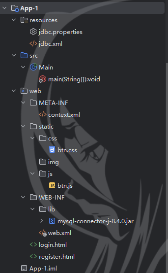
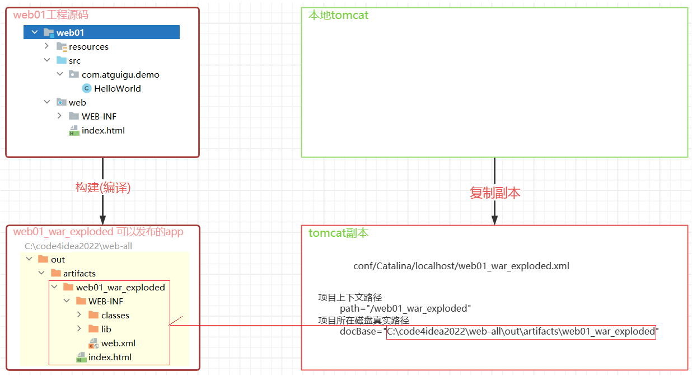
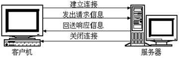
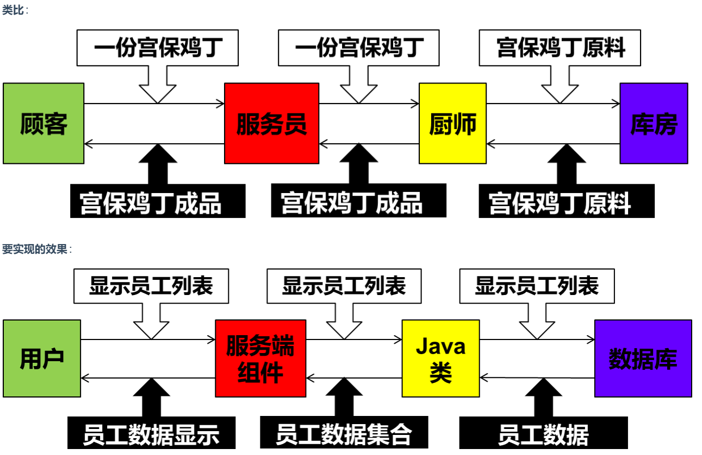
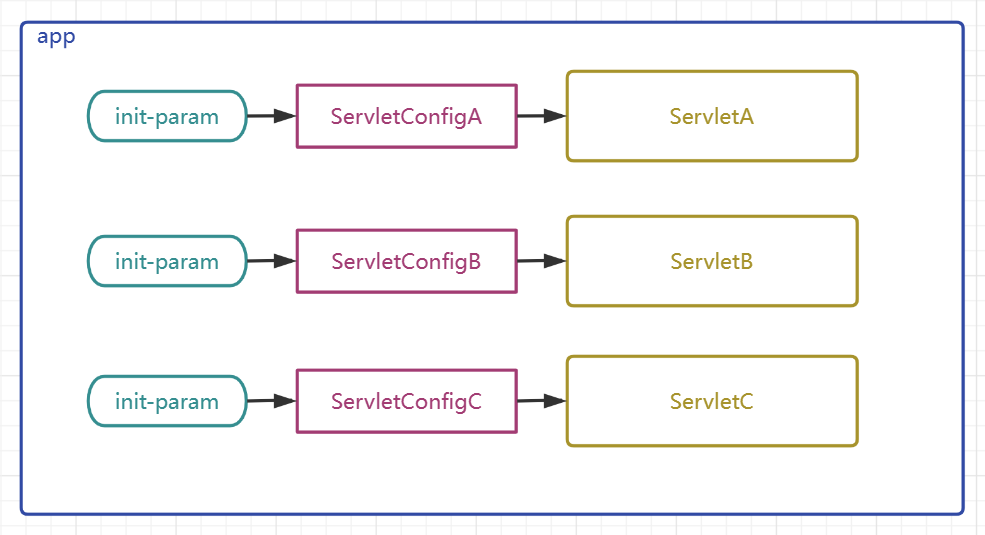
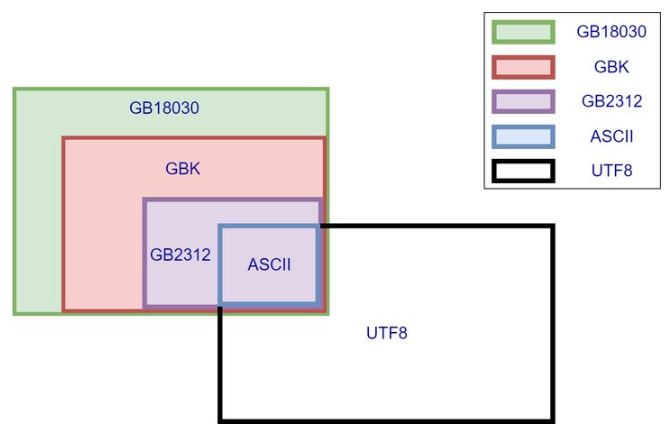
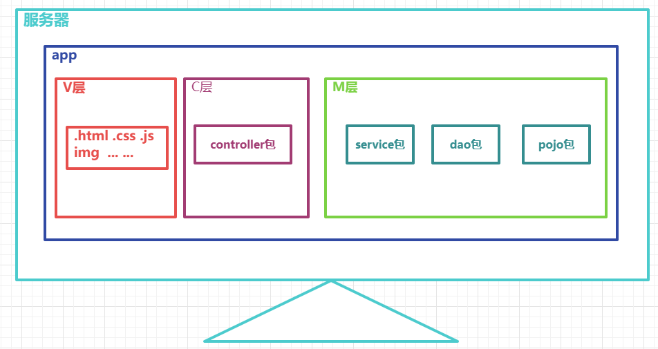

# Web

## Web 开发介绍

**Web**：全球广域网，也称为**万维网**(www **W**orld **W**ide **W**eb)，能够通过浏览器访问的**网站**。

### 网站的工作流程

1. 首先通过**浏览器**访问发布到**前端服务器**中的**前端程序**，这时候前端程序会将前端代码返回给浏览器。如下图所示：


2. 浏览器得到前端代码，此时浏览器会将前端代码进行解析，然后展示到浏览器的窗口中，这时候就看到了**网站**的**页面**，如下图所示：


1. 但是此时这个页面是没有数据的，因为数据在数据库中，所以浏览器需要根据**前端代码中指定的后台服务器的地址** 向**后台服务器**（内部有 java 程序）发起**请求**，后台服务器再去从**数据库**中获取数据，然后返回给浏览器。


1. 浏览器拿到后台返回的数据后，然后将数据展示在前端资源也就是**网页**上，然后就看到了网页的完整的内容


**整个流程如下：**

1. 浏览器先向前端服务器请求**前端资源**，也就是我们所说的**网页**

2. 浏览器再向**后台服务器**发起请求，获取**数据**

3. 浏览器将得到的后台**数据**填充到**网页**上，然后展示给用户去看

### 网站的开发模式

主要有 2 种：前后端分离开发模式和混合开发模式。

#### 前后端分离开发模式

（**目前企业开发的主流**市场占有率 70%以上）这种开发模式的特点如下：

1. 前端人员开发前端程序，前端程序单独部署到前端服务器上

2. 后端人员开发后端程序，后端程序部署到后端服务器上


#### 混合开发模式

这种开发模式的特点是：前端人员开发的代码和后端人员开发的代码在同一个项目中，一起打包部署。


### 网站开发的技术栈


前端 web 开发：

| 技术       | 描述                                            |
| ---------- | ----------------------------------------------- |
| HTML       | 用于构建网站的基础结构的                        |
| css        | 用于美化页面的，作用和化妆或者整容作用一样      |
| JavaScript | 实现网页和用户的交互                            |
| Vue        | 主要用于将数据填充到 html 页面上的              |
| Element    | 主要提供了一些非常美观的组件                    |
| Nginx      | 一款 web 服务器软件，可以用于部署我们的前端工程 |

后端 web 开发：

| 技术       | 描述                                            |
| ---------- | ----------------------------------------------- |
| Maven      | 一款 java 中用于管理项目的软件                  |
| Mysql      | 最常用的一款数据库软件之一                      |
| SpringBoot | spring 家族的产品，当前最为主流的项目开发技术。 |
| Mybatis    | 用于操作数据库的框架                            |

### Web 标准

**Web 标准**也称为**网页标准**，由一系列的标准组成，大部分由 W3C（ World Wide Web Consortium，万维网联盟）负责制定。由三个组成部分：

- HTML：负责网页的结构（页面元素和内容）。

- CSS：负责网页的表现（页面元素的外观、位置等页面样式，如：颜色、大小等）。

- JavaScript：负责网页的行为（交互效果）。

## HTML&CSS

### HTML

**HTML**:HyperText Markup Language，超文本标记语言。

- 超文本：超越了文本的限制，比普通文本更强大。除了文字信息，还可以定义图片、音频、视频等内容。

- 标记语言：由标签构成的语言
  - HTML 标签都是预定义好的。例如：使用`<h1>`标签展示标题，使用`<a>`展示超链接，使用``展示图片，`<video>`展示视频。
  - HTML 代码直接在浏览器中运行，HTML 标签由浏览器解析。

#### HTML 页面的基础结构标签

```html
<html>
  <head>
    <title> </title>
  </head>
  <body></body>
</html>
```

`<title>`中定义标题显示在浏览器的标题位置，`<body>`中定义的内容会呈现在浏览器的内容区域

#### HTML 中的标签特点

- HTML 标签不区分大小写
- HTML 标签的属性值，采用单引号、双引号都可以
- HTML 语法相对比较松散（建议大家编写 HTML 标签的时候尽量严谨一些）

#### 图片标签 img

1. 图片标签:``

2. 常见属性:
   src: 指定图像的 url (可以指定 绝对路径 , 也可以指定 相对路径)
   width: 图像的宽度 (像素 / 百分比 , 相对于父元素的百分比)
   height: 图像的高度 (像素 / 百分比 , 相对于父元素的百分比)

   备注: 一般 width 和 height 我们只会指定一个，另外一个会自动的等比例缩放。

3. 路径书写方式:
   绝对路径（赋值给 src 属性）: 1. 绝对磁盘路径 2. 绝对网络路径
   相对路径:
   ./ : 当前目录，可省略
   ../ : 上一级目录

#### 标题标签 h 系列

1. 标题标签: `<h1>` - `<h6>`

```html
<h1>111111111111</h1>
<h2>111111111111</h2>
<h3>111111111111</h3>
<h4>111111111111</h4>
<h5>111111111111</h5>
<h6>111111111111</h6>
```

2. 效果 : h1 为一级标题，字体也是最大的 ； h6 为六级标题，字体是最小的。

#### 水平分页线标签

水平分页线标签: `<hr>`

#### 超链接

- 标签: `<a>href="..." target="...">...</a>`
- 属性:
  - href: 指定资源访问的 url
  - target: 指定在何处打开资源链接
    - \_self: 默认值，在当前页面打开
    - \_blank: 在空白页面打开

#### 视频、音频标签

- 视频标签:`<video>`

  - 属性:
    - src: 规定视频的 url
    - controls: 显示播放控件
    - width: 播放器的宽度
    - height: 播放器的高度

- 音频标签:`<audio>`
  - 属性:
    - src: 规定音频的 url
    - controls: 显示播放控件

#### 段落标签

- 换行标签: `<br>`

  - 注意: 在 HTML 页面中,我们在编辑器中通过回车实现的换行, 仅仅在文本编辑器中会看到换行效果, 浏览器是不会解析的, HTML 中换行需要通过 br 标签

- 段落标签: `<p>`

#### 文本格式标签

| 效果   | 标签 | 标签(强调) |
| ------ | ---- | ---------- |
| 加粗   | b    | strong     |
| 倾斜   | i    | em         |
| 下划线 | u    | ins        |
| 删除线 | s    | del        |

#### 占位符

- 在 HTML 页面中无论输入了多少个空格, 最多只会显示一个。 可以使用空格占位符（&nbsp；）来生成空格，如果需要多个空格，就使用多次占位符。

- 那在 HTML 中，除了空格占位符以外，还有一些其他的占位符(了解, 只需要知道空格的占位符写法即可)，如下：

| 显示结果 | 描述   | 占位符  |
| :------- | :----- | :------ |
| &nbsp;   | 空格   | \&nbsp; |
| <        | 小于号 | \&lt;   |
| >        | 大于号 | \&gt;   |
| &        | 和号   | \&amp;  |
| "        | 引号   | \&quot; |
| '        | 撇号   | \&apos; |

#### 布局标签

- 布局标签：实际开发网页中，会大量频繁的使用 div 和 span 这两个没有语义的布局标签。

- 标签：`<div>` `<span>`

- 特点：

  - div 标签：

    - 一行只显示一个（独占一行）

    - 宽度默认是父元素的宽度，高度默认由内容撑开

    - 可以设置宽高（width、height）

  - span 标签：

    - 一行可以显示多个

    - 宽度和高度默认由内容撑开

    - 不可以设置宽高（width、height）

#### 表格标签

- `<table>` : 用于定义整个表格, 可以包裹多个 `<tr>`， 常用属性如下：

  - border：规定表格边框的宽度
  - width：规定表格的宽度
  - cellspacing: 规定单元之间的空间

- `<tr>` : 表格的行，可以包裹多个 `<td>`

- `<td>` : 表格单元格(普通)，可以包裹内容 , 如果是表头单元格，可以替换为 `<th>`

#### 表单标签

- 表单标签: `<form>`

- 表单属性:

  - action: 规定表单提交时，向何处发送表单数据，表单提交的 URL。
  - method: 规定用于发送表单数据的方式，常见为： GET、POST。
    - GET：表单数据是拼接在 url 后面的， 如： xxxxxxxxxxx?username=Tom&age=12，url 中能携带的表单数据大小是有限制的。
    - POST： 表单数据是在请求体（消息体）中携带的，大小没有限制。

- 表单项标签: 不同类型的 input 元素、下拉列表、文本域等。

  - input: 定义表单项，通过 type 属性控制输入形式

  - select: 定义下拉列表

  - textarea: 定义文本域

分别是：

- `<input>`: 表单项 , 通过 type 属性控制输入形式。

  | type 取值                | **描述**                             |
  | ------------------------ | ------------------------------------ |
  | text                     | 默认值，定义单行的输入字段           |
  | password                 | 定义密码字段                         |
  | radio                    | 定义单选按钮                         |
  | checkbox                 | 定义复选框                           |
  | file                     | 定义文件上传按钮                     |
  | date/time/datetime-local | 定义日期/时间/日期时间               |
  | number                   | 定义数字输入框                       |
  | email                    | 定义邮件输入框                       |
  | hidden                   | 定义隐藏域                           |
  | submit / reset / button  | 定义提交按钮 / 重置按钮 / 可点击按钮 |

- `<select>`: 定义下拉列表, `<option>` 定义列表项

- `<textarea>`: 文本域

#### HTTP 请求

##### 请求组成：

1. 请求行：请求方式、请求地址、协议版本

2. 请求头：头名:头值

3. 请求体（可选）：携带数据

##### 请求方式与数据格式

**get 请求示例**

```
GET /test2?name=张&age=20 HTTP/1.1
//请求行

Host: localhost
//请求头
```

**post 请求示例**

（url 编码）

```
POST /test2 HTTP/1.1
//请求行

Host: localhost
Content-Type: application/x-www-form-urlencoded
Content-Length: 21
//请求头

name=张
//请求体
```

- application/x-www-form-urlencoded：参数用键值对存储，用 `=` 分隔；参数之间用 `&` 分割

**json 请求示例**

（utf-8 编码）

```
POST /test3 HTTP/1.1
//请求行

Host: localhost
Content-Type: application/json
Content-Length: 25
//请求头

{"name":"zhang","age":18}
//请求体
```

- application/json：参数以 JSON 格式存储，参数之间用 `,` 分割；参数的键值对用 `:` 分割

##### session 原理

Http 无状态，有会画：

- 无状态是指，请求之间相互独立，第一次请求的数据，第二次请求不能重用

- 有会话是指，客户端和服务端都有相应的技术，可以暂存数据，让数据在请求间共享

服务端使用了 session 技术来暂存数据

- 存

```
GET /s1?name=zhang HTTP/1.1
Host: localhost
```

- 取

```
GET /s2 HTTP/1.1
Host: localhost
Cookie: JSESSIONID=560FA845D02AE09B176E1BC5D9816A5D
```

### CSS

**CSS**:Cascading Style Sheet，层叠样式表，用于控制页面的样式（表现）。

#### CSS 引入方式

具体有 3 种引入方式，语法如下表格所示：

| 名称     | 语法描述                                          |
| -------- | ------------------------------------------------- |
| 行内样式 | 在标签内使用`style`属性，属性值是 CSS 属性键值对  |
| 内嵌样式 | 定义`<style>`标签，在标签内部定义 CSS 样式        |
| 外联样式 | 定义`<link>`标签，通过`href`属性引入外部 CSS 文件 |

企业开发的使用情况如下：

1. 内联样式会出现大量的代码冗余，不方便后期的维护，所以不常用。
2. 内部样式，通过定义 CSS 选择器，让样式作用于当前页面的指定的标签上。
3. 外部样式，HTML 和 CSS 实现了完全的分离，企业开发常用方式。

#### 颜色表示

| **表示方式**   | **表示含义**                      | **取值**                                         |
| -------------- | --------------------------------- | ------------------------------------------------ |
| 关键字         | 预定义的颜色名                    | red, green, blue...                              |
| rgb 表示法     | 红绿蓝三原色，每项取值范围：0-255 | rgb(0, 0, 0), rgb(255, 255, 255), rgb(255, 0, 0) |
| 十六进制表示法 | #开头，将数字转换成十六进制表示   | #000000, #ff0000, #cccccc，简写：#000, #ccc      |

#### CSS 选择器

选择器是选取需设置样式的元素（标签），根据业务场景不同，选择的标签的需求也是多种多样的，有多种选择器

1. **元素（标签）选择器**

- 选择器的名字必须是标签的名字
- 作用：选择器中的样式会作用于所有同名的标签上

```css
元素名称 {
  css样式名: css样式值；;
}
```

2. **id 选择器**

- 选择器的名字前面需要加上#
- 作用：选择器中的样式会作用于指定 id 的标签上，而且有且只有一个标签（由于 id 是唯一的）

```css
#id属性值 {
  css样式名: css样式值；;
}
```

3. **类选择器**

- 选择器的名字前面需要加上 .
- 作用：选择器中的样式会作用于所有 class 的属性值和该名字一样的标签上，可以是多个

```css
.class属性值 {
  css样式名: css样式值；;
}
```

#### CSS 属性

- text-indent: 设置段落的首行缩进
- line-height: 设置行高
- text-align: 设置对齐方式, 可取值为 left / center / right

#### 盒子模型

- 盒子：页面中所有的元素（标签），都可以看做是一个 盒子，由盒子将页面中的元素包含在一个矩形区域内，通过盒子的视角更方便的进行页面布局

- 盒子模型组成：内容区域（content）、内边距区域（padding）、边框区域（border）、外边距区域（margin）


## JavaScript

JavaScript 是一门脚本语言，用于实现网页的动态效果，让页面和用户进行交互。

### 引入方式

**第一种方式**：内部脚本，将 JS 代码定义在 HTML 页面中

- JavaScript 代码必须位于`<script> </script>`标签之间
- 在 HTML 文档中，可以在任意地方，放置任意数量的`<script>`
- 一般会把脚本置于`<body>`元素的底部，可改善显示速度

**第二种方式**：外部脚本，将 JS 代码定义在外部 JS 文件中，然后引入到 HTML 页面中

- 外部 JS 文件以`.js`为后缀名
- 外部 JS 文件只包含 JS 代码，不包含`<script>`标签
- 引入外部 JS 的`<script>`必须是双标签，且放在`<head>`标签中

### 基本语法

#### 语法规则：

- 区分大小写：与 Java 一样，变量名、函数名以及其他一切东西都是区分大小写的

- 每行结尾的分号可有可无

- 大括号表示代码块

- 注释：

  - 单行注释：// 注释内容

  - 多行注释：/_ 注释内容 _/

#### JS 的三种输出语句

| API              | 描述             |
| ---------------- | ---------------- |
| window.alert()   | 警告框           |
| document.write() | 在 HTML 输出内容 |
| console.log()    | 写入浏览器控制台 |

#### 变量

| 关键字 | 解释                                                                       |
| ------ | -------------------------------------------------------------------------- |
| var    | 早期 ECMAScript5 中用于变量声明的关键字                                    |
| let    | ECMAScript6 中新增的用于变量声明的关键字，相比较 var，let 只在代码块内生效 |
| const  | 声明常量的，常量一旦声明，不能修改                                         |

- JavaScript 是一门弱类型语言，变量可以存放不同类型的值 。
- 变量名需要遵循如下规则：
  - 组成字符可以是任何字母、数字、下划线（\_）或美元符号（$）
  - 数字不能开头
  - 建议使用驼峰命名

#### 数据类型和运算符

虽然 JS 是弱数据类型的语言，但是 JS 中也存在数据类型，JS 中的数据类型分为 ：原始类型 和 引用类型，具体有如下类型

| 数据类型  | 描述                                               |
| --------- | -------------------------------------------------- |
| number    | 数字（整数、小数、NaN(Not a Number)）              |
| string    | 字符串，单双引皆可                                 |
| boolean   | 布尔。true，false                                  |
| null      | 对象为空                                           |
| undefined | 当声明的变量未初始化时，该变量的默认值是 undefined |

使用 typeof 函数可以返回变量的数据类型

| 运算规则   | 运算符                                                                     |
| ---------- | -------------------------------------------------------------------------- |
| 算术运算符 | + , - , \* , / , % , ++ , --                                               |
| 赋值运算符 | = , += , -= , \*= , /= , %=                                                |
| 比较运算符 | >, < , >= , <= , != , == , === 注意`==`会进行类型转换`===`不会进行类型转换 |
| 逻辑运算符 | && , \|\| , !                                                              |
| 三元运算符 | 条件表达式 ? true_value: false_value                                       |

#### 函数

- 第一种定义格式：

```js
function 函数名(参数1,参数2..){
    要执行的代码
}
```

因为 JavaScript 是弱数据类型的语言，所以有如下几点需要注意：

- 形式参数不需要声明类型，并且 JavaScript 中不管什么类型都是 let 或者 var 去声明，加上也没有意义。

- 返回值也不需要声明类型，直接 return 即可

- 第二种定义格式：

```js
var functionName = function (参数1,参数2..){
	//要执行的代码
}
```

- 在 JavaScript 中，函数的调用只需要名称正确即可，参数列表不管的。如上述案例，10 传递给了变量 a，20 传递给了变量 b,而 30 和 40 没有变量接受，但是不影响函数的正常调用。

### JavScript 对象

#### 基本对象

- Array
- Boolean
- Classe
- Date
- Error
- Global
- JSON
- Math
- Number
- RegExp
- String
- 运算符
- 语句

##### Array

Array 对象是用来定义数组

**构造方法**

方法一：`var 变量名 = new Array(元素1,元素2,元素3..);`

方法二：`var 变量名 = [元素1,元素2,元素3..];`

JavaScript 中数组相当于 Java 中的集合，数组的长度是可以变化的。而且 JavaScript 是弱数据类型的语言，所以数组中可以存储任意数据类型的值。接下来我们通过代码来演示上述特点。

**属性和方法**

属性：

| 属性   | 描述                         |
| :----- | :--------------------------- |
| length | 设置或返回数组中元素的数量。 |

方法：

| 方法方法  | 描述                                                                       |
| :-------- | :------------------------------------------------------------------------- |
| forEach() | 遍历数组中的每个有值的元素，并调用一次传入的函数                           |
| push()    | 将新元素添加到数组的末尾，并返回新的长度                                   |
| splice()  | 从数组中删除元素，参数 1 表示从哪个索引位置删除，参数 2 表示删除的元素个数 |

使用方法都是使用`.`来后接方法名，并传入相应的参数。

```js
arr.forEach(function (e) {
  console.log(e);
});

arr.forEach((e) => console.log(e));
```

##### String

String 对象是用来定义字符串

**构造方法**

方法一：`var 变量名 = new String(字符串);`

方法二：`var 变量名 = "字符串";`

**属性和方法**

属性：

| 属性   | 描述           |
| ------ | -------------- |
| length | 字符串的长度。 |

方法：

| 方法        | 描述                                     |
| ----------- | ---------------------------------------- |
| charAt()    | 返回在指定位置的字符。                   |
| indexOf()   | 检索字符串。                             |
| trim()      | 去除字符串两边的空格                     |
| substring() | 提取字符串中两个指定的索引号之间的字符。 |

##### JSON

###### 自定义对象

**构造方法**

```js
var 对象名 = {
  属性名1: 属性值1,
  属性名2: 属性值2,
  属性名3: 属性值3,
  函数名称: function (形参列表) {},
};
```

通过`对象名.属性名`调用属性或者`对象名.函数名称(参数)`调用函数。

###### JSON 对象

JSON 对象：**J**ava**S**cript **O**bject **N**otation，JavaScript 对象标记法。是通过 JavaScript 标记法书写的文本。

**格式**：

```js
{
  "key":value,
  "key":value,
  "key":value
}
```

**key 必须使用引号并且是双引号标记，value 可以是任意数据类型。**

JSON 这种数据格式的对象经常用来作为前后台交互的数据载体。

在前后台交互的时候，我们需要传输数据，可以使用下图的 XML 格式，可以清晰地描述 Java 中需要传递给前端的 Java 对象。


但是 XML 格式存在如下问题：

- 冗余：标签需要编写双份，占用带宽、浪费资源

- 繁琐：解析繁琐

JSON 格式的对象可以解决这些问题


但是上述在浏览器中还不能直接使用，**因为上述是一个 JSON 字符串，不是 JSON 对象**

使用`JSON.parse()`方法，传入一个 JSON 字符串，可以将其转换为 JSON 对象。

使用`JSON.stringify()`方法，传入一个 JSON 对象，可以将其转换为 JSON 字符串。

#### BOM 对象

BOM 的全称是 Browser Object Model,翻译过来是浏览器对象模型

也就是 JavaScript 将浏览器的各个组成部分封装成了对象。操作浏览器的部分功能，可以通过操作 BOM 对象的相关属性或者函数来完成。

| 对象名称  | 描述           |
| :-------- | :------------- |
| Window    | 浏览器窗口对象 |
| Navigator | 浏览器对象     |
| Screen    | 屏幕对象       |
| History   | 历史记录对象   |
| Location  | 地址栏对象     |

BOM 对象与浏览器各组成对应关系：


##### Window 对象

Window 对象指的是浏览器窗口对象，是 JavaScript 的全部对象，对于 Window 对象，我们可以直接使用，并且对于其属性和方法，我们可以省略 Window 对象。

window 对象提供了获取其他 BOM 对象的属性：

| 属性      | 描述                    |
| --------- | ----------------------- |
| history   | 用于获取 history 对象   |
| location  | 用于获取 location 对象  |
| navigator | 用于获取 navigator 对象 |
| screen    | 用于获取 screen 对象    |

Window 也提供了一些常用的函数，如下表格所示：

| 函数          | 描述                                               |
| ------------- | -------------------------------------------------- |
| alert()       | 显示带有一段消息和一个确认按钮的警告框。           |
| comfirm()     | 显示带有一段消息以及确认按钮和取消按钮的对话框。   |
| setInterval() | 按照指定的周期（以毫秒计）来调用函数或计算表达式。 |
| setTimeout()  | 在指定的毫秒数后调用函数或计算表达式。             |

- alert()函数：弹出警告框，函数的内容就是警告框的内容

- confirm()函数：弹出确认框，并且提供用户 2 个按钮，分别是确认和取消。该函数有个布尔类型的返回值

- setInterval(function,毫秒值)：定时器，用于周期性的执行某个功能，并且是**循环执行**。该函数需要传递 2 个参数：第一个参数是要执行的函数，第二个参数是执行的周期，单位是毫秒。

- setTimeout(function,毫秒值) ：定时器，只会在一段时间后**执行一次功能**。参数同`setInterval()`

##### Location 对象

location 是指浏览器的地址栏对象，常用属性为`href`属性，用于获取或者设置浏览器的地址信息

#### DOM 对象

DOM：Document Object Model 文档对象模型。也就是 JavaScript 将 HTML 文档的各个组成部分封装为对象。

封装的对象分为：

- Document：整个文档对象
- Element：元素对象
- Attribute：属性对象
- Text：文本对象
- Comment：注释对象


DOM 技术的特点：

- 改变 HTML 元素的内容
- 改变 HTML 元素的样式（CSS）
- 对 HTML DOM 事件作出反应
- 添加和删除 HTML 元素

DOM 技术核心：

- 如何获取 DOM 中的元素对象（Element 对象 ，也就是标签）
- 如何操作 Element 对象的属性,也就是标签的属性。

##### 获取 DOM 对象

HTML 中的 Element 对象可以通过 Document 对象获取，而 Document 对象是通过 Window 对象获取的。Document 对象提供的用于获取 Element 元素对象的 API 如下表所示：

| 函数                              | 描述                                         |
| --------------------------------- | -------------------------------------------- |
| document.getElementById()         | 根据 id 属性值获取，返回单个 Element 对象    |
| document.getElementsByTagName()   | 根据标签名称获取，返回 Element 对象数组      |
| document.getElementsByName()      | 根据 name 属性值获取，返回 Element 对象数组  |
| document.getElementsByClassName() | 根据 class 属性值获取，返回 Element 对象数组 |

- document.getElementById()：根据标签的 id 属性获取标签对象，id 是唯一的，所以获取到是单个标签对象。

- document.getElementsByTagName() : 根据标签的名字获取标签对象，同名的标签有很多，所以返回值是数组。

- document.getElementsByName()：根据标签的 name 的属性值获取标签对象，name 属性值可以重复，所以返回值是一个数组。

- document.getElementsByClassName(): 根据标签的 class 属性值获取标签对象，class 属性值也可以重复，返回值是数组。

##### 操作 DOM 对象

`innerHTML`属性：设置或获取元素的内容，可以设置 HTML 代码。

`style`属性：设置或获取元素的样式，可以设置 CSS 样式。

[JavaScript 参考手册](https://www.w3school.com.cn/jsref/index.asp)

### JavaScript 事件

HTML 事件是发生在 HTML 元素上的 “事情”，例如：

- 按钮被点击
- 鼠标移到元素上
- 输入框失去焦点

可以给这些事件绑定函数，当事件触发时，可以自动的完成对应的功能。这就是事件监听。

#### 事件绑定

JavaScript 对于事件的绑定提供了 2 种方式：

- 方式 1：通过 html 标签中的事件属性进行绑定，然后指向一个函数

- 方式 2：通过 DOM 中 Element 元素的事件属性进行绑定，然后操作对象属性绑定函数事件

### 常见事件

上面案例中使用到了 `onclick` 事件属性，那都有哪些事件属性供我们使用呢？下面就给大家列举一些比较常用的事件属性

| 事件属性名  | 说明                     |
| ----------- | ------------------------ |
| onclick     | 鼠标单击事件             |
| onblur      | 元素失去焦点             |
| onfocus     | 元素获得焦点             |
| onload      | 某个页面或图像被完成加载 |
| onsubmit    | 当表单提交时触发该事件   |
| onmouseover | 鼠标被移到某元素之上     |
| onmouseout  | 鼠标从某元素移开         |

## TypeScript

动态类型意味着

- 运行代码时才知道发生什么 (running the code to see what happens)

静态类型意味着

- 在代码运行前，就对它的行为做出预测 (make predications about what code is expected before it runs)

typescript 属于编译时实施类型检查（静态类型）的技术

### 类型

| 类型         | 例                                    | 备注                         |
| ------------ | ------------------------------------- | ---------------------------- |
| 字符串类型   | string                                |                              |
| 数字类型     | number                                |                              |
| 布尔类型     | boolean                               |                              |
| 数组类型     | number[],string[], boolean[] 依此类推 |                              |
| 任意类型     | any                                   | 相当于又回到了没有类型的时代 |
| 复杂类型     | type 与 interface                     |                              |
| 函数类型     | () => void                            | 对函数的参数和返回值进行说明 |
| 字面量类型   | "a"\|"b"\|"c"                         | 限制变量或参数的取值         |
| nullish 类型 | null 与 undefined                     |                              |
| 泛型         | `<T>`，`<T extends 父类型>`           |                              |

### 标注位置

##### 标注变量

```js
let message: string = "hello,world";
```

- 一般可以省略，因为可以根据后面的字面量推断出前面变量类型

##### 标注参数

```js
function greet(name: string): void {
  //...
}
```

##### 标注返回值

```js
function add(a: number, b: number): number {
  return a + b;
}
```

- 一般也可以省略，因为可以根据返回值做类型推断

##### 复杂类型

**type**

```js
type Cat = {
  name: string,
  age: number,
};

const c1: Cat = { name: "小白", age: 1 };
const c2: Cat = { name: "小花" }; // 错误: 缺少 age 属性
const c3: Cat = { name: "小黑", age: 1, sex: "公" }; // 错误: 多出 sex 属性
```

**interface**

```js
interface Cat {
  name: string;
  age: number;
}

const c1: Cat = { name: "小白", age: 1 };
const c2: Cat = { name: "小花" }; // 错误: 缺少 age 属性
const c3: Cat = { name: "小黑", age: 1, sex: "公" }; // 错误: 多出 sex 属性
```

**可选属性**

```js
interface Cat {
  name: string;
  age?: number;
}

const c1: Cat = { name: "小白", age: 1 };
const c2: Cat = { name: "小花" }; // 正确: age 属性可选
```

可选属性需要注意处理 `undefined` 值，否则会报错。

##### 方法类型

```js
interface Api {
  foo(): void;
  bar(str: string): string;
}

function test(api: Api) {
  api.foo();
  console.log(api.bar("hello"));
}

test({
  foo() {
    console.log("ok");
  },
  bar(str: string) {
    return str.toUpperCase();
  },
});
```

##### 字面量类型

```js
function printText(s: string, alignment: "left" | "right" | "center") {
  console.log(s, alignment);
}

printText("hello", "left");
printText("hello", "aaa"); // 错误: 取值只能是 left | right | center
```

##### nullish 类型

```js
function test(x?: string | null) {
  console.log(x?.toUpperCase());
}

test("aaa");
test(null);
test();
```

- x?: string | null 表示可能是 undefined 或者是 string 或者是 null

##### 泛型

```js
interface Ref<T> {
  value: T;
}

const r1: Ref<string> = { value: "hello" };
const r2: Ref<number> = { value: 123 };
const r3: Ref<boolean> = { value: true };
```

- 泛型的要点就是 `<类型参数>`，把【类型】也当作一个变化的要素，像参数一样传递过来，这样就可以派生出结构相似的新类型

函数定义也支持泛型

```js
function ref<T>(n: T): Ref<T> {
  return { value: n };
}

const v1 = ref("hello"); // Ref<string>
const v2 = ref(123.3333); // Ref<number>

v1.value.toLocaleLowerCase();
v2.value.toFixed(2);
```

## Vue-文档自学（废）

Vue.js 是一套构建用户界面的 **渐进式框架**。与其他重量级框架不同的是，Vue 采用自底向上增量开发的设计。Vue 的核心库只关注视图层，并且非常容易学习，非常容易与其它库或已有项目整合。Vue.js 的目标是通过尽可能简单的 API 实现**响应的数据绑定**和**组合的视图组件**。

框架即是一个半成品软件，是一套可重用的、通用的、软件基础代码模型。基于框架进行开发，更加快捷、更加高效。

为了提高开发的效率，引入**MVVM(Model-View-ViewModel)的前端开发思想**，即让开发者更加关注数据，而非数据绑定到视图这种机械化的操作。

MVVM:其实是 Model-View-ViewModel 的缩写，有 3 个单词，具体释义如下：

- Model: 数据模型，特指前端中通过请求从后台获取的数据

- View: 视图，用于展示数据的页面，可以理解成我们的 html+css 搭建的页面，但是没有数据

- ViewModel: 数据绑定到视图，负责将数据（Model）通过 JavaScript 的 DOM 技术，将数据展示到视图（View）上


基于 MVVM 思想，其中的 Model 我们可以通过 Ajax 来发起请求从后台获取

对于 View 部分，我们将来会学习一款 ElementUI 框架来替代 HTML+CSS 来更加方便的搭建 View

而侧重于 ViewModel 部分开发的 vue 前端框架，用来替代 JavaScript 的 DOM 操作，让数据展示到视图的代码开发变得更加的简单。

### 基础介绍

核心功能：

- **声明式渲染**：Vue 基于标准 HTML 拓展了一套模板语法，使得我们可以声明式地描述最终输出的 HTML 和 JavaScript 状态之间的关系

- **响应性**：Vue 会自动跟踪 JavaScript 状态并在其发生变化时响应式地更新 DOM

使用类 HTML 格式的文件来书写 Vue 组件，也称为**单文件组件**（`.vue`文件）顾名思义，Vue 的单文件组件会将一个组件的逻辑 (JavaScript)，模板 (HTML) 和样式 (CSS) 封装在同一个文件里。

### 环境准备

使用 `vite` 作为前端项目的打包、构建工具

```shell
npm init vite@latest

cd <my-project>
npm install
npm run dev
```

#### 修改端口

```ts
// vite.config.ts

export default defineConfig({
  //...

  server: {
    port: 3000,
    host: "0.0.0.0",
  },
});
```

#### 配置代理

为了避免前后端服务器联调时，相关请求产生跨域问题，需要配置代理

```ts
// vite.config.ts

export default defineConfig({
  //...

  server: {
    //...

    proxy: {
      "/api": {
        target: "http://localhost:4000",
        changeOrigin: true,
      },
    },
  },
});
```

#### 项目结构

```
index.html
package.json
tsconfig.json
vite.config.ts
├─public
└─src
    ├─assets
    ├─components
    ├─model
    ├─router
    ├─store
    └─views
```

- index.html 为主页面
- package.json npm 配置文件
- tsconfig.json typescript 配置文件
- vite.config.ts vite 配置文件
- public 静态资源
- src/components 可重用组件
- src/model 模型定义
- src/router 路由
- src/store 共享存储
- src/views 视图组件

### 创建一个 Vue 实例

每个 Vue 应用都是通过`createApp`函数创建一个新的应用实例

```js
import { createApp } from "vue";
const app = createApp({
  /* 根组件选项 */
});
```

**根组件**`src/App.vue`：传入的`createApp`对象实际上是一个组件，每个应用都需要一个“根组件”，其他组件将作为其子组件嵌套在根组件下。

#### Vue 组件

Vue 组件文件是以`.vue`结尾，每个组件由三个部分组成

```vue
<script setup lang="ts"></script>

<template></template>

<style scoped></style>
```

- script 代码部分，控制模板的数据来源和行为

- template 模板部分，由它生成 html 代码

#### main.ts

```ts
import { createApp } from "vue";
import App from "./App.vue";

createApp(App).mount("#app");
```

- createApp 就是创建一个 Vue 应用实例，它接受的参数 App 即根组件

- mount 就是把根组件生成的 html 代码片段挂载到 index.html 中的 id 为 `app` 的元素上

#### ref 和 reactive

- ref 能将任意类型的数据变为【响应式】的

- reactive 只能将对象类型变为【响应式】，对基本类型无效（例如 string，number，boolean）

```ts
<script setup lang="ts">
import { ref, reactive } from 'vue'
const u1 = ref({ name: '张三' })
const u2 = reactive({ name: '张三' })

function test() {
  console.log(u1.value)
  console.log(u2)
}

test()
</script>

<template>
  <h2>{{u1.name}}</h2>
  <h2>{{u2.name}}</h2>
</template>
```

- 在 template 模板中使用 ref 包装的数据，直接写【变量名】就可以了

- 但在代码中要使用 ref 包装的数据，必须用【变量名.value】才能访问到

- reactive 包装的数据，在模板中和代码中都是一致的

#### 属性绑定

```ts
<script setup lang="ts">
import { ref } from 'vue'
const path = ref('/src/assets/vue.svg')

</script>

<template>
  
</template>
```

- 【:属性名】用来将标签属性与【响应式】变量绑定（`v-bind`简写）

#### 事件绑定

```ts
<script setup lang="ts">
import { ref } from 'vue'
const count = ref(0)
function dec() {
  count.value--
}
function inc() {
  count.value++
}
</script>

<template>
  <input type="button" value="-" @click="dec">
  <h2>{{count}}</h2>
  <input type="button" value="+" @click="inc">
</template>
```

- 【@事件名】用来将标签属性与函数绑定，事件发生后执行函数内代码（`v-on`简写）

#### 表单绑定

- 用 v-model 实现双向绑定，即

  - javascript 数据可以同步到表单标签

  - 反过来用户在表单标签输入的新值也会同步到 javascript 这边

- 双向绑定只适用于表单这种带【输入】功能的标签，其它标签的数据绑定，单向就足够了

- 复选框这种标签，双向绑定的 javascript 数据类型一般用数组

#### 计算属性

```ts
computed(() => {});
```

- 计算属性具备缓存功能，即传入参数的值发生了变化，才会重新计算

- 如果用函数实现相同功能，则没有缓存功能，不会再当参数改变时重新计算

#### xhr 请求

```ts
const xhr = new XMLHttpRequest(); // 创建 XMLHttpRequest 对象

// 当响应返回时，会触发 onload 事件
xhr.onload = function () {
  console.log(xhr.response); // 响应数据
};

xhr.open("Get", url); // 打开请求
xhr.responseType = "json"; // 设置响应类型
xhr.send(); // 发送请求
```

### 模板语法

Vue 使用一种基于 HTML 的模板语法，能够声明式地将其组件实例的数据绑定到呈现的 DOM 上。所有的 Vue 模板都是语法层面合法的 HTML，可以被符合规范的浏览器和 HTML 解析器解析。

在底层机制中，Vue 会将模板编译成高度优化的 JavaScript 代码。结合响应式系统，当应用状态变更时，Vue 能够智能地推导出需要重新渲染的组件的最少数量，并应用最少的 DOM 操作。

#### 文本插值

最基础的数据绑定形式是文本插值，使用的是 `{{ }}` 语法，该语法会被替换为相应组件实例中 `msg` 属性的值，每次 `msg` 属性更改时也会同步更新

```vue
<span>Message: {{ message }}</span>
```

#### Attribute 绑定

`{{}}` 不能在 HTML attribute 中使用，想要响应式地绑定一个 attribute ，应该使用 `v-bind` 指令：

```
<div v-bind:id="dynamicId"></div>
```

`v-bind` 指令指示 Vue 将元素的 `id` attribute 与组件的 `dynamicId` 属性保持一致，如果 `dynamicId` 发生变化，则会同步更新 `id` attribute；如果绑定的值是 `null` 或者 `undefined` 那么该 attribute 会被移除。

##### 简写

将常用的 `v-bind` 指令缩写为 `: `：

```vue
<div :id="dynamicId"></div>
```

##### 同名简写

如果 attribute 的名称与绑定的 JavaScript 值的名称相同，那么可以进一步简化语法，省略 attribute 值：

```vue
<!-- 与 :id="id" 等效 -->
<div :id="id"></div>
```

##### 布尔型 Attribute

**布尔型 attribute** 依据 true/false 值来决定 attribute 是否应该存在于该元素上。 `disabled` 就是最常见的例子

`v-bind` 在这种场景下有所不同：

```vue
<button :disabled="isButtonDisabled">Button</button>
```

1. 如果 `isButtonDisabled` 为 `true` 或者一个空字符串，则 `<button>` 元素将会获得 `disabled` attribute。

2. 如果 `isButtonDisabled` 为 `false`，则 `<button>` 元素将会失去 `disabled` attribute。

##### 动态绑定多个值

```ts
const objectOfAttrs = {
  id: 'container',
  class: 'wrapper',
  style: 'background-color:green'
}

<div v-bind="objectOfAttrs"></div>
```

#### JavaScript 表达式

在 Vue 模板内，JavaScript 表达式可以被使用在如下场景上：

- 在文本插值中 (双大括号)

- 在任何 Vue 指令 (以 v- 开头的特殊 attribute) attribute 的值中

仅支持单一表达式，判断标准是否可以合法地写在 `return` 后面

#### 指令 Directives

指令是指带有 `v-` 前缀的特殊 attribute

Vue 提供了很多内置指令， 指令 attribute 的期望值为一个 JavaScript 表达式（除了 `v-for` 、 `v-on` 、 `v-slot`这几个指令之外），一个指令的任务是在其表达式的值变化时响应式地更新 DOM。


##### 参数 Arguments

某些指令需要一个参数，在指令后通过一个冒号 `:` 来指定参数

```vue
<a :href="url">...</a>
```

此处的 `href` 就是一个参数，它告诉 `v-bind` 指令将表达式 `url` 的值绑定到元素的 `href` attribute 上。

###### 动态参数

在指令参数上也可以使用一个 JavaScript 表达式，需要包含在 `[ ]` 内：

```vue
<a :[key]="url">...</a>
```

此处的 `key` 会作为一个 JavaScript 表达式被动态执行，计算得到的值会被用作最汇总的参数。

动态参数中表达式的值应当是一个字符串或者 `null` ，特殊值 `null` 意为显式移除该绑定。其他非字符串的值会触发警告。

##### 修饰符 Modifiers

修饰符是以点开头的特殊后缀，表明指令需要以一些特定的方式被绑定，后续 `v-on` 和 `v-model` 会详细说明

### 响应式基础

#### 声明响应式状态

##### `ref()`

```ts
import { ref } from "vue";

const count = ref(0);
```

`ref()` 接收参数，并将其包裹在一个带有 `.value` 属性的 ref 对象中返回

```ts
const count = ref(0);

console.log(count.value); // {{ value: 0 }}
console.log(count); // 0

count.value++;

console.log(count.value); // 1
```

##### `<script setup>`

在 `setup()` 函数中手动暴露大量的状态和方法十分繁琐，可以通过单文件组件来避免，使用 `<script setup>` 来大幅度简化代码

```ts
<script setup>
import { ref } from 'vue'

const count = ref(0)

function increment() {
  count.value++
}
</script>

<template>
  <button @click="increment">{{ count }}</button>
</template>
```

`<script setup>` 中的顶层的导入、声明的变量和函数刻在同一组件的模板中直接使用

##### 响应式原理

当在模板中使用了一个 `ref`，然后改变了这个 `ref` 的值时，Vue 会自动检测到这个变化，并且相应地更新 DOM。这是通过一个基于依赖追踪的响应式系统实现的。当一个组件首次渲染时，Vue 会追踪在渲染过程中使用的每一个 `ref`。然后，当一个 `ref` 被修改时，它会触发追踪它的组件的一次重新渲染。

另一个 `ref` 的好处是，与普通变量不同，你可以将 `ref` 传递给函数，同时保留对最新值和响应式连接的访问。当将复杂的逻辑重构为可重用的代码时，这将非常有用。

##### 深层响应性

Ref 可以持有任何类型的值，包括深层嵌套的对象、数组或者 JavaScript 内置的数据结构，比如 `Map`。这意味着即使改变嵌套对象或数组时，变化也会被检测到.

非原始值将通过 `reactive()` 转换为响应式代理

也可以通过 `shallow ref` 来放弃深层响应性。对于浅层 `ref`，只有 `.value` 的访问会被追踪。浅层 `ref` 可以用于避免对大型数据的响应性开销来优化性能、或者有外部库管理其内部状态的情况。

##### DOM 更新时机

修改了响应式状态时，DOM 会被自动更新。但是需要注意的是，DOM 更新不是同步的。Vue 会在“next tick”更新周期中缓冲所有状态的修改，以确保不管你进行了多少次状态修改，每个组件都只会被更新一次。

要等待 DOM 更新完成后再执行额外的代码，可以使用 `nextTick()` 全局 API：

```ts
import { nextTick } from "vue";

async function increment() {
  count.value++;
  await nextTick();
  // 现在 DOM 已经更新了
}
```

### 计算属性

使用**计算属性**来描述依赖响应式状态的复杂逻辑

```ts
<script setup>
import { ref, computed } from 'vue'

const authorName = ref('John Doe')
const books = ref([
  'Vue 2 - Advanced Guide',
  'Vue 3 - Basic Guide',
  'Vue 4 - The Mystery'
])

const publishedBooksMessage = computed(() => {
  return books.value.length > 0 ? "yes" : "no"
})
</script>

<template>
  <p>Has published books: {{ publishedBooksMessage }}</p>
</template>
```

计算属性的返回值是一个 `computed ref`，它会根据依赖的响应式状态自动更新。

Vue 的计算属性会自动追踪响应式依赖。它会检测到 `publishedBooksMessage` 依赖于 `books`，所以当 `books` 改变时，任何依赖于 `publishedBooksMessage` 的绑定都会同时更新。

若使用

```ts
function caculateBooksMessage() {
  return books.value.length > 0 ? "yes" : "no";
}
```

定义为一个方法而不是计算属性，则不会自动追踪依赖，需要手动调用 `caculateBooksMessage()` 来更新。

### Class 与 Style 绑定

数据绑定的一个常见需求场景是操纵元素的 CSS class 列表和内联样式。因为 class 和 style 都是 attribute，可以和其他 attribute 一样使用 v-bind 将它们和动态的字符串绑定。

但是，在处理比较复杂的绑定时，通过拼接生成字符串是麻烦且易出错的。

因此，Vue 专门为 class 和 style 的 v-bind 用法提供了特殊的功能增强。除了字符串外，表达式的值也可以是对象或数组。

#### 绑定 Class

使用 `:class` （ `v-bind:class` ）来传递一个对象来动态切换 class

#### 绑定 Style

使用 `:style` 来绑定 JavaScript 表达式对象，动态更新元素的样式，对应的是 `style` attribute。

### 条件渲染

#### `v-if`

`v-if` 指令用于条件性地渲染一块内容。这块内容只会在指令的表达式返回真值时才被渲染。

#### `v-else`

`v-else` 指令表示 `v-if` 的“else 块”。

#### `v-else-if`

`v-else-if` 指令表示 `v-if` 的一个分支，可以连续多次重复使用，一个使用 `v-else-if` 的元素必须紧跟在一个 `v-if` 或一个 `v-else-if` 元素后面。

#### `v-show`

`v-show` 指令根据表达式的真假值，切换元素的 `display` CSS 属性。不同于 `v-if`，`v-show` 不渲染元素，只是简单地切换元素的 `display` 值。

### 列表渲染

#### `v-for`

我们可以使用 `v-for` 指令基于一个数组来渲染一个列表。`v-for` 指令的值需要使用 `item in items` 、 `item of items` 形式的特殊语法，其中 items 是源数据的数组，而 item 是迭代项的别名：

`v-for` 也支持使用可选的第二个参数表示当前项的位置索引

#### `v-for` 与 对象

可以使用 `v-for` 来遍历一个对象的所有属性。遍历的顺序会基于对该对象调用 `Object.values()` 的返回值来决定。

提供第二个参数表示属性名（`key`），第三个参数表示位置索引（`index`）

#### `v-for` 与 范围值

可以使用 `v-for` 来渲染一个数字范围，会基于 `1 ... n`的取值范围来渲染。

```vue
<span v-for="n in 10">{{ n }}</span>
```

**初值为 1**

### 事件处理

#### 监听事件

`v-on` 指令用来监听 DOM 事件（简写为 `@` ），并在触发时调用相应的 JavaScript 回调函数。

事件处理器的值可以是：

1. **内联事件处理器**：事件被触发时执行的内联 JavaScript 代码

2. **方法事件处理器**：一个指向组件上定义的方法的属性名或是路径

#### 内联事件处理器

常用于简单场景

```vue
const count = ref(0)

<button @click="count++">{{ count }}</button>
```

在内联事件处理器中访问时间参数：

1. `$event`：原生 DOM 事件对象

```vue
<!-- 使用特殊的 $event 变量 -->
<button @click="warn('Form cannot be submitted yet.', $event)">
  Submit
</button>
```

2. 使用内联箭头函数

```vue
<!-- 使用内联箭头函数 -->
<button @click="(event) => warn('Form cannot be submitted yet.', event)">
  Submit
</button>
```

#### 方法事件处理器

`v-on` 可以接受一个方法名或对某个方法的调用

```ts
const name = ref('Vue.js')

function greet(event) {
  alert(`Hello ${name.value}!`)
  // `event` 是 DOM 原生事件
  if (event) {
    alert(event.target.tagName)
  }
}

<button @click="greet">Greet</button>
```

方法事件处理器会自动接收原生 DOM 事件并触发执行。在上面的例子中，我们能够通过被触发事件的 `event.target` 访问到该 DOM 元素。

#### 事件修饰符

在处理事件常常要调用 `event.preventDefault()` 或 `event.stopPropagation()` ，为了让方法更专注于数据逻辑而不用去处理 DOM 细节，Vue 为 `v-on` 提供了事件修饰符。

修饰符是以 `.` 表示的指令后缀，包含

- `.stop`
- `.prevent`
- `.self`
- `.capture`
- `.once`
- `.passive`

```vue
<!-- 单击事件将停止传递 -->
<a @click.stop="doThis"></a>

<!-- 提交事件将不再重新加载页面 -->
<form @submit.prevent="onSubmit"></form>

<!-- 修饰语可以使用链式书写 -->
<a @click.stop.prevent="doThat"></a>

<!-- 也可以只有修饰符 -->
<form @submit.prevent></form>

<!-- 仅当 event.target 是元素本身时才会触发事件处理器 -->
<!-- 例如：事件处理器不来自子元素 -->
<div @click.self="doThat">...</div>

<!-- 添加事件监听器时，使用 `capture` 捕获模式 -->
<!-- 例如：指向内部元素的事件，在被内部元素处理前，先被外部处理 -->
<div @click.capture="doThis">...</div>

<!-- 点击事件最多被触发一次 -->
<a @click.once="doThis"></a>

<!-- 滚动事件的默认行为 (scrolling) 将立即发生而非等待 `onScroll` 完成 -->
<!-- 以防其中包含 `event.preventDefault()` -->
<div @scroll.passive="onScroll">...</div>
```

#### 按键修饰符

可以使用 `v-on` 监听按键事件时添加按键修饰符

```vue
<!-- 仅在 `key` 为 `Enter` 时调用 `submit` -->
<input @keyup.enter="submit" />
```

**按键别名**：

- `.enter`
- `.tab`
- `.delete` (捕获“删除”和“退格”键)
- `.esc`
- `.space`
- `.up`
- `.down`
- `.left`
- `.right`

**系统按键修饰符**：

- `.ctrl`
- `.alt`
- `.shift`
- `.meta` (Mac 上的 “command” 键)

**`.exact`修饰符**：

`.exact` 修饰符允许精确控制触发事件所需的系统修饰符的组合

```vue
<!-- 当按下 Ctrl 时，即使同时按下 Alt 或 Shift 也会触发 -->
<button @click.ctrl="onClick">A</button>

<!-- 仅当按下 Ctrl 且未按任何其他键时才会触发 -->
<button @click.ctrl.exact="onCtrlClick">A</button>

<!-- 仅当没有按下任何系统按键时触发 -->
<button @click.exact="onClick">A</button>
```

**鼠标按键修饰符**：

- `.left`
- `.right`
- `.middle`

### 表单输入绑定

`v-model` 指令简化了将表单输入框的内容同步给 JavaScript 变量的过程，手动连接值绑定和更改事件监听器相对麻烦，`v-model` 指令会自动将元素的值和变量绑定起来。

```
<input v-model="text">
```

v-model 还可以用于各种不同类型的输入，`<textarea>`、`<select>` 元素。它会根据所使用的元素自动使用对应的 DOM 属性和事件组合：

文本类型的 `<input>` 和 `<textarea>` 元素会绑定 value property 并侦听 input 事件；

`<input type="checkbox">` 和 `<input type="radio">` 会绑定 checked property 并侦听 change 事件；

`<select>` 会绑定 value property 并侦听 change 事件。

### 生命周期

#### 生命周期图示


#### 生命周期钩子

##### 注册周期钩子

`onMounted` 钩子可以用来在组件完成初始渲染并创建 DOM 节点后运行代码

```vue
<script setup>
import { onMounted } from "vue";

onMounted(() => {
  console.log(`the component is now mounted.`);
});
</script>
```

`onUpdated` 钩子可以用来在组件完成重新渲染后运行代码

```vue
<script setup>
import { onUpdated } from "vue";

onUpdated(() => {
  console.log(`the component is now updated.`);
});
</script>
```

`onBeforeMount` 钩子可以用来在组件开始渲染前运行代码

```vue
<script setup>
import { onBeforeMount } from "vue";

onBeforeMount(() => {
  console.log(`the component is about to be mounted.`);
});
</script>
```

`onBeforeUpdate` 钩子可以用来在组件重新渲染前运行代码

```vue
<script setup>
import { onBeforeUpdate } from "vue";

onBeforeUpdate(() => {
  console.log(`the component is about to be updated.`);
});
</script>
```

## Ajax-文档自学（废）

Ajax: 全称 Asynchronous JavaScript And XML，异步的 JavaScript 和 XML

作用如下：

- 与服务器进行数据交换：通过 Ajax 可以给服务器发送请求，并获取服务器响应的数据。

  - 如下图所示前端资源被浏览器解析，但是前端页面上缺少数据，前端可以通过 Ajax 技术，向后台服务器发起请求，后台服务器接受到前端的请求，从数据库中获取前端需要的资源，然后响应给前端，前端在通过我们学习的 vue 技术，可以将数据展示到页面上，这样用户就能看到完整的页面了。此处可以对比 JavaSE 中的网络编程技术来理解。


- 异步交互：可以在**不重新加载整个页面**的情况下，与服务器交换数据并**更新部分网页**的技术，如：搜索联想、用户名是否可用的校验等等。

  - Ajax 请求不会导致整个页面的重新加载，并且只针对局部模块的数据进行了数据的更新，不会对整个页面的其他地方进行数据的更新，这样就大大提升了页面的加载速度，用户体验高。

**同步异步**

- 同步请求发送过程如下：

  浏览器页面在发送请求给服务器，在服务器处理请求的过程中，浏览器页面不能做其他的操作，只能等到服务器响应结束后才能，浏览器页面才能继续做其他的操作。


- 异步请求发送过程如下：

  浏览器页面发送请求给服务器，在服务器处理请求的过程中，浏览器页面还可以做其他的操作


## Tomcat

Web 服务器通常由硬件和软件共同构成

- 硬件：电脑，提供服务供其他客户电脑访问

- 软件：电脑上安装的服务器软件，安装后能提供服务给网络中的其他计算机，将本地文件映射成一个虚拟的 url 地址供网络中的其他人访问


### Tomcat 目录

- bin：该目录下存放的是二进制可执行文件，如果是安装版，那么这个目录下会有两个 exe 文件：tomcat10.exe、tomcat10w.exe，前者是在控制台下启动 Tomcat，后者是弹出 GUI 窗口启动 Tomcat

- conf：这是一个非常非常重要的目录，这个目录下有四个最为重要的文件：

  - **server.xml：配置整个服务器信息。例如修改端口号。默认 HTTP 请求的端口号是：8080**

  - tomcat-users.xml：存储 tomcat 用户的文件，这里保存的是 tomcat 的用户名及密码，以及用户的角色信息。可以按着该文件中的注释信息添加 tomcat 用户，然后就可以在 Tomcat 主页中进入 Tomcat Manager 页面了；

  - - web.xml：部署描述符文件，这个文件中注册了很多 MIME 类型，即文档类型。这些 MIME 类型是客户端与服务器之间说明文档类型的，如用户请求一个 html 网页，那么服务器还会告诉客户端浏览器响应的文档是 text/html 类型的，这就是一个 MIME 类型。客户端浏览器通过这个 MIME 类型就知道如何处理它了。当然是在浏览器中显示这个 html 文件了。但如果服务器响应的是一个 exe 文件，那么浏览器就不可能显示它，而是应该弹出下载窗口才对。MIME 就是用来说明文档的内容是什么类型的！

- context.xml：对所有应用的统一配置，通常我们不会去配置它。

- lib：Tomcat 的类库，里面是一大堆 jar 文件。如果需要添加 Tomcat 依赖的 jar 文件，可以把它放到这个目录中，当然也可以把应用依赖的 jar 文件放到这个目录中，这个目录中的 jar 所有项目都可以共享之，但这样你的应用放到其他 Tomcat 下时就不能再共享这个目录下的 jar 包了，所以建议只把 Tomcat 需要的 jar 包放到这个目录下；

- logs：这个目录中都是日志文件，记录了 Tomcat 启动和关闭的信息，如果启动 Tomcat 时有错误，那么异常也会记录在日志文件中。

- temp：存放 Tomcat 的临时文件，这个目录下的东西可以在停止 Tomcat 后删除！

- **webapps：存放 web 项目的目录，其中每个文件夹都是一个项目**；如果这个目录下已经存在了目录，那么都是 tomcat 自带的项目。其中 ROOT 是一个特殊的项目，在地址栏中访问：http://127.0.0.1:8080，没有给出项目目录时，对应的就是ROOT项目.http://localhost:8080/examples，进入示例项目。其中examples"就是项目名，即文件夹的名字。

- work：运行时生成的文件，最终运行的文件都在这里。通过 webapps 中的项目生成的！可以把这个目录下的内容删除，再次运行时会生再次生成 work 目录。当客户端用户访问一个 JSP 文件时，Tomcat 会通过 JSP 生成 Java 文件，然后再编译 Java 文件生成 class 文件，生成的 java 和 class 文件都会存放到这个目录下。

- LICENSE：许可证。

- NOTICE：说明文件。

### WEB 项目的标准结构

在 Tomcat 的 webapps 目录下创建一个文件夹，这个文件夹就是你的 WEB 项目的名字

app 本应用根目录：

- static 非必要目录,约定俗成的名字,一般在此处放静态资源 (css js img)

- WEB-INF 必要目录,必须叫 WEB-INF,受保护的资源目录,浏览器通过 url 不可以直接访问的目录

  - classes 必要目录,src 下源代码,配置文件,编译后会在该目录下,web 项目中如果没有源码,则该目录不会出现

  - lib 必要目录,项目依赖的 jar 编译后会出现在该目录下,web 项目要是没有依赖任何 jar,则该目录不会出现

  - web.xml 必要文件,web 项目的基本配置文件. 较新的版本中可以没有该文件,但是学习过程中还是需要该文件

- index.html 非必要文件,index.html/index.htm/index.jsp 为默认的欢迎页

> url 的组成部分和项目中资源的对应关系：


### WEB 项目部署的方式

> 方式 1 直接将编译好的项目放在 webapps 目录下 (已经演示)

> 方式 2 将编译好的项目打成 war 包放在 webapps 目录下,tomcat 启动后会自动解压 war 包(其实和第一种一样)

> 方式 3 可以将项目放在非 webapps 的其他目录下,在 tomcat 中通过配置文件指向 app 的实际磁盘路径

- 在磁盘的自定义目录上准备一个 app


- 在 tomcat 的 conf 下创建 Catalina/localhost 目录,并在该目录下准备一个 app.xml 文件

```
<!--
	path: 项目的访问路径,也是项目的上下文路径,就是在浏览器中,输入的项目名称
    docBase: 项目在磁盘中的实际路径
 -->
<Context path="/app" docBase="D:\mywebapps\app" />
```

- 启动 tomcat 访问测试即可

### IDEA 中开发、部署、运行 WEB 项目

#### IDEA 关联 Tomcat

在 IDEA 设置中的“构建、执行、部署”中的“应用程序服务器”添加`Tomcat Server`

链接配置到对应的 Tomcat 主目录

#### IDEA 创建 WEB 项目

先创建一个空项目，然后在一个空项目下同时存在多个 modules，不用后续来回切换

然后给 modules 添加 Tomcat 依赖（设置中项目结构，选择对应模块添加 Tomcat 库依赖）

单击 modules 然后选择模块设置，选择“facet”，添加 Web Facet，点击“添加应用程序服务器特定的描述符”，选择 Tomcat 服务器（version 5.0），然后就应用确定

#### IDEA Web 项目目录结构

```
App-1
  ├─resources
  ├─src
  └─web
      ├─META-INF
      ├─static
      │  ├─css
      │  ├─img
      │  └─js
      └─WEB-INF
          └─lib
```



- resources 目录用于存储项目的配置文件，如 properties 文件、xml 文件等，**需要标记为资源根目录（resources root）**。

- src 目录用于存储 Web 项目后端代码，如 Java 类

- web 目录用于存储 Web 项目前端代码

  - static 目录用于存储静态资源

    - css 目录用于存储样式表文件

    - img 目录用于存储图片文件

    - js 目录用于存储 JavaScript 文件

  - WEB-INF 目录用于存储 Web 项目的配置文件

    - lib 目录用于存储依赖的 jar 包（src 文件夹所需要的 jar 包必须放在该目录下），**需要添加为模块库**

    - web.xml 用于配置 Web 项目的基本信息。

  - html 文件用于存储 Web 项目的页面文件

最后可以通过项目结构来查看目前项目有什么环境依赖

#### IDEA 部署、运行 WEB 项目

> 检查 idea 是否识别 modules 为 web 项目并存在将项目构建成发布结构的配置

- 检查工程目录下，Web 目录有无特殊标记（蓝圈）

- 项目设置中，工件（artifacts） 下，有没有对应的输出目录

- 编辑运行/调试配置，添加本地 Tomcat 服务器，然后在部署（development）中选择刚才创建的 Web Module，回到服务器（Server）选择中，默认打开浏览器并且输入对应地址访问项目，配置 JRE 环境（如果没有配置，则会提示配置），然后应用运行配置，运行项目

> 工程结构和可以发布的项目结构之间的目录对应关系


> IDEA 部署并运行项目的原理

- idea 并没有直接进将编译好的项目放入 tomcat 的 webapps 中

- idea 根据关联的 tomcat,创建了一个 tomcat 副本,将项目部署到了这个副本中

- idea 的 tomcat 副本在 C:\用户\当前用户\AppData\Local\JetBrains\IntelliJIdea2022.2\tomcat\中

- idea 的 tomcat 副本并不是一个完整的 tomcat,副本里只是准备了和当前项目相关的配置文件而已

- idea 启动 tomcat 时,是让本地 tomcat 程序按照 tomcat 副本里的配置文件运行

- idea 的 tomcat 副本部署项目的模式是通过 conf/Catalina/localhost/\*.xml 配置文件的形式实现项目部署的



## HTTP 简介


> **HTTP 超文本传输协议** (HTTP-Hyper Text transfer protocol)，是一个属于应用层的面向对象的协议，由于其简捷、快速的方式，适用于分布式超媒体信息系统。它于 1990 年提出，经过十几年的使用与发展，得到不断地完善和扩展。**它是一种详细规定了浏览器和万维网服务器之间互相通信的规则**，通过因特网传送万维网文档的数据传送协议。客户端与服务端通信时传输的内容我们称之为**报文**。**HTTP 协议就是规定报文的格式。**HTTP 就是一个通信规则，这个规则规定了客户端发送给服务器的报文格式，也规定了服务器发送给客户端的报文格式。实际我们要学习的就是这两种报文。**客户端发送给服务器的称为"请求报文"**，**服务器发送给客户端的称为"响应报文"**。

### HTTP 协议的会话方式

浏览器与服务器之间的通信过程要经历四个步骤：



- 浏览器和 Web 服务器的连接过程是短暂的，每次连接只处理一个请求和响应。对每一个页面的访问，浏览器与 Web 服务器都要建立一次单独的连接

- 浏览器到 Web 服务器之间的所有通讯都是完全独立分开的请求和响应对

### 请求和相应报文

#### 报文格式

> 主体上氛围报文首部和报文主体，中间空行隔开


> 报文部首可以继续细分为“行”和“头”


#### 请求报文

> 客户端发送给服务端的报文

- 请求格式报文

  - 请求首行（**请求行**）；GET/POST 资源路径?参数 HTTP/1.1

  - 请求头信息（**请求头**）；

  - 空行；

  - 请求体；POST 请求才有请求体

##### GET 请求

> form 表单发送 GET 请求特点

1. 由于请求参数在请求首行中已经携带了，所以没有请求体，也没有请求空行

2. 请求参数拼接在 url 地址中，地址栏可见（url?name1=value1\&name2=value2），不安全

3. 由于参数在地址栏中携带，所以由大小限制（地址栏数据大小一般限制为 4k），只能携带纯文本

4. get 请求参数只能上传文本数据

5. 没有请求体。所以封装和解析都快，效率高， 浏览器默认提交的请求都是 get 请求比如：地址栏输入回车,超链接,表单默认的提交方式

> 查看 GET 请求行，请求头，请求体

- 请求行组成部分

  - 请求方式 GET

  - 访问服务器的资源路径?参数一=值一&参数二=值二

  - 协议及版本 HTTP/1.1

`GET /index.html?name1=value1&name2=value2 HTTP/1.1`

- 请求头

- 请求空行

- 请求体

  - GET 请求数据不放在请求体

##### POST 请求

> form 表单发送 POST 请求特点

1. POST 请求有请求体，而 GET 请求没有请求体。

2. post 请求数据在请求体中携带，请求体数据大小没有限制，可以用来上传所有内容（文件、文本）

3. 只能使用 post 请求上传文件

4. post 请求报文多了和请求体相关的配置\[请求头]

5. 地址栏参数不可见，相对安全

6. post 效率比 get 低

> 查看 post 的请求行 请求头 请求体

- 请求行组成部分

  - 请求方式 POST

  - 访问服务器的资源路径

  - 协议及版本 HTTP/1.1

`POST /index.html HTTP/1.1`

- 请求头

- 请求空行

- 请求体：路蓝旗提交给服务器的数据

`username=admin&password=123456`

#### 响应报文

> 响应报文格式

- 响应首行（**响应行**）； 协议/版本 状态码 状态码描述

```
HTTP/1.1 200 OK
说明：响应协议为HTTP1.1，响应状态码为200，表示请求成功；
```

- 响应头信息（**响应头**）；

- 空行；

- 响应体；

> 响应状态码：响应码对浏览器来说很重要，它告诉浏览器响应的结果。比较有代表性的响应码如下

- **200：** 请求成功，浏览器会把响应体内容（通常是 html）显示在浏览器中；

- **302：** 重定向，当响应码为 302 时，表示服务器要求浏览器重新再发一个请求，服务器会发送一个响应头 Location 指定新请求的 URL 地址；

- **304：** 使用了本地缓存

- **404：** 请求的资源没有找到，说明客户端错误的请求了不存在的资源；

- **405：** 请求的方式不允许

- **500：** 请求资源找到了，但服务器内部出现了错误；

## Servlet

### 动态资源和静态资源

- 静态资源

  - 无需在程序运行时，通过代码运行生成的资源，在程序运行之前就写好的资源，如：html css js img，音频文件和视频文件

- 动态资源

  - 需要在程序运行时通过代码运行生成的资源，在程序运行之前无法确定的数据，运行时动态生成，如 Servlet、Thymeleaf

  - 动态资源指的不是试图上的动画效果或是简单的人机互动效果

### Servlet 简介

> Servlet (server applet) 是运行在服务端(tomcat)的 Java 小程序，是 sun 公司提供一套定义动态资源规范; 从代码层面上来讲 Servlet 就是一个接口

- 用来接收、处理客户端请求、响应给浏览器的动态资源。在整个 Web 应用中，Servlet 主要负责接收处理请求、协同调度功能以及响应数据。我们可以把 Servlet 称为 Web 应用中的**控制器**



- 不是所有 Java 类都可以用于处理客户端请求，能处理客户端请求并做出响应的一套技术标准就是 Servlet

- Sercket 试运行在服务端的，所以 Servlet 必须在 Web 项目中开发，且在 Tomcat 这样的服务器中运行

> 请求响应与 HttpServletRequest 和 HttpServletResponse 之间的对应关系


1. Tomcat 接收到请求后，会将请求报文的信息转换成一个 HttpServletRequest 对象，该对象中包含了请求报文中的所有信息

2. Tomcat 同时创建了一个 HttpServletResponse 对象，该对象用于承装要响应给客户端的信息，该对象会被转换成响应报文

3. Tomcat 根据请求中的资源路径找到对应的 servlet，将 servlet 实例化，调用 service 方法，同时将 HttpServletRequest 和 HttpServletResponse 对象作为参数传入

#### 开发 Servlet 过程

- 步骤一：开发一个 web 类型的 module

- 步骤二：开发一个 UserServlet 类，继承 HttpServlet 类

```java
public class UserServlet extends HttpServlet {
  protected void service(HttpServletRequest request, HttpServletResponse response) throws ServletException, IOException {
    // 1. 从request对象中获取请求的所有信息（参数）
      String username = request.getParameter("username");// 根据参数名获取参数值
    // 2. 根据参数生成要响应给客户端的数据
      String info = "YES";
      if(username.equals("admin"))
        info = "NO";
    // 3. 将相应的数据放入response对象
      PrintWriter writer = response.getWriter();
      writer.write(info);
  }
}
```

- 步骤三：在 web.xml 中为 UserServlet 配置请求的映射路径

```xml
<servlet>
  <!--给UserServlet起一个别名-->
  <servlet-name>UserServlet</servlet-name>
  <servlet-class>com.example.UserServlet</servlet-class>
</servlet>

<servlet-mapping>
  <!--关联别名和映射路径-->
  <servlet-name>userServlet</servlet-name>
  <!--可以为一个Servlet匹配多个不同的映射路径,但是不同的Servlet不能使用相同的url-pattern-->
  <url-pattern>/userServlet</url-pattern>
  <!-- <url-pattern>/userServlet2</url-pattern>-->
  <!--
      /        表示通配所有资源,不包括jsp文件
      /*       表示通配所有资源,包括jsp文件
      /a/*     匹配所有以a前缀的映射路径
      *.action 匹配所有以action为后缀的映射路径
  -->
  <!-- <url-pattern>/*</url-pattern>-->
</servlet-mapping>
```

- 步骤四：开发一个 form 表单，向 servlet 发送一个 get 请求并携带 username 参数

```html
<!DOCTYPE html>
<html lang="en">
  <head>
    <meta charset="UTF-8" />
    <title>Title</title>
  </head>
  <body>
    <form action="userServlet">
      请输入用户名:<input type="text" name="username" /> <br />
      <input type="submit" value="校验" />
    </form>
  </body>
</html>
```

1. servlet-api.jar 导入：

- servlet-api 在编码时候需要，在运行的时候，在服务器的环境中，由服务软件（Tomcat）提供，因此我们的 JavaWeb 项目中，在打包/构建的时候，是无需携带 servlet-api.jar 的。

2. Content-Type 响应头：

- MINE 类型响应头 媒体类型，文件类型，响应的数据类型

- MINE 类型用于告诉客户端相应的数据是什么类型的数据，客户端以此类型决定用什么方式解析响应体。

- 设置 Content-Type 响应头

```java
response.setHeader("Content-Type", "text/html;charset=UTF-8");

response.setContentType("text/html;charset=UTF-8");
```

- 一个 servlet-name 可以同时对应多个 servlet-mapping, url-pattern

- 不同的 servlet 不能使用相同的 url-pattern

- url-pattern 匹配规则：

  - url-pattern 精确匹配：/userServlet

  - url-pattern 通配符匹配：

    - `/*`， \*代表模糊

    - `/`，匹配全部，不包含 jsp 文件

    - `/*`，匹配全部，包含 jsp 文件

    - `/a/*`，匹配以 a 开头的路径，不包含 jsp 文件

    - `*.action`，匹配以 action 结尾的路径，不包含 jsp 文件

- `@WebServlet(urlPatterns = {"/userServlet"})`/`WebServlet("/userServlet")`使用注解配置可以省略 xml 配置，但是两种方式不能同时使用

- `<load-on-startup>`标签（在`<servlet>`标签中）：默认值-1 代表 tomcat 启动时不会实例化该 servlet，设置值大于 0 时，代表在启动时就实例化该 servlet，设置值越小，启动时实例化的优先级越高。

- `default-servlet`：默认 servlet 是指当服务器找不到请求的资源时，会默认调用的 servlet，可以配置多个 default-servlet，但是只能有一个 default-servlet 被激活。

#### Servlet 生命周期

##### 生命周期简介

> 什么是 Servlet 生命周期？

- 应用程序中的对象不仅在空间上有层次结构的关系，在时间上也会因为处于程序运行中的不同阶段而表现出不同状态和不同行为——这就是对象的生命周期

- 简单的叙述生命周期，就是对象在容器中从开始创建到销毁的过程

> Servlet 容器

- Servlet 对象是 Servlet 容器创建的，生命周期方法都是由容器（目前我们使用的是 Tomcat）调用的。

> Servlet 主要的生命周期执行特点

| 生命周期 | 对应方法                                                 | 执行时机               | 执行次数 |
| -------- | -------------------------------------------------------- | ---------------------- | -------- |
| 构造对象 | 构造器                                                   | 第一次请求或者容器启动 | 1        |
| 初始化   | init()                                                   | 构造完毕后             | 1        |
| 处理服务 | service(HttpServletRequest req,HttpServletResponse resp) | 每次请求               | 多次     |
| 销毁     | destory()                                                | 容器关闭               | 1        |

#### Servlet 继承结构

##### Servlet 接口

Servlet 规范接口,所有的 Servlet 必须实现

- public void init(ServletConfig config) throws ServletException;

  - 初始化方法,容器在构造 servlet 对象后,自动调用的方法,容器负责实例化一个 ServletConfig 对象,并在调用该方法时传入

  - ServletConfig 对象可以为 Servlet 提供初始化参数

- public ServletConfig getServletConfig();

  - 获取 ServletConfig 对象的方法,后续可以通过该对象获取 Servlet 初始化参数

- public void service(ServletRequest req, ServletResponse res) throws ServletException, IOException;

  - 处理请求并做出响应的服务方法,每次请求产生时由容器调用

  - 容器创建一个 ServletRequest 对象和 ServletResponse 对象,容器在调用 service 方法时,传入这两个对象

- public String getServletInfo();

  - 获取 ServletInfo 信息的方法

- public void destroy();

  - Servlet 实例在销毁之前调用的方法

##### GenericServlet 抽象类

GenericServlet 抽象类是对 Servlet 接口一些固定功能的粗糙实现,以及对 service 方法的再次抽象声明,并定义了一些其他相关功能方法，侧重于除了 service 方法外的实现

- private transient ServletConfig config;

  - 初始化配置对象作为属性

- public GenericServlet() { }

  - 构造器,为了满足继承而准备

- public void destroy() { }

  - 销毁方法的平庸实现

- public String getInitParameter(String name)

  - 获取初始参数的快捷方法

- public Enumeration<String> getInitParameterNames()

  - 返回所有初始化参数名的方法

- public ServletConfig getServletConfig()

  - 获取初始 Servlet 初始配置对象 ServletConfig 的方法

- public ServletContext getServletContext()

  - 获取上下文对象 ServletContext 的方法

- public String getServletInfo()

  - 获取 Servlet 信息的平庸实现

- public void init(ServletConfig config) throws ServletException()

  - 初始化方法的实现,并在此调用了 init 的重载方法

- public void init() throws ServletException

  - 重载 init 方法,为了让我们自己定义初始化功能的方法

- public void log(String msg)

- public void log(String message, Throwable t)

  - 打印日志的方法及重载

- public abstract void service(ServletRequest req, ServletResponse res) throws ServletException, IOException;

  - 服务方法再次声明

- public String getServletName()

  - 获取 ServletName 的方法

##### HttpServlet 抽象类

abstract class HttpServlet extends GenericServlet HttpServlet 抽象类,除了基本的实现以外,增加了更多的基础功能，侧重于 service 方法的具体实现

- private static final String METHOD_DELETE = "DELETE";

- private static final String METHOD_HEAD = "HEAD";

- private static final String METHOD_GET = "GET";

- private static final String METHOD_OPTIONS = "OPTIONS";

- private static final String METHOD_POST = "POST";

- private static final String METHOD_PUT = "PUT";

- private static final String METHOD_TRACE = "TRACE";

  - 上述属性用于定义常见请求方式名常量值

- public HttpServlet() {}

  - 构造器,用于处理继承

- public void service(ServletRequest req, ServletResponse res) throws
  ServletException, IOException

  - 对服务方法的实现

  - 在该方法中,将请求和响应对象转换成对应 HTTP 协议的 HttpServletRequest HttpServletResponse 对象

  - 调用重载的 service 方法

- public void service(HttpServletRequest req, HttpServletResponse res) throws ServletException, IOException

  - 重载的 service 方法,被重写的 service 方法所调用

  - 在该方法中,通过请求方式判断,调用具体的 do\*\*\*方法完成请求的处理

- protected void doGet(HttpServletRequest req, HttpServletResponse
  resp) throws ServletException, IOException

- protected void doPost(HttpServletRequest req, HttpServletResponse resp) throws ServletException, IOException

- protected void doHead(HttpServletRequest req, HttpServletResponse resp) throws ServletException, IOException

- protected void doPut(HttpServletRequest req, HttpServletResponse resp) throws ServletException, IOException

- protected void doDelete(HttpServletRequest req, HttpServletResponse resp) throws ServletException, IOException

- protected void doOptions(HttpServletRequest req, HttpServletResponse resp) throws ServletException, IOException

- protected void doTrace(HttpServletRequest req, HttpServletResponse resp) throws ServletException, IOException

  - 对应不同请求方式的处理方法

  - 除了 doOptions 和 doTrace 方法,其他的 do\*\*\* 方法都在故意响应错误信息

##### 继承结构图解


#### ServletConfig 和 ServletContext

> ServletConfig 是什么

- 为 Servlet 提供初始配置参数的一种对象，每个 Servlet 都有自己独立唯一的 ServletConfig 对象

- 容器会为每个 Servlet 实例化一个 ServletConfig 对象，并通过 Servlet 生命周期的 init 方法传入 Servlet 作为属性



> ServletConfig 是一个接口，定义了如下 API

```java
package jakarta.servlet;
import java.util.Enumeration;
public interface ServletConfig {
    String getServletName();
    ServletContext getServletContext();
    String getInitParameter(String var1);
    Enumeration<String> getInitParameterNames();
}
```

| 方法名                  | 作用                                                               |
| ----------------------- | ------------------------------------------------------------------ |
| getServletName()        | 获取\<servlet-name>HelloServlet\</servlet-name>定义的 Servlet 名称 |
| getServletContext()     | 获取 ServletContext 对象                                           |
| getInitParameter()      | 获取配置 Servlet 时设置的『初始化参数』，根据名字获取值            |
| getInitParameterNames() | 获取所有初始化参数名组成的 Enumeration 对象                        |

> ServletContext 是什么

- ServletContext 对象又称呼为上下文对象，或者叫应用域对象

- 容器会为每个 app 创建一个独立的唯一的 ServletContext 对象

- ServletContext 对象为所有的 Servlet 所共享

- ServletContext 可以为所有的 Servlet 提供初始配置参数


> ServletContext 用法

- 配置 ServletContext 参数

```xml
    <context-param>
        <param-name>paramA</param-name>
        <param-value>valueA</param-value>
    </context-param>
    <context-param>
        <param-name>paramB</param-name>
        <param-value>valueB</param-value>
    </context-param>
```

- 获取 ServletContext 对象

```java
ServletContext servletContext1 = servletConfig.etServletContext();
ServletContext servletContext2=req.getServletContext();ServletContext servletContext3=getServletContext();
```

- 获取 ServletContext 参数

```java
String paramA = servletContext1.getInitParameter("paramA");
String paramB = servletContext1.getInitParameter("paramB");

Enumeration<String> paramNames = servletContext1.getInitParameterNames();
while(paramNames.hasMoreElements())
  String paramName = paramNames.nextElement();
```

##### ServletContext 的重要 API

> 获取资源的真实路径

```java
String realPath = getServletContext().getRealPath("资源在web目录中的路径");
```

- 如果目标是需要获取项目中某个静态资源的路径，不是工程目录中的路径，而是**部署目录中的路径**；如果直接拷贝其在电脑中的完整路径的话其实是有问题的，因为如果该项目以后部署到公司服务器上的话，路径肯定是会发生改变的，所以需要使用代码动态获取资源的真实路径. 只要使用了 servletContext 动态获取资源的真实路径，**那么无论项目的部署路径发生什么变化，都会动态获取项目运行时候的实际路径**，所以就不会发生由于写死真实路径而导致项目部署位置改变引发的路径错误问题

> 获取请求的上下文路径

```java
String contextPath = getServletContext().getContextPath();
```

- 项目的部署名称,也叫项目的上下文路径,在部署进入 tomcat 时所使用的路径,该路径是可能发生变化的,通过该 API 动态获取项目真实的上下文路径,可以**帮助解决一些后端页面渲染技术或者请求转发和响应重定向中的路径问题**

> 域对象的相关 API

- 域对象: 一些用于存储数据和传递数据的对象,传递数据不同的范围,称之为不同的域,不同的域对象代表不同的域,共享数据的范围也不同

- ServletContext 代表应用,所以 ServletContext 域也叫作应用域,是 webapp 中最大的域,可以在本应用内实现数据的共享和传递

- webapp 中的三大域对象,分别是应用域,会话域,请求域

- 三大域对象都具有的 API 如下

| API                                         | 功能解释            |
| ------------------------------------------- | ------------------- |
| void setAttribute(String key,Object value); | 向域中存储/修改数据 |
| Object getAttribute(String key);            | 获得域中的数据      |
| void removeAttribute(String key);           | 移除域中的数据      |

#### HttpServletRequest

##### HttpServletRequest 简介

> HttpServletRequest 是什么

- HttpServletRequest 是一个接口,其父接口是 ServletRequest

- HttpServletRequest 是 Tomcat 将请求报文转换封装而来的对象,在 Tomcat 调用 service 方法时传入

- HttpServletRequest 代表客户端发来的请求,所有请求中的信息都可以通过该对象获得

##### HttpServletRequest 常见 API

- 获取请求行信息相关(方式,请求的 url,协议及版本)

| API                           | 功能解释                       |
| ----------------------------- | ------------------------------ |
| StringBuffer getRequestURL(); | 获取客户端请求的 url           |
| String getRequestURI();       | 获取客户端请求项目中的具体资源 |
| int getServerPort();          | 获取客户端发送请求时的端口     |
| int getLocalPort();           | 获取本应用在所在容器的端口     |
| int getRemotePort();          | 获取客户端程序的端口           |
| String getScheme();           | 获取请求协议                   |
| String getProtocol();         | 获取请求协议及版本号           |
| String getMethod();           | 获取请求方式                   |

- 获得请求头信息相关

| API                                   | 功能解释                 |
| ------------------------------------- | ------------------------ |
| String getHeader(String headerName);  | 根据头名称获取请求头     |
| Enumeration<String> getHeaderNames(); | 获取所有的请求头名字     |
| String getContentType();              | 获取 content-type 请求头 |

- 获得请求参数相关

| API                                                     | 功能解释                             |
| ------------------------------------------------------- | ------------------------------------ |
| String getParameter(String parameterName);              | 根据请求参数名获取请求单个参数值     |
| String[] getParameterValues(String parameterName);      | 根据请求参数名获取请求多个参数值数组 |
| Enumeration<String> getParameterNames();                | 获取所有请求参数名                   |
| Map<String, String[]> getParameterMap();                | 获取所有请求参数的键值对集合         |
| BufferedReader getReader() throws IOException;          | 获取读取请求体的字符输入流           |
| ServletInputStream getInputStream() throws IOException; | 获取读取请求体的字节输入流           |
| int getContentLength();                                 | 获得请求体长度的字节数               |

- 其他 API

| API                                          | 功能解释                      |
| -------------------------------------------- | ----------------------------- |
| String getServletPath();                     | 获取请求的 Servlet 的映射路径 |
| ServletContext getServletContext();          | 获取 ServletContext 对象      |
| Cookie[] getCookies();                       | 获取请求中的所有 cookie       |
| HttpSession getSession();                    | 获取 Session 对象             |
| void setCharacterEncoding(String encoding) ; | 设置请求体字符集              |

#### HttpServletResponse

##### HttpServletResponse 简介

> HttpServletResponse 是什么

- HttpServletResponse 是一个接口,其父接口是 ServletResponse

- HttpServletResponse 是 Tomcat 预先创建的,在 Tomcat 调用 service 方法时传入

- HttpServletResponse 代表对客户端的响应,该对象会被转换成响应的报文发送给客户端,通过该对象我们可以设置响应信息

##### HttpServletResponse 常见 API

- 设置响应行相关

| API                       | 功能解释       |
| ------------------------- | -------------- |
| void setStatus(int code); | 设置响应状态码 |

- 设置响应头相关

| API                                                    | 功能解释                                             |
| ------------------------------------------------------ | ---------------------------------------------------- |
| void setHeader(String headerName, String headerValue); | 设置/修改响应头键值对                                |
| void setContentType(String contentType);               | 设置 content-type 响应头及响应字符集(设置 MIME 类型) |

- 设置响应体相关

| API                                                       | 功能解释                                                  |
| --------------------------------------------------------- | --------------------------------------------------------- |
| PrintWriter getWriter() throws IOException;               | 获得向响应体放入信息的字符输出流                          |
| ServletOutputStream getOutputStream() throws IOException; | 获得向响应体放入信息的字节输出流                          |
| void setContentLength(int length);                        | 设置响应体的字节长度,其实就是在设置 content-length 响应头 |

- 其他 API

| API                                                          | 功能解释                                            |
| ------------------------------------------------------------ | --------------------------------------------------- |
| void sendError(int code, String message) throws IOException; | 向客户端响应错误信息的方法,需要指定响应码和响应信息 |
| void addCookie(Cookie cookie);                               | 向响应体中增加 cookie                               |
| void setCharacterEncoding(String encoding);                  | 设置响应体字符集                                    |

> MIME 类型

- MIME 类型,可以理解为文档类型,用户表示传递的数据是属于什么类型的文档

- 浏览器可以根据 MIME 类型决定该用什么样的方式解析接收到的响应体数据

- 可以这样理解: 前后端交互数据时,告诉对方发给对方的是 html/css/js/图片/声音/视频/... ...

- tomcat/conf/web.xml 中配置了常见文件的拓展名和 MIMIE 类型的对应关系

- 常见的 MIME 类型举例如下

| 文件拓展名                  | MIME 类型              |
| --------------------------- | ---------------------- |
| .html                       | text/html              |
| .css                        | text/css               |
| .js                         | application/javascript |
| .png /.jpeg/.jpg/... ...    | image/jpeg             |
| .mp3/.mpe/.mpeg/ ... ...    | audio/mpeg             |
| .mp4                        | video/mp4              |
| .m1v/.m1v/.m2v/.mpe/... ... | video/mpeg             |

#### 请求转发和响应重定向

- 请求转发和响应重定向是 web 应用中间接访问项目资源的两种手段,也是 Servlet 控制页面跳转的两种手段

- 请求转发通过 HttpServletRequest 实现,响应重定向通过 HttpServletResponse 实现

##### 请求转发


- 请求转发通过 HttpServletRequest 对象获取请求转发器实现

- 请求转发是服务器内部的行为,对客户端是屏蔽的

- 客户端只发送了一次请求,客户端地址栏不变

- 服务端只产生了一对请求和响应对象,这一对请求和响应对象会继续传递给下一个资源

- 因为全程只有一个 HttpServletRequset 对象,所以请求参数可以传递,请求域中的数据也可以传递

- 请求转发可以转发给其他 Servlet 动态资源,也可以转发给一些静态资源以实现页面跳
  转

- 请求转发可以转发给 WEB-INF 下受保护的资源，该方式也是 WEB-INF 下的资源唯一访问方式

- 请求转发不能转发到本项目以外的外部资源

##### 响应重定向


- 响应重定向通过 HttpServletResponse 对象的 sendRedirect 方法实现

- 响应重定向是服务端通过 302 响应码和路径,告诉客户端自己去找其他资源,是在服务端提示下的,客户端的行为

- 客户端至少发送了两次请求,客户端地址栏是要变化的

- 服务端产生了多对请求和响应对象,且请求和响应对象不会传递给下一个资源

- 因为全程产生了多个 HttpServletRequset 对象,所以请求参数不可以传递,请求域中的数据也不可以传递

- 重定向可以是其他 Servlet 动态资源,也可以是一些静态资源以实现页面跳转

- 重定向不可以到给 WEB-INF 下受保护的资源

- 重定向可以到本项目以外的外部资源

##### 总结

同样能实现页面跳转，优先使用响应重定向

#### web 乱码和路径问题总结

##### 乱码问题

> 乱码问题产生的根本原因

- 数据的编码和解码使用的不是同一个字符集

- 使用了不支持某个语言文字的字符集

> 各个字符集的兼容性



##### 路径问题

> 相对路径和绝对路径

- 相对路径

  - 相对路径的规则是: 以当前资源所在的路径为出发点去寻找目标资源

  - 相对路径不以 / 开头

  - 在 file 协议下,使用的是磁盘路径

  - 在 http 协议下,使用的是 url 路径

  - 相对路径中可以使用 ./表示当前资源所在路径,可以省略不写

  - 相对路径中可以使用../表示当前资源所在路径的上一层路径,需要时要手动添加

- 绝对路径

  - 绝对路径的规则是: 使用以一个固定的路径做出出发点去寻找目标资源,和当前资源所
    在的路径没有关系

  - 绝对路径要以/ 开头

  - 绝对路径的写法中,不以当前资源的所在路径为出发点,所以不会出现 ./ 和../

  - 不同的项目和不同的协议下,绝对路径的基础位置可能不同,要通过测试确定

  - 绝对路径的好处就是:无论当前资源位置在哪,寻找目标资源路径的写法都一致

- base 标签定义页面相对路径公共前缀

  - base 标签定义在 head 标签中,用于定义相对路径的公共前缀

  - base 标签定义的公共前缀只在相对路径上有效,绝对路径中无效

  - 如果相对路径开头有 ./ 或者../修饰,则 base 标签对该路径同样无效

- 模组设置直接清除上下文路径

### MVC 架构模式

> MVC（Model View Controller）是软件工程中的一种 **`软件架构模式`**，它把软件系统分为 **`模型`**、**`视图`**和 **`控制器`**三个基本部分。用一种业务逻辑、数据、界面显示分离的方法组织代码，将业务逻辑聚集到一个部件里面，在改进和个性化定制界面及用户交互的同时，不需要重新编写业务逻辑。

目的：

1. **高内聚低耦合**

2. **开闭原则**

- **M**：Model 模型层,具体功能如下

  1. 存放和数据库对象的实体类以及一些用于存储非数据库表完整相关的 VO 对象

  2. 存放一些对数据进行逻辑运算操作的的一些业务处理代码

- **V**：View 视图层,具体功能如下

  1. 存放一些视图文件相关的代码 html css js 等

  2. 在前后端分离的项目中,后端已经没有视图文件,该层次已经衍化成独立的前端项目

- **C**：Controller 控制层,具体功能如下

  1. 接收客户端请求,获得请求数据

  2. 将准备好的数据响应给客户端

> MVC 模式下，项目中的常见包

- M:

  1. 实体类包(pojo /entity /bean) 专门存放和数据库对应的实体类和一些 VO 对象

  2. 数据库访问包(dao/mapper) 专门存放对数据库不同表格 CURD 方法封装的一些类

  3. 服务包(service) 专门存放对数据进行业务逻辑运算的一些类

- C:

  1. 控制层包(controller)

- V:

  1. web 目录下的视图资源 html css js img 等

  2. 前端工程化后,在后端项目中已经不存在了

**非前后端分离的 MVC**



**前后端分离的 MVC**


## 会话

### 会话管理概述

> HTTP 是无状态协议

- 无状态就是不保存状态，即无状态协议(stateless)，HTTP 协议自身不对请求和响应之间的通信状态进行保存，也就是说，在 HTTP 协议这个级别，协议对发送过的请求或者响应都不做持久化处理

- 浏览器发送请求，服务器接受并响应，但是服务器不记录请求是否来自哪个浏览器，服务器没记录浏览器的特征，即客户端的状态

> 实现会话管理：Cookie 和 Session

- cookie 是在客户端保留少量数据的技术，主要通过响应头向客户端响应一些客户端要保留的信息

- session 是在服务端保留更多数据的技术，主要通过 HttpSession 对象保存一些和客户端相关的信息

- cookie 和 session 配合记录请求状态

### Cookie

> Cookie 是一种客户端会话技术，Cookie 由服务端产生，它是服务器存放在浏览器的一小份数据，浏览器以后每次访问该服务器的时候都会将这小份数据携带到服务器

- 服务端创建 cookie，将 cookie 放入响应对象中，Tomcat 容器将 cookie 转化为`set-cookie`的响应头，响应给客户端

- 客户端在收到 cookie 的响应头，在下次请求该服务的资源时，会以 cookie 请求头的形式携带之前收到的 cookie

- cookie 是一种键值对格式的数据，从 tomcat8.5 开始保存中文，但是不推荐

- 由于 cookie 是存储于客户端的数据，比较容易暴露，一般不存储一些敏感或者影响安全的数据

> 原理图：


常见应用场景有：记录用户名、保存电影播放进度

#### Cookie 的使用

> ServletA 向响应中增加 Cookie

```java
@WebServlet("/servletA")
public class ServletA extends HttpServlet {
  @Override
  protected void service(HttpServletRequest req, HttpServletResponse resp) throws ServletException, IOException {
    // 创建Cookie
    Cookie cookie1 = new Cookie("c1","c1_message");
    Cookie cookie2 = new Cookie("c2","c2_message");
    // 将cookie放入响应对象
    resp.addCookie(cookie1);
    resp.addCookie(cookie2);
  }
}
```

> ServletB 从请求中读取 Cookie

```java
@WebServlet("/servletB")
public class ServletB extends HttpServlet {
  @Override
  protected void service(HttpServletRequest req, HttpServletResponse resp) throws ServletException, IOException {
    // 获取请求中的cookie
    Cookie[] cookies = req.getCookies();
    // 迭代cookies数组
    if(null != cookies && cookies.length > 0)
      for(Cookie cookie : cookies)
        System.out.println(cookie.getName() + ":" + cookie.getValue());
}
```

#### Cookie 的时效性

> 默认情况下 Cookie 的有效期是一次会话范围内，我们可以通过 cookie 的`setMaxAge()`方法让 Cookie 持久化保存到浏览器上

- 会话级 Cookie

  - 服务器端并没有明确指定 Cookie 的存在时间

  - 在浏览器端，Cookie 数据存在于内存中

  - 只要浏览器还开着，Cookie 数据就一直存在

  - 浏览器关闭，内存中的 Cookie 数据就会被释放

- 持久化 Cookie

  - 服务器明确设置了 Cookie 的存在时间
  - 在浏览器端，Cookie 数据会被保存到硬盘上
  - Cookie 在硬盘上存在的时间根据服务器端限定的时间来管控，不受浏览器关闭的影响
  - 持久化 Cookie 达到了预设的时间会被释放

`cookie.setMaxAge(int expiry)`参数单位秒，表示 cookie 的持久化时间，如果设置参数为 0，表示将浏览器中保存的该 cookie 删除

#### Cookie 的提交路径

> 访问互联网资源时不能每次都需要把所有 Cookie 带上，访问不同的资源时，可以携带不同的 Cookie。可以通过 Cookie 的`setPath(String path)`对 Cookie 的路径进行设置

```java
public class ServletA extends HttpServlet {
    @Override
    protected void service(HttpServletRequest req, HttpServletResponse resp) throws ServletException, IOException {
        // 创建Cookie
        Cookie cookie1 =new Cookie("c1","c1_message");
        // 设置cookie的提交路径
        cookie1.setPath("/web03_war_exploded/servletB");
        Cookie cookie2 =new Cookie("c2","c2_message");
        // 将cookie放入响应对象
        resp.addCookie(cookie1);
        resp.addCookie(cookie2);
    }
}
```

经过以上设置，只有访问`/web03_war_exploded/servletB`时，才会带上`c1`这个 Cookie
