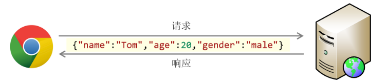

# Web

## Web开发介绍

**Web**：全球广域网，也称为**万维网**(www **W**orld **W**ide **W**eb)，能够通过浏览器访问的**网站**。

### 网站的工作流程

1. 首先通过**浏览器**访问发布到**前端服务器**中的**前端程序**，这时候前端程序会将前端代码返回给浏览器。如下图所示：


2. 浏览器得到前端代码，此时浏览器会将前端代码进行解析，然后展示到浏览器的窗口中，这时候就看到了**网站**的**页面**，如下图所示：


1. 但是此时这个页面是没有数据的，因为数据在数据库中，所以浏览器需要根据**前端代码中指定的后台服务器的地址** 向**后台服务器**（内部有java程序）发起**请求**，后台服务器再去从**数据库**中获取数据，然后返回给浏览器。


1. 浏览器拿到后台返回的数据后，然后将数据展示在前端资源也就是**网页**上，然后就看到了网页的完整的内容


**整个流程如下：**

1. 浏览器先向前端服务器请求**前端资源**，也就是我们所说的**网页**

2. 浏览器再向**后台服务器**发起请求，获取**数据**

3. 浏览器将得到的后台**数据**填充到**网页**上，然后展示给用户去看

### 网站的开发模式

主要有2种：前后端分离开发模式和混合开发模式。

#### 前后端分离开发模式

（**目前企业开发的主流**市场占有率70%以上）这种开发模式的特点如下：

1. 前端人员开发前端程序，前端程序单独部署到前端服务器上

2. 后端人员开发后端程序，后端程序部署到后端服务器上


#### 混合开发模式

这种开发模式的特点是：前端人员开发的代码和后端人员开发的代码在同一个项目中，一起打包部署。


### 网站开发的技术栈


前端web开发：

| 技术       | 描述                                          |
| ---------- | --------------------------------------------- |
| HTML       | 用于构建网站的基础结构的                      |
| css        | 用于美化页面的，作用和化妆或者整容作用一样    |
| JavaScript | 实现网页和用户的交互                          |
| Vue        | 主要用于将数据填充到html页面上的              |
| Element    | 主要提供了一些非常美观的组件                  |
| Nginx      | 一款web服务器软件，可以用于部署我们的前端工程 |

后端web开发：

| 技术       | 描述                                           |
| ---------- | ---------------------------------------------- |
| Maven      | 一款java中用于管理项目的软件                   |
| Mysql      | 最常用的一款数据库软件之一                     |
| SpringBoot | spring家族的产品，当前最为主流的项目开发技术。 |
| Mybatis    | 用于操作数据库的框架                           |

### Web标准

**Web标准**也称为**网页标准**，由一系列的标准组成，大部分由W3C（ World Wide Web Consortium，万维网联盟）负责制定。由三个组成部分：

- HTML：负责网页的结构（页面元素和内容）。

- CSS：负责网页的表现（页面元素的外观、位置等页面样式，如：颜色、大小等）。

- JavaScript：负责网页的行为（交互效果）。

## HTML&CSS

### HTML

**HTML**:HyperText Markup Language，超文本标记语言。

- 超文本：超越了文本的限制，比普通文本更强大。除了文字信息，还可以定义图片、音频、视频等内容。

- 标记语言：由标签构成的语言
  - HTML标签都是预定义好的。例如：使用`<h1>`标签展示标题，使用`<a>`展示超链接，使用``展示图片，`<video>`展示视频。
  - HTML代码直接在浏览器中运行，HTML标签由浏览器解析。

#### HTML页面的基础结构标签

```
<html>
	<head>
    	<title> </title>
    </head>
    <body>
       
    </body>
</html>
```

`<title>`中定义标题显示在浏览器的标题位置，`<body>`中定义的内容会呈现在浏览器的内容区域

#### HTML中的标签特点

- HTML标签不区分大小写
- HTML标签的属性值，采用单引号、双引号都可以
- HTML语法相对比较松散（建议大家编写HTML标签的时候尽量严谨一些）

#### 图片标签 img

1. 图片标签:``

2. 常见属性: 
	src: 指定图像的url (可以指定 绝对路径 , 也可以指定 相对路径)
	width: 图像的宽度 (像素 / 百分比 , 相对于父元素的百分比)
	height: 图像的高度 (像素 / 百分比 , 相对于父元素的百分比)
	
	备注: 一般width 和 height 我们只会指定一个，另外一个会自动的等比例缩放。
	
3. 路径书写方式:
    绝对路径（赋值给src属性）:
        1. 绝对磁盘路径 
        2. 绝对网络路径
    相对路径:
        ./ : 当前目录，可省略
        ../ : 上一级目录

#### 标题标签 h 系列

1. 标题标签: `<h1>` - `<h6>`

```
	<h1>111111111111</h1>
	<h2>111111111111</h2>
	<h3>111111111111</h3>
	<h4>111111111111</h4>
	<h5>111111111111</h5>
	<h6>111111111111</h6>
```

2. 效果 : h1为一级标题，字体也是最大的 ； h6为六级标题，字体是最小的。

#### 水平分页线标签

水平分页线标签: `<hr>`

#### 超链接

- 标签: `<a>href="..." target="...">...</a>`
- 属性:
  - href: 指定资源访问的url
  - target: 指定在何处打开资源链接
    - _self: 默认值，在当前页面打开
    - _blank: 在空白页面打开

#### 视频、音频标签

- 视频标签:`<video>`
  - 属性: 
    - src: 规定视频的url
    - controls: 显示播放控件
    - width: 播放器的宽度
    - height: 播放器的高度

- 音频标签:`<audio>`
  - 属性:
    - src: 规定音频的url
    - controls: 显示播放控件

#### 段落标签

- 换行标签: `<br>`
  - 注意: 在HTML页面中,我们在编辑器中通过回车实现的换行, 仅仅在文本编辑器中会看到换行效果, 浏览器是不会解析的, HTML中换行需要通过br标签

- 段落标签: `<p>`

####  文本格式标签

| 效果   | 标签 | 标签(强调) |
| ------ | ---- | ---------- |
| 加粗   | b    | strong     |
| 倾斜   | i    | em         |
| 下划线 | u    | ins        |
| 删除线 | s    | del        |

#### 占位符

- 在HTML页面中无论输入了多少个空格, 最多只会显示一个。 可以使用空格占位符（&nbsp；）来生成空格，如果需要多个空格，就使用多次占位符。

- 那在HTML中，除了空格占位符以外，还有一些其他的占位符(了解, 只需要知道空格的占位符写法即可)，如下：

| 显示结果 | 描述   | 占位符  |
| :------- | :----- | :------ |
| &nbsp;   | 空格   | \&nbsp; |
| <        | 小于号 | \&lt;   |
| >        | 大于号 | \&gt;   |
| &        | 和号   | \&amp;  |
| "        | 引号   | \&quot; |
| '        | 撇号   | \&apos; |


#### 布局标签

- 布局标签：实际开发网页中，会大量频繁的使用 div 和 span 这两个没有语义的布局标签。

- 标签：`<div>` `<span>`

- 特点：

  - div标签：

    - 一行只显示一个（独占一行）

    - 宽度默认是父元素的宽度，高度默认由内容撑开

    - 可以设置宽高（width、height）

  - span标签：

    - 一行可以显示多个

    - 宽度和高度默认由内容撑开

    - 不可以设置宽高（width、height）

#### 表格标签

- `<table>` : 用于定义整个表格, 可以包裹多个 `<tr>`， 常用属性如下： 
  - border：规定表格边框的宽度
  - width：规定表格的宽度
  - cellspacing: 规定单元之间的空间

- `<tr>` : 表格的行，可以包裹多个 `<td>` 

- `<td>` : 表格单元格(普通)，可以包裹内容 , 如果是表头单元格，可以替换为 `<th>`

#### 表单标签

- 表单标签: `<form>`

- 表单属性:
  - action: 规定表单提交时，向何处发送表单数据，表单提交的URL。
  - method: 规定用于发送表单数据的方式，常见为： GET、POST。
    - GET：表单数据是拼接在url后面的， 如： xxxxxxxxxxx?username=Tom&age=12，url中能携带的表单数据大小是有限制的。
    - POST： 表单数据是在请求体（消息体）中携带的，大小没有限制。

- 表单项标签: 不同类型的input元素、下拉列表、文本域等。
  
  - input: 定义表单项，通过type属性控制输入形式
  
  - select: 定义下拉列表
  
  - textarea: 定义文本域

分别是：

- `<input>`: 表单项 , 通过type属性控制输入形式。

  | type取值                 | **描述**                             |
  | ------------------------ | ------------------------------------ |
  | text                     | 默认值，定义单行的输入字段           |
  | password                 | 定义密码字段                         |
  | radio                    | 定义单选按钮                         |
  | checkbox                 | 定义复选框                           |
  | file                     | 定义文件上传按钮                     |
  | date/time/datetime-local | 定义日期/时间/日期时间               |
  | number                   | 定义数字输入框                       |
  | email                    | 定义邮件输入框                       |
  | hidden                   | 定义隐藏域                           |
  | submit / reset / button  | 定义提交按钮 / 重置按钮 / 可点击按钮 |

- `<select>`: 定义下拉列表, `<option>` 定义列表项

- `<textarea>`: 文本域

### CSS

**CSS**:Cascading Style Sheet，层叠样式表，用于控制页面的样式（表现）。

#### CSS引入方式

具体有3种引入方式，语法如下表格所示：

| 名称     | 语法描述                                        |
| -------- | ----------------------------------------------- |
| 行内样式 | 在标签内使用`style`属性，属性值是CSS属性键值对  |
| 内嵌样式 | 定义`<style>`标签，在标签内部定义CSS样式        |
| 外联样式 | 定义`<link>`标签，通过`href`属性引入外部CSS文件 |

企业开发的使用情况如下：

1. 内联样式会出现大量的代码冗余，不方便后期的维护，所以不常用。
2. 内部样式，通过定义CSS选择器，让样式作用于当前页面的指定的标签上。
3. 外部样式，HTML和CSS实现了完全的分离，企业开发常用方式。

#### 颜色表示

| **表示方式**   | **表示含义**                      | **取值**                                         |
| -------------- | --------------------------------- | ------------------------------------------------ |
| 关键字         | 预定义的颜色名                    | red, green, blue...                              |
| rgb表示法      | 红绿蓝三原色，每项取值范围：0-255 | rgb(0, 0, 0), rgb(255, 255, 255), rgb(255, 0, 0) |
| 十六进制表示法 | #开头，将数字转换成十六进制表示   | #000000, #ff0000, #cccccc，简写：#000, #ccc      |

#### CSS选择器

选择器是选取需设置样式的元素（标签），根据业务场景不同，选择的标签的需求也是多种多样的，有多种选择器

1. **元素（标签）选择器** 

- 选择器的名字必须是标签的名字
- 作用：选择器中的样式会作用于所有同名的标签上

```
元素名称 {
    css样式名:css样式值；
}
```


2. **id选择器**

- 选择器的名字前面需要加上#
- 作用：选择器中的样式会作用于指定id的标签上，而且有且只有一个标签（由于id是唯一的）

```
#id属性值 {
    css样式名:css样式值；
}
```

3. **类选择器**

- 选择器的名字前面需要加上 .
- 作用：选择器中的样式会作用于所有class的属性值和该名字一样的标签上，可以是多个

```
.class属性值 {
    css样式名:css样式值；
}
```

#### CSS属性 

- text-indent: 设置段落的首行缩进 
- line-height: 设置行高
- text-align: 设置对齐方式, 可取值为 left / center / right

#### 盒子模型

- 盒子：页面中所有的元素（标签），都可以看做是一个 盒子，由盒子将页面中的元素包含在一个矩形区域内，通过盒子的视角更方便的进行页面布局

- 盒子模型组成：内容区域（content）、内边距区域（padding）、边框区域（border）、外边距区域（margin）


## JavaScript

JavaScript是一门脚本语言，用于实现网页的动态效果，让页面和用户进行交互。

### 引入方式

**第一种方式**：内部脚本，将JS代码定义在HTML页面中

- JavaScript代码必须位于`<script> </script>`标签之间
- 在HTML文档中，可以在任意地方，放置任意数量的`<script>`
- 一般会把脚本置于`<body>`元素的底部，可改善显示速度

**第二种方式**：外部脚本，将JS代码定义在外部JS文件中，然后引入到HTML页面中

- 外部JS文件以`.js`为后缀名
- 外部JS文件只包含JS代码，不包含`<script>`标签
- 引入外部JS的`<script>`必须是双标签，且放在`<head>`标签中

### 基本语法

#### 语法规则：

- 区分大小写：与 Java 一样，变量名、函数名以及其他一切东西都是区分大小写的

- 每行结尾的分号可有可无

- 大括号表示代码块

- 注释：

  - 单行注释：// 注释内容

  - 多行注释：/* 注释内容 */

#### JS的三种输出语句

| API              | 描述             |
| ---------------- | ---------------- |
| window.alert()   | 警告框           |
| document.write() | 在HTML 输出内容  |
| console.log()    | 写入浏览器控制台 |

#### 变量

| 关键字 | 解释 |
| --- | --- |
| var | 早期ECMAScript5中用于变量声明的关键字 |
| let | ECMAScript6中新增的用于变量声明的关键字，相比较var，let只在代码块内生效 |
| const | 声明常量的，常量一旦声明，不能修改 |

- JavaScript 是一门弱类型语言，变量可以存放不同类型的值 。
- 变量名需要遵循如下规则：
  - 组成字符可以是任何字母、数字、下划线（_）或美元符号（$）
  - 数字不能开头
  - 建议使用驼峰命名

#### 数据类型和运算符

虽然JS是弱数据类型的语言，但是JS中也存在数据类型，JS中的数据类型分为 ：原始类型 和 引用类型，具体有如下类型

| 数据类型 | 描述 |
| --------- | -------------------------------------------------- |
| number | 数字（整数、小数、NaN(Not a Number)） |
| string | 字符串，单双引皆可 |
| boolean | 布尔。true，false |
| null | 对象为空 |
| undefined | 当声明的变量未初始化时，该变量的默认值是 undefined |

使用typeof函数可以返回变量的数据类型

| 运算规则 | 运算符 |
| --- | --- |
| 算术运算符 | + , - , * , / , % , ++ , -- |
| 赋值运算符 | = , += , -= , *= , /= , %=  |
| 比较运算符 |  >, < , >= , <= , != , == , ===   注意`==`会进行类型转换`===`不会进行类型转换 |
| 逻辑运算符 | && , \|\| , ! |
| 三元运算符 | 条件表达式 ? true_value: false_value |

#### 函数

- 第一种定义格式：

```
function 函数名(参数1,参数2..){
    要执行的代码
}
```

因为JavaScript是弱数据类型的语言，所以有如下几点需要注意：

  - 形式参数不需要声明类型，并且JavaScript中不管什么类型都是let或者var去声明，加上也没有意义。
  
  - 返回值也不需要声明类型，直接return即可

- 第二种定义格式：

```
var functionName = function (参数1,参数2..){   
	//要执行的代码
}
```

  - 在JavaScript中，函数的调用只需要名称正确即可，参数列表不管的。如上述案例，10传递给了变量a，20传递给了变量b,而30和40没有变量接受，但是不影响函数的正常调用。

### JavScript对象

#### 基本对象

- Array
- Boolean
- Classe
- Date
- Error
- Global
- JSON
- Math
- Number
- RegExp
- String
- 运算符
- 语句

##### Array

Array对象是用来定义数组

**构造方法**

方法一：`var 变量名 = new Array(元素1,元素2,元素3..);`

方法二：`var 变量名 = [元素1,元素2,元素3..];`

JavaScript中数组相当于Java中的集合，数组的长度是可以变化的。而且JavaScript是弱数据类型的语言，所以数组中可以存储任意数据类型的值。接下来我们通过代码来演示上述特点。

**属性和方法**

属性：

| 属性 | 描述 |
| :----- | :--------------------------- |
| length | 设置或返回数组中元素的数量。 |

方法：

| 方法方法  | 描述 |
| :-------- | :---- |
| forEach() | 遍历数组中的每个有值的元素，并调用一次传入的函数 |
| push()    | 将新元素添加到数组的末尾，并返回新的长度 |
| splice()  | 从数组中删除元素，参数1表示从哪个索引位置删除，参数2表示删除的元素个数 |

使用方法都是使用`.`来后接方法名，并传入相应的参数。

```
arr.forEach(function(e){
  console.log(e);
})

arr.forEach((e)=>console.log(e))
```

##### String

String对象是用来定义字符串

**构造方法**

方法一：`var 变量名 = new String(字符串);`

方法二：`var 变量名 = "字符串";`

**属性和方法**

属性：

| 属性   | 描述           |
| ------ | -------------- |
| length | 字符串的长度。 |

方法：

| 方法        | 描述 |
| ----------- | ----- |
| charAt()    | 返回在指定位置的字符。 |
| indexOf()   | 检索字符串。|
| trim()      | 去除字符串两边的空格 |
| substring() | 提取字符串中两个指定的索引号之间的字符。 |

##### JSON

###### 自定义对象

**构造方法**

```
var 对象名 = {
    属性名1: 属性值1, 
    属性名2: 属性值2,
    属性名3: 属性值3,
    函数名称: function(形参列表){}
};
```

通过`对象名.属性名`调用属性或者`对象名.函数名称(参数)`调用函数。

###### JSON对象

JSON对象：**J**ava**S**cript **O**bject **N**otation，JavaScript对象标记法。是通过JavaScript标记法书写的文本。

**格式**：

```
{
  "key":value,
  "key":value,
  "key":value
}
```

**key必须使用引号并且是双引号标记，value可以是任意数据类型。**

JSON这种数据格式的对象经常用来作为前后台交互的数据载体。

在前后台交互的时候，我们需要传输数据，可以使用下图的XML格式，可以清晰地描述Java中需要传递给前端的Java对象。


但是XML格式存在如下问题：

- 冗余：标签需要编写双份，占用带宽、浪费资源

- 繁琐：解析繁琐

JSON格式的对象可以解决这些问题



但是上述在浏览器中还不能直接使用，**因为上述是一个JSON字符串，不是JSON对象**

使用`JSON.parse()`方法，传入一个JSON字符串，可以将其转换为JSON对象。

使用`JSON.stringify()`方法，传入一个JSON对象，可以将其转换为JSON字符串。

#### BOM对象

BOM的全称是Browser Object Model,翻译过来是浏览器对象模型

也就是JavaScript将浏览器的各个组成部分封装成了对象。操作浏览器的部分功能，可以通过操作BOM对象的相关属性或者函数来完成。

| 对象名称  | 描述           |
| :-------- | :------------ |
| Window    | 浏览器窗口对象 |
| Navigator | 浏览器对象     |
| Screen    | 屏幕对象       |
| History   | 历史记录对象   |
| Location  | 地址栏对象     |

BOM对象与浏览器各组成对应关系：


##### Window对象

Window对象指的是浏览器窗口对象，是JavaScript的全部对象，对于Window对象，我们可以直接使用，并且对于其属性和方法，我们可以省略Window对象。

window对象提供了获取其他BOM对象的属性：

| 属性      | 描述                  |
| --------- | --------------------- |
| history   | 用于获取history对象   |
| location  | 用于获取location对象  |
| navigator | 用于获取navigator对象 |
| screen    | 用于获取screen对象    |

Window也提供了一些常用的函数，如下表格所示：

| 函数 | 描述 |
| --- | --- |
| alert()       | 显示带有一段消息和一个确认按钮的警告框。           |
| comfirm()     | 显示带有一段消息以及确认按钮和取消按钮的对话框。   |
| setInterval() | 按照指定的周期（以毫秒计）来调用函数或计算表达式。 |
| setTimeout()  | 在指定的毫秒数后调用函数或计算表达式。             |

- alert()函数：弹出警告框，函数的内容就是警告框的内容

- confirm()函数：弹出确认框，并且提供用户2个按钮，分别是确认和取消。该函数有个布尔类型的返回值

- setInterval(function,毫秒值)：定时器，用于周期性的执行某个功能，并且是**循环执行**。该函数需要传递2个参数：第一个参数是要执行的函数，第二个参数是执行的周期，单位是毫秒。

- setTimeout(function,毫秒值) ：定时器，只会在一段时间后**执行一次功能**。参数同`setInterval()`

##### Location对象

location是指浏览器的地址栏对象，常用属性为`href`属性，用于获取或者设置浏览器的地址信息

#### DOM对象

DOM：Document Object Model 文档对象模型。也就是 JavaScript 将 HTML 文档的各个组成部分封装为对象。

封装的对象分为：

- Document：整个文档对象
- Element：元素对象
- Attribute：属性对象
- Text：文本对象
- Comment：注释对象


DOM技术的特点：

- 改变 HTML 元素的内容
- 改变 HTML 元素的样式（CSS）
- 对 HTML DOM 事件作出反应
- 添加和删除 HTML 元素

DOM技术核心：

- 如何获取DOM中的元素对象（Element对象 ，也就是标签）
- 如何操作Element对象的属性,也就是标签的属性。

##### 获取DOM对象

HTML中的Element对象可以通过Document对象获取，而Document对象是通过Window对象获取的。Document对象提供的用于获取Element元素对象的API如下表所示：

| 函数 | 描述 |
| --- | --- |
| document.getElementById() | 根据id属性值获取，返回单个Element对象 |
| document.getElementsByTagName() | 根据标签名称获取，返回Element对象数组 |
| document.getElementsByName() | 根据name属性值获取，返回Element对象数组 |
| document.getElementsByClassName() | 根据class属性值获取，返回Element对象数组 |

- document.getElementById()：根据标签的id属性获取标签对象，id是唯一的，所以获取到是单个标签对象。

- document.getElementsByTagName() :  根据标签的名字获取标签对象，同名的标签有很多，所以返回值是数组。

- document.getElementsByName()：根据标签的name的属性值获取标签对象，name属性值可以重复，所以返回值是一个数组。

- document.getElementsByClassName(): 根据标签的class属性值获取标签对象，class属性值也可以重复，返回值是数组。

##### 操作DOM对象

`innerHTML`属性：设置或获取元素的内容，可以设置HTML代码。

`style`属性：设置或获取元素的样式，可以设置CSS样式。

[JavaScript参考手册](https://www.w3school.com.cn/jsref/index.asp)

### JavaScript事件

HTML事件是发生在HTML元素上的 “事情”，例如：

- 按钮被点击
- 鼠标移到元素上
- 输入框失去焦点

可以给这些事件绑定函数，当事件触发时，可以自动的完成对应的功能。这就是事件监听。

#### 事件绑定

JavaScript对于事件的绑定提供了2种方式：

- 方式1：通过html标签中的事件属性进行绑定，然后指向一个函数

- 方式2：通过DOM中Element元素的事件属性进行绑定，然后操作对象属性绑定函数事件

### 常见事件

上面案例中使用到了 `onclick` 事件属性，那都有哪些事件属性供我们使用呢？下面就给大家列举一些比较常用的事件属性

| 事件属性名  | 说明 |
| ----------- | ------------------------ |
| onclick     | 鼠标单击事件             |
| onblur      | 元素失去焦点             |
| onfocus     | 元素获得焦点             |
| onload      | 某个页面或图像被完成加载 |
| onsubmit    | 当表单提交时触发该事件   |
| onmouseover | 鼠标被移到某元素之上     |
| onmouseout  | 鼠标从某元素移开         |

## Vue

Vue.js是一套构建用户界面的 **渐进式框架**。与其他重量级框架不同的是，Vue 采用自底向上增量开发的设计。Vue 的核心库只关注视图层，并且非常容易学习，非常容易与其它库或已有项目整合。Vue.js 的目标是通过尽可能简单的 API 实现**响应的数据绑定**和**组合的视图组件**。

框架即是一个半成品软件，是一套可重用的、通用的、软件基础代码模型。基于框架进行开发，更加快捷、更加高效。

为了提高开发的效率，引入**MVVM(Model-View-ViewModel)的前端开发思想**，即让开发者更加关注数据，而非数据绑定到视图这种机械化的操作。

MVVM:其实是Model-View-ViewModel的缩写，有3个单词，具体释义如下：

- Model: 数据模型，特指前端中通过请求从后台获取的数据

- View: 视图，用于展示数据的页面，可以理解成我们的html+css搭建的页面，但是没有数据

- ViewModel: 数据绑定到视图，负责将数据（Model）通过JavaScript的DOM技术，将数据展示到视图（View）上


基于MVVM思想，其中的Model我们可以通过Ajax来发起请求从后台获取

对于View部分，我们将来会学习一款ElementUI框架来替代HTML+CSS来更加方便的搭建View

而侧重于ViewModel部分开发的vue前端框架，用来替代JavaScript的DOM操作，让数据展示到视图的代码开发变得更加的简单。

### 基础介绍

核心功能：

- **声明式渲染**：Vue基于标准HTML拓展了一套模板语法，使得我们可以声明式地描述最终输出的HTML和JavaScript状态之间的关系

- **响应性**：Vue会自动跟踪JavaScript状态并在其发生变化时响应式地更新DOM

使用类HTML格式的文件来书写Vue组件，也称为**单文件组件**（`.vue`文件）顾名思义，Vue 的单文件组件会将一个组件的逻辑 (JavaScript)，模板 (HTML) 和样式 (CSS) 封装在同一个文件里。

#### 组合式API

组合式 API 通常会与`<script setup>`搭配使用